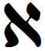

- glyph: 
- Back: Alef  ʾ  [ ʔ, Ø ]  1 [92daea41fc9c3b1a661725b59162607c.mp3](26.mp3)
- name: Alef 
- latin transliteration: ʾ 
- pronunciation: [ ʔ, Ø ]  
- number: 1 
- name spoken: [92daea41fc9c3b1a661725b59162607c.mp3](26.mp3)