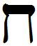

- glyph: 
- Back: Chet / Het  h / ch  [096ba2a63f38d3fba3c66384757b3ae8.mp3](0.mp3)
- name: Chet / Het 
- latin transliteration: h / ch
- pronunciation: [Voiceless_pharyngeal_fricative_chet.mp3](2.mp3) [Voiceless_velar_fricative_chet.mp3](16.mp3)
- number: 8 
- name spoken: [096ba2a63f38d3fba3c66384757b3ae8.mp3](0.mp3)