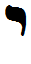

- glyph: 
- Back: Yud y/i [ j ]  10  [3caa140c5ba4df35798f973bdfd24f8a.mp3](93.mp3)  
- name: Yud 
- latin transliteration: y/i 
- pronunciation: [ j ] [Palatal_approximant_yud.mp3](77.mp3)
- number: 10 
- name spoken: [3caa140c5ba4df35798f973bdfd24f8a.mp3](93.mp3) 