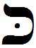

- glyph: 
- Back: Kaf k [k] 20 [0e108ed39ac9c1ab6b2cd7c9df29f8b6.mp3](34.mp3) 
- name: Kaf
- latin transliteration: k
- pronunciation: [k]
- number: 20
- name spoken: [0e108ed39ac9c1ab6b2cd7c9df29f8b6.mp3](34.mp3)