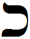

- glyph: 
- Back: Chaf kh [x]20 [0e108ed39ac9c1ab6b2cd7c9df29f8b6.mp3](./34.mp3)
- name: Chaf
- latin transliteration: kh
- pronunciation: [x] [Voiceless_velar_fricative_chet_kaf.mp3](./54.mp3)
- number: 20 
- name spoken: [0e108ed39ac9c1ab6b2cd7c9df29f8b6.mp3](./34.mp3)