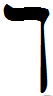

- glyph: 
- Back: Chaf-sofit final kaf k/kh [k] [x] [9d17ccdb0b9a01d3132221395d766972.mp3](./72.mp3) 
- name: Chaf-sofit (final kaf) 
- latin transliteration: k/kh
- pronunciation: [k] [x]
- number: 20
- name spoken: [9d17ccdb0b9a01d3132221395d766972.mp3](./72.mp3)