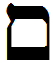

- glyph: 
- Back: Mem-sofit  final mem  [5eb9c8a2666cab9d3a67ed1cf151c1bc.mp3](./76.mp3)
- name: Mem-sofit (final mem) 
- latin transliteration: m 
- pronunciation: [ m ] 
- number: 
- name spoken: [5eb9c8a2666cab9d3a67ed1cf151c1bc.mp3](./76.mp3)