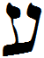

- glyph: 
- Back: Ayin  ‘  [ee8e8341777bb3055df9c4e391c09e50.mp3](88.mp3)
- name: Ayin 
- latin transliteration: ‘ 
- pronunciation: [Voiced_pharyngeal_fricative_ayin.mp3](65.mp3)
- number: 70 
- name spoken: [ee8e8341777bb3055df9c4e391c09e50.mp3](88.mp3)