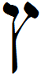

- glyph: 
- Back: Tsadee-sofit  final tsadee [3abd6b987b8c3b73556d583edee859ab.mp3](./22.mp3)
- name: Tsadee-sofit (final tsadee) 
- latin transliteration: ẕ
- pronunciation: [ ts ]
- number: 
- name spoken: [3abd6b987b8c3b73556d583edee859ab.mp3](./22.mp3)