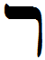

- glyph: 
- Back: Resh  r  [ ʁ ]  200 [5d6ead5afc8884a3bf8ccdf783db4795.mp3](./68.mp3)
- name: Resh 
- latin transliteration: r 
- pronunciation: [ ʁ ] [Voiced_uvular_fricative_resh.mp3](./75.mp3) / [r] [Alveolar_trill_resh.mp3](./46.mp3)
- number: 200 
- name spoken: [5d6ead5afc8884a3bf8ccdf783db4795.mp3](./68.mp3)