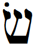

- glyph: 
- Back: Sin  s  [s] [61a731fe0ba458f2817aa1f4be081749.mp3](1.mp3)
- name: Sin 
- latin transliteration: s 
- pronunciation: [s] / [ɬ] [Voiceless_alveolar_lateral_fricative_sin.mp3](49.mp3)
- number: 
- name spoken: [61a731fe0ba458f2817aa1f4be081749.mp3](1.mp3)