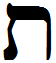

- glyph: 
- Back: Thaf  t  [ t ]  400  [d2f15ea09dc62c30ed8211bf110d41a7.mp3](./15.mp3)
- name: Thaf 
- latin transliteration: t 
- pronunciation: [ t ] (maybe [ θ ] [Voiceless_dental_fricative_thaf.mp3](./50.mp3))
- number: 400
- name spoken: [d2f15ea09dc62c30ed8211bf110d41a7.mp3](./15.mp3)