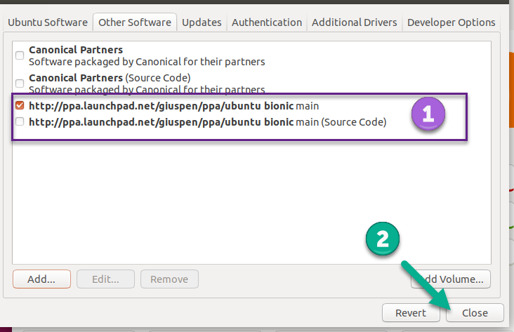

# Ubuntu


	Cherrytree can be installed to Ubuntu via the **Ubuntu Software** application or the command line.

 ##  Installing with Ubuntu Software

	The Cherrytree PPA (Personal Package Archive) must be set to ensure that the latest application version installs.

   1. Open the **Software and Updates** application.

   2. Go to the **Other Software** tab.

   3.  Click **Add**.

   4.  Enter the following snippet into the textbox:


   5.  Click **Add Source** and enter your password when prompted.

   6.  Confirm that the PPA is added then close the window.

		 Figure 2.01
		

   7. Click **Reload** and enter your password to install updates from the newly added source.

   8. Open **Ubuntu Software** and search for Cherrytree.

   9. Select the application and click **Install**.

   10. Provide your password when prompted to begin the installation.

   11. Launch Cherrytree and confirm that the latest version of the application is installed by selecting **Check Newer Version** from the **Help** menu.

 ##  Installing via Command Line

	1. Download the latest installer that has a **.deb** extension from the [downloads webpage](https://www.giuspen.com/cherrytree/#downl).

	2. Open a terminal and change to the directory containing the installation file.

	3. Enter the following command, replacing **cherrytree.deb** with the name of your installation file:

	

	4. Provide your user password when prompted to begin the installation.

```plain-text
ppa:giuspen/ppa
```


```sh
sudo dpkg -i cherrytree.deb
```
