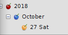

# Managing Nodes

	Nodes are primarily managed from the **Tree** menu, which contains the following options:

	- **Change Node Properties** - Opens the **Node Properties** menu which is identical to the **New Node Properties** and is used to define the node name, icon, and type.

	- **Toggle Read Only** - Locks a node in its current state. This must be disabled to edit or delete the node.

	- **Add to Bookmarks** / **Remove from Bookmarks** - When a node is added to your bookmarks, a link to the node can be found in the **Bookmarks** menu.

		- **Add to Bookmarks** - Adds a node to the bookmarks list.

		- **Remove from Bookmarks** - Removes a node from the bookmarks list.

	- **Insert Today’s Node** - Creates a top-level node with a title set to the current year, a subnode of the current month, and a third-level node of the current day of the month and week.

			 Figure 6.03
			
	
	Each time **Insert Today’s Node** is used, it adds the current date to tree, cataloguing it with the existing nodes by year, month, and day. If today’s node already exists, no new nodes are added and you are directed to the existing node instead.

	- **Tree Info** - Displays the following summary of the current document:

		- The Number of Rich Text Nodes

		- The Number of Plain Text Nodes

		- The Number of Code Nodes

		- The Number of Images

		- The Number of Embedded Files

		- The Number of Tables

		- The Number of CodeBoxes

		- The Number of Anchors

	- **Node Move** - Contains the following functions:
	
		- **Move Node Up** - Moves the selected node up one position within its current hierarchy.

		- **Move Node Down** - Moves the selected node down one position within its current hierarchy.

		- **Move Node Left** - Moves the selected node up one level in hierarchy.

		- **Move Node Right** - Makes the selected node a subnode of the node above it. This does not work on the first child node, where the node above is its parent.

	- **Node Change Parent** - Allows you to choose a new parent node for the selected node.
	
			**NOTE:** Most of these functions can be performed by dragging a node up, down, or over another node within the tree view.

	- **Node Sort** - Contains the following functions:
	
		- **Sort Tree Ascending** - Sorts the entire tree alphabetically from top to bottom.

		- **Sort Tree Descending** - Sorts the entire tree alphabetically from bottom to top.

		- **Sort Node Ascending** - Sorts the selected node and its [siblings](https://docs.oracle.com/cd/E19509-01/820-3742/ghpow/index.html) alphabetically from top to bottom.

		- **Sort Node Descending** - Sorts the selected node and its siblings alphabetically from bottom to top.

	- **Find in Nodes Names and Tags** - [Search](../Text/Search.md) the entire tree for a set of characters within node titles and assigned tags.

	- **Replace in Nodes Names** - Search the entire tree for a set of characters within node titles and assigned tags, and replace it with new characters.

	- **Nodes Import** - Opens the [Import](../Files/Importing.md) menu.

	- **Nodes Export** - Opens the [Export](../Files/Exporting.md) menu.

	- **Inherit Syntax** - If the selected node and its [parent node](https://docs.oracle.com/cd/E19509-01/820-3742/ghpow/index.html) have an Automated Syntax Highlighting type, the selected node inherits syntax highlighting for the language defined in its parent’s Node Properties menu.

	- **Delete Node** - Removes the selected node from the tree.
	
		**CAUTION:** This also deletes any children of the selected node.

	- **Go Back** - Move backward once in your node selection history.

	- **Go Forward** - Move forward once in your node selection history.

