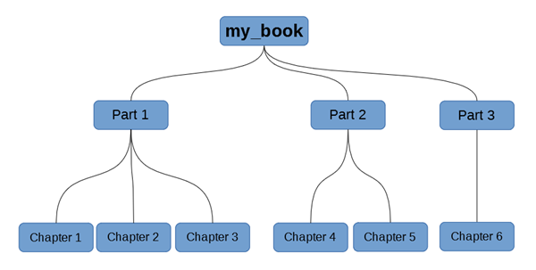
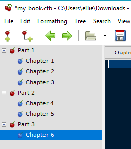

# Nodes

	A tree is a data structure consisting of nodes which are connected by edges. In the tree shown in [Figure 6.01](Nodes.md), **my_book** is the root node. **Part 3** is one of three child nodes that belong to **my_book** and is also the parent node of **Chapter 6**.
	
	 Figure 6.01
	
	
	[Figure 6.01](http://#figure-6.01) might look like [Figure 6.02](Nodes.md) in Cherrytree, where the document name represents the root node.

	 Figure 6.02
	
	
	## Content
	- [Creating Nodes](Creating%20Nodes.md)
	- [Managing Nodes](Managing%20Nodes.md)

