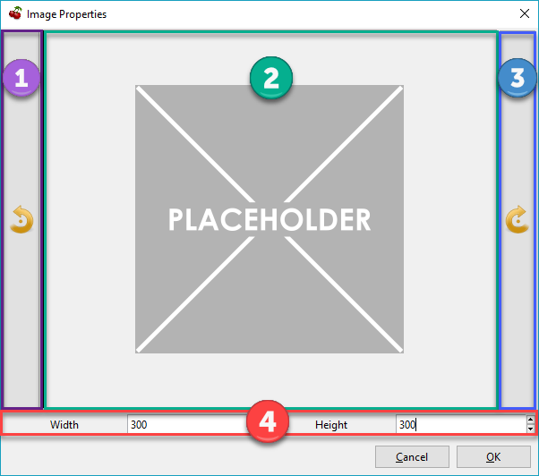

# Images

 ## Inserting Images

	1. Select Insert Image from the **Edit** menu.

	2. Select an image to be uploaded and click **Open**.

	3. (**Optional**) The selected image is displayed in the simplistic editor shown in [Figure 8.01](./Images.md), which can be used to rotate or scale the content.
	
		 Figure 8.01
		
	
		[Figure 8.01](./Images.md) has been highlighted to indicate the parts of its interface.
	
			- **One** - Rotates the image counter-clockwise 90°.

			- **Two** - Displays the image uploaded in Step 2.

			- **Three** - Rotates the image clockwise 90°.

			- **Four** - Options for defining the image’s dimensions. Height and Width are linked to each other to maintain the content’s aspect ratio.

	4. Click **OK** to complete the insertion.

	Cherrytree does not support wrapping text around images at this time.

 ## Editing Images

	Right-click an image to display its menu of options.
	
	- **Cut Image** - Moves the selected image to your clipboard. The image can then be pasted elsewhere.

	- **Copy Image** - Copies the selected image to your clipboard. A copy of the image can then be pasted elsewhere.

	- **Delete Image** - Delete the selected image.

	- **Edit Image** - Displays the window shown in [Figure 8.01](./Images.md)

	- **Save Image as PNG** - Saves a copy of the selected image to your computer.

	- **Edit Link** - Apply or edit the link of the selected image.
	
		See [Links](./Links.md) for more information about links.

	- **Dismiss Link** - Removes an existing link from the selected image. This option only appears if the image has an assigned link.

