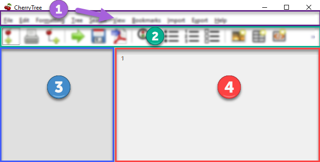

# Interface

	Cherrytree’s interface consists of four sections, highlighted in [Figure 4.01](Interface.md).

		 Figure 4.01
		

 ## Menu Bar

	The menu bar contains the following menus:
	
	- **File** - Document-management features such as opening, saving, printing, and exporting.

	- **Edit** - Application preferences, basic copy and paste features, and object insertion features.

	- **Formatting** - Text formatting options.

	- **Tree** - Node management features.

	- **Search** - Features for search and replace.

	- **View** - Interface options.

	- **Bookmarks** - A list of bookmarked nodes. Nodes can be added to bookmarks by right-clicking the node within the tree view and selecting **Add to Bookmarks**.

	- **Import** - Cherrytree can import from a variety of sources including KeepNote, NoteCase, Tomboy, HTML files, others.

	- **Export** - Cherrytree documents can be exported to HTML, PDF, and Plain Text.

	- **Help** - Contains **Check for updates**, an **About** section, and a link to the online manual.

 ## Toolbar

	The toolbar contains options for managing nodes, formatting text, and inserting objects.

 ## Tree View

	Cherrytree’s tree view shows the document’s hierarchical structure of nodes.

 ## Editor

	The editor is used to read, write, edit, and delete notes. Click and hold the divider between the tree view and editor, then drag the mouse left or right to resize the two windows.

 ## Interface Options

	Most interface options exist within the **View** menu, located in the menu bar.
	
	The size of the toolbar icons is enlarged within [Figure 4.01](Interface.md). Icon size can be increased by selecting **Increase Toolbar Icon Size** in the **View** menu or decreased with **Decrease Toolbar Icon Size**.
	
	You can change the size of text within the node view and editor using **CTRL+[Mousewheel]**. Alternatively, use **`CTRL`** and **`+`** to increase or **`CTRL`** and **`-`** to decrease text size.

