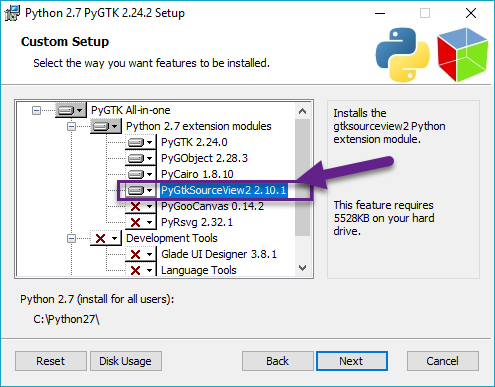

# Windows


		- [Steps 1-8:](Windows.md) Installing Python2.7 and adding it to environment variables.
		- [Steps 9-16:](Windows.md) Installing Cherrytree dependencies.
		- [Steps 17-20:](Windows.md) Configuring the Cherrytree directory.

##  ## Installing Python 2.7Installing Python 2.7

	1. If a variant of Python 2.7 is not installed to your machine, go to the [Python Releases for Windows page](https://www.python.org/downloads/windows/) and click **Latest version of Python 2**.

	2. Download and run the **Windows x86 MSI** **installer** version, then follow its installation steps.

	3. (**Optional**) Go to the folder where you installed Python 2.7 and rename the **python** application to **python2 **to avoid conflicting with Python3.

	4. Copy the path of your installation directory.

	5. Open your environment variable settings.

			**NOTE:** Click [here](https://www.nextofwindows.com/how-to-addedit-environment-variables-in-windows-7) for instructions to add environment variables in Windows 7.

	6. Select Path and click **Edit**.

	7. Click **New** then paste the path of your Python 2.7 installation into the text field.

	8. Click **Ok** to close the window.


##  ## Installing Cherrytree DependenciesInstalling Cherrytree Dependencies

	9. [Download the GTK2 Windows bundle](http://www.giuspen.com/software/gtk-2.24.10-win-bundle.7z).

	10. [Unzip](https://www.7-zip.org/) the GTK2 bundle.

	11. Open the bundle, move into the **bin** folder, then copy its path and add it to your environment variables.
	
			**NOTE: **For example, if you move the bundle into your **C: **drive, your path should look like **C:\gtk2\bin**.

	12. [Download the PYGTK installer](http://ftp.gnome.org/pub/GNOME/binaries/win32/pygtk/2.24/pygtk-all-in-one-2.24.2.win32-py2.7.msi).

	13. Run the installation file and follow its steps to install. Ensure **PYGtkSourceView2** is toggled on the** Custom Setup **page.
	
			 Figure 3.01
			

	14. [Download python 2.7 lib files](http://www.giuspen.com/software/C_Python27_Lib.7z).

	15. [Unzip](https://www.7-zip.org/) the folder and move the content from **C_Python27_Lib** to the** Lib** folder within your Python 2.7 installation.

	16. (Optional) Open **Command Prompt **and install dependencies for additional functionality using the commands:
	
		-  For spell check functionality.
		
		
		
		-  For better decoding support of imported and pasted text.
		
		


##  ## Configuring the Cherrytree DirectoryConfiguring the Cherrytree Directory

	17. [Clone](https://git-scm.com/docs/git-clone) or download the [Cherrytree repository](https://github.com/giuspen/cherrytree).

	18. [Download a portable version of 7zip](http://downloads.sourceforge.net/sevenzip/7za920.zip), which is required to password-protect files.

	19. Extract its content and move the **7za.exe** file into the root folder of your local Cherrytree directory.

	20. Open **Command Prompt**, change to the directory containing your local copy of Cherrytree, and run:
	



```sh
python2 -m pip install pyenchant
```

```sh
python2 -m pip install chardet
```

```sh
python2 cherrytree
```
