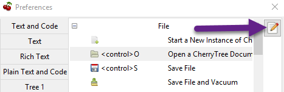
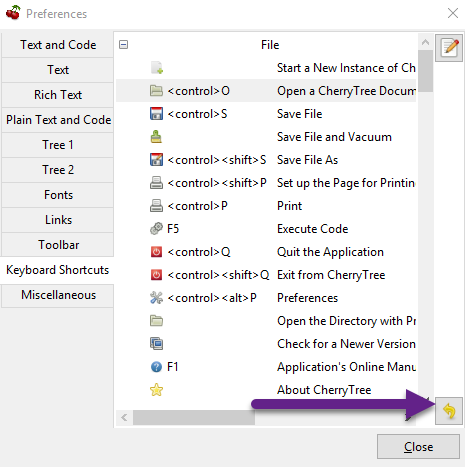

# Keyboard Shortcuts

	The keyboard Shortcuts preferences menu provides configuration options for shortcuts to Cherrytree’s features.

 ## Editing a Keyboard ShortcutEditing a Keyboard Shortcut

	1. Select a shortcut to edit.

	2. Click the edit shortcut button to display the **Edit Keyboard Shortcut **menu.
	
		 Figure 9.16
		

	3. Select **No Keyboard Shortcut** to remove a shortcut. Alternatively, toggle any of the three options: **control**, **shift**, and **alt**, and add one or more keys to the adjacent form to define the keyboard shortcut.

	4. Click **OK** to complete the edit.

 ## Reset Keyboard Shortcuts SettingsReset Keyboard Shortcuts Settings

	Click the yellow return button to return to Cherrytree’s default shortcut settings.
	
	 Figure 9.17
	

 ## Default Keyboard ShortcutsDefault Keyboard Shortcuts

	

|  | Start a New Instance of Cherrytree  |
| --- | --- |
| Ctrl+O  | Open a New Cherrytree Document  |
| Ctrl+S  | Save File  |
|  | Save File and Vacuum  |
| Ctrl+Shift+S  | Save File As  |
| Ctrl+Shift+P  | Set up the Page for Printing  |
| Ctrl+P  | Print  |
| F5  | Execute Code  |
| Ctrl+Q  | Quit Application  |
| Ctrl+Shift+Q  | Exit from Cherrytree  |
| Ctrl-Alt-P  | Preferences  |
|  | Open The Directory with Preferences Files  |
|  | Check for a Newer Version  |
| F1  | Application’s Online Manual  |
|  | About Cherrytree  |
| Ctrl+N  | Add a Node having the Same Parent of the Selected Node  |
| Ctrl+Shift+N  | Add a Child Node to the Selected Node  |
| Ctrl+Shift+D  | Duplicate the Selected Node  |
| F8  | Insert a Node with Hierarchy Year/Month/Day  |
|  | Sort the Tree Ascending  |
|  | Sort the Tree Descending  |
|  | Sort all the Siblings of the Selected Node Ascending  |
|  | Sort all the Siblings of the Selected Node Descending  |
| F2  | Edit the Properties of the Selected Node  |
| Ctrl+Alt+R  | Toggle the Read Only Property of the Selected Node  |
|  | Change the Selected Node’s Children Syntax Highlighting to the Parent’s Syntax Highlighting  |
|  | Tree Summary Information  |
| Ctrl+Shift+B  | Add the Current to the Bookmarks List  |
| Ctrl+Alt+B  | Remove the Current Node from the Bookmarks List  |
| Ctrl+Z  | Undo Last Operation  |
| Ctrl+Y  | Redo Previously Discarded Operation  |
| Ctrl+Alt+I  | Insert an Image  |
| Ctrl+Alt+T  | Insert a Table  |
| Ctrl+Alt+C  | Insert a CodeBox  |
| Ctrl+Alt+E  | Insert a File  |
| Ctrl+L  | Insert a Link/Edit the Underlying Link  |
| Ctrl+Alt+A  | Insert an Anchor  |
|  | Insert Table of Contents  |
| Ctrl+Alt+M  | Insert Timestamp  |
| Ctrl+R  | Insert Horizontal Rule  |
| Ctrl+W  | Lower the Case of the Selection/ the Underlying Word  |
| Ctrl+Shift+W  | Upper the Case of the Selection/ the Underlying Word  |
| Ctrl+G  | Toggle the Case of the Selection/ the Underlying Word  |
|  | Strip Trailing Spaces  |
| Ctrl+Alt+S  | Toggle Enable/Disable Spell Check  |
| Ctrl+Shift+X  | Cut as Plain Text, Discard the Rich Text Formatting  |
| Ctrl+Shift+C  | Copy as Plain Text, Discard the Rich Text Formatting  |
| Ctrl+Shift+V  | Paste as Plain Text, Discard the Rich Text Formatting  |
| Shift+Alt+X  | Cut the Current Row/Selected Rows  |
| Shift+Alt+C  | Copy the Current Row/Selected Rows  |
| Ctrl+K  | Delete the Current Row/Selected Rows  |
| Ctrl+D  | Duplicate the Current Row/Selected Rows  |
| Alt+Up  | Move Up the Current Row/Selected Rows  |
| Alt+Down  | Move Down the Current Row/Selected Rows  |
| Shift+Alt+F  | Change the Color of the Selected Text Foreground  |
| Shift+Alt+B  | Change the Color of the Selected Text Background  |
| Ctrl+B  | Toggle Bold Property of the Selected Text  |
| Ctrl+I  | Toggle Italic Property of the Selected Text  |
| Ctrl+U  | Toggle Underline Property of the Selected Text  |
| Ctrl+E  | Toggle Strikethrough Property of the Selected Text  |
| Ctrl+1  | Toggle h1 Property of the Selected Text  |
| Ctrl+2  | Toggle h2 Property of the Selected Text  |
| Ctrl+3  | Toggle h3 Property of the Selected Text  |
| Ctrl+0  | Toggle Small Property of the Selected Text  |
| Ctrl+M  | Toggle Superscript Property of the Selected Text  |
|  | Toggle Subscript Property of the Selected Text  |
|  | Toggle Monospace Property of the Selected Text  |
|  | Justify Left the Current Paragraph  |
|  | Justify Center the Current Paragraph  |
|  | Justify Right the Current Paragraph  |
|  | Justify Fill the Current Paragraph  |
| Ctrl+Alt+1  | Set/Unset the Current Paragraph/Selection as a Bulleted List  |
| Ctrl+Alt+2  | Set/Unset the Current Paragraph/Selection as a Numbered List  |
| Ctrl+Alt+3  | Set/Unset the Current Paragraph/Selection as a To-Do List  |
| F7  | Memory of Latest Text Format Type  |
| Ctrl+Shift+R  | Remove the Formatting from the Selected Text  |
| Ctrl+F  | Find into the Selected Node Content  |
| Ctrl+Shift+F  | Find into All the Tree Nodes Contents  |
| Ctrl+Alt+F  | Find into the Selected Node and Subnodes Contents  |
| Ctrl+T  | Find in Nodes names and Tags  |
| F3  | Iterate the Last Find Operation  |
| F4  | Iterate the Last Find Operation in Opposite Direction  |
| Ctrl+H  | Replace into the Selected Node Content  |
| Ctrl+Shift+H  | Replace into All Tree Nodes Contents  |
| Ctrl+Alt+H  | Replace into the Selected Node and Subnodes Contents  |
| Ctrl+Shift+T  | Replace in Nodes Names  |
| F6  | Iterate the Last Replace Option  |
| Ctrl+Shift+A  | Show Search All Matches Dialog  |
| F9  | Toggle Show/Hide Tree  |
|  | Toggle Show/Hide Toolbar  |
|  | Toggle Show/Hide Node Name Header  |
| Ctrl+Tab  | Toggle Focus Between Tree and Text  |
| Ctrl+Shift+E  | Expand All the Tree Nodes  |
| Ctrl+Shift+L  | Collapse All the Tree Nodes  |
|  | Increase the Size of the Toolbar Icons  |
|  | Decrease the Size of the Toolbar Icons  |
| F11  | Toggle Full Screen On/Off  |
|  | Export to PDF  |
|  | Export to HTML  |
|  | Export to Multiple Plain Text Files  |
|  | Export to Single Plain Text File  |
|  | Export to Cherrytree Document  |
|  | Add Nodes of Cherrytree File to the Current Tree  |
|  | Add Nodes from a Plain Text File to the Current Tree  |
|  | Add Nodes from a Folder of Plain Text Files to the Current Tree  |
|  | Add Nodes from an HTML File to the Current Tree  |
|  | Add Nodes from a Folder of HTML Files to the Current Tree  |
|  | Add Nodes from Basket Folder to the Current Tree  |
|  | Add Nodes from an EssentialPIM HTML File to the Current Tree  |
|  | Add Nodes of a Gnote Folder to the Current Tree  |
|  | Add Nodes of a KeepNote Folder to the Current Tree  |
|  | Add Nodes of a KeyNote Folder to the Current Tree  |
|  | Add Nodes of a Knowit File to the Current Tree  |
|  | Add Nodes of a Leo File to the Current Tree  |
|  | Add Nodes of a Mempad File to the Current Tree  |
|  | Add Nodes of a NoteCase File to the Current Tree  |
|  | Add Nodes of a RedNotebook Folder to the Current Tree  |
|  | Add Nodes of a Tomboy Folder to the Current Tree  |
|  | Add Nodes of a Treepad File to the Current Tree  |
|  | Add Nodes of a TuxCards File to the Current Tree  |
|  | Add Nodes of a Zim Folder to the Current Tree  |
| Key | Value |
