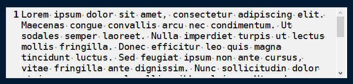
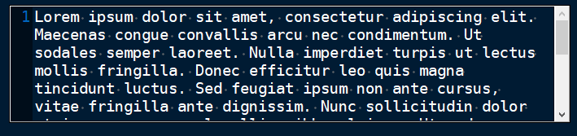
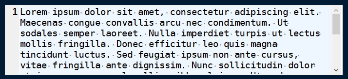
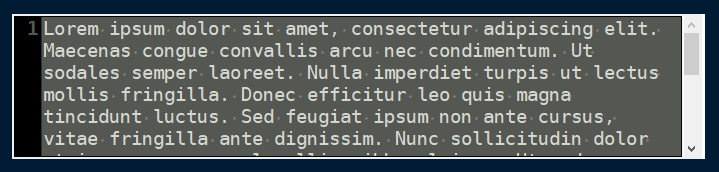
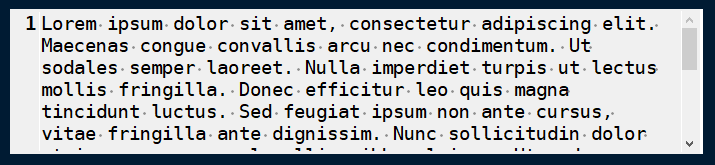
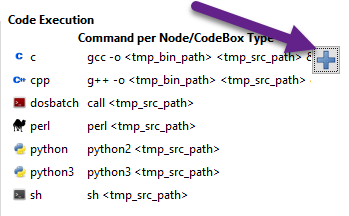
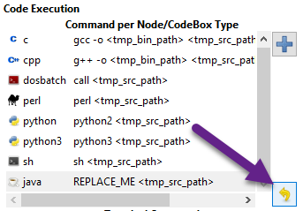
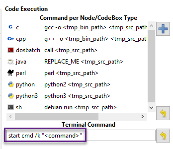

# Plain Text and Code

	The Plain Text and Code preferences menu provides configuration options for [automatic syntax highlighted](<../Text/Automatic Syntax Highlighting.md>) nodes, [plain text](<../Text/Plain Text.md>) nodes, and [codeboxes](../Objects/Codebox.md).

 ## Text Editor

	- **Style Scheme** - Defines the color theme.

		- **Classic**
		
			 Figure 9.04
			

		- **Cobalt**
		
			 Figure 9.05
			

		- **Kate**
		
			 Figure 9.06
			

		- **Oblivion**
		
			 Figure 9.07
			

		- **Tango**
		
			 Figure 9.08
			

	- **Show White Spaces** - Displays character markers over spaces.

	- **Highlight Current Line** - When enabled, highlights the line of the cursor position.

 ## Code Execution

	This section defines the command, for each language, that runs when a [codebox is executed](../Objects/Codebox.md).

 ## Adding a New Command

	1. Click the `+` icon, shown in [Figure 9.09](<./Plain Text and Code.md>), to display the **Select Element to Add** menu.
	
			 Figure 9.09
			

	2. Select a language to apply the new command to.

	3. Click **OK**.

	4. Find the new language rule in the list and [edit the command](<./Plain Text and Code.md>).

 ## Editing a Command

	Double-click a command to edit its value.

	**NOTE:** **`<tmp_src_path>`** is a variable that represents the codebox or node being executed. It should not be removed from the command.

 ## Reset Commands

	Click the yellow return arrow to reset to the default list of commands.
	
	 Figure 9.10
	

 ## Terminal Command

	The terminal command is a configuration required to execute code within Cherrytree. To configure a terminal, set this option to a command that executes another command within a new instance of your terminal. Use **`<command>`** as a placeholder for the command to be executed in the new instance.
	
	For example, when a codebox is executed on the machine in [Figure 9.11](<./Plain Text and Code.md>), the following command is used: `start cmd /k "<command>"`.
	
	 Figure 9.11
	
	
		- **`start cmd`** - Opens a new instance of command prompt.

		- **`/k`** - A command line option to execute the text that follows inside quotation marks.

		- **`<command>`** - A variable which represents one of the language-specific commands that are defined in the [code execution](../Objects/Codebox.md) options.

		**NOTE:** The language-specific command represented by **`<command>`** is determined by the language selected in the [codebox properties](../Objects/Codebox.md). If, for example, a codebox executed in [Figure 9.11](<./Plain Text and Code.md>) is configured for python3, **`<command>`** represents python3 **`<tmp_src_path>`**.
