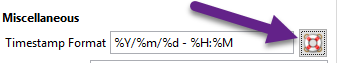
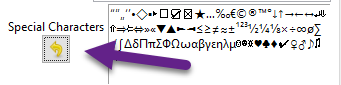

# Text and Code

 ## Text Editor

	- **Tab Width** - Defines the number of **`space`** characters that a **`tab`** is equal to in width.

	- **Insert Spaces Instead of Tabs** - Replaces one **`tab`** with a number of **`spaces`** equal to the number defined in Tab Width.

	- **Use Line wrapping** - Restricts lines of text to the current viewport by forcing text to a new line. This does not break a line with **`newline`** characters and can be toggled as needed without compromising the line structure of a node.

	- **Line Wrapping Indentation** - Defines the alignment of wrapped text compared to the original line.

		- **0** - No indention.

		- **Less than 0** - Indents the wrapped lines to the right of the original line by **`x`** pixels, where **`x`** represents the provided number.

		- **More than 0** - Indents the original line to the right of the wrapped lines by **`x`** pixels, where **`x`** represents the provided number.

	- **Enable Automatic Indentation** - Aligns new lines with the indention of the previous line.

	- **Show Line Numbers** - Displays a numerical index of the lines within the editor.

	- **Vertical Space Around Lines** - Defines the number of pixels that separate lines of text.

	- **Vertical Space in Wrapped Lines** - Defines the percentage of the Vertical Space Around Lines value that applies to wrapped lines.

		**NOTE:** This has no effect if **Vertical Space Around Lines** is set to zero.

 ## Miscellaneous

	- **Timestamp Format** - Defines the format of a [timestamp](../Objects/Timestamps.md).

		**NOTE:** See [Formatting Timestamps](<./Text and Code.md>) for a list of timestamp directives or visit the [strftime documentation](https://docs.python.org/2/library/time.html#time.strftime) by click the icon next to the timestamp setting.

		 Figure 9.01
		

	- **Horizontal Rule** - Defines the text inserted for a [horizontal rule](<../Objects/Horizontal Rule.md>).

	- **Special Characters** - Defines the list of special characters to exist in the [Special Characters](<../Objects/Special Characters.md>) submenu.
	
		New characters can be added to the list by pasting them next to the existing characters. Click the yellow arrow icon to reset to the default list of characters.

		 Figure 9.02
		

	- **Chars to Select at Double Click** - By default, double-clicking text selects the sequence of letters and numbers that are under the mouse pointer and are not separated by whitespace, punctuation, or special characters. Adding characters to the **Chars to Select at Double Click** setting includes those characters in a double-click selection.

 ## Formatting Timestamps

	The table below, copied from the [strftime documentation](https://docs.python.org/2/library/time.html#time.strftime), can be referenced when formatting timestamps in Cherrytree.

	

| %a  | Locale’s abbreviated weekday name.  |
| --- | --- |
| %A  | Locale’s full weekday name.  |
| %b  | Locale’s abbreviated month name.  |
| %B  | Locale’s full month name.  |
| %c  | Locale’s appropriate date and time representation.  |
| %d  | Day of the month as a decimal number.  |
| %H  | Hour (24-hour clock) as a decimal number.  |
| %I  | Hour (12-hour clock) as a decimal number.  |
| %j  | Day of the year as a decimal number.  |
| %m  | Month as a decimal number.  |
| %M  | Minute as a decimal number.  |
| %p  | Locale’s equivalent of either AM or PM.  |
| %S  | Second as a decimal number.  |
| %U  | Week number of the year (Sunday as the first day of the week) as a decimal number [00,53]. All days in a new year preceding the first Sunday are considered to be in week 0.  |
| %w  | Weekday as a decimal number.  |
| %W  | Week number of the year (Monday as the first day of the week) as a decimal number [00,53]. All days in a new year preceding the first Monday are considered to be in week 0.  |
| %x  | Locale’s appropriate date representation.  |
| %X  | Locale’s appropriate time representation.  |
| %y  | Year without century as a decimal number.  |
| %Y  | Year with century as a decimal number.  |
| %Z  | Time zone name (no characters if no time zone exists).  |
| %%  | A literal '%' character.  |
| Directive | Value |
