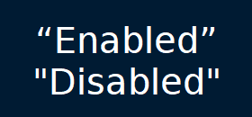

# Text

	**Enable Smart Quotes Auto Replacement** - Converts paired quotation marks on a line to smart quotes, illustrated in [Figure 9.03](./Text.md).
	
	 Figure 9.03
	
	
	**Enable Symbol Auto Replacement** - Enables the automatic replacement of certain symbols such as:

     - ***** to **•**
     - **(C)** to **©** 
