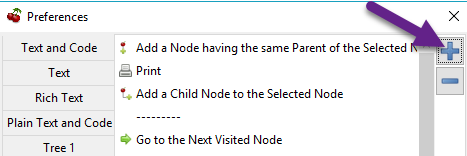
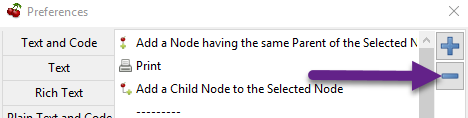
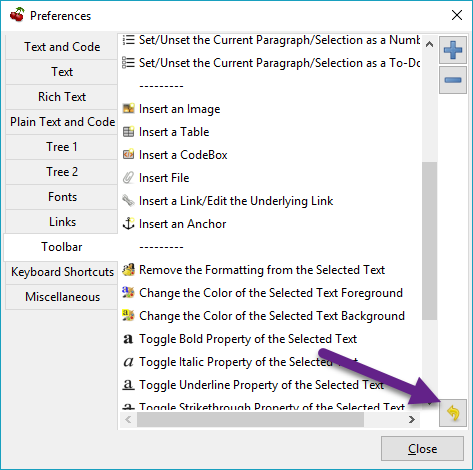

# Toolbar

	The **Toolbar** preferences menu provides configuration options for the [toolbar](../Quick%20Start/Interface.md) panel.

 ## Adding Actions to the ToolbarAdding Actions to the Toolbar

	1. Click the** ****+**** **icon, shown in [Figure 9.13](Toolbar.md) to display the **Select Element to Add **window.
	
		 Figure 9.13
		

	2. Select an action to add.
	
		**NOTE**: The --------- option represents a vertical divider in the toolbar.

	3. Click** OK** to complete the addition.

	The action can then be dragged up or down to determine its position on the toolbar. Actions are organized from top to bottom in the Toolbar preferences menu, which translates to left to right in the actual toolbar.

 ## Removing Actions from the ToolbarRemoving Actions from the Toolbar

	1. Select an action.

	2. Click the **-** icon to remove the selected action from the toolbar.
	
		 Figure 9.14
		

 ## Reset Toolbar SettingsReset Toolbar Settings

	Click the yellow return button to return to Cherrytree’s default toolbar settings.

	 Figure 9.15
	

