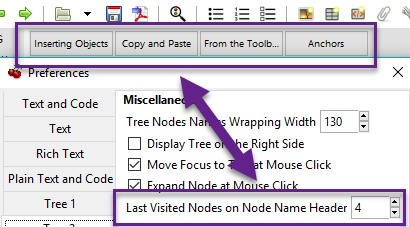

# Tree 2

	The **Tree 2 **preferences menu is a continuation of [Tree 1](Tree%201.md), providing additional configuration options for the [tree view](http://#tree-view) panel.

 ## MiscellaneousMiscellaneous

	- **Tree Nodes Names Wrapping Width** - Defines the width in pixels at which text begins to wrap within the tree view.

	- **Display Tree on Right Side **- Moves the tree view panel to the right side of the window.

	- **Move Focus to Text at Mouse Click **- When a node is selected, the editor becomes the active panel with the cursor positioned at the beginning of the first line.

	- **Expand Node at Mouse Click - **Collapsed nodes expand when they are selected within the tree view.

	- **Last Visited Nodes on Node Name Header** - Defines the number of most recently visited nodes to display above the editor.
	
		 Figure 9.12
		
	
