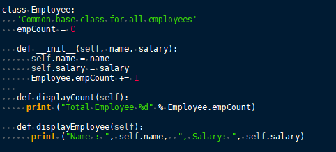

# Automatic Syntax Highlighting

	Automatic syntax highlighting styles text with a readable color scheme that corresponds with the grammar of a language.
	
	 Figure 7.01
	

 ## Choosing a Language

	1. Open the **Node Properties** menu by right-clicking a node and selecting **Change Node Properties**.

	2. Choose** Automatic Syntax Highlighting**.

	3. Click the drop-down menu directly beneath the **Node Type** options.

	4. Choose from the list of [supported languages](Automatic%20Syntax%20Highlighting.md).

 ## Executing a Node

	Nodes set to automatic syntax highlighting can be executed from Cherrytree, assuming you have its assigned language installed to your machine.
	
**	To execute a node:**
	
	1. Select **Execute Code** from the **File** menu.

	2. When prompted, click **OK** to confirm that you want to execute the code.

	Some languages require an execution command to be assigned to the language before the code can be executed.
	See [Plain Text and Code](../Settings/Plain%20Text%20and%20Code.md) for details on assigning a command.

 ## Supported Languages

	- ada
	- asp
	- awk
	- bibtex
	- boo
	- c
	- c-sharp
	- cg
	- changelog
	- chdr
	- clisp
	- cmake
	- cpp
	- css
	- cuda
	- d
	- desktop
	- diff
	- docbook
	- dosbatch
	- dot
	- dpatch
	- dtd
	- eiffel
	- erlang
	- fcl
	- forth
	- fortran
	- fsharp
	- gap
	- gettext-translation
	- glsl
	- go
	- groovy
	- gtk-doc
	- haddock
	- haskell
	- haskell-literate
	- html
	- idl
	- ini
	- java
	- js
	- latex
	- libtool
	- lua
	- m4
	- makefile
	- mallard
	- markdown
	- markdown-extra
	- msil
	- nemerle
	- nisi
	- objc
	- objective-caml
	- ocl
	- octave
	- ooc
	- pascal
	- perl
	- php
	- pkgconfig
	- powershell
	- prolog
	- python
	- python3
	- r
	- rpmspec
	- ruby
	- rust
	- scala
	- scheme
	- sh
	- sparql
	- sql
	- t2t
	- tcl
	- texinfo
	- vala
	- vbnet
	- verilog
	- vhdl
	- xml
	- xslt
	- yacc
	- yaml

