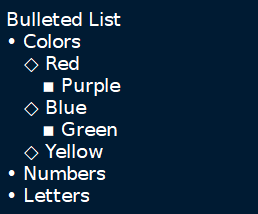
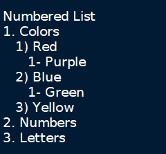
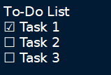
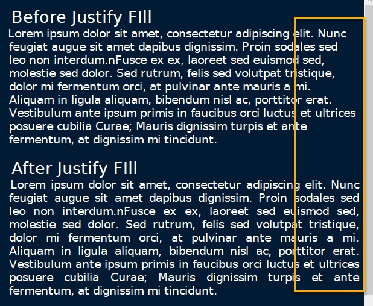

# Formatting

	Most formatting options are only applicable to Rich Text documents and can be found in the **Formatting** menu.
	
	**These options include:**
	
	- **Format Latest** - Apples the most recently used format to the selected text.

	- **Remove Formatting** - Strips all formatting from the selected text.

	- **Text Color Foreground** -  Opens a **Pick a Color** menu. The chosen color is applied to the selected text.

	- **Text Color Background** - Opens a **Pick a Color** menu. The chosen color is applied to the background of selected text.

	- **Toggle Bold Property** - Applies **Bold** the selected text.

	- **Toggle Italic Property** - Applies *Italics* to the selected text.

	- **Toggle Underline Property** - Applies ++Underline++ to the selected text.

	- **Toggle Strikethrough Property** - Applies ~~Strikethrough~~ to the selected text.

	- **Toggle h1 Property** - Styles the selected paragraph as a top-level header.

	- **Toggle h2 Property** - Styles the selected paragraph as a mid-level header.

	- **Toggle h3 Property** - Styles the selected paragraph as a low-level header.
	
		 Figure 7.02
		

	- **Toggle Small Property** - Decreases the size of selected text.

	- **Toggle Superscript Property** - Decreases the size of selected text and vertically aligns it above the normal line of type.

	- **Toggle Subscript Property** - Decreases the size of selected text and vertically aligns it below the normal line of type.

	- **Toggle Monospace Property** - Applies a Monospace format to selected text. (All characters assume the same amount of width.)
	
		 Figure 7.03
		
	
		**NOTE:** The background color of monospace text can be edited in the [Rich Text preferences menu](<../Settings/Rich Text.md>).

	- **Set/Unset Bulleted Lis**t - Formats the selected lines into a bulleted list, in which the item order does not matter.
	
		 Figure 7.04
		

	- **Set/Unset Numbered List** - Formats the selected lines into a numbered list, in which the order of items has purpose.
	
		 Figure 7.05
		

	- **Set/Unset To-Do List** - Formats the selected lines into a list of checkbox items. Click a checkbox to mark it as complete.
	
		 Figure 7.06
		

	- **Justify Left** - Aligns content to the left side of the page. (Default)

	- **Justify Center** - Aligns content to the center of the page.

	- **Justify Right** - Aligns content to the right side of the page.

	- **Justify Fill** - Aligns content to the left side of the page and redistributes any empty space at the end of lines to between the words in the paragraph(s). This causes the body of text to fill the complete width of its textbox, demonstrated in [Figure 7.07](./Formatting.md).
	
		 Figure 7.07
		

