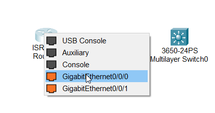
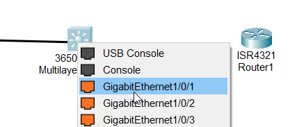
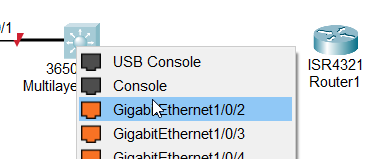
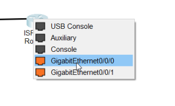
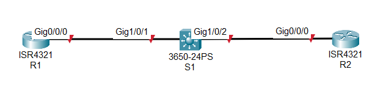

Configuring a router and switch

Connection of router and switch

Connection using a copper straight-through cable.

Connect from Router GE0/0/0 to Switch GE1/0/1

Connection from switch GE1/0/2 to router GE0/0/0
 

Change the names for ease

