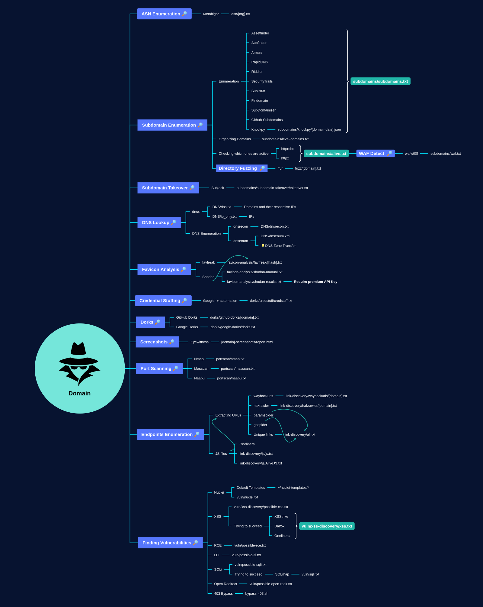

**Three Stratergy**  **:**
⇒ Authenticated Routes  ( Authentication based urls )
⇒ UnAthenticated Routes ( pages for everyones )
⇒ DOM Injection   (Custom Js files and NPM Packages ) 

**Compensative Control :** 
⇒ Cookie Flags
⇒ Browser Security Headers
⇒ Content Security Policy
⇒ WAF
⇒ Client Side Validation
⇒ Server Side Valication
⇒ Output Encoding

 **Link to All Recon Tools :**   <https://user-images.githubusercontent.com/73609472/119389097-8a3de200-bca1-11eb-831b-d8739075695f.png>

- **Recon using Ars0n Framework or find all the subdomains**    ( **Categorize the subdomains** )
      - No Functionality
      - Restricted Access
      - API
      - External Service Login Page 
      - Internal Login Page
      - Full App w/  Authentication

**No Functionality :** 

- Bruteforce headers and fields with seclis payload and intruder
- Bruteforce and find intresing fields ,headers ,folders,direcories and more..
- Use Seclistt Payloads
- Param Miner

**Restricted Access**  : 

- Use 403 By pass Extention from burp pro
- Use and read hacktricks book websites to learn about 403 and 401 bypass
-He send that request to the repeater and manipulate he request by changing values at end
      - Content type changed like content-type: application/json after changing he insert json values
      - the above methods are examples
- <https://github.com/Dheerajmadhukar/4-ZERO-3>
- 

**API  :**

- Search ad fetch content about API Documentation
- Auomate with API Payloads using intruder

**External Service LOgin Page :** 

- Search CVE , REPORTS , WRITEUPS related to that subdomain and services to exploit

**Full App Authentication :** 
- Open All core domains url
- Use sitemap and configure the scan to fetch reflected xss and stored xss possible urls 
- The scan may take more hours
- The scan used for finding attack vector for client side injection
- Search for input returned in response >>  in the Burpsuite Dashboard
- Check compansative controls
      ◇  **Cookie Flags**
               - Check Storage values in developer console
      ◇ **Browser Security Headers**
               - Check Security Headers like  Xframe,xss protection and more
      ◇ **Content Security Policy**
               - **fetch content security header** with values   adn use **csp evaluater** to get more information
               - <https://csp-evaluator.withgoogle.com/>
      ◇ **WAF**
               - Find WAF 
               - Awesome WAF TOOL used to find the name of the WAF
               - To Bypass 
                  - get collection of tags from the Portswigger cheat sheet
                  - **Try one by one manual** or **automate the tags**
                        - Seperate as **Catch   No-Catch   ByPass**   list and write down the tags
                        - Catch : 
                                                - Mention the tags which blocked by the application firewall
                        - No Catch : 
                                                - Mention the Tags which are allowed by the application firewall
                        - ByPass  : 
                                                - Use Portswigger cheat Sheet
                                                - Try the **Worked**  and **Not** **Worked** : 
                                                         - Use Upper and lower Characters   **<ScRiPt>**
                                                         - Use double characters some time the application only encode first charector  **<<ScrtipT**
                                                         - Add   additional characters like this   **<Script+asa+askjh>**
                                                         - Use Aditional open tags  like      **< ScrIpT <** 
                                                         - Use Intruder to automate to find the perfect payload to break the encoding
                                                            - **<any tage    ="martin $Payload$" >
                                                                        ⇒ Check in which stage the tage or special character values not encoded 
                                                                        ⇒ or Had some difference notice and exploit in further **
      **◇ Client Side Validation**
               - Check Client validation
      **◇ Server Side Valication**
               - Use burpsuite intruder to automate the request attack with collection of payloads ( characters,hex values and some used in the url clientside injection from seclist )
               - Verfy each response with manual or content length
      **◇ Output Encoding**

- Subdomain Enumeration
         - assetfinder --subs-only example.com >> subdomains.txt
         - subfinder -d example.com -o subdomains.txt
         - amass enum -passive -d example.com >> subdomains.txt
         - findomain -t example.com -u findomain_subdomains.txt
         - combine all txt files result into one single file and remove duplicates 
                  - **cat *.txt | sort -u > combined_subdomains.txt**  
                  - cat filename.txt | wc  -l    to know total subdomains
      

- Validating Subdomains 
         - cat subdomains.txt | httpx -silent -mc 200,302,301 -o live_subdomains.txt                                >>>> >             **Using httpx**           <<<<<<<<<<
         - cat subdomains.txt | httprobe > live_subdomains.txt                                                                               >>>> >             **Using httpprobe**           <<<<<<<<<<
- Capture and store domains headers and screenshot 
            - Aquatone tool
            - Set thread = 1
            - Analyze and classify each domains 
                                                                 

- Extracting JS Files from Live Subdomains 
         - cat live_subdomains.txt | gau | grep "\.js$" > js_files.txt        =>   Working Properly only fetch js files
         - cat live_subdomains.txt | hakrawler -js -depth 3 > js_files.txt      =>  fetch all type of urls
         - cat live_subdomains.txt | waybackurls | grep "\.js$" > js_files.txt
         - cat urls.txt | subjs | tee subjs.txt     **working** **good**

- **Fetch URL 's From the JavaScript FIles**
         - cat js_files.txt | xargs -n 1 wget -q -O - | grep -oP 'http[s]?://\S+' > js_urls.txt
         - cat js_files.txt | xargs -n 1 curl -s | grep -oP 'http[s]?://\S+' >> js_urls.txt

- Check sensitive keys with Custom Wordlist 
         - cat js_files.txt | xargs -n 1 curl -s | grep -f custom_wordlist.txt >> found_keys.txt

- Remove Duplicates from the files
         - sort -u js_urls.txt -o js_urls.txt   ;   sort -u found_keys.txt -o found_keys.txt

- Extract Sensitive information from the files 
         - Donwload all js files  :   wget -i js_urls.txt -P ./js_files/
         - 

         -                    

