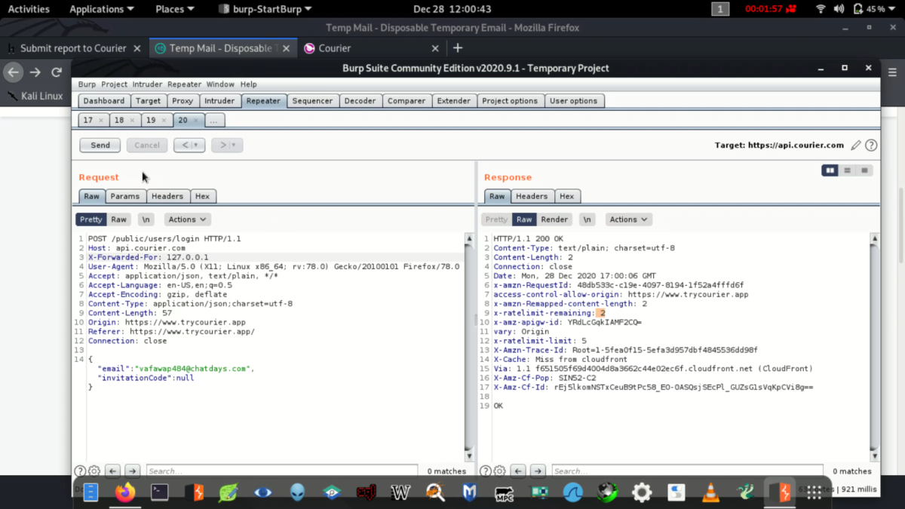

-     **BY changing the value of X forward For header in Request..the attacker add that value and forward the request to server will create a no rate limit vuln.**

   

**•** 				**Imagine a user with IP 203.0.113.5 visits a website, but their request goes through a proxy server with IP 192.168.1.1. 
- 				The request sent to the website will include:  makefile  X-Forwarded-For: 203.0.113.5  
- 				When the website receives this request, it can look at the X-Forwarded-For header to see the user’s real IP, 203.0.113.5, 
- 				instead of just seeing the proxy server’s IP, 192.168.1.1. **
