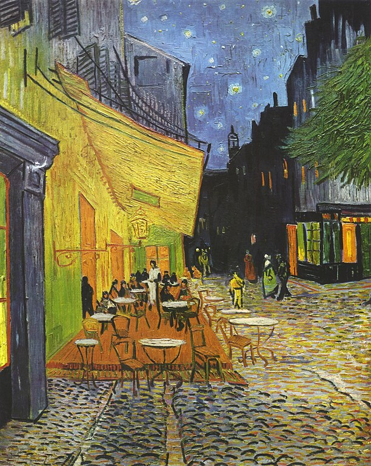
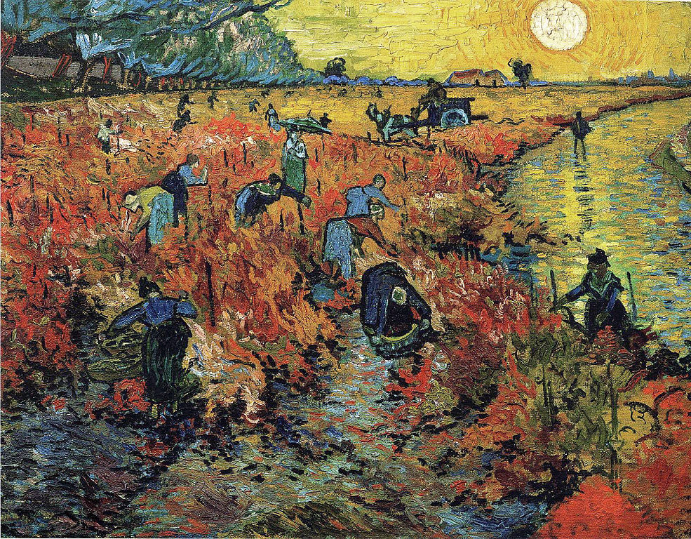
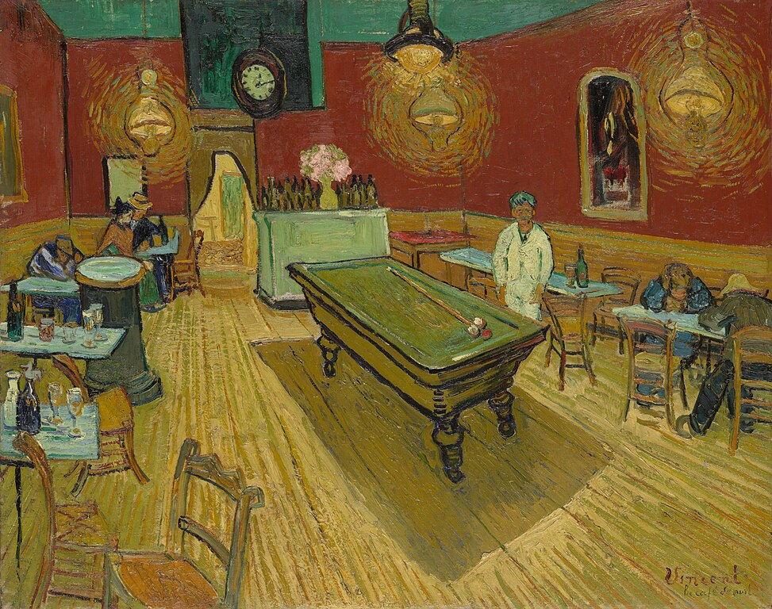

This is an entry intended to demonstrate (most?) of the features of Day One. It is intended to provide an example for a potential Obsidian import plugin.

Day One supports basic markdown directly.


# Header 1

## Header 2

### Header 3

#### Header 4

##### Header 5

###### Header 6

Unicode is supported, including emoji (🌋) and non-english scripts (富士山). Words can be **bold**, *italic*, ***bold and italic***, and highlighted. Links are supported, both as text ([Obsidian](https://obsidian.md)) and inline (https://obsidian.md).

A numbered list:

1. One
2. Two
3. Three

A bullet list:

- One
- Two
- Three

A check list:

- [ ] One
- [ ] Two
- [ ] Three

A combination list with nesting:

- [ ] One
	- Alpha
	- Beta
	- Gamma
- [ ] Two
	1. Foo
	2. Bar
	3. Baz
- [ ] Three

A horizontal rule:

---

Inline `code` is supported. Code blocks can either be used to provide code:

```
#!/usr/bin/env bash
```


```

```
```
echo "Hello world!"
```


Or as a way of specifying more complex markdown (including embedded HTML).

| Col 1 | Col 2 | Col 3 |
| -----:|:-----:|:----- |
|     A |   B   | C     |

<a href="https://obsidian.md">An HTML link.</a>


Block quotes are also supported, and single line breaks are allowed:

> Two roads diverged in a yellow wood,
> And sorry I could not travel both
> And be one traveler, long I stood
> And looked down one as far as I could
> To where it bent in the undergrowth;
> 
> Then took the other, as just as fair
> And having perhaps the better claim,
> Because it was grassy and wanted wear;
> Though as for that, the passing there
> Had worn them really about the same,
> 
> And both that morning equally lay
> In leaves no step had trodden black
> Oh, I kept the first for another day!
> Yet knowing how way leads on to way,
> I doubted if I should ever come back.
> 
> I shall be telling this with a sigh
> Somewhere ages and ages hence:
> Two roads diverged in a wood, and I,
> I took the one less traveled by,
> And that has made all the difference.
> 
> — https://public-domain-poetry.com/robert-lee-frost/road-not-taken-1222

Videos up to 5 minutes in length can be embedded.

[7ac45902cb04ef72ed4081ba2781fb76.mp4](7ac45902cb04ef72ed4081ba2781fb76.mp4)

Clip source: https://peach.blender.org/download/ 

Audio can be embedded.

[16f7faf0741731dad2be4e8b82a9ff41.m4a](16f7faf0741731dad2be4e8b82a9ff41.m4a)

Clip source: http://openmusicarchive.org/browse_tag.php?tag=jazz 

PDFs can be embedded.

[cf41539dd15668f71c87aa256ffcbaaf.pdf](cf41539dd15668f71c87aa256ffcbaaf.pdf)

Book source: https://gutenberg.org/files/11/old/alice30.pdf

And, of course, images can be embedded.







Image sources:
- https://en.wikipedia.org/wiki/File:Vincent_Willem_van_Gogh_-_Cafe_Terrace_at_Night_%28Yorck%29.jpg
- https://en.wikipedia.org/wiki/File:Red_vineyards.jpg
- https://en.wikipedia.org/wiki/File:Le_caf%C3%A9_de_nuit_%28The_Night_Caf%C3%A9%29_by_Vincent_van_Gogh.jpeg

Journals can have tags with spaces applied, or also be #TaggedInline (but inline tags can’t have spaces). They can have other metadata associated with them, like weather conditions, a location, and an activity. Finally, entries can be pinned or favorited.

[A link to another journal entry.](2024-01-06-0001.md)