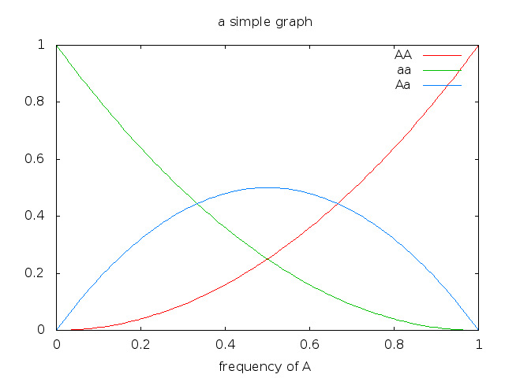

Introduction

A collection of example pages

## Org-Mode Beamer

Derek Feichtinger (myInstitute)

Animations by overlays

## Example

Subtitle

Derek Feichtinger

myInstitute

9. 04. 2026

Org-Mode Beamer Example

Multiple Columns

Conclusions

9. 04. 2026 1 / 45

---

Introduction

## Outline 1 Introduction

2 A collection of example pages 3 Animations by overlays

4 Multiple Columns

5 Conclusions

Derek Feichtinger (myInstitute)

A collection of example pages

Animations by overlays

Org-Mode Beamer Example

Multiple Columns

Conclusions

9. 04. 2026

---

Introduction

## Topic 1 Introduction

2 A collection of example pages 3 Animations by overlays

4 Multiple Columns

5 Conclusions

Derek Feichtinger (myInstitute)

A collection of example pages

Animations by overlays

Org-Mode Beamer Example

Multiple Columns

Conclusions

9. 04. 2026

---

Introduction

A collection of example pages

An alternative title page for a section

Derek Feichtinger (myInstitute)

Animations by overlays

Multiple Columns

Conclusions

# Introduction

Org-Mode Beamer Example

9. 04. 2026

---

Introduction

A collection of example pages

## Instructions

Look at the Org source file to learn about available options. I also added many comments explaining the usage, there.

generating presentation notes.

inserting a table of contents with the current section highlighted at the beginning of each section.

configuring transparency of yet uncovered overlay elements.

Derek Feichtinger (myInstitute)

Animations by overlays

Org-Mode Beamer Example

Multiple Columns

Conclusions

9. 04. 2026

---

Introduction

A collection of example pages

## Debugging

Look at the pdflatex messages in the buffer named You may want to run the T X compilation interactively with something likeE

pdflatex -shell-escape beamer-example.tex

to get the interactive LAT X shell helpE

Derek Feichtinger (myInstitute)

Org-Mode Beamer Example

Animations by overlays

Multiple Columns

Conclusions

*Org PDF LaTeX Output*

9. 04. 2026

---

Introduction

A collection of example pages

Org mode version information

Emacs version: GNU Emacs 30.2 (build 1, x86_64-pc-linux-gnu, X toolkit, cairo version 1.16.0, Xaw3d scroll bars)

org version: 9.7.11

Derek Feichtinger (myInstitute)

Animations by overlays

Org-Mode Beamer Example

Multiple Columns

Conclusions

9. 04. 2026

---

Introduction

A collection of example pages

## Sources and Links

[I started this example based on the Worg](http://orgmode.org/worg/exporters/beamer/tutorial.html) Basic LAT X Beamer linksE [An introduction to Beamer (German)](http://www2.informatik.hu-berlin.de/~mischulz/beamer.html) [great beamer reference card by Fabrice](http://www2.informatik.hu-berlin.de/~mischulz/beamer.html) [nice link for choosing a theme: beamer theme matrix](https://github.com/fniessen/refcard-org-beamer) [nice example of beamer features (pure Latex)](http://www.hartwork.org/beamer-theme-matrix/) [Presentations using Latex - the Beamer Class by Amber Smith. Excellent introduction](http://www.mathematik.uni-leipzig.de/~hellmund/LaTeX/beamer2.pdf) [beamer features.](http://www.math.utah.edu/~smith/AmberSmith_GSAC_Beamer.pdf)

Derek Feichtinger (myInstitute)

Org-Mode Beamer Example

Animations by overlays

Multiple Columns

Conclusions

[hosted example by Eric S. Fraga](http://orgmode.org/worg/exporters/beamer/tutorial.html)

Niessen on GitHub.

showing many

9. 04. 2026

---

Introduction

A collection of example pages

## A simple slide

This slide consists of some text with a number of bullet points:

the first, very important, point!

the previous point shows the use of the special markup which translates to the Beamer  alert command for highlighting text.

The above list could be numbered or any other type of list and may include sub-lists.

Derek Feichtinger (myInstitute)

Animations by overlays

Org-Mode Beamer Example

Multiple Columns

Conclusions

specific

9. 04. 2026

---

Introduction

A collection of example pages

## A more complex slide

This slide illustrates the use of Beamer blocks. The following text,

a block:

Theorem (Org mode increases productivity)

org mode means not having to remember L

it is based on ascii text which is inherently portable.

Emacs!

Derek Feichtinger (myInstitute)

Animations by overlays

AT Xcommands. E

Org-Mode Beamer Example

Multiple Columns

Conclusions

with its own headline, is displayed in

9. 04. 2026

---

| Introduction A collection of example pages | Animations by overlays | Multiple | Columns Conclusions |
|---|---|---|---|
| Tables |  |  |  |
| The size of the table font can be chosen | by giving a #+LATEX: | \small command | (or \tiny or |
| \footnotesize) |  |  |  |
| WNs Processors | Cores/node HS06/node | total cores | total HS06 |
| 20 2*Xeon X5560 | 8 | 118 160 | 2360 |
| 11 2*E5-2670 2.60GHz | 16 | 263 176 | 2893 |
| 4 2*AMD 6272 | 2.40GHz 32 | 241 128 | 964 |
| 35 |  | 464 | 6217 |
| Derek Feichtinger (myInstitute) | Org-Mode Beamer Example |  | 9. 04. 2026 11 / 45 |

The size of the table font can be chosen by giving a 2*AMD 6272 2.40GHz #+LATEX: \small Multiple Columns command (or
---

Introduction

A collection of example pages

## Exporting beamer presentations

Frequently there is a need to convert a beamer presentation to MS

contributing slides

The best solution known to me as of 2022 is 1 open the PDF using

2 Save as pptx may need to adapt slides or copy content to another template

Animations by overlays

libreoffice --impress

Multiple Columns

Conclusions

powerpoint for sharing or

Derek Feichtinger (myInstitute)

Org-Mode Beamer Example

9. 04. 2026

---

Introduction

## Topic 1 Introduction

2 A collection of example pages 3 Animations by overlays

4 Multiple Columns

5 Conclusions

Derek Feichtinger (myInstitute)

A collection of example pages

Animations by overlays

Org-Mode Beamer Example

Multiple Columns

Conclusions

9. 04. 2026

---

Introduction

A collection of example pages

## block environments

a block \begin{block}{A block} ... \end{block}

an alert block \begin{alertblock}{An alert block} ... \end{alertblock}

an example block

\begin{exampleblock}{An alert block} ... \end{exampleblock} Derek Feichtinger (myInstitute)

Animations by overlays

Org-Mode Beamer Example

Multiple Columns

Conclusions

9. 04. 2026

---

Introduction

A collection of example pages

## colorbox

a block containing a colorbox

The beamercolorbox text and an Org example block \begin{beamercolorbox}[shadow=true, rounded=true]{eecks} ... \end{beamercolorbox}

a color box test made with inline LaTex

Just some text.

Derek Feichtinger (myInstitute)

Animations by overlays

Multiple Columns

Conclusions

code

Org-Mode Beamer Example

9. 04. 2026

---

Introduction

A collection of example pages

Animations by overlays

Multiple Columns

Conclusions

A fullframe is a frame with an ignored slide title. frametitle is set to the empty string

Derek Feichtinger (myInstitute)

Org-Mode Beamer Example

9. 04. 2026

---

Introduction

A collection of example pages

Animations by overlays

Multiple Columns

Conclusions

A headline with an ignoreheading environment will only have its contents displayed in the output. The heading text itself is ignored, and no heading bar is shown.

Contents are not inserted in any frame environment. It makes no sense to use this as major element for a slide.

ignoreheading is useful as a structural element in order to again place normal text after a previous element (like a block or a column environment). Derek Feichtinger (myInstitute)

Org-Mode Beamer Example

9. 04. 2026

---

Introduction

A collection of example pages

Animations by overlays

Multiple Columns

Conclusions

## structureenv environment

For highlighting text.

To help the audience see the structure of your presentation.

On this slide you should see that the text of the upper items is differently typeset from the bottom item in the structureenv

you need to use ignoreheading (like here) in order to then insert some more normal text after the structureenv.

Derek Feichtinger (myInstitute)

Org-Mode Beamer Example

9. 04. 2026

---

Introduction

A collection of example pages

definition environment

Definition (definition)

Contents of the definition

Derek Feichtinger (myInstitute)

Animations by overlays

Org-Mode Beamer Example

Multiple Columns

Conclusions

9. 04. 2026

---

Introduction

A collection of example pages

Animations by overlays

Multiple Columns

Conclusions

## proof environment and revealing line by line

proof. Suppose p were the largest prime number.

Derek Feichtinger (myInstitute)

Org-Mode Beamer Example

9. 04. 2026

---

Introduction

A collection of example pages

Animations by overlays

Multiple Columns

Conclusions

## proof environment and revealing line by line

proof. Suppose p were the largest prime number.

Let q be the product of the first p numbers.

Derek Feichtinger (myInstitute)

Org-Mode Beamer Example

9. 04. 2026

---

Introduction

A collection of example pages

Animations by overlays

Multiple Columns

Conclusions

## proof environment and revealing line by line

proof. Suppose p were the largest prime number.

Let q be the product of the first p numbers.

Then q + 1 is not divisible by any of them.

Derek Feichtinger (myInstitute)

Org-Mode Beamer Example

9. 04. 2026

---

Introduction

A collection of example pages

Animations by overlays

Multiple Columns

Conclusions

## proof environment and revealing line by line

proof. Suppose p were the largest prime number.

Let q be the product of the first p numbers.

Then q + 1 is not divisible by any of them.

But q + 1 is greater than 1, thus divisible by some prime number not in the first p numbers.

Derek Feichtinger (myInstitute)

Org-Mode Beamer Example

9. 04. 2026

---

Introduction

A collection of example pages

## numbered list over two pages (1) 1 one 2 two 3 three 4 four

Derek Feichtinger (myInstitute)

Animations by overlays

Org-Mode Beamer Example

Multiple Columns

Conclusions

9. 04. 2026

---

Introduction

A collection of example pages

Animations by overlays

Multiple Columns

Conclusions

## numbered list over two pages (2)

Use the [@N] syntax to start a numbered list at a certain value.

block A 5 five 6 six 7 seven

block B 8 eight 9 nine 10 ten

Derek Feichtinger (myInstitute)

Org-Mode Beamer Example

9. 04. 2026

---

Introduction

A collection of example pages

Animations by overlays

Multiple Columns

Conclusions

## long source code over two pages I

Use the allowframebreaks Beamer option. (use-package python

:config (progn ;; load my own python helper functions (load-file (concat dfeich/site-lisp "/my-pydoc-helper.el"))

(defun dfeich/python-keydefs () (define-key python-mode-map (kbd "<M-right>") python-indent-shift-right)

(define-key python-mode-map (kbd "<M-left>") python-indent-shift-left)) (add-hook python-mode-hook # dfeich/python-keydefs)

;; show line numbers on the left for python (add-hook python-mode-hook linum-mode)

(when (featurep flycheck) (add-hook python-mode-hook

(use-package jedi-core :ensure t

Derek Feichtinger (myInstitute)

flycheck-mode))

Org-Mode Beamer Example

9. 04. 2026

---

Introduction

A collection of example pages

Animations by overlays

Multiple Columns

Conclusions

long source code over two pages II

:config (progn (autoload jedi:setup "jedi-core" nil t)

(add-hook python-mode-hook (setq jedi:complete-on-dot t) (setq jedi:server-args

jedi:setup) ("--log" "/tmp/jedi.log"

"--log-level" "INFO")) (when (featurep company)

(defun dfeich/python-mode-hook () (add-to-list company-backends company-jedi)

(add-hook python-mode-hook dfeich/python-mode-hook))))))

Derek Feichtinger (myInstitute)

Org-Mode Beamer Example

9. 04. 2026

---

Introduction

A collection of example pages

## placing text at the bottom of a page

This text is on top

Animations by overlays

Multiple Columns

Conclusions

This text is on the bottom Derek Feichtinger (myInstitute)

Org-Mode Beamer Example

9. 04. 2026

---

Introduction

A collection of example pages

Animations by overlays

reducing font size in bullet lists

This is a workaround to have the bullet list hierarchy not suddenly produce

reset the main font.

#+LATEX: \footnotesize \let\small\footnotesize

example

example example

Multiple Columns

Conclusions

bigger font for the lower hierarchy, if you only

example

example

Derek Feichtinger (myInstitute)

Org-Mode Beamer Example

9. 04. 2026

---

Introduction

A collection of example pages

Animations by overlays

Multiple Columns

Conclusions

## Text colors

Examples for colored text (using the xcolor package): Text1 Text2 Text3 Text4 Text5 The basic LAT X colors are: black, blue, brown, cyan, darkgray, gray, green, lightgray, lime, magenta,

E olive, orange, pink, purple, red, teal, violet, white, yellow. TODO: The Beamer class loads the xcolor package by default. By including the xcolor option dvipsnames in the beamer class definition, we should also be able to use those names:

#+LaTeX_CLASS_OPTIONS: [t,10pt,xcolor={dvipsnames}]

But this does not seem to work. Cyan Emerald

Derek Feichtinger (myInstitute)

Org-Mode Beamer Example

9. 04. 2026

---

Introduction

## Topic 1 Introduction

2 A collection of example pages 3 Animations by overlays

4 Multiple Columns

5 Conclusions

Derek Feichtinger (myInstitute)

A collection of example pages

Animations by overlays

Org-Mode Beamer Example

Multiple Columns

Conclusions

9. 04. 2026

---

Introduction

A collection of example pages

## Highlighting text

The double can be used to enclose active code. Here we use it to specify beamer code  highlight text by specifying an overlay. A useful feature

Derek Feichtinger (myInstitute)

Animations by overlays

Org-Mode Beamer Example

Multiple Columns

Conclusions

that will

9. 04. 2026

---

Introduction

A collection of example pages

## Highlighting text

The double can be used to enclose active code. Here we use it to specify beamer code  highlight text by specifying an overlay. A useful feature

Derek Feichtinger (myInstitute)

Animations by overlays

Org-Mode Beamer Example

Multiple Columns

Conclusions

that will

9. 04. 2026

---

Introduction

A collection of example pages

## Lists

For the first list we use an #+ATTR_BEAMER: :overlay +-It acts like \begin{itemize}[<+->]. So, it will cause the list items to appear one after the other. item 1

For the second list we classify each line by angular brackets each item.

item 1

Derek Feichtinger (myInstitute)

Animations by overlays

Multiple Columns

Conclusions

specification.

to explicitely define the order of revealing

Org-Mode Beamer Example

9. 04. 2026

---

Introduction

A collection of example pages

## Lists

For the first list we use an #+ATTR_BEAMER: :overlay +-It acts like \begin{itemize}[<+->]. So, it will cause the list items to appear one after the other. item 1

Animations by overlays

Multiple Columns

Conclusions

specification.

item 2

For the second list we classify each line by angular brackets to explicitely define the order of revealing each item.

item 1

item 3

Derek Feichtinger (myInstitute)

Org-Mode Beamer Example

9. 04. 2026

---

Introduction

## Lists

For the first list we use an It acts like \begin{itemize}[<+->] item 1

item 2

item 3

For the second list we classify each line by angular brackets each item.

item 1

item 2

item 3

Derek Feichtinger (myInstitute)

A collection of example pages

Animations by overlays

Multiple Columns

Conclusions

#+ATTR_BEAMER: :overlay +- specification. . So, it will cause the list items to appear one after the other.

to explicitely define the order of revealing

Org-Mode Beamer Example

9. 04. 2026

---

Introduction

A collection of example pages

## Basic revealing of blocks using BEAMER_act

First Block this is visible from the beginning

Derek Feichtinger (myInstitute)

Animations by overlays

Multiple Columns

Org-Mode Beamer Example

Conclusions

9. 04. 2026

---

Introduction

A collection of example pages

## Basic revealing of blocks using BEAMER_act

First Block this is visible from the beginning

Second Block and this one is revealed afterwards by using the BEAMER_act  section.

Derek Feichtinger (myInstitute)

Animations by overlays

Multiple Columns

Conclusions

keyword in the PROPERTIES

Org-Mode Beamer Example

9. 04. 2026

---

Introduction

A collection of example pages

## revealing a picture

A picture will be uncovered next

Derek Feichtinger (myInstitute)

Animations by overlays

Org-Mode Beamer Example

Multiple Columns

Conclusions

9. 04. 2026

---

---

Introduction

A collection of example pages

## revealing a picture

A picture will be uncovered next

Derek Feichtinger (myInstitute)

Animations by overlays

Org-Mode Beamer Example

Multiple Columns

Conclusions

9. 04. 2026

---

---

Introduction

A collection of example pages

## Explicitely defining the transparancy of covered text

First Block this is visible from the beginning

Derek Feichtinger (myInstitute)

Animations by overlays

Multiple Columns

Org-Mode Beamer Example

Conclusions

9. 04. 2026

---

Introduction

A collection of example pages

## Explicitely defining the transparancy of covered text

First Block this is visible from the beginning

Second Block this is initially invisible since we used \setbeamercovered{invisible}

then it is revealed again using the BEAMER_act keyword

Derek Feichtinger (myInstitute)

Animations by overlays

Multiple Columns

Conclusions

for this frame

in the PROPERTIES section.

Org-Mode Beamer Example

9. 04. 2026

---

Introduction

## different transparency setting and default overlay

First Block this is visible from the beginning. Note that we specified another  slide.

A collection of example pages

Animations by overlays

Second Block Initial visibility defined by \setbeamercovered{transparent=30}

Third Block And a third block

Multiple Columns

Conclusions

transparency compared to the previous

Derek Feichtinger (myInstitute)

Org-Mode Beamer Example

9. 04. 2026

---

Introduction

## different transparency setting and default overlay

First Block this is visible from the beginning. Note that we specified another  slide.

A collection of example pages

Animations by overlays

Second Block Initial visibility defined by \setbeamercovered{transparent=30}

Third Block And a third block

Multiple Columns

Conclusions

transparency compared to the previous

Derek Feichtinger (myInstitute)

Org-Mode Beamer Example

9. 04. 2026

---

Introduction

## different transparency setting and default overlay

First Block this is visible from the beginning. Note that we specified another  slide.

A collection of example pages

Animations by overlays

Second Block Initial visibility defined by \setbeamercovered{transparent=30}

Third Block And a third block

Multiple Columns

Conclusions

transparency compared to the previous

Derek Feichtinger (myInstitute)

Org-Mode Beamer Example

9. 04. 2026

---

Introduction

A collection of example pages

## dynamic transparency setting and default overlay

First Block this is visible from the beginning. We defined blocks are slowly getting less transparent.

Second Block a second block

Third Block

And a third block

Fourth Block And a fourth block

Derek Feichtinger (myInstitute)

Org-Mode Beamer Example

Animations by overlays

Multiple Columns

Conclusions

\setbeamercovered{highly dynamic} so that other

9. 04. 2026

---

Introduction

A collection of example pages

## dynamic transparency setting and default overlay

First Block this is visible from the beginning. We defined blocks are slowly getting less transparent.

Second Block a second block

Third Block

And a third block

Fourth Block And a fourth block

Derek Feichtinger (myInstitute)

Org-Mode Beamer Example

Animations by overlays

Multiple Columns

Conclusions

\setbeamercovered{highly dynamic} so that other

9. 04. 2026

---

Introduction

A collection of example pages

## dynamic transparency setting and default overlay

First Block this is visible from the beginning. We defined blocks are slowly getting less transparent.

Second Block a second block

Third Block

And a third block

Fourth Block And a fourth block

Derek Feichtinger (myInstitute)

Org-Mode Beamer Example

Animations by overlays

Multiple Columns

Conclusions

\setbeamercovered{highly dynamic} so that other

9. 04. 2026

---

Introduction

A collection of example pages

## dynamic transparency setting and default overlay

First Block this is visible from the beginning. We defined blocks are slowly getting less transparent.

Second Block a second block

Third Block

And a third block

Fourth Block And a fourth block

Derek Feichtinger (myInstitute)

Org-Mode Beamer Example

Animations by overlays

Multiple Columns

Conclusions

\setbeamercovered{highly dynamic} so that other

9. 04. 2026

---

Introduction

A collection of example pages

Animations by overlays

Multiple Columns

Conclusions

plain text between two blocks

block 1 The first block

Derek Feichtinger (myInstitute)

Org-Mode Beamer Example

9. 04. 2026

---

Introduction

A collection of example pages

Animations by overlays

Multiple Columns

Conclusions

## plain text between two blocks

block 1

The first block

A plain text paragraph. I only managed to get the right uncovering behavior by using #+LATEX: \onslide<2-> in front of the paragraph.

Derek Feichtinger (myInstitute)

Org-Mode Beamer Example

9. 04. 2026

---

Introduction

A collection of example pages

Animations by overlays

Multiple Columns

Conclusions

## plain text between two blocks

block 1

The first block

A plain text paragraph. I only managed to get the right uncovering  \onslide<2-> in front of the paragraph.

block 2 The second block

behavior by using #+LATEX:

Derek Feichtinger (myInstitute)

Org-Mode Beamer Example

9. 04. 2026

---

Introduction

## Topic 1 Introduction

2 A collection of example pages 3 Animations by overlays

4 Multiple Columns

5 Conclusions

Derek Feichtinger (myInstitute)

A collection of example pages

Animations by overlays

Org-Mode Beamer Example

Multiple Columns

Conclusions

9. 04. 2026

---

Introduction

A collection of example pages

## Blocks in two columns

A left block this slide consists of two columns

this is the right column This is the first column

Derek Feichtinger (myInstitute)

Animations by overlays

Multiple Columns

Conclusions

A right block

Org-Mode Beamer Example

9. 04. 2026

---

Introduction

A collection of example pages

## A text section and a figure

this slide consists of two columns

the first (left) column has no heading and consists of text

the second (right) column has an image and is enclosed in an example block

Derek Feichtinger (myInstitute)

Animations by overlays

Multiple Columns

Conclusions

Example (A screenshot)

Org-Mode Beamer Example

9. 04. 2026

---

---

Introduction

A collection of example pages

## A centered text section and a figure

a centered text section. I found no good way for using \vfill or \minipage [as referenced here](http://tex.stackexchange.com/questions/15244/why-does-vfill-not-work-inside-a-beamer-column)

Derek Feichtinger (myInstitute)

Animations by overlays

Multiple Columns

Conclusions

Example (A screenshot)

Org-Mode Beamer Example

9. 04. 2026

---

---

Introduction

A collection of example pages

## Babel

Octave code A = [1 2 ; 3 4] b = [1; 1]; x = A\b

Derek Feichtinger (myInstitute)

Animations by overlays

The output

A =

1 2 3 4

x =

-1 1

Org-Mode Beamer Example

Multiple Columns

Conclusions

9. 04. 2026

---

Introduction

## Topic 1 Introduction

2 A collection of example pages 3 Animations by overlays

4 Multiple Columns

5 Conclusions

Derek Feichtinger (myInstitute)

A collection of example pages

Animations by overlays

Org-Mode Beamer Example

Multiple Columns

Conclusions

9. 04. 2026

---

Introduction

A collection of example pages

Animations by overlays

Multiple Columns

Conclusions

## Summary

org is an incredible tool for time management it is also excellent for composing documents

Beamer is a very powerful LAT X package for presentationsE the combination is unbeatable: Org Beamer ease of composing slides fast and being able to use all the other Org features though, it takes a bit of a learning curve and examples to copy from

Derek Feichtinger (myInstitute)

Org-Mode Beamer Example

9. 04. 2026

---

|  | Appendix |  |  |  |  |
|---|---|---|---|---|---|
| SOME | BACKUP | SLIDES. The | Appendix will | not be | listed in the table of contents. |
|  | Derek | Feichtinger (myInstitute) | Org-Mode | Beamer | Example 9. 04. 2026 43 / 45 |

SOME BACKUP SLIDES. The Derek Feichtinger (myInstitute) Appendix will not be listed in the Org-Mode Beamer Example
---

| Backup |  | slide 1 |
|---|---|---|
| Some | backup | info |
|  | Derek Feichtinger | (myInstitute) Org-Mode Beamer Example 9. 04. 2026 44 / 45 |

Backup slide 1 Some backup info Derek Feichtinger (myInstitute)
---

|  | Backup | slide 2 |
|---|---|---|
| These | details | are not part of the main talk. |
|  | Derek Feichtinger | (myInstitute) Org-Mode Beamer Example 9. 04. 2026 45 / 45 |

Backup slide 2 These details are not part of the Derek Feichtinger (myInstitute)