## graphviz-babel

Derek Feichtinger

<2015-06-17 Wed>

### Contents 1 Version information

1

2 Links

2

3 rst test

2

4 Examples

3 4.1 color . . . . . . . . . . . . . . . . . . . . . . . . . . . . . . . . 3 4.2 subcluster . . . . . . . . . . . . . . . . . . . . . . . . . . . . . 4 4.3 owchart . . . . . . . . . . . . . . . . . . . . . . . . . . . . . . 10 5 git graphs

14 5.1 schemas with points . . . . . . . . . . . . . . . . . . . . . . . 14 5.1.1 using weight . . . . . . . . . . . . . . . . . . . . . . . . 14 5.1.2 aligning by using groups . . . . . . . . . . . . . . . . . 16 5.2 subgraph . . . . . . . . . . . . . . . . . . . . . . . . . . . . . . 18 1 Version information

(princ (concat (format "Emacs version: %s\n" (emacs-version)) (format "org version: %s\n" (org-version))))

Emacs version: GNU Emacs 24.5.1 (x86_64-unknown-linux-gnu, GTK+ Version 3.10.8) of 2015-05-04 on dflt1w org version: 8.2.10

---

2 Links

[graphviz colors](http://www.graphviz.org/doc/info/colors.html)

[Node, Edge and Graph Attributes](http://www.graphviz.org/doc/info/attrs.html)

[excellent tutorial](http://4webmaster.de/wiki/Graphviz-Tutorial) 3 rst test

digraph {

node [shape=circle,fontsize=8,fixedsize=true,width=0.9]; edge [fontsize=8];

rankdir=LR;

"low-priority" [shape="doublecircle" color="orange"]; "high-priority" [shape="doublecircle" color="orange"];

"s1" -> "low-priority"; "s2" -> "low-priority"; "s3" -> "low-priority";

"low-priority" -> "s4"; "low-priority" -> "s5"; "low-priority" -> "high-priority" [label="wait-time exceeded"];

"high-priority" -> "s4"; "high-priority" -> "s5";

---

4 Examples

4.1 color

digraph G { /* Node main initialisieren und */ /* Attribute für ihn setzen  main [shape=box, color=deeppink]

main -> parse -> execute

/* Node init initialisieren,  /* Edge von main nach init und  /* Attribute für diese Edge setzen.*/ main -> init [color=deeppink, arrowhead=vee, arrowtail=vee]

/* Attribute für den Node init  /* setzen. Das geht auch, nachdem */ /* er schon initialisiert ist.  init [shape=box, color=deeppink]

main -> cleanup execute -> make_string execute -> printf init -> make_string

---

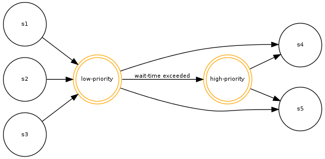

---

main -> printf

/* Bei Edges kann man die  /* Attribute nicht im nachhinein */ /* setzen. Dabei wird nämlich  /* eine zweite Edge erzeugt.  execute -> compare execute -> compare [color=green, arrowtail=tee]

4.2 subcluster

digraph G {

rankdir=BT; subgraph cluster_c0 {a0 -> a1 -> a2 -> a3;} subgraph cluster_c1 {b0 -> b1 -> b2 -> b3;} x -> a0;

---

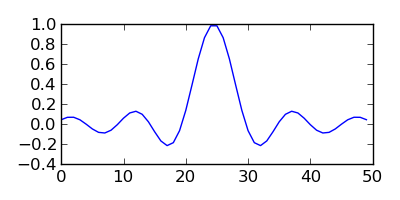

---

x -> b0; a1 -> b3; b1 -> a3;

---

---

digraph G {

rankdir=BT; subgraph cluster_c0 {a0 -> a1 -> a3;} subgraph cluster_c1 {b0 -> b1 -> b2 -> b3;} x -> a0; x -> b0; a1 -> b3; b1 -> a3;

---

---

---

digraph G {

rankdir=BT; subgraph cluster_c0 {a0 -> a1 -> a3;} subgraph cluster_c1 {b0 -> b1 -> b2 -> b3;} x -> a0; x -> b0; a1 -> b3; b1 -> a3;

---

---

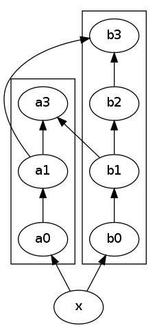

---

4.3 owchart

digraph { label="How to make sure ’input’ is valid"

start[shape="box", style=rounded]; end[shape="box", style=rounded]; if_valid[shape="diamond", style=""]; message[shape="parallelogram", style=""] input[shape="parallelogram", style=""]

start -> input; input -> if_valid; if_valid -> message[label="no"]; if_valid -> end[label="yes"]; message -> input;

if_valid[label="Is input\nvalid?"] message[label="Show\nmessage"] input[label="Prompt\nfor input"]

{rank=same; message input}

---

digraph { start [label="Start"];

start -> decision;

decision [shape=diamond, label="Accessed

decision -> public [label="Yes"]; decision -> notpublic [label="No"];

public [shape=box, label="public"];

externally?"];

---

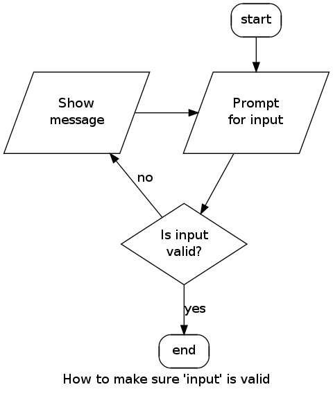

---

notpublic [shape=diamond, label="Deny to children?"];

notpublic -> protected [label="No"] notpublic -> private [label="Yes"]

protected [shape=box, label="protected"] private [shape=box, label="private"]

{ rank=same; decision; public } { rank=same; notpublic; private }

digraph G { Back [shape=house,color=gray,style=filled,fillcolor=lightgray] [URL="Back Page"] [tooltip="Back to Main Diagram"] subgraph cluster0 { Node1 Back -> Node1 Node2 Node1 -> Node2 Node3

---

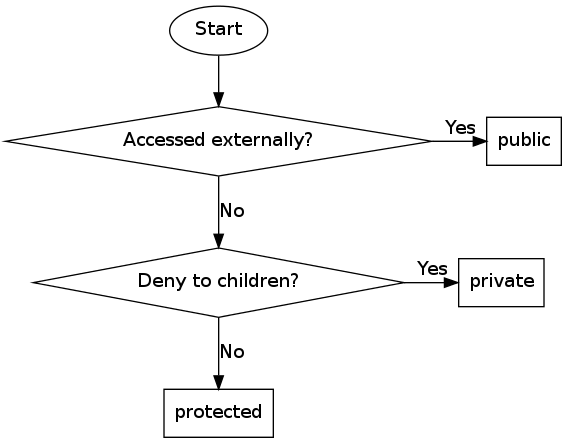

---

Node1 -> Node3

color=invis

Forward [shape=invhouse,color=gray,style=filled,fillcolor=lightgray] [URL="Forward Page"] [tooltip="On to Next Diagram"] Node3 -> Forward

---

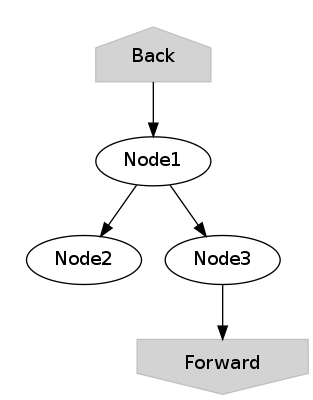

---

5 git graphs

5.1 schemas with points

5.1.1 using weight

weight [can be used to keep the main nodes on the main line (stackoverow](http://stackoverflow.com/questions/4671238/forcing-main-line-nodes-into-a-straight-line-in-graphviz-or-alternatives/4673624) [link). The larger the weight](http://stackoverflow.com/questions/4671238/forcing-main-line-nodes-into-a-straight-line-in-graphviz-or-alternatives/4673624)[factor of an edge is, the straighter, shorter, and](http://stackoverflow.com/questions/4671238/forcing-main-line-nodes-into-a-straight-line-in-graphviz-or-alternatives/4673624) [in the direction of the graph it will be.](http://stackoverflow.com/questions/4671238/forcing-main-line-nodes-into-a-straight-line-in-graphviz-or-alternatives/4673624)

digraph G { rankdir="LR"; node[width=0.15, height=0.15, shape=point]; edge[weight=2, arrowhead=none]; 1 -> 2 -> 3 -> 4 -> 5 -> 6 -> 7 -> 8 -> 9; edge[weight=1]; 2 -> b1 -> b2 ; 6-> c1 -> c2;

fontsize

invisible nodes for aligning graphs

digraph G { rankdir="LR"; node[width=0.15, height=0.15, shape=point]; edge[weight=2, arrowhead=none];

m1 -> m2; // invisible node node[style="invis"]

edge[style="invis"]

m2 -> m3 -> m4;

lm[shape=box, style="", color="", label="master", fontsize=8.0]; m4 -> lm[style="invisible"];

// the branch

---

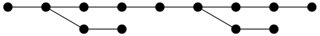

---

node[style="", color="green1"] edge[weight=1, style=""]; m2 -> b1 -> b2;

lb[shape=box, color="", label="branch", fontsize=8.0]; b2 -> lb[style="invisible"]

digraph G { rankdir="LR"; node[width=0.15, height=0.15, shape=point]; edge[weight=3, arrowhead=none];

m1 -> m2; // invisible node

m2 -> m3 -> m4;

lm[shape=box, style="", color="", label="master", fontsize=8.0]; m4 -> lm[style="invisible"];

// the branch node[style="", color="green1"] edge[weight=2, style=""]; m2 -> b1 -> b2;

b1 -> m3[color="green1",arrowhead="", constraint=false]; b2 -> m4[color="green1",arrowhead="",constraint=false];

lb[shape=box, color="", label="branch", fontsize=8.0]; b2 -> lb[style="invisible"]

---

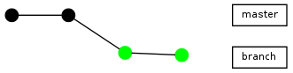

---

5.1.2 aligning by using groups

If the end points of an edge belong to the same group, i.e., have group attribute, parameters are set to avoid straight.

digraph g{

rankdir="LR"; node[width=0.15, height=0.15, shape=point, group=main]; edge[arrowhead=none]; 1 -> 2 -> 3 -> 4 -> 5 -> 6 -> 7 -> 8; node[group=branches];

2 -> 9 -> 10; 5 -> 11 -> 12[color="red1"];

the same crossings and keep the edges

Group seems to be well suited for making graphs with branches

digraph g{

rankdir="LR"; edge[arrowhead=none]; // ranksep=0.30; // this influences the length of edges //splines=ortho;

node[width=0.15, height=0.15, shape=point, group=master]; 1 -> 2 -> 3 -> 4 -> 5 -> 6 -> 7 -> 8; lmaster[shape="box", label="master", fontsize=8.0]; 8 -> lmaster[style="invisible"];

tag_v1[shape="box", group="", color="cyan", fontsize=8.0, style=filled];

---

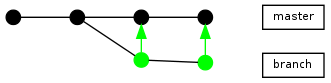

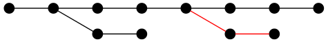

---

// to place the tag vertically above 4, I need to define it so that it // ends up in the same hierarchy level as 4, e.g. by declaring it // above 5 using tag -> 5 tag_v1 -> 5[weight=1, style=invisible]; tag_v1 -> 4[arrowhead="", constraint=false]; //tag_v1 -> 5[style=invisible];

node[group=branchA]; 2 -> a1 -> a2; lbrancha[shape="box", label="branch A", fontsize=8.0]; a2 -> lbrancha[style="invisible"];

node[group=branchB] 3 -> b1 -> b2[color="red1"]; lbranchb[shape="box", label="branch B", fontsize=8.0]; b2 -> lbranchb[style="invisible"];

node[group=branchC, weight=2]; 5 -> c1 -> c2 -> c3; lbranchc[shape="box", label="branch C", fontsize=8.0]; c3 -> lbranchc[style="invisible"];

digraph G {

rankdir=LR; edge[arrowhead=none]; node[width=0.15, height=0.15, shape=point]; node[group=master]; 1 -> 2 -> 3 -> 4 -> 5; lmaster[shape="box", label="master", fontsize=8.0]; 5 -> lmaster[style="invisible"];

node[group=branch]; 2 -> b1 -> b2 -> b3 -> 3;

---

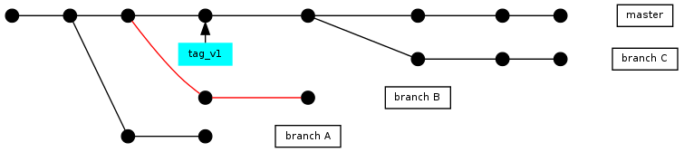

---

lbrancha[shape="box", label="branch A", fontsize=8.0]; b3 -> lbrancha[style="invisible"];

5.2 subgraph

digraph G

graph[size="4,2.66"] //graph[size="8.00,5.00"] rankdir=BT;

subgraph commits

"5c071a6b2c" -> "968bda3251" -> "9754d40473" -> "9e59700d33" -> "2a3242efa4";

subgraph annotations1

rank="same"; "V1.0" [shape=box]; "V1.0" -> "9e59700d33" [weight=0];

subgraph annotations2

rank="same"; "br/HEAD" [shape=box]; "br/HEAD" -> "2a3242efa4" [weight=0];

---

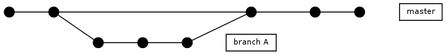

---

digraph G

rankdir=BT; subgraph master

"comm1" -> "comm2" -> "comm3" -> "comm4";

---

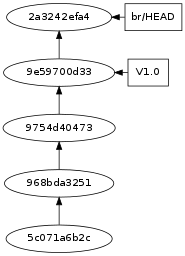

---

subgraph branch1

rank=same; "comm3" -> "br-com1" -> "br-com2";

---

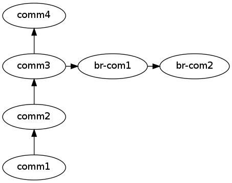

