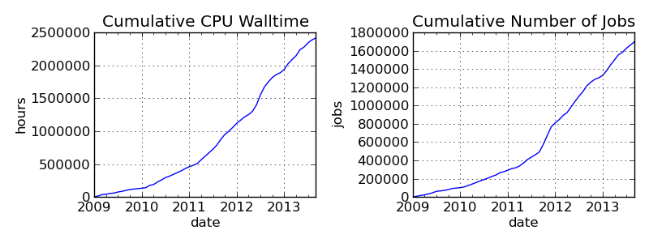

# odt-example

Derek Feichtinger

\<2015-02-14 Sat\>

# Version information

    Emacs version: GNU Emacs 24.4.1 (x86_64-unknown-linux-gnu, GTK+ Version 3.10.8)
     of 2014-10-31 on dflt1w
    org version: 8.2.10

# Table example

The table occupies 80% of the page width. The columns widhts will
be in the ratio of 4:7:10:10. Col b and col c have no visible
vertical separating line (they are one **column group**).

| col a | col b | col c | col d |
|:------|------:|:-----:|------:|
| /     |    \< |  \>   |       |
| a     |     b |   c   |  10.1 |
| d     |     e |   f   | 20 34 |

Here we use a table reference: The compute resources of the
Swiss-CMS TIER-3 are shown in Table *tblAllResources2013*.

Note that the numbering of tables and figures is done in a format of `section-number.sequence-number`.
This cannot be configured by styles. I traced it to the source code in ox-odt.el

| **Resources Q2/2013**        | **Amount**             |
|:-----------------------------|:-----------------------|
| Compute performance          | 5243 HS06 in 336 cores |
| Data Set Storage (SE), RAID6 | 759 TB                 |
| Home Storage (NFS), backuped | ca 6 TB                |
| User interface nodes         | 9 nodes, 72 cores      |
| Virtual Servers              | 15                     |

PSI CMS Tier-3 Resources

# Page breaks and tinkering with OpenDocument XML

At first I wanted to use `soft-page-break` elements, as I saw them
in some LibreOffice generated files. But I found out that they only
work if in the enclosing `<office:body>` there is some definition
like this:

    <office:text text:use-soft-page-breaks="true">

Therefore the following inline ODT block does not work with the
default documents produced by the org ODT exporter, where that
setting is missing (at least not in LibreOffice). I confirmed that
the inline block had been included in the exported ODT document

    #+BEGIN_ODT
       <text:soft-page-break/>
    #+END_ODT   

The basics of this are described in the [OASIS](http://docs.oasis-open.org/office/v1.2/os/OpenDocument-v1.2-os-part1.html#__RefHeading__1419322_253892949) standards specification.

A method that works is to define our own style element for a page
break, just as it is described in the org ODT manual. I used the
`styles.odt` files that I had produced previously, unpacked it, and
then edited the `styles.xml` file found in the archive. Afterwards
I packed it again into an archive `styles-df.odt` and defined the
`#+ODT_STYLES_FILE: "./styles-df.odt"` setting for every org file
where I want to use it. And it works!

    </office:styles>
     ...
      <style:style style:name="PageBreak" style:family="paragraph"
                   style:parent-style-name="Text_20_body">
        <style:paragraph-properties fo:break-before="page"/>
      </style:style>
    </office:styles>

Now, will we get a page break following this line?

# Figure

The resource usage of the Swiss CMS Tier-3 since 2009 is shown in figure *figT3cumjobs*.

T3 resource usage

# Exporting to MS Word

This can be done via \[\[<https://github.com/kawabata/ox-pandoc>\]\[ox-pandoc\] directly or on the command line using LibreOffice (or formerly soffice):

     libreoffice --convert-to docx --headless my-document.odt