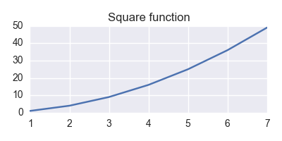
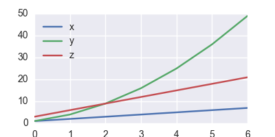

## python org-babel exporting

Derek Feichtinger

January 7, 2016

### Contents 1 Version information

1

2 Links and Documentation

2

3 Generating tables as output

2

4 Calling a python function from inside an org table 3

5 Matplotlib

3 5.1 plotting of a simple graph . . . . . . . . . . . . . . . . . . . . 3 5.2 Plotting from an Org table . . . . . . . . . . . . . . . . . . . 4 6 Pandas

5 6.1 printing a data frame as a table (and noweb block inclusion) . 5 6.1.1 data frame printing using Ipython.display . . . . . . . 7 6.1.2 an older and simpler dataFrame printing alternative: . 8 6.2 plotting a data frame (and placing a code reference) . . . . . 9 6.3 time series resampling . . . . . . . . . . . . . . . . . . . . . . 10 7 Sympy

11

8 Unicode related problems in Org Babel 13

1 Version information

1 (princ (concat 2

(format "Emacs version: %s\n" 3 (emacs-version))

---

4

(format "org version: %s\n"

5

(org-version))))

Emacs version: GNU Emacs 24.5.1 (x86_64-unknown-linux-gnu, GTK+ Version 3.10.8) of 2015-05-04 on dflt1w org version: 8.3.2

python -V 2>&1

Python 2.7.11 :: Continuum Analytics, Inc.

2 Links and Documentation

[http://orgmode.org/worg/org-contrib/babel/languages/ob-doc-python.](http://orgmode.org/worg/org-contrib/babel/languages/ob-doc-python.html) [html](http://orgmode.org/worg/org-contrib/babel/languages/ob-doc-python.html) 3 Generating tables as output

Example 1:

1 x = range(1,10) 2 y = [xe*3 for xe in x] 3 return [x,y]

1 2 3 4 5

3 6 9 12 15

Example 2: 1 import numpy as np 2

3 x = range(1,10) 4 y = [xe*3 for xe in x] 5 return np.array([x,y]).transpose() 1  2  3  4  5  6  7  8  9

6 7 8 9 18 21 24 27

3 6 9 12 15 18 21 24 27

---

4 Calling a python function from inside an org table

Here I dene the function. It takes time stamp. I want to have it converted

time = epoch

import datetime

strtime = str(time) datetimestamp = datetime.datetime.utcfromtimestamp(int(strtime[:10])) print datetimestamp.strftime(’[%Y-%m-%d %a %H:%M:%S]’)

[2010-01-05 Tue 07:11:05]

In the table we need to refer to the named source block by using the a short lisp form involving org-sbe. If the table value function is to be interpreted as a number, the reference uses a single dollar sign, e.g. $1 (as here). If it should be interpreted as a string, one puts an additional dollar sign in front, e.g. $$1.

epoch  1262675465119 123456 99998754

5 Matplotlib

5.1 plotting of a simple graph

import matplotlib, numpy matplotlib.use(’Agg’) import matplotlib.pyplot as plt fig=plt.figure(figsize=(4,2)) x=numpy.linspace(-15,15) plt.plot(numpy.sin(x)/x) fig.tight_layout() plt.savefig(’python-matplot-fig.png’) return ’python-matplot-fig.png’

epoch as the variable, which is a unix to an Org type time format.

that is referred to in the

day 2010-01-05 Tue 07:11 1970-01-02 Fri 10:17 1973-03-03 Sat 09:25

# return filename to org-mode

---

5.2 Plotting from an Org table

The table is passed to python as a list

x y 1 1 2 4 3 9 4 16 5 25

6 36

7 49

import matplotlib import numpy as np matplotlib.use(’Agg’) import matplotlib.pyplot as plt import seaborn

fname=’python-matplot-fig2.png’ ar = np.array(data).transpose() fig=plt.figure(figsize=(4,2)) plt.plot(ar[0],ar[1]) plt.title(’Square function’) fig.tight_layout() plt.savefig(fname) return fname # return filename to org-mode

---

---

6 Pandas

6.1 printing a data frame as a table (and noweb sion)

I dene a function in a named src block with name print out a nice table format that org will recognize. The function currently assumes that the rst line is the title line, and will put a horizontal line below it.

def dataFrameToOrgTbl(dframe, name=None, caption=None, attr=None, index=True, date_format=None, hlines=None): if name: print "#+NAME: %s" % name

block inclu-

dframeToOrg. This will

if caption: print "#+CAPTION: %s" % caption

if attr: print "#+ATTR_LATEX: %s" % attr

lines = ’|’ + dframe.to_csv(None, sep=’|’, line_terminator=’|\n|’,

hlines_tmp=[] if hlines == None:

encoding=’utf-8’, index=index, date_format=date_format).rstrip("|").rstrip("\n")

---

---

hlines_tmp.append(1) # per default add a hl after the 1st line else:

for hl in hlines:

if hl < 0: hlines_tmp.append(len(lines.split(’\n’)) + hl)

else: hlines_tmp.append(hl)

for i,l in enumerate(lines.split(’\n’)): if i in hlines_tmp: print "|-----"

print l

In the following source block, I demonstrate how to use the of including a named block within another, by referring to our DataFrame printing block by dframeToOrg

import pandas as pd

import numpy as np

# Here the block with the dataFrameToorgTbl function will be inserted def dataFrameToOrgTbl(dframe, name=None, caption=None, attr=None, index=True, date_format=None, hlines=None): if name: print "#+NAME: %s" % name

if caption: print "#+CAPTION: %s" % caption

if attr: print "#+ATTR_LATEX: %s" % attr

lines = ’|’ + dframe.to_csv(None, sep=’|’, line_terminator=’|\n|’,

hlines_tmp=[] if hlines == None: hlines_tmp.append(1) else:

noweb syntax

encoding=’utf-8’, index=index, date_format=date_format).rstrip("|").rstrip("\n")

# per default add a hl after the 1st line

---

for hl in hlines: if hl < 0: hlines_tmp.append(len(lines.split(’\n’)) + hl) else: hlines_tmp.append(hl)

for i,l in enumerate(lines.split(’\n’)): if i in hlines_tmp: print "|-----" print l df = pd.DataFrame({’A’ : [’one’, ’one’, ’two’, ’three’] * 3, ’B’ : [’A’, ’B’, ’C’] * 4, ’C’ : [’foo’, ’foo’, ’foo’, ’bar’, ’bar’, ’bar’] * 2, ’D’ : np.random.randn(12), ’E’ : np.random.randn(12)})

dataFrameToOrgTbl(df)

A B C

D  0 one A foo -0.177492553046  1 one B foo 0.307372063379  2 two C foo -0.506459622617  3 three A bar -0.672410967263  4 one B bar 0.148010312125  5 one C bar 0.96101584612  6 two A foo -1.1184963973  7 three B foo 0.302270097906  8 one C foo -1.24775380532  9 one A bar -1.39539099135  10 two B bar -0.130769234691  11 three C bar -0.663429922864

The noweb syntax is mostly used in literate programing, where we pro- duce code les from the org le (the process is called

6.1.1 data frame printing using Ipython.display

As an alternative, the display function from Ipython is also able to align a frame. I only managed to get diplay_pretty working up to now, and its output is lacking table separators. So, it only displays nicely in an example environment.

E -0.374836967216 1.30933334256 -1.24683168285 -1.54583742192 1.26706909082 0.185088824718 -0.688959136818 -0.187694779632 -0.372942271299 0.0619111727805 -1.85543558128 0.474627019679

tangling

---

The display and display functions produce no output.

latex

html

import pandas as pd import numpy as np from IPython.display import display_pretty

df = pd.DataFrame({’A’ : [’one’, ’one’, ’two’, ’three’] * 3, ’B’ : [’A’, ’B’, ’C’] * 4, ’C’ : [’foo’, ’foo’, ’foo’, ’bar’, ’bar’, ’bar’] * 2, ’D’ : np.random.randn(12), ’E’ : np.random.randn(12)})

display_pretty(df)

A B C

D

E 0 one A foo 0.667950 -0.266868 1 one B foo 0.369191 -0.795070 2 two C foo -0.780600 -1.273259 3 three A bar 0.150728 -1.535735 4 one B bar 0.026353 -0.316189 5 one C bar 0.485256 -0.254337 6 two A foo 0.119993 0.698165 7 three B foo -1.014094 -0.055146 8 one C foo -0.302114 -0.414778 9 one A bar -0.508872 0.852937 10 two B bar 0.095404 1.048710 11 three C bar -1.303801 -0.491319

6.1.2 an older and simpler dataFrame printing alternative:

In order to get a nice org table, it is necessary to pass the frame’s contents back as a list. The column names end up as the rst row in the table. I cut this row away by using the [1:] slice.

import pandas as pd import numpy as np import sys

df = pd.DataFrame({’A’ : [’one’, ’one’, ’two’, ’three’] * 3, ’B’ : [’A’, ’B’, ’C’] * 4, ’C’ : [’foo’, ’foo’, ’foo’, ’bar’, ’bar’, ’bar’] * 2,

---

return(np.array(list(df.T.itertuples())).transpose()[1:]) #df.to_csv(sys.stdout, sep=’|’,line_terminator=’|\n’) #return (df.to_string(col_space=5, justify=’right’,index=False))

# this is a good one #print ’|’,(df.to_csv(None, sep=’|’, line_terminator=’|\n|’, encoding=’utf-8’))

6.2 plotting a data frame (and placing a code reference)

’D’ : np.random.randn(12), ’E’ : np.random.randn(12)})

x  1  2  3 4  5  6  7

Here we also show how a code reference works. It can be inserted using the org-store-link command while editing the src code in the dedicated buer: In line 11 we dene a new column (in this sentence you should see the number of the respective line in the exported le) The -r ag in the BEGIN_SRC line removes source code listing in the output (else the string would have exported version’s source code). Regrettably the reference is not removed when the code gets executed, so I need to insert language specic commenting to keep the code functional.

1 import matplotlib 2 import matplotlib.pyplot as plt 3 import pandas as pd 4 import numpy as np 5 matplotlib.use(’Agg’) 6 import seaborn 7

8 fname=’python-matplot-fig3.png’ 9 df = pd.DataFrame(data)

y 1 4 9 16 25 36 49

the reference string from the ended up in the

---

10 df.columns = [’x’,’y’] 11 df[’z’] = df[’x’] * 3 12

13 df.plot(figsize=(4,2)) 14 plt.savefig(fname) 15 return fname 6.3 time series resampling

Let’s say we are taking measurements twice a day,

import pandas as pd

import numpy as np import matplotlib.pyplot as plt

ts = pd.date_range(’2013-07-01 06:00:00’, periods=20, freq=’12h’) val = [x * 10.0 for x in range(len(ts))]

tdf = pd.DataFrame({’value’: val}, index=ts) # Now we put one observation as invalid tdf.value[14] = np.NaN # and we delete another one #tdf = tdf.drop(tdf.index[2]) tdf = tdf.drop(tdf.index[6:8])

newdf = tdf.resample(’1D’, loffset=’6h’,how=’min’).rename(columns={ newdf[’diff’] = newdf.diff()

every 12h.

’value’: ’1D_resample’})

---

---

return pd.concat([tdf,newdf], join=’inner’,axis=1)

value 1D_resample  2013-07-01 06:00:00  2013-07-02 06:00:00  2013-07-03 06:00:00  2013-07-05 06:00:00  2013-07-06 06:00:00  2013-07-07 06:00:00  2013-07-08 06:00:00  2013-07-09 06:00:00  2013-07-10 06:00:00 7 Sympy

I dene a post-wrapping function for putting the results into the desired equation environment.

cat <<EOF \begin{equation}

$outp

\end{equation}

EOF

The correct preview of the resulting L output drawer results options. I tested rendering with the option, but the resulting L command (C-c C-x C-l

import sympy as sym

x = sym.Symbol(’x’) k = sym.Symbol(’k’)

print sym.latex(sym.Integral(1/x, x))

The above LAT X equation is also rendered nicely in the HTML export. E

diff 0  20  40  80  100  120  NaN  160  180

AT X block is not rendered by theE

Z

0  20  40  80  100  120  150  160  180

AT X fragment I only get with theE 1 dx x

NaN 20 20 NaN 20 20 30 10 20

:results latex org-toggle-latex-fragment (1)

---

For simple in-buer consummation, one may also want to just use the

ASCII output

import sympy as sym import sys

x = sym.Symbol(’x’) k = sym.Symbol(’k’)

print sym.pretty_print(sym.Integral(1/x, x))

\| 1 | - dx

\| x

None

Or as an alternative, the unicode rendering.

import sympy as sym import sys

import codecs sys.stdout = codecs.getwriter(’utf8’)(sys.stdout)

x = sym.Symbol(’x’) k = sym.Symbol(’k’)

print sym.pretty_print(sym.Integral(1/x, x), use_unicode=True) 1 dx x

None

---

8 Unicode related problems in Org Babel

The terminal to which org babel writes output seems to be a dumb ASCII type terminal. If one wants to print non-ASCII characters, the characteristics of the output device must be dened using the

# -*- coding: iso-8859-15 -*-

# the above line is needed, so that python accepts the Umlauts # in the following line strg = u’Can we see Umlauts? . And accents? ’

import sys

try:

print strg except: print "Expected error:", sys.exc_info()[0]

import codecs sys.stdout = codecs.getwriter(’utf8’)(sys.stdout)

print "\nNow it works:\n", strg

Expected error: <type ’exceptions.UnicodeEncodeError’>

Now it works: Can we see Umlauts? äöü. And accents? ØŁ.

Another possibility is to change the default encoding, even though this seems less clean, since it requires reloading sys.

# -*- coding: iso-8859-15 -*- import sys

strg = u’Can we see Umlauts? . And accents? ’

print ’default encoding is now %s’ % sys.getdefaultencoding() try: print strg except:

codecs module.

---

print "Expected error:", sys.exc_info()[0]

# THESE ARE THE RELEVANT LINES reload(sys) sys.setdefaultencoding(’utf8’)

print ’\ndefault encoding is now %s’ % sys.getdefaultencoding() print "Now it works:\n", strg

default encoding is now ascii Expected error: <type ’exceptions.UnicodeEncodeError’>

default encoding is now utf8 Now it works: Can we see Umlauts? äöü. And accents? ØŁ.

Emacs 24.5.1 (Org mode 8.3.2)
