**ACHTUNG:** Zur Nutzung unseres Shops müssen Sie zwingend JavaScript aktivieren und Script-Blocker deaktivieren!    
Vielen Dank für Ihr Verständnis!

‹

›

‹

›

- -   

    
    Optimiert für Linux  
    Firmware \| Software \| Treiber

    
    Einschalten &  
    loslegen

    
    Exklusives  
    Linux-Ökosystem

    
    Linux-geschulter  
    Kunden-Support

    
    Exklusive Gehäuse-  
    Individualisierung

    Linux-Hardware im Maßanzug

    TUXEDO Computers sind individuell konfigurierbare Linux-Notebooks und Desktop PCs, die auf den Betrieb mit Ubuntu-basierten Betriebssystemen optimiert sind, eben Linux-Hardware im Maßanzug.

    
    Ihr Browser kann dieses Video nicht wiedergeben.

    
    Individuell  
    konfigurierbar

    
    2 bis 5 Jahre  
    Garantie

    
    Kostenfreier  
    Versand

    
    Auf Wunsch auch mit  
    Microsoft Windows

    
    Deutscher  
    Datenschutz

    Linux-first-Ansatz und eigene Entwicklung

    Bei TUXEDO ist Linux kein Neben- oder Nischengeschäft. Linux ist unser Markenkern!

    "Linux first" - nach diesem Motto werden TUXEDO-Notebooks und -PCs am Standort Augsburg in Süddeutschland in erster Linie auf den Betrieb mit Linux optimiert.

    So erhalten Sie von TUXEDO nicht nur Linux-Notebooks und -PCs mit bestmöglichem Linux-Support, sondern Hardware, die mit sämtlichen Treibern startklar vorinstalliert an Sie ausgeliefert wird, so dass Sie sie nur noch auspacken und einschalten müssen.

    Was TUXEDO im Detail ausmacht und warum Sie bei uns genau richtig sind, haben wir auf einer eigenen Seite für Sie zusammengefasst.

    [Warum TUXEDO?](https://www.tuxedocomputers.com/warum-TUXEDO.tuxedo)

    TUXEDO-Ökosystem: Viel mehr als nur Linux-Hardware

     

    

- 

- [Previous](https://www.tuxedocomputers.com/#)
- [Next](https://www.tuxedocomputers.com/#)

[  
  
Linux kompatibel](https://www.tuxedocomputers.com/de/warum-TUXEDO.tuxedo)

[  
  
Bis zu 5 Jahre Garantie](https://www.tuxedocomputers.com/de/warum-TUXEDO.tuxedo)

[  
  
Sofort einsatzbereit](https://www.tuxedocomputers.com/de/warum-TUXEDO.tuxedo)

[  
  
Gefertigt in Deutschland](https://www.tuxedocomputers.com/de/warum-TUXEDO.tuxedo)

[  
  
Deutscher Datenschutz](https://www.tuxedocomputers.com/de/warum-TUXEDO.tuxedo)

[  
  
Deutscher Tech Support](https://www.tuxedocomputers.com/de/warum-TUXEDO.tuxedo)

## Unlinked Resources

- 
- 
- 
- 
- 
- [unnamed_24933b83757740a9a491f0b2ea1fca65](./unnamed_24933b83757740a9a491f0b2ea1fca65)
- 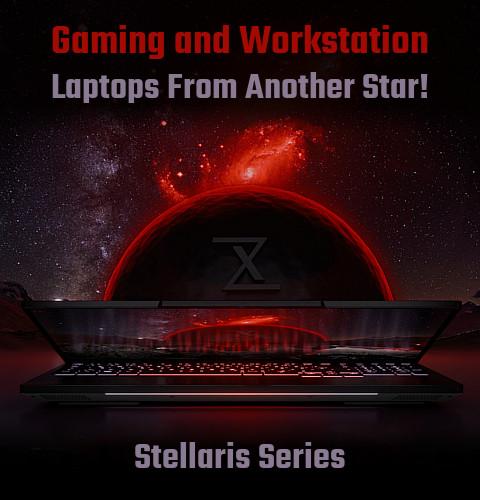
- 
- 
- 
- 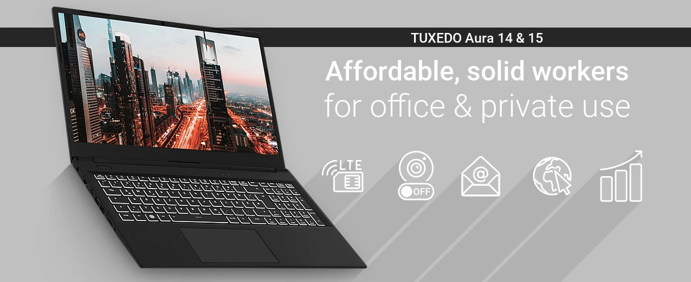
- 
- 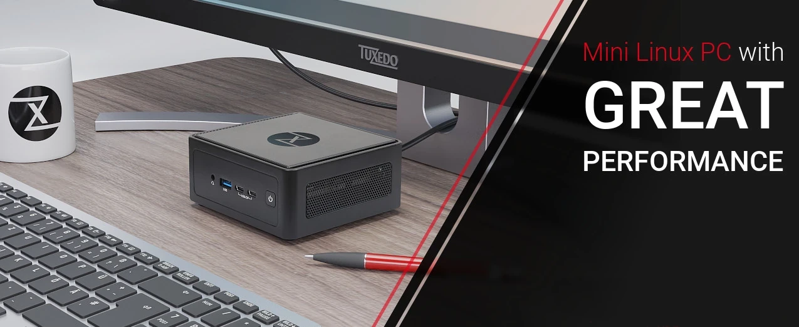
- 
- 
- 
- 
- 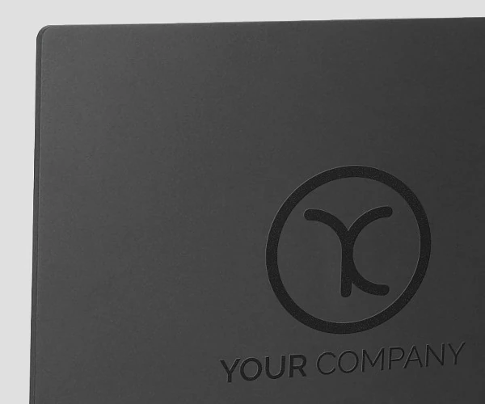
- 
- 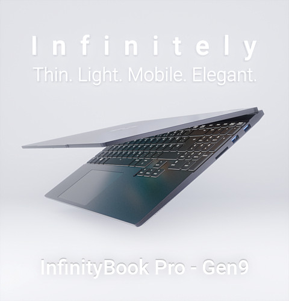
- 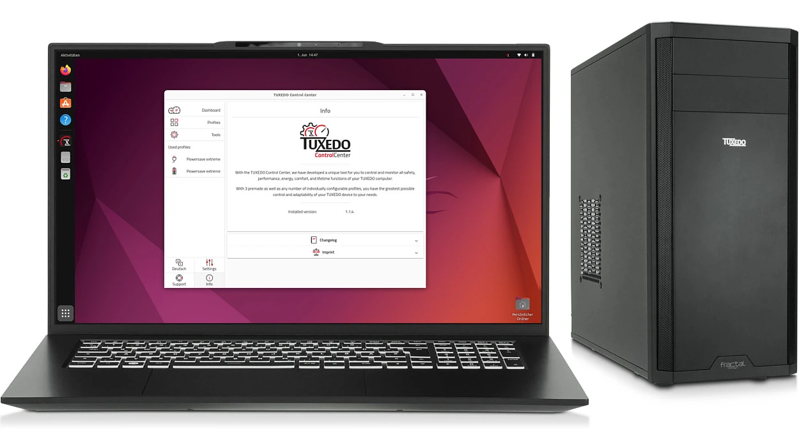
- 
- [unnamed_956269f0e5d74875adadd6c795a76d79](./unnamed_956269f0e5d74875adadd6c795a76d79)
- 
- 
- 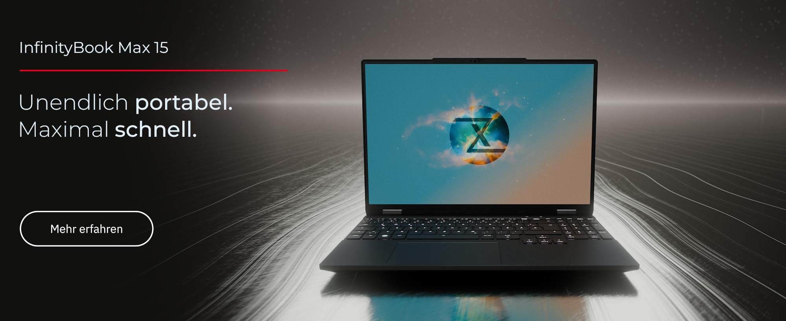
- 
- 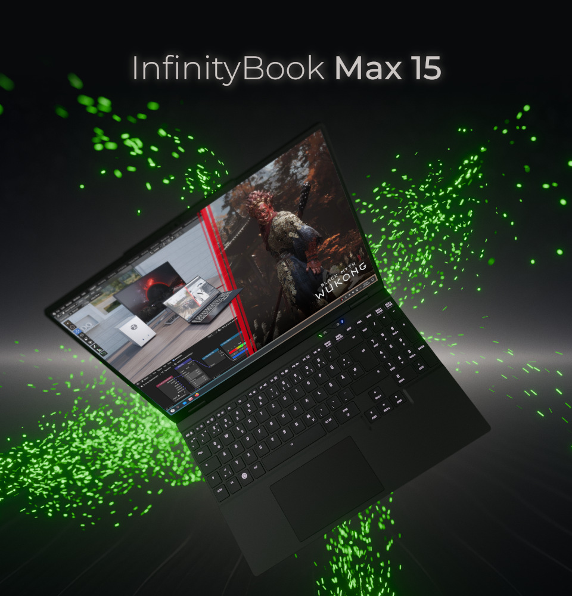
- 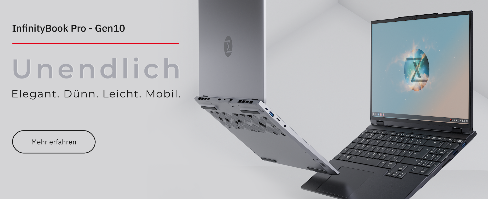
- 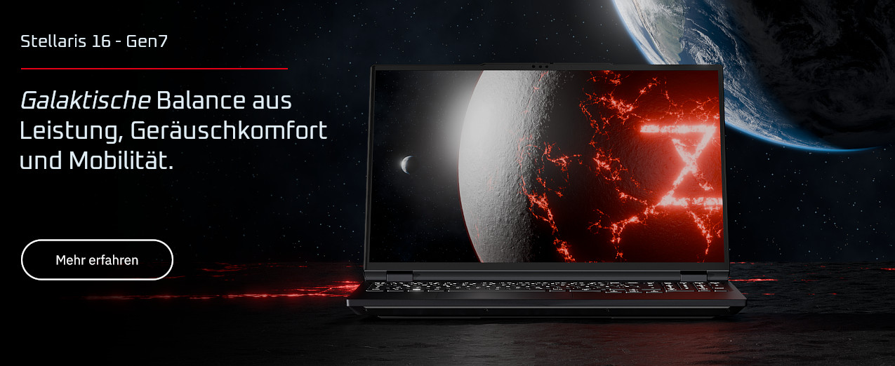
- 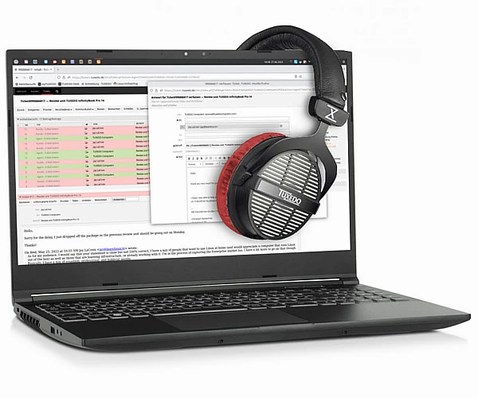
- 
- 
- [unnamed_beb799193f224af8a3bed01d43cf2fde](./unnamed_beb799193f224af8a3bed01d43cf2fde)
- [unnamed_bf3c4c06434348bc89fa6a688fb5d27b](./unnamed_bf3c4c06434348bc89fa6a688fb5d27b)
- 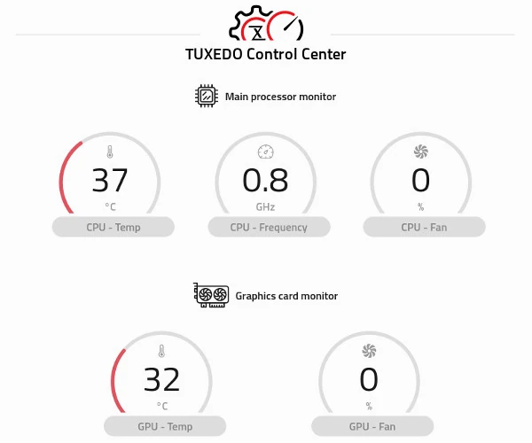
- 
- 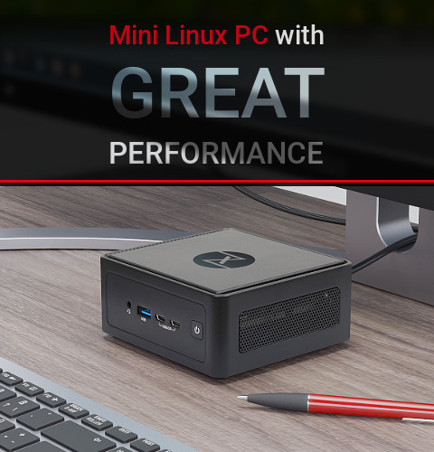
- [unnamed_e27a984d654841d0bfcd9eb1a7cad415](./unnamed_e27a984d654841d0bfcd9eb1a7cad415)
- 
- 
- 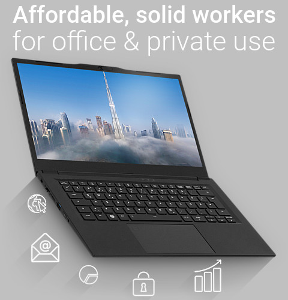