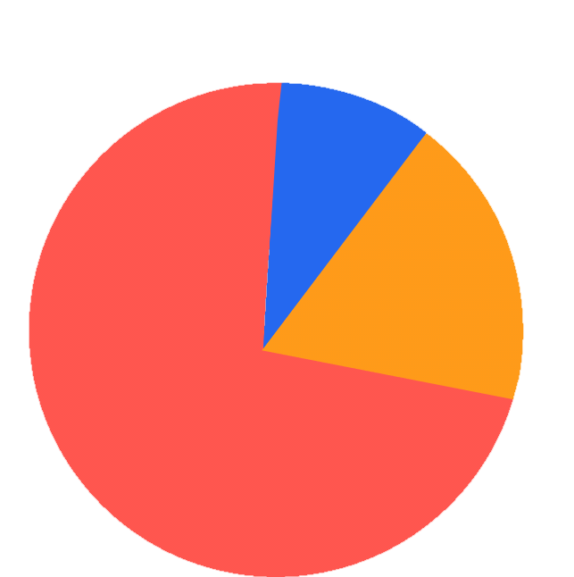
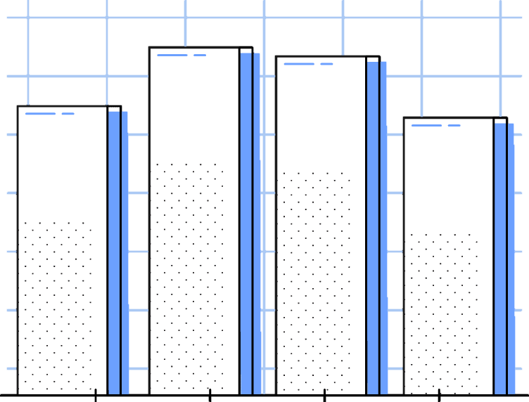

# Multi-Page Report

## “A comprehensive and content-heavy report that includes text, images, and tables for thorough testing of pagination and complex layouts.”

## Prepared By

## Sample Team

## [sample-files.com](https://sample-files.com/)

---

# Table of Contents

## 1. Introduction

## 2. Market Analysis

## 3. Data Analysis

## 4. Product Overview

## 5. Results & Discussion

## 6. Marketing Strategy

## 7. Sales Projections

## 8. Launch Timeline

*This sample PDF file is provided by [Sample-Files.com. Visit us for more sample files and resource](https://sample-files.com/)*

---

# Introduction

This section introduces the report and highlights the key objectives. The purpose of this report is to analyze data, evaluate outcomes, and provide insights for future decisions. This analysis is based on various data sources that include quantitative and qualitative inputs. Note: Add an image here illustrating the concept of data analysis or research methodology.

| ID | Metric | Value | Remarks |
|---|---|---|---|
| 1 | Metric 1 | 70 | Valid Data |
| 2 | Metric 2 | 431 | Valid Data |
| 3 | Metric 3 | 186 | Valid Data |
| 4 | Metric 4 | 489 | Valid Data |
| 5 | Metric 5 | 180 | Valid Data |

*This sample PDF file is provided by [Sample-Files.com. Visit us for more sample files and resource](https://sample-files.com/)*

---

# Market Analysis

### Nam quis porta ex. Donec porttitor at sem nec sollicitudin. Ut vel commodo tortor, sagittis egestas nisl. Donec quam mauris, tristique non tempus vitae, ornare sed mauris. Etiam blandit tempor metus, at vehicula nisi. Maecenas suscipit vulputate varius.

## Current market share

## Projected sales for the first three years

*This sample PDF file is provided by [Sample-Files.com. Visit us for more sample files and resource](https://sample-files.com/)*

---

---

# Data Analysis

## This section analyzes data collected from various sources. The data is presented in a structured format to identify trends, patterns, and anomalies. Statistical methods are used to derive meaningful insights. Note: Add a chart or a graph here depicting the data trends visually.

*This sample PDF file is provided by [Sample-Files.com. Visit us for more sample files and resource](https://sample-files.com/)*

---

---

# Product Overview

### Nam quis porta ex. Donec porttitor at sem nec sollicitudin. Ut vel commodo tortor, sagittis egestas nisl. Donec quam mauris, tristique non tempus vitae, ornare sed mauris. Etiam blandit tempor metus, at vehicula nisi. Maecenas suscipit vulputate varius.

## Key Features

## - Integer et justo velus.

## - Ut in ipsum ac risus.

## - Maecenas iaculis.

## - Ut nec mauris vel.

## - Tellus accumsan.

## Key Features

## - Integer et justo velus.

## - Ut in ipsum ac risus.

## - Maecenas iaculis.

## - Ut nec mauris vel.

## - Tellus accumsan.

*This sample PDF file is provided by [Sample-Files.com. Visit us for more sample files and resource](https://sample-files.com/)*

---

---

# Results & Discussion

## The results and findings are discussed in this section. The data presented previously is analyzed and contextualized to understand the implications. This section highlights key trends, potential causes, and implications for future strategies. Note: Add a comparative analysis image or table illustrating different scenarios.

*This sample PDF file is provided by [Sample-Files.com. Visit us for more sample files and resource](https://sample-files.com/)*

---

# Marketing Strategy

### Tristique non tempus vitae, ornare sed mauris. Etiam blandit tempor metus, at vehicula nisi. Maecenas suscipit vulputate varius.

## 1st Strategy

## - Integer et justo velus.

## - Ut in ipsum ac risus.

## - Maecenas iaculis.

## - Ut nec mauris vel.

## - Tellus accumsan.

## 2nd Strategy

## - Integer et justo velus.

## - Ut in ipsum ac risus.

## - Maecenas iaculis.

## - Ut nec mauris vel.

## - Tellus accumsan.

*This sample PDF file is provided by [Sample-Files.com. Visit us for more sample files and resource](https://sample-files.com/)*

---

# Sales Projections

## Tristique non tempus vitae, ornare sed mauris. Etiam blandit tempor metus, at vehicula nisi. Maecenas suscipit vulputate varius.

20

15

10

5

0

*This sample PDF file is provided by*

Item 1

| Metric | Sales |
|---|---|
| Market Size | $50 Billion |
| User Satisfaction | 85% |
| Growth Rate | 10% |

## Series 1

## Item 2

*[Sample-Files.com. Visit us for more sample files and resource](https://sample-files.com/)*

## Series 2

## Item 3

---

# Launch Timeline

## Vivamus ac nunc vitae nulla molestie sodales. Proin sit amet rhoncus lacus. Cras non erat imperdiet sapien porttitor aliquam nec ut velit.

*This sample PDF file is provided by [Sample-Files.com. Visit us for more sample files and resource](https://sample-files.com/)*
