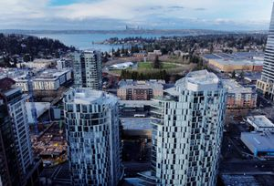

[Skip to content](https://www.seattletimes.com/seattle-news/the-splitting-of-seattle-and-the-eastside-too-is-accelerating/?utm_medium=social&utm_campaign=owned_echobox_tw_m&utm_source=Twitter#content)
[Skip Ad](https://www.seattletimes.com/seattle-news/the-splitting-of-seattle-and-the-eastside-too-is-accelerating/?utm_medium=social&utm_campaign=owned_echobox_tw_m&utm_source=Twitter#skip-1)[Skip Ad](https://www.seattletimes.com/seattle-news/the-splitting-of-seattle-and-the-eastside-too-is-accelerating/?utm_medium=social&utm_campaign=owned_echobox_tw_m&utm_source=Twitter#skip-1)
[The Seattle Times](https://www.seattletimes.com/)
[The Seattle Times](https://www.seattletimes.com/)

- **[Coronavirus](https://www.seattletimes.com/tag/coronavirus/)**
- **
[Local News](https://www.seattletimes.com/seattle-news/)

    - [Traffic Lab](https://www.seattletimes.com/seattle-news/transportation/)
    - [Law &Justice](https://www.seattletimes.com/seattle-news/law-justice/)
    - [Local Politics](https://www.seattletimes.com/seattle-news/politics/)
    - [Education](https://www.seattletimes.com/seattle-news/education/)
    - [Education Lab](https://www.seattletimes.com/education-lab/)
    - [Eastside](https://www.seattletimes.com/seattle-news/eastside/)
    - [Environment](https://www.seattletimes.com/seattle-news/environment/)
    - [Health](https://www.seattletimes.com/seattle-news/health/)
    - [Data](https://www.seattletimes.com/seattle-news/data/)
    - [Mental Health](https://www.seattletimes.com/seattle-news/mental-health/)
    - [Project Homeless](https://www.seattletimes.com/seattle-news/homeless/)
    - [Times Watchdog](https://www.seattletimes.com/seattle-news/times-watchdog/)

**
- **
[Business & Tech](https://www.seattletimes.com/business/)
**
- **
[Nation & World](https://www.seattletimes.com/nation-world/)
**
- **
[Sports](https://www.seattletimes.com/sports/)
**
- **
[Entertainment](https://www.seattletimes.com/entertainment/)
**
- **
[Life](https://www.seattletimes.com/life/)
**
- **[Pacific NW Magazine](https://www.seattletimes.com/pacific-nw-magazine/)**
- **[Homes & Real Estate](https://www.seattletimes.com/homes-real-estate)**
- **
[Opinion](https://www.seattletimes.com/opinion/)
**
- **[Video](https://www.seattletimes.com/video/)**
- **[Photography](https://www.seattletimes.com/photo-video/)**
- **
[Obituaries](https://obituaries.seattletimes.com/)
**
- **[Newsletters](https://www.seattletimes.com/newsletters/)**
- **[Print Replica](https://replica.seattletimes.com/)**
- **[Today’s Paper](https://www.seattletimes.com/todays-times/)**
- **[Inside The Times](https://www.seattletimes.com/tag/inside-the-times/)**
- **[The Ticket](https://theticket.seattletimes.com/)**
- **[Explore](https://www.seattletimes.com/explore/)**
- **[Jobs](http://jobs.seattletimes.com/)**
- **[Best in the PNW](https://www.bestinthepnw.com/)**

- [Log In](https://secure.seattletimes.com/accountcenter/)
- [Subscribe](https://www.seattletimes.com/subscribe/signup-offers/?subsource=voluntary)
- [Contact](https://www.seattletimes.com/contact/)

[Local News](https://www.seattletimes.com/seattle-news/)

- [Log In](https://secure.seattletimes.com/accountcenter/) | 
- [Subscribe](https://www.seattletimes.com/subscribe/signup-offers/?subsource=voluntary)

# 
    The splitting of Seattle — and the Eastside, too — is accelerating  

 Sep. 16, 2023 at 6:33 am     

Seen from the air, Bellevue’s Soma Towers... (Ken Lambert / The Seattle Times)
    By 
[Danny Westneat](https://www.seattletimes.com/author/danny-westneat/)
[](https://www.facebook.com/STwestneat)        
*Seattle Times columnist*

When I wrote a few months ago about how Seattle is splitting into silos due to extreme rich-poor gaps, it turns out I had no idea how wide the split could get.

“Our city was already a living exhibit of tech-fueled inequality,” [I wrote in July](https://www.seattletimes.com/seattle-news/in-seattle-were-seeing-the-splitting-of-a-city/). “The pandemic put that on supercycle.”

Well now it’s shifted to superdupercycle.

New economic data shows the rich around here seem to have no earthly bounds. The wealthiest 20% of Seattle households saw their incomes surge yet again in 2022, and now make an average of [$442,400 per year](https://data.census.gov/table?q=seattle+mean+household+income+of+quintiles+2022), the U.S. Census Bureau reported this past week.

Compared to before the pandemic, in 2019, the wealthiest fifth have seen their incomes rise 24%, or about $90,000 per household. Those at the bottom finally got back to where they were in 2019 — they’re making about $200 more per year, an average of $19,360, the new figures show.

It means the top 70,000 families in our city now make about $420,000 more per year than the bottom 70,000 families. Seattle’s top fifth enjoys [53% of the income](https://data.census.gov/table?q=seattle+mean+household+income+of+quintiles+2022&tid=ACSDT1Y2022.B19082); the bottom fifth shares just 2%, the Census Bureau’s American Community Survey estimated.

These yawning gaps are due to what I labeled some years ago the “[prosperity bomb](https://www.seattletimes.com/business/amazon/take-it-from-us-with-amazon-you-can-get-too-much-of-a-good-thing/)” — basically Big Tech radically altering the economy of our region. The prosperity part is great, especially if you already owned a home when it started. The bomb part — the displacement, the unaffordable housing, [the $25 hamburgers](https://www.seattletimes.com/seattle-news/seattle-speaks-with-poignancy-pain-on-rich-poor-split/) — not so much.

Advertising
[Skip Ad](https://www.seattletimes.com/seattle-news/the-splitting-of-seattle-and-the-eastside-too-is-accelerating/?utm_medium=social&utm_campaign=owned_echobox_tw_m&utm_source=Twitter#skip-2)[Skip Ad](https://www.seattletimes.com/seattle-news/the-splitting-of-seattle-and-the-eastside-too-is-accelerating/?utm_medium=social&utm_campaign=owned_echobox_tw_m&utm_source=Twitter#skip-2)
[Skip Ad](https://www.seattletimes.com/seattle-news/the-splitting-of-seattle-and-the-eastside-too-is-accelerating/?utm_medium=social&utm_campaign=owned_echobox_tw_m&utm_source=Twitter#skip-3)[Skip Ad](https://www.seattletimes.com/seattle-news/the-splitting-of-seattle-and-the-eastside-too-is-accelerating/?utm_medium=social&utm_campaign=owned_echobox_tw_m&utm_source=Twitter#skip-3)
[Skip Ad](https://www.seattletimes.com/seattle-news/the-splitting-of-seattle-and-the-eastside-too-is-accelerating/?utm_medium=social&utm_campaign=owned_echobox_tw_m&utm_source=Twitter#skip-4)[Skip Ad](https://www.seattletimes.com/seattle-news/the-splitting-of-seattle-and-the-eastside-too-is-accelerating/?utm_medium=social&utm_campaign=owned_echobox_tw_m&utm_source=Twitter#skip-4)

City researcher Richard Florida calls it “the new urban crisis.”

“The original urban crisis of the 1960s and 1970s was a crisis of economic failure,” [he writes](https://www.bloomberg.com/news/articles/2017-04-11/richard-florida-introduces-the-new-urban-crisis), with people abandoning cities for the burbs. “The new urban crisis is a crisis of success,” with superstar cities raining millionaires but also economic segregation, sorting and strain.

It’s not only Seattle. Take a look at the Eastside, where the poor are not as poor, but the rich are absolutely blowing the roof off.

The Census Bureau reports that in Bellevue, the top quintile of households has soared past the half-million mark for the first time. They now bring in an astounding [$562,670 per year per household.](https://data.census.gov/table?q=bellevue+mean+household+income+of+quintiles+2022) That’s up 28% — about $125,000 more per year — since 2019.

Meanwhile the poorest fifth of Bellevue households makes $32,500, up 1% since before the pandemic, or just $350 more per year.

I [wrote last year](https://www.seattletimes.com/seattle-news/its-prosperity-bomb-2-0-bellevue-passes-manhattan-in-housing-prices/) that these widening gaps in Bellevue are bound to upend that city’s placid politics, as they did Seattle’s. The pressure the top exerts on the bottom, by being so rich, is relentless. It’s most visible with housing and restaurant prices, and also shows up in the volatile issue of who pays for city services and amenities that are at a premium due to rapid growth.

Sure enough, there’s now a mini tax revolt going on in Bellevue — against potentially raising a sales tax or other fees to pay for road work in the city.

Advertising
[Skip Ad](https://www.seattletimes.com/seattle-news/the-splitting-of-seattle-and-the-eastside-too-is-accelerating/?utm_medium=social&utm_campaign=owned_echobox_tw_m&utm_source=Twitter#skip-5)[Skip Ad](https://www.seattletimes.com/seattle-news/the-splitting-of-seattle-and-the-eastside-too-is-accelerating/?utm_medium=social&utm_campaign=owned_echobox_tw_m&utm_source=Twitter#skip-5)

“If approved, this will be the fourth tax the council has approved in 10 months,” Craig Spiezle, of the group [Neighbors for a Livable Bellevue](https://livablebellevue.com/), protested at a [council meeting this past week](https://bellevue.granicus.com/player/clip/5875?view_id=3&redirect=true&h=6eef143c5a5052ad6a16be950c1d1869).

Spiezle and a dozen others went on to detail how the proposed taxes are regressive, meaning they would hit Bellevue’s working poor the hardest. People are facing rising costs for groceries and gas, Spiezle said — “There’s a growing number of Bellevue households who are one paycheck away from being unhoused. … The council has made positive steps to support affordable housing. But you need to focus on affordable living.”

This could have been testimony at any Seattle public hearing of the past decade. It seems only a matter of time before someone over in Bellevue notices that the top fifth of the city has gotten insanely wealthy. And moves to tax them or their companies instead, as Seattle has been trying to do.

Or maybe not. The tech-fueled wealth supercycle seems to defy all political gravity. Inequality keeps soaring no matter what various social movements have done to try to rein it in.

There’s now an apartment for rent, Unit 4026 at Two Lincoln Tower in Bellevue, going for [$27,500 per month](https://www.apartments.com/two-lincoln-tower-bellevue-wa/7psx4pw/). It’s an astronomical figure — it adds up to $330,000 in rent per year.

“Live life differently,” [the brochure says](https://cdngeneralcf.rentcafe.com/dmslivecafe/2/140272/3_1239950_13925573.pdf).

There are incredibly now 12,000 households in Bellevue that rake in an average of $562,000 annually. So it wouldn’t be living life *that* differently. There are thousands already living in Bellevue who could afford that price point.

Advertising
[Skip Ad](https://www.seattletimes.com/seattle-news/the-splitting-of-seattle-and-the-eastside-too-is-accelerating/?utm_medium=social&utm_campaign=owned_echobox_tw_m&utm_source=Twitter#skip-6)[Skip Ad](https://www.seattletimes.com/seattle-news/the-splitting-of-seattle-and-the-eastside-too-is-accelerating/?utm_medium=social&utm_campaign=owned_echobox_tw_m&utm_source=Twitter#skip-6)
[Skip Ad](https://www.seattletimes.com/seattle-news/the-splitting-of-seattle-and-the-eastside-too-is-accelerating/?utm_medium=social&utm_campaign=owned_echobox_tw_m&utm_source=Twitter#skip-7)[Skip Ad](https://www.seattletimes.com/seattle-news/the-splitting-of-seattle-and-the-eastside-too-is-accelerating/?utm_medium=social&utm_campaign=owned_echobox_tw_m&utm_source=Twitter#skip-7)
[Skip Ad](https://www.seattletimes.com/seattle-news/the-splitting-of-seattle-and-the-eastside-too-is-accelerating/?utm_medium=social&utm_campaign=owned_echobox_tw_m&utm_source=Twitter#skip-8)[Skip Ad](https://www.seattletimes.com/seattle-news/the-splitting-of-seattle-and-the-eastside-too-is-accelerating/?utm_medium=social&utm_campaign=owned_echobox_tw_m&utm_source=Twitter#skip-8)

This is in one sense fine, and great for those in the top fifth. It can get oppressive for those at the bottom, though, especially as the seemingly unlimited wealth causes upward pressure on prices for virtually everything. It’s “suffocating,” as one reader told me in July.

One month’s Lincoln Tower top rent is roughly what the bottom fifth of the Bellevue households make in a year. The prosperity bomb means a city that not long ago was a mostly uniform and sleepy suburb is now struggling with urban-style issues of extreme inequality.

Redmond also just vaulted past a half-million. The Census Bureau found that its top fifth of households now make [$534,000 annually](https://data.census.gov/table?q=redmond+mean+household+income+of+quintiles+2022) — up an otherworldly 47% since 2019. Kirkland is right behind at [$493,000 for its top households](https://data.census.gov/table?q=kirkland+mean+household+income+of+quintiles+2022). As Seattle Times’ [FYI Guy reported](https://www.seattletimes.com/seattle-news/data/seattle-median-household-income-hits-115000-census-data-shows/), Sammamish now tops them all with the highest median household income of any city in the nation. It’s wealthiest fifth makes [an average of $606,800](https://data.census.gov/table?q=sammamish+mean+household+income+of+quintiles+2022).

What’s so elusive about this growing problem is that it’s a problem at all. Money and a frothy economy are supposed to be good, right?

That’s the main reason we’re having so much trouble grappling with this “new urban crisis.” Because how do you even make the case that there’s such a thing as too much success?

*
**
         Danny Westneat:      **
[dwestneat@seattletimes.com](https://www.seattletimes.com/seattle-news/the-splitting-of-seattle-and-the-eastside-too-is-accelerating/?utm_medium=social&utm_campaign=owned_echobox_tw_m&utm_source=Twitter#Echobox=1694880733-1mailto:dwestneat@seattletimes.com);            Danny Westneat takes an opinionated look at the Puget Sound region's news, people and politics.    
*

## Most Read Local Stories

- 1
[Seattle police union responds to backlash over Jaahnavi Kandula’s death   WATCH](https://www.seattletimes.com/seattle-news/law-justice/seattle-police-union-responds-to-criticism-in-response-to-jaahnavi-kandulas-death/)
- 2
[1 dead, 1 critically injured in floatplane crash in Lake Sammamish   WATCH](https://www.seattletimes.com/seattle-news/eastside/crews-responding-to-floatplane-crash-in-lake-sammamish/)
- 3
[What to know about COVID-19 levels and masking as updated vaccine lands in WA  ](https://www.seattletimes.com/seattle-news/health/what-to-know-about-covid-levels-masking-as-updated-vaccine-lands-in-wa/)
- 4
[The splitting of Seattle — and the Eastside, too — is accelerating  ](https://www.seattletimes.com/seattle-news/the-splitting-of-seattle-and-the-eastside-too-is-accelerating/)
- 5
[Wing Luke Museum vandalized; man arrested for alleged hate crime   VIEW](https://www.seattletimes.com/seattle-news/law-justice/wing-luke-museum-vandalized-man-arrested-for-alleged-hate-crime/)

[ View 447Comments / 447 New](https://www.seattletimes.com/seattle-news/the-splitting-of-seattle-and-the-eastside-too-is-accelerating/?utm_medium=social&utm_campaign=owned_echobox_tw_m&utm_source=Twitter#comments)

The opinions expressed in reader comments are those of the author only and do not reflect the opinions of The Seattle Times.

Advertising
[Skip Ad](https://www.seattletimes.com/seattle-news/the-splitting-of-seattle-and-the-eastside-too-is-accelerating/?utm_medium=social&utm_campaign=owned_echobox_tw_m&utm_source=Twitter#skip-9)[Skip Ad](https://www.seattletimes.com/seattle-news/the-splitting-of-seattle-and-the-eastside-too-is-accelerating/?utm_medium=social&utm_campaign=owned_echobox_tw_m&utm_source=Twitter#skip-9)
[Skip Ad](https://www.seattletimes.com/seattle-news/the-splitting-of-seattle-and-the-eastside-too-is-accelerating/?utm_medium=social&utm_campaign=owned_echobox_tw_m&utm_source=Twitter#skip-10)[Skip Ad](https://www.seattletimes.com/seattle-news/the-splitting-of-seattle-and-the-eastside-too-is-accelerating/?utm_medium=social&utm_campaign=owned_echobox_tw_m&utm_source=Twitter#skip-10)
[Skip Ad](https://www.seattletimes.com/seattle-news/the-splitting-of-seattle-and-the-eastside-too-is-accelerating/?utm_medium=social&utm_campaign=owned_echobox_tw_m&utm_source=Twitter#skip-11)[Skip Ad](https://www.seattletimes.com/seattle-news/the-splitting-of-seattle-and-the-eastside-too-is-accelerating/?utm_medium=social&utm_campaign=owned_echobox_tw_m&utm_source=Twitter#skip-11)
[Skip Ad](https://www.seattletimes.com/seattle-news/the-splitting-of-seattle-and-the-eastside-too-is-accelerating/?utm_medium=social&utm_campaign=owned_echobox_tw_m&utm_source=Twitter#skip-13)[Skip Ad](https://www.seattletimes.com/seattle-news/the-splitting-of-seattle-and-the-eastside-too-is-accelerating/?utm_medium=social&utm_campaign=owned_echobox_tw_m&utm_source=Twitter#skip-13)

- [COMPANY](https://www.seattletimes.com/type/link/)
- [COMMUNITY](https://www.seattletimes.com/type/link/)
- [Advertise](https://www.seattletimes.com/type/link/)
- [SUBSCRIPTION](https://www.seattletimes.com/type/link/)
- [CONNECT](https://www.seattletimes.com/type/link/)

[Copyright © 2023 The Seattle Times](https://www.seattletimes.com/notices/copyright.html) |
[Privacy Statement](https://www.seattletimes.com/notices/privacy.html) |
[Notice At Collection](https://www.seattletimes.com/notices/privacy.html#california) |
[Do Not Sell My Personal Information](https://www.seattletimes.com/seattle-news/the-splitting-of-seattle-and-the-eastside-too-is-accelerating/?utm_medium=social&utm_campaign=owned_echobox_tw_m&utm_source=Twitter#) |
[Terms of Service](https://www.seattletimes.com/notices/terms.html)
[7a8ab1ab1e014ce7](./7a8ab1ab1e014ce7)
[7a8ab1ab1e014ce7](./7a8ab1ab1e014ce7)
