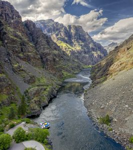
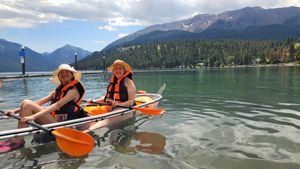

[Skip to content](https://www.seattletimes.com/life/travel/road-trip-inspiration-nearly-400-miles-of-adventure-in-northeast-or/#content)
[Skip Ad](https://www.seattletimes.com/life/travel/road-trip-inspiration-nearly-400-miles-of-adventure-in-northeast-or/#skip-1)
[The Seattle Times](https://www.seattletimes.com/)
[The Seattle Times](https://www.seattletimes.com/)

- **[Coronavirus](https://www.seattletimes.com/tag/coronavirus/)**
- **
[Local News](https://www.seattletimes.com/seattle-news/)
**
- **
[Business & Tech](https://www.seattletimes.com/business/)
**
- **
[Nation & World](https://www.seattletimes.com/nation-world/)
**
- **
[Sports](https://www.seattletimes.com/sports/)
**
- **
[Entertainment](https://www.seattletimes.com/entertainment/)
**
- **
[Life](https://www.seattletimes.com/life/)

    - [Food &Drink](https://www.seattletimes.com/life/food-drink/)
    - [Travel &Outdoors](https://www.seattletimes.com/life/travel/)
    - [Wellness](https://www.seattletimes.com/life/wellness/)
    - [Pets](https://www.seattletimes.com/life/pets/)
    - [Rant &Rave](https://www.seattletimes.com/category/rant-and-rave/)

**
- **[Pacific NW Magazine](https://www.seattletimes.com/pacific-nw-magazine/)**
- **[Homes & Real Estate](https://www.seattletimes.com/homes-real-estate)**
- **
[Opinion](https://www.seattletimes.com/opinion/)
**
- **[Video](https://www.seattletimes.com/video/)**
- **[Photography](https://www.seattletimes.com/photo-video/)**
- **
[Obituaries](https://obituaries.seattletimes.com/)
**
- **[Newsletters](https://www.seattletimes.com/newsletters/)**
- **[Print Replica](https://replica.seattletimes.com/)**
- **[Today’s Paper](https://www.seattletimes.com/todays-times/)**
- **[Inside The Times](https://www.seattletimes.com/tag/inside-the-times/)**
- **[The Ticket](https://theticket.seattletimes.com/)**
- **[Explore](https://www.seattletimes.com/explore/)**
- **[Jobs](http://jobs.seattletimes.com/)**
- **[Best in the PNW](https://www.bestinthepnw.com/)**

- [Log In](https://secure.seattletimes.com/accountcenter/)
- [Subscribe](https://www.seattletimes.com/subscribe/signup-offers/?subsource=voluntary)
- [Contact](https://www.seattletimes.com/contact/)

[Travel](https://www.seattletimes.com/life/travel/)

- [Log In](https://secure.seattletimes.com/accountcenter/) | 
- [Subscribe](https://www.seattletimes.com/subscribe/signup-offers/?subsource=voluntary)

[TRAFFIC                        I-405 closed between Bellevue and Renton until Monday morning                    ](https://www.seattletimes.com/seattle-news/transportation/five-miles-of-i-405-are-shutting-down-this-weekend-thats-not-the-only-closure/)
**

# 
    Road trip inspiration: nearly 400 miles of adventure in Northeast OR  

 Aug. 19, 2023 at 6:00 am * |  Updated Aug. 19, 2023 at 6:00 am *    

****1 of 5  | **This landing at the Hells Canyon Creek Visitor Center... (Hells Canyon Adventures)
By 
[Julia Duin](https://www.seattletimes.com/author/cap-julia-duin/)
*Special to The Seattle Times*

We were driving through the alfalfa and wheat fields in Oregon’s far northeastern corner when there they were: a range of mountains seemingly erupting from the valley floor.

These were the stately and magnificent Wallowa Mountains, nestled next to Hells Canyon, North America’s deepest gorge at nearly 8,000 feet, and the dividing line between Idaho and Oregon.

The 213-mile [Hells Canyon Sceni](https://traveloregon.com/things-to-do/trip-ideas/scenic-drives/hells-canyon-scenic-byway/?utm_actcampaign=9976395838&gclid=Cj0KCQjwz8emBhDrARIsANNJjS5tqcvS3beEhRMZedKsRX4isFQyF9aaYtLlw7Tl_TPHMxS6rWQXlykaAjK5EALw_wcB)[c](https://traveloregon.com/things-to-do/trip-ideas/scenic-drives/hells-canyon-scenic-byway/?utm_actcampaign=9976395838&gclid=Cj0KCQjwz8emBhDrARIsANNJjS5tqcvS3beEhRMZedKsRX4isFQyF9aaYtLlw7Tl_TPHMxS6rWQXlykaAjK5EALw_wcB)[ Byway](https://traveloregon.com/things-to-do/trip-ideas/scenic-drives/hells-canyon-scenic-byway/?utm_actcampaign=9976395838&gclid=Cj0KCQjwz8emBhDrARIsANNJjS5tqcvS3beEhRMZedKsRX4isFQyF9aaYtLlw7Tl_TPHMxS6rWQXlykaAjK5EALw_wcB) winds through this Swiss Alps-like mountain range, passing by the pristine [Wallowa Lake](https://www.wallowalake.net/) and offering drop-dead views over the canyon, at the bottom of which the Snake River races north. In the distance are Idaho’s [Seven Devils Mountains](https://www.summitpost.org/seven-devils-mountains/171143).

If you add in all the side trips, the byway offers up to 400 miles’ worth of roads to remote canyons, hiking trails, scenic outlooks and even one of the largest ecologically intact prairies of its kind. There’s so much to do in the area, my family spent nearly a week traipsing through dramatic scenery that — so far — hasn’t attracted busloads of tourists.

[Your guide to PNW travel for summer 2023](https://www.seattletimes.com/life/travel/summer-travel-in-seattle-and-the-pacific-northwest/)

- [8 PNW road trips for music and arts lovers in summer 2023](https://www.seattletimes.com/entertainment/8-pnw-road-trips-for-music-and-arts-lovers-in-summer-2023/)
- [6 great restaurants to fuel your road trips out of Seattle this summer](https://www.seattletimes.com/life/food-drink/6-stops-for-great-eats-as-you-road-trip-in-and-out-of-seattle-this-summer/)
- [Check out 7 cascades on an Olympic Peninsula waterfall tour](https://www.seattletimes.com/life/outdoors/check-out-7-cascades-on-an-olympic-peninsula-waterfall-tour/)
- [Doe Bay celebrates 20 years of rustic chic](https://www.seattletimes.com/life/travel/doe-bays-rustic-chicness-remains-unchanged-after-20-years/)
- [Seattle’s summer travel forecast: busy with a chance of a bargain](https://www.seattletimes.com/life/travel/seattles-summer-travel-forecast-busy-with-a-chance-of-a-bargain/)
- [From Oregon to B.C., these 8 lodges offer uniquely PNW charms](https://www.seattletimes.com/life/travel/from-oregon-to-b-c-these-8-lodges-offer-uniquely-pnw-charms/)
- [Match your vacation type to these book recommendations](https://www.seattletimes.com/entertainment/books/match-your-vacation-type-to-these-book-recommendations/)
- [These 3 WA adventures pair outdoor fun with comfy indoor lodging](https://www.seattletimes.com/life/outdoors/these-3-wa-adventures-pair-outdoors-fun-with-comfy-indoor-lodging/)
- [Camping at the Gorge this summer? Pack these 5 tips from festival veterans](https://www.seattletimes.com/entertainment/music/camping-at-the-gorge-this-summer-pack-these-5-tips-from-festival-veterans/)

With portions of the byway closed from late October until early June because of snow ([check here for current conditions](https://hellscanyonbyway.com/)), visitors have at most five months of the year to access this paved, scenic road. The most direct route to the byway from Seattle is a 323-mile, six-hour drive on interstates 90, 82 and 84. 

Advertising
[Skip Ad](https://www.seattletimes.com/life/travel/road-trip-inspiration-nearly-400-miles-of-adventure-in-northeast-or/#skip-2)
[Skip Ad](https://www.seattletimes.com/life/travel/road-trip-inspiration-nearly-400-miles-of-adventure-in-northeast-or/#skip-3)
[Skip Ad](https://www.seattletimes.com/life/travel/road-trip-inspiration-nearly-400-miles-of-adventure-in-northeast-or/#skip-4)

On the way there, stop at the Tamástslikt Cultural Institute Museum, which is nestled in back of the Wildhorse Resort & Casino (exit 216 off I-84). The museum includes a cafe and exhibits on the history of local tribes that were living near the Oregon Trail when settlers began pouring into the Oregon Territory in the late 1830s.

Before starting on the byway, my daughter and I took refuge at [The Lodge at Hot Lake Springs](https://hotlakelodge.com/) in La Grande. [The historic property](https://hotlakelodge.com/) stands on the shores of the 186-degree Hot Lake, which is fed by underwater springs that pump out 2,000 gallons of water per minute. Beside the lake is an attractive deck with tubs of varying temperatures that worked like a charm in helping us drop off asleep an hour later. The rooms are attractively designed as is the main lounge, which has a 1950s vibe. Breakfasts, however, are scanty (bananas, coffee, packaged buns and bagels). The new owners who took over in 2020 are still remodeling the place, so much is in flux there.

Heading north on Highway 82 (exit 261 off I-84), we drove through a number of small towns, including tiny Wallowa, home of the [Nez Perce Wallowa Homeland Visitor Center](https://www.wallowanezperce.org/visitor-center). The small museum details how, in the 1880s, the U.S. government [ejected Nez Perce tribal members](https://www.oupress.com/9780806131900/let-me-be-free/) from 17 million miles of the tribe’s ancestral lands that spanned across Idaho, Oregon and Washington. There are displays about daily life for the Nez Perce, info on the tribal diaspora and a short film. The Nez Perce purchased a 320-acre piece of land just outside of town to host its annual [Tamkaliks](https://www.wallowanezperce.org/tamkaliks) gatherings every third weekend of July. Visitors are welcome. 

Farther along the byway, the grave of legendary Nez Perce leader Chief Joseph lies just south of Joseph, Ore. The town is home to the two-story Josephy Center, a museum and art gallery with a Nez Perce exhibit on the second floor and a first floor table of books about interactions between Native Americans and settlers, ranging from historians Alvin M. Josephy Jr.’s [“Lewis and Clark through Indian Eyes”](https://www.goodreads.com/en/book/show/580601) to David Lavender’s [“Let Me Be Free: The Nez Perce Tragedy](https://www.oupress.com/9780806131900/let-me-be-free/).” 

Less than 4 miles from Joseph is the crown jewel of the region: Wallowa Lake. Ignore the profusion of nearby eateries, cabins and even a go-kart track (which my 18-year-old daughter said had great racers) on the south end of the lake near the [1920s-era Wallowa Lake Lodge](https://www.seattletimes.com/life/travel/how-a-rural-community-rallied-to-save-a-rustic-100-year-old-oregon-hotel/), and instead take a swim in its ultra-clear water. There’s a state park at the south end, but the beach is tiny and rutted, and the area is mainly used for boat launches. Dive in at the county park at the north end of the lake. For a bit of an adventure, we rented a glass-bottomed kayak at [JO Paddle](https://jopaddle.com/glass-bottom-kayak-rentals/) in Joseph for two hours.

### **
          Related
**

[How a rural community rallied to save a rustic 100-year-old Oregon hotel](https://www.seattletimes.com/life/travel/how-a-rural-community-rallied-to-save-a-rustic-100-year-old-oregon-hotel/)
Advertising
[Skip Ad](https://www.seattletimes.com/life/travel/road-trip-inspiration-nearly-400-miles-of-adventure-in-northeast-or/#skip-5)

Don’t miss the [Wallowa Lake Tramway,](https://wallowalaketramway.com/) just down the road from the lodge. Tickets are bought the day of, but even in midsummer, there was no wait to get on the gondolas. The ascent through lodgepole pine and subalpine firs is lovely and the air is so fresh, it practically sparkles. At the top (8,150 feet), there are some short hikes, but the altitude slowed us down. We eventually settled in at the Alpine Summit Grill where we got a seat with a view.

Many visitors to the area take a side trip 30 miles east to the village of Imnaha, then 21 miles on Hat Point Road to get to [Hat Point](https://www.fs.usda.gov/recarea/wallowa-whitman/recarea/?recid=51929), one of the lovelier overlooks into Hells Canyon. Having heard of the route’s steep drop-offs and lack of guardrails, I decided to travel north through the [Zumwalt Prairie](https://josephoregon.com/index.php/joseph-or-recreation/zumwalt-prairie) to the Buckhorn Lookout, an equally lovely spot on a less precarious route. (Pro tip: Google and Apple maps were useless in this region, so I headed to the [U.S. Forest Service office](https://www.fs.usda.gov/detail/wallowa-whitman/about-forest/offices) in Joseph and got a great map of the forest service roads and grasslands north of town.)

Our route led into the Zumwalt Prairie, once grazing ground for the horses of the Nez Perce, and through the Wallowa-Whitman National Forest in a [beautiful 115-mile loop](https://www.wallowacountychamber.com/zumwalt-prairie/) that took six hours with multiple stops. 

Roughly 20 miles north on the gravel Zumwalt Road, we encountered a sign leading us 1.5 miles to the Duckett Barn Information Center. A display outside the abandoned barn told of the work of The Nature Conservancy, which oversees some of the prairie’s vast acreage. 

Nearby were the Findley Buttes, three former shield volcanoes that served as way markers for the Nez Perce. Continuing north, we reached the better-graveled Forest Road 46, which led to the lookout. The brown striated cliffs, the Seven Devils to the southeast and coffee-colored mounds closer to the bottom provided a beautiful vista. The return route meandered past grassy golden hills, several campgrounds and forests sprinkled with wildflowers before finally hitting paved roads again.

The next day, we headed southeast on the byway on the paved Forest Service Road 39 (Wallowa Mountain Loop Road), for a 64-mile drive through ponderosa pine and larch canyons, stopping at the [Hells Canyon Overlook](https://www.fs.usda.gov/recarea/wallowa-whitman/recarea/?recid=51943) at the 35-mile mark. Mid-July is still springtime at this elevation and a rich palette of Indian paintbrush, creamy white daisies, magenta fireweed and blue-green grass laced the roadside. This is also range land, so watch for cows that suddenly pop out of the woods. 

Advertising
[Skip Ad](https://www.seattletimes.com/life/travel/road-trip-inspiration-nearly-400-miles-of-adventure-in-northeast-or/#skip-6)
[Skip Ad](https://www.seattletimes.com/life/travel/road-trip-inspiration-nearly-400-miles-of-adventure-in-northeast-or/#skip-7)
[Skip Ad](https://www.seattletimes.com/life/travel/road-trip-inspiration-nearly-400-miles-of-adventure-in-northeast-or/#skip-8)

Eventually meeting up with Oregon 86, we headed west to spend the night at the remote [Cornucopia Lodge,](https://www.cornucopialodge.com/) located 12 miles past the town of Halfway near the ghost mining town of Cornucopia. The place specializes in trail rides, pack trips and hikes into the [355,553-acre Eagle Cap Wilderness](https://wilderness.net/visit-wilderness/?ID=167), a playground of 60 alpine lakes and [trails that rivals the Enchantments](https://outthereoutdoors.com/backpacking-oregons-eagle-cap-wilderness/) in the Washington Cascades. (Get good directions, as we got quite lost.)

Our final day, we headed 21 miles east to the small town of Oxbow on the Snake River, crossed over to Idaho, then drove 23 miles along the cliffs to the Hells Canyon Dam, crossing back over into Oregon. Perched on a cliff was [a visitor center](https://www.fs.usda.gov/recarea/wallowa-whitman/recarea/?recid=51941) where we met up with [Hells Canyon Adventures](https://www.hellscanyonadventures.com/), a jet boat tour company offering half-day trips through Class III and IV rapids. While piloting the 36-foot Culebra II, our captain told us he had to train three years before he was allowed to take passengers through those rapids. Eighteen miles downriver, we stopped at Sheep Creek Ranch, a shady spot where we ate lunch and took refuge from the 108-degree heat. That ride was the highlight of our journey for my daughter, who sat in the front of the boat to get the most water splashed on her.

Returning to Oxbow, it was a 70-mile drive through scenic farmland and marshes near a portion of the Oregon Trail to the city of Baker City, home of the stately [Geiser Grand Hotel](https://geisergrand.hotels-oregon.com/en/). 

First opened in 1889 for a gold rush clientele, the historic hotel offered novelties such as fresh Maine lobster brought in by train. It closed in 1968, then underwent a $7 million restoration from 1993-98. We liked the Palm Court, a dining room topped by the largest piece of stained glass in the Pacific Northwest. The silk damask draperies and sumptuous beds felt opulent and a nice flourish to the end of the byway and a way to rest up before heading back to Seattle the next day.

*
**
         Julia Duin      **
Julia Duin is a Seattle writer who likes schlepping her daughter, Olivia, to tourism hot spots around the Pacific Northwest.   
*

## Most Read Life Stories

- 1
[This Edmonds dad scaled Washington’s 300 highest peaks  ](https://www.seattletimes.com/life/outdoors/this-edmonds-dad-scaled-washingtons-300-highest-peaks/)
- 2
[Road trip inspiration: nearly 400 miles of adventure in Northeast OR   VIEW](https://www.seattletimes.com/life/travel/road-trip-inspiration-nearly-400-miles-of-adventure-in-northeast-or/)
- 3
[Want to try out van life? What you’ll pay, what you’ll get, where to go  ](https://www.seattletimes.com/life/outdoors/want-to-try-out-van-life-what-youll-pay-what-youll-get-where-to-go/)
- 4
[Burgers, dumplings lead pack of Greater Seattle restaurant openings  ](https://www.seattletimes.com/life/food-drink/burgers-dumplings-lead-pack-of-greater-seattle-restaurant-openings/)
- 5
[Chicken combo: Popular chain plots second Seattle-area location  ](https://www.seattletimes.com/life/food-drink/caniac-combo-popular-chicken-chain-plots-second-seattle-area-location/)

[ View 7Comments / 7 New](https://www.seattletimes.com/life/travel/road-trip-inspiration-nearly-400-miles-of-adventure-in-northeast-or/#comments)

The opinions expressed in reader comments are those of the author only and do not reflect the opinions of The Seattle Times.

[Skip Ad](https://www.seattletimes.com/life/travel/road-trip-inspiration-nearly-400-miles-of-adventure-in-northeast-or/#skip-9)
[Skip Ad](https://www.seattletimes.com/life/travel/road-trip-inspiration-nearly-400-miles-of-adventure-in-northeast-or/#skip-10)
[Skip Ad](https://www.seattletimes.com/life/travel/road-trip-inspiration-nearly-400-miles-of-adventure-in-northeast-or/#skip-11)
[Skip Ad](https://www.seattletimes.com/life/travel/road-trip-inspiration-nearly-400-miles-of-adventure-in-northeast-or/#skip-12)

[Explore More Events](https://theticket.seattletimes.com/)
Advertising
[Skip Ad](https://www.seattletimes.com/life/travel/road-trip-inspiration-nearly-400-miles-of-adventure-in-northeast-or/#skip-13)
[Skip Ad](https://www.seattletimes.com/life/travel/road-trip-inspiration-nearly-400-miles-of-adventure-in-northeast-or/#skip-14)
[Skip Ad](https://www.seattletimes.com/life/travel/road-trip-inspiration-nearly-400-miles-of-adventure-in-northeast-or/#skip-15)
[Skip Ad](https://www.seattletimes.com/life/travel/road-trip-inspiration-nearly-400-miles-of-adventure-in-northeast-or/#skip-17)

- [COMPANY](https://www.seattletimes.com/type/link/)
- [COMMUNITY](https://www.seattletimes.com/type/link/)
- [Advertise](https://www.seattletimes.com/type/link/)
- [SUBSCRIPTION](https://www.seattletimes.com/type/link/)
- [CONNECT](https://www.seattletimes.com/type/link/)

[Copyright © 2023 The Seattle Times](https://www.seattletimes.com/notices/copyright.html) |
[Privacy Statement](https://www.seattletimes.com/notices/privacy.html) |
[Notice At Collection](https://www.seattletimes.com/notices/privacy.html#california) |
[Do Not Sell My Personal Information](https://www.seattletimes.com/life/travel/road-trip-inspiration-nearly-400-miles-of-adventure-in-northeast-or/#) |
[Terms of Service](https://www.seattletimes.com/notices/terms.html)
[7a8ab1ab1e014ce7](./7a8ab1ab1e014ce7)[7a8ab1ab1e014ce7](./7a8ab1ab1e014ce7)
