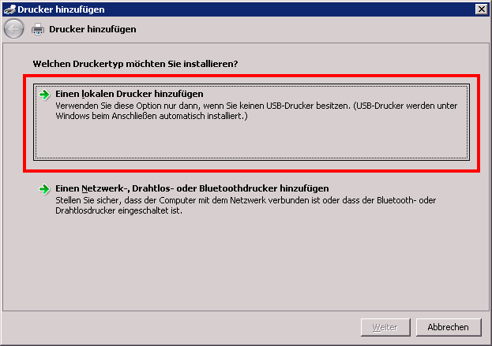
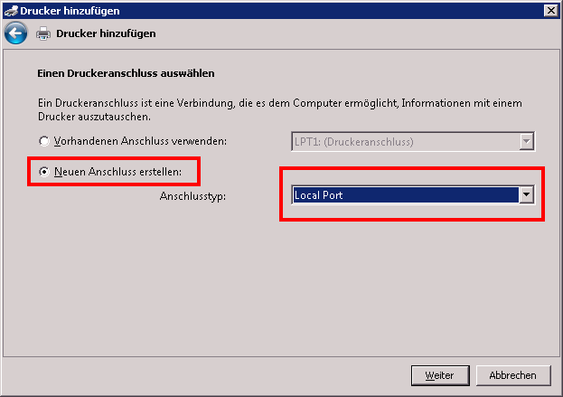
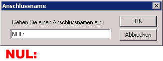
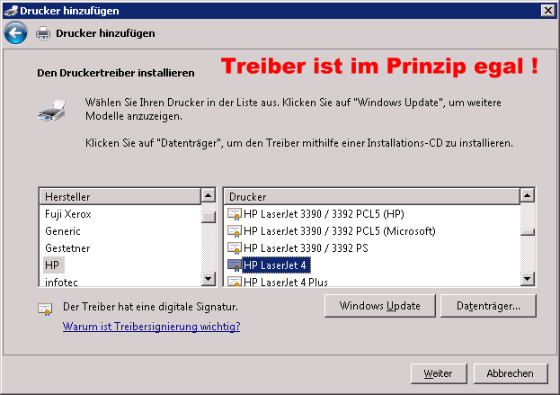
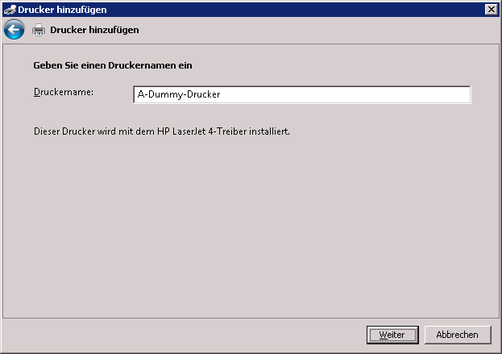
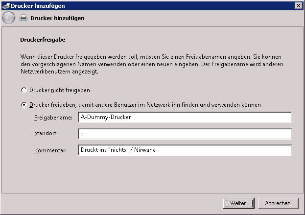
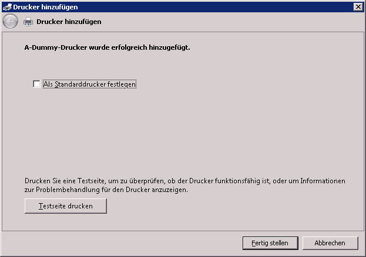
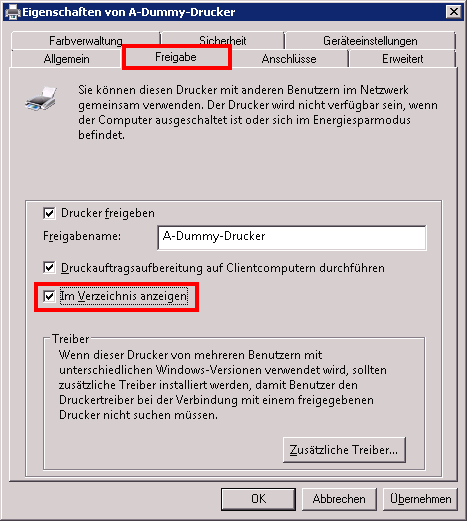

# **Dummy Drucker / Nirwana Drucker / NUL oder NULL Drucker anlegen / einrichten**

Für eine Terminalserver-Umgebung brauchte ich einen anderen Standarddrucker - da die Benutzer Ihren Standarddrucker frei wählen können, das beim ersten Start aber natürlich nicht getan haben, hat Windows Ihnen einen ausgesucht.
Windows geht das ganz unproblematisch an: es wurde einfach der vorne im Alphabet genommen.
Leider war das hier die Druckstrasse ...
Als Lösung habe ich einen Dummy-Drucker als den ersten verfügbaren eingerichtet - dieser Drucker druckt ins nichts / Nirwana. Alle Ausdrucke auf diesem "Drucker" werden einfach verworfen.
Wer so etwas mal braucht - so geht es:
Wir gehen zu den Druckern und legen einen neuen an:

Es muss ein lokaler Drucker sein (den wir gerne später als Netzwerkdrucker freigeben können)
Wir erstellen einen neuen, lokalen Anschluss:

Den wir `**NUL:`** nennen!

`**NUL:`** kommt von NULL = 0 = ins "Nichts" bitte!
Dann müssen wir noch einen Druckertreiber wählen - nehmt bitte unbedingt einen von den in Windows eingebauten, Der `**HP Laserjet `** z.B.

Den Namen lassen ich mit "A" anfangen damit der Drucker ganz vorne steht und ggf. von Windows automatisch genommen wird:

Den Drucker können wir auch freigeben - da wir den Windows-Treiber genommen haben sollte sich jeder damit verbinden können.

Falls der Drucker im Active-Directory angezeigt werden soll müsst Ihr nachträglich noch den entsprechenden haken setzten:

--[Bernhard Linz](http://znil.net/index.php?title=Benutzer:BLinz) 11:18, 27. Nov. 2012 (CET)

---

**
		Kommentare
**
**
Jojo 148 Tage  zuvor
Punkte 0[nofollow](http://znil.net/index.php?title=Spezial:Anmelden&returnto=Dummy_Drucker_%2F_Nirwana_Drucker_%2F_NUL_oder_NULL_Drucker_anlegen_%2F_einrichten)[nofollow](http://znil.net/index.php?title=Spezial:Anmelden&returnto=Dummy_Drucker_%2F_Nirwana_Drucker_%2F_NUL_oder_NULL_Drucker_anlegen_%2F_einrichten)
**
Super Anleitung. Brauchte einen Dummy Drucker für Auftragsbestätigungen die die Branchensoftware zum buchen benötigt, aber ich nicht als Papierausdruck. Hatte es sonst mit einem Druck in eine Datei gelöst, die immer überschrieben wurde.
Funktioniert einwandfrei und vor allem auf Anhieb. DANKE!
[nofollowPermalink](http://znil.net/index.php?title=Dummy_Drucker_/_Nirwana_Drucker_/_NUL_oder_NULL_Drucker_anlegen_/_einrichten#comment-286)  | [nofollowAntworten](http://znil.net/index.php?title=Dummy_Drucker_/_Nirwana_Drucker_/_NUL_oder_NULL_Drucker_anlegen_/_einrichten#end) 
**
[nofollowBLinz](http://znil.net/index.php?title=Benutzer:BLinz) 147 Tage  zuvor
Punkte 0[nofollow](http://znil.net/index.php?title=Spezial:Anmelden&returnto=Dummy_Drucker_%2F_Nirwana_Drucker_%2F_NUL_oder_NULL_Drucker_anlegen_%2F_einrichten)[nofollow](http://znil.net/index.php?title=Spezial:Anmelden&returnto=Dummy_Drucker_%2F_Nirwana_Drucker_%2F_NUL_oder_NULL_Drucker_anlegen_%2F_einrichten)
**
Immer gerne :-)
[nofollowPermalink](http://znil.net/index.php?title=Dummy_Drucker_/_Nirwana_Drucker_/_NUL_oder_NULL_Drucker_anlegen_/_einrichten#comment-287) 
nofollow
**Kommentar hinzufügen:**
Gebe hier einen Kommentar ein. Du kannst einen beliebigen Namen oder eine Email-Adresse als Namen angeben.
Wenn du dich [einloggst](http://znil.net/index.php?title=Spezial:Anmelden) wird automatisch dein Benutzername genommen.
Links bitte mit '''http://''' beginnen lassen.
Name oder Emailadresse:
Kommentar:
[Kategorien](http://znil.net/index.php?title=Spezial:Kategorien): 

- [Windows](http://znil.net/index.php?title=Kategorie:Windows&action=edit&redlink=1)- [Windows 7](http://znil.net/index.php?title=Kategorie:Windows_7&action=edit&redlink=1)- [Windows Server 2000](http://znil.net/index.php?title=Kategorie:Windows_Server_2000&action=edit&redlink=1)- [Windows Server 2003](http://znil.net/index.php?title=Kategorie:Windows_Server_2003&action=edit&redlink=1)- [Windows Server 2008](http://znil.net/index.php?title=Kategorie:Windows_Server_2008&action=edit&redlink=1)- [Windows Vista](http://znil.net/index.php?title=Kategorie:Windows_Vista&action=edit&redlink=1)- [Windows XP](http://znil.net/index.php?title=Kategorie:Windows_XP&action=edit&redlink=1)

