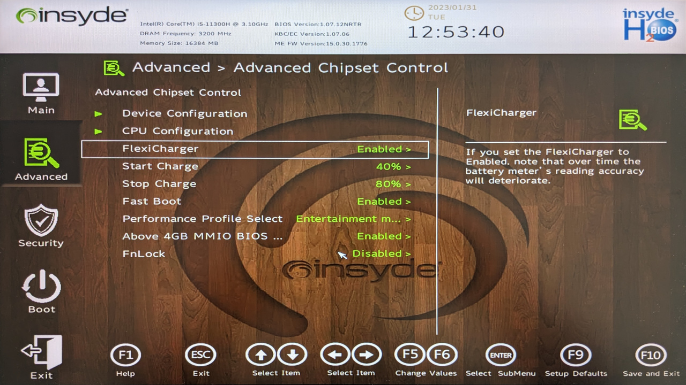

*Vorweg: Ob Ihr Gerät FlexiCharger unterstützt, entnehmen Sie bitte der Artikelbeschreibung.*

Die Langlebigkeit von Lithiumbatterien hängt von der Anzahl der Ladezyklen ab, die sie durchlaufen. Das vollständige Aufladen eines Akkus auf 100 Prozent verkürzt somit jedes Mal seine Gesamtlebensdauer. Unsere Laptops bieten daher mit FlexiCharger ein Feature, um das Ladeverhalten des Akkus anzupassen.

Um die Maximalladung einzustellen, starten Sie den Computer neu und rufen Sie das BIOS auf, indem Sie die Taste F2 oder Entf gedrückt halten. Dort navigieren Sie zu *Advanced*, dann *Advanced Chipset Control* und setzen *FlexiCharger* auf *Enabled* (aktiviert). Es erscheinen zwei Untermenüs, in welchen Sie die gewünschten Prozentsätze individuell einstellen können.

Je größer die Spanne zwischen dem oberen und unteren Prozentwert ist, desto länger hält der Akku. Für eine optimale Langlebigkeit sind Ladezyklen von 40 bis 80 Prozent zu empfehlen:

- *Start Charge 40%*
- *Stopp Charge 80%*

Mit aktiviertem FlexiCharger kann Ihr TUXEDO Book ausschließlich über den Wechselstromanschluss betrieben werden, ohne dass die Akkuladung davon berührt wird. Dies verhindert unnötige Auf- und Entladungen, die die Lebensdauer der Batterie verringern. Dies ist besonders nützlich, wenn Ihr TUXEDO Laptop über einen längeren Zeitraum an das Netzteil angeschlossen ist.

FlexiCharger kann jederzeit im BIOS deaktiviert werden, wodurch das Ladeprofil auf die Werkseinstellungen zurückgesetzt wird. Sollten Sie etwa für eine Reise eine möglichst lange Akkulaufzeit benötigen, deaktivieren Sie im Vorfeld den FlexiCharger, um den Akku auf 100 Prozent aufzuladen.