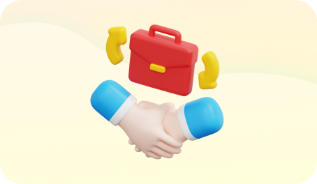

  

## * ✅ Explore Everything Step By Step*

**Let us help you become a fully-fledged FuseBase citizen. Stick to our task list below and cross one task off at a time to mark your progress. You can always come back to this page and check what's left. Or open Tasks in the left sidebar to find the task list in the dashboard.**  
  

Currently, we cannot display the task list as it is not supported in this type of pages.

  

## 🤔 What Is FuseBase

**Before you start your exciting journey, check out an insightful FuseBase overview from our CEO, Paul Sher. You'll learn about all the benefits of scaling your processes with our collaboration platform.**

<https://fast.wistia.net/embed/iframe/we6bcn0y6a>

  

  

## 📋 Choose Your Interest and Advance

**Go through the pages below to learn more about how everything works in detail. Start with the first on the list and move further at your own pace.**

  

====

💡

**Quick tip**  
Click on the text with 🔗 to open the desired page.

  

  

### [🔗📑 Create Lit Super Docs](https://nimbusweb.me/guides/getting-started/create-super-docs/)

**–** **Build interactive documents and embed content from other tools to keep everything in one place.**  
**–** **Organize and structure your information effectively with tables and various objects.**

------------------------------------------------------------------------

  

### [🔗🧑‍💻 Work with Your Team](https://nimbusweb.me/guides/organization/work-with-your-team/)

**–** **Streamline the brainstorming and feedback processes with chats. Or comment on blocks, texts and pictures.**  
**–** **Control access and permissions with flexible user roles and permissions settings.**

------------------------------------------------------------------------

  

### [ 🔗📆 Manage Your Projects](https://nimbusweb.me/guides/organization/manage-your-projects/)

**–** **Organize tasks, projects and teams using dedicated workspaces and databases.**  
**–** **Track progress and priorities with Kanban boards and task lists.**

  

------------------------------------------------------------------------

  

###  🔗💼 [Interact with Clients](https://nimbusweb.me/guides/client-portal/collaborate-with-clients-using-fusebase-portals/)

**–** **Provide clients with controlled access to project information and updates.**  
**–** **Share files and pages securely with password protection and guest roles.**

  

------------------------------------------------------------------------

  

### [🔗🪄 Work Smarter with AI](https://nimbusweb.me/guides/getting-started/get-started-with-ai-in-fusebase/)

**–** **Leave tedious tasks to your virtual assistant while concentrating on more important ones.**

**–** **Brainstorm ideas and get personalized recommendations based on your knowledge.**

------------------------------------------------------------------------

##  🧑‍🎓 Learn More Now

**If you want to get more information about specific FuseBase solutions and features, book a call with our team or read** [**our guides \>\>**](https://nimbusweb.me/guides/)  
  

====

👇

**Choose the desired date and available time slots to get your custom solution.**

<https://nimbusweb.me/book-a-demo/?bd=getting-started>

  

  

------------------------------------------------------------------------

### 📝  Share Your Feedback

**We are always open to hearing your feedback. Please share what you think about our onboarding process. Just 3 answers and 1 minute of your time can help us a lot.**  
  
**Let's make FuseBase better for you, with you!**

<https://form.typeform.com/to/VwwBVXAQ>