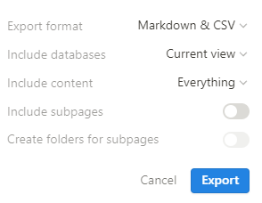

This is a space to test logseq export / import

# Exporting the space

- Export root - with subpages, without folders, or 
Export root - with subpages, with folders
- Include Everything
- Use ‘default view’ for databases

[Sub page](<./Root Page to Export to Logseq/Sub page.md>)

The root has a link to the [Sub page](<./Root Page to Export to Logseq/Sub page.md>) 

## Databases

[Page with an inline DB](<./Root Page to Export to Logseq/Page with an inline DB.md>)

[Full page DB](<./Full page DB 19accaea7a6c42b1b569ca637746ba4b.csv>)

[Tests to run on this](<./Root Page to Export to Logseq/Tests to run on this.md>)