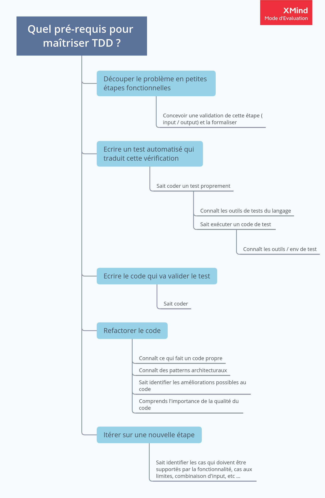

🤔

# TDD: easy to learn ?

Est-ce que c’est si simple que d’apprendre TDD ? 🤔

Pour un développeur débutant ou un apprenant en formation initiale, quelles sont les apprentissages à faire pour passer de:

-   Je sais écrire du code qui fait quelque chose

à l’étape:

-   Je sais utiliser les techniques de conception avancées d’ingénierie logicielle pour produire du code de qualité, qui marche, selon une procédure industrielle ou quasi ?