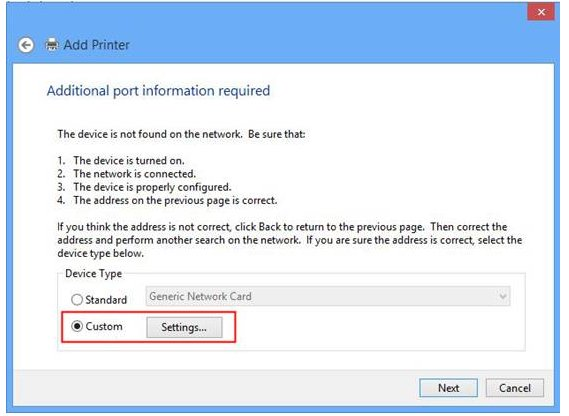
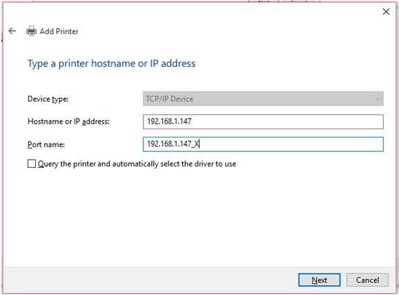

**For Windows 2000/XP**

[**http://www.tp-link.com/en/faq-181.html**](http://www.tp-link.com/us/faq-181.html)

**Step** **1** Click **Start**-\>**Printers and Faxes**-\> **Printers**.

**Step** **2** Double click on **Add Printer**.

**Step** **3** Click **Next** on the Welcome screen.

**Step** **4** The Local or Network Printer screen will open. Select **Local printer**. Uncheck **Automatically detect and install my Plug and Play printer.**

**Step** **5** Click **Next**.

**Step** **6** The screen of Select a Printer Port will open. Select **Create a new port** and **Standard TCP/IP Port**.

**Step** **7** Click **Next**.

**Step** **8** Click **Next** again on the welcome screen.

**Step** **9** The **Add** **Standard TCP/IP Printer Port** screen will open. Enter the IP address of the printer server. For Port Name, it will be entered automatically.

**Step** **10** Click **Next**.

**Step** **11** The **Additional** **Port** **Information Required** screen will open. Select **Custom**. Click **Settings**.

**Step 12** The **Configure Standard TCP/IP Port Monitor** screen will open.

**By using LPR protocol**

Select **LPR** for Protocol. Enter **lp1** in the Queue Name field. Click on the **LPR Byte Counting Enabled** checkbox (Due to a flaw in Windows LPR, some print servers will not accept jobs unless Byte Counting is enabled).

**By using Raw protocol**

In the **Protocol** section, select **Raw**

In the **Port Number** field, enter **9100**

**Step 13** Click **OK**, then **Next** and **Finish**.

**Step 14** A window will show all of the drivers, select the appropriate one.

a\. In the window, select an appropriate name (Use the Queue name for clarity when making multiple printer definitions).

b\. Keep existing driver if necessary.

c\. In the **Print Test Page** window, you may test as needed if necessary.

d\. Click **Next**.

e\. Click **Finish**.

**For Windows 7/Vista**

**Situation 1**

[**http://www.tp-link.com/en/faq-240.html**](http://www.tp-link.com/us/faq-240.html)

You **never** use the printer on your computer before but also want to share printing; you just need to add a printer, follow the steps to create a Standard TCP/IP port, and then install the printer driver.

**Step 1** Click **Start**-\> **Control Panel**, and select **Devices and Printers**.

**Step 2** Click **Add a printer.**

**Step 3** Select **Add a local printer.**

**Step 4** Select **Create a new port**, and the type of port is **Standard TCP/IP Port**.

**Step 5** Input the **IP address** of the print server and click **Next**. The windows will detect the TCP/IP Port. Please wait for the next page.

**Step 6** Select **Custom** and click **Settings**. And then on the next page, please select **LPR** as the Protocol and the Queue Name is **lp1**.

**Step 7** It will ask you to install the driver of the printer. You can select one in the list or click **Have Disk** to install other drivers. Please follow the steps to finish the installation.

**Step 8** After that, the new printer is in the list. And you can enjoy the sharing.

**Situation 2**

[**http://www.tp-link.com/en/faq-239.html**](http://www.tp-link.com/us/faq-239.html)

You ever connected directly a printer to your computer by a USB cable or a parallel cable, and installed the printer driver. Now you want to use a print server to share the printer through your network. You need to change the printer port to Standard TCP/IP port.

Step 1 Click **Start**-\> **Control** **Panel** -\> **Classic View** -\> **Printers**.

Step 2 Find your installed printer icon, right-click, select **Properties**.

Step 3 Click **Ports** -\> **Add Port** -\> **Standard TCP/IP Port** -\> **New Port** -\> **Next**.

Step 4 Input the exact **IP address** of print server that you configured it. Click **Next**.

Step 5 Select **Custom**, and click **Settings**.

Step 6 Choose **LPR**, and input the queue name as **lp1**. Click **OK**.

Step 7 Click **Next**, **Finish**, to complete the wizard.

Step 8 Click **Close** and **Apply**.

Now, the printer port has been created.

**For Windows 8**

[**http://www.tp-link.com/en/faq-459.html**](http://www.tp-link.com/us/faq-459.html)

Windows 8 is a new operating system of Microsoft, it changed greatly compared with the former versions. Since it also supports TCP/IP printing, it is compatible with our Print Servers, like TL-PS110U/TL-PS110P/TL-PS310U/TL-WPS510U. Here is the configuration guide.

Note: Before the installation, please make sure the printer works fine if it is connected to computer directly.

**Step 1** Please move your mouse to the right corner and you will see **Search**. Click it and search **Control Panel**.

**Step 2** Go to **Control Panel**-\>**Hardware and Sound** page, and click **Advanced printer setup**.

**Step 3**

A window will pop out to search the printers automatically, please ignore it and click **Next** button.

**Step 4** Please Select **Add a Printer using a TCP/IP address or hostname**, click **Next**.

**Step 5** Please select **Custom** and click **Settings**.

**Step 6** Please type the IP address of your Print Server in **Hostname or IP address**. The print server’s IP should in same subnet with your router. As default, the Protocol is **Raw**. You can keep it still or select **LPR**. The two protocols support different printing languages. You can try one first, if can’t print, delete it and try another one.

**Step 7** Select the correct driver for your printer. If you can’t find the model of your printer, please connect your printer to PC with USB cable and install the driver first. Click **Next**.

**Step 8** Click **Next**.

**Step 9** Click **Finish**.

Until now, you have finished the installation. You can find the newly added Printer on **Control Panel**-\> **Hardware** **and Sound**-\> **Devices and Printers** page.

**For Windows 10**

[**http://www.tp-link.com/en/faq-929.html**](http://www.tp-link.com/us/faq-929.html)

Since Windows 10 supports TCP/IP printing, it is compatible with our Print Servers, like TL-PS110U/TL-PS110P/TL-PS310U/TL-WPS510U. Here is the configuration guide.

Before the installation, please make sure the printer works fine if it is connected to computer directly.

**Step 1** Configure the print server as usual. Example looks below (sample is using IP 192.168.1.147).

**Step 2** Open **Device & Printers** on **Control Panel**, or Press **Window** Button, then type “**Printer**” then Enter.

**Step 3** Click “**Add a printer**”. Then it will automatically search for devices. Instead, click “**The Printer that I want isn’t listed**”.

**Step 4** Then it will show **Add Printe**r page. Select “**Add a local printer or network printer with manual settings**”. Then **next**.

**Step 5** On the next page, you will be asked for printer port. In this case, select “**Create a new port**”, and then select “**Standard TCP/IP Port**”. Then **next**.

**Step 6** Next page you will be asked for IP address of your device. Put in the print server’s **IP Address** and on the **Port Name**, add some text. For example, 192.168.1.147\_X. Also remember NOT to tick the “Query the printer and automatically select the driver to use”.

**Step 7** You then will be shown a page with Detecting TCP/IP Port. Wait a few minutes depends on your network configuration. It will show you that the system cannot find any devices. Don’t worry, this is as expected. Then you will be shown the page like next page.

Select “**Custom**” then click “**Settings…**”

**Step 8** Please type the IP address of your Print Server in Hostname or IP address. The print server’s IP should in the same subnet with your router. As default, the Protocol is **Raw**. You can keep it still or select **LPR**. The two protocols support different printing languages. You can try one first, if can’t print, delete it and try another one.

**Step 9** Click **Next**.

**Step 10** You will be asked to select your printer driver. Select based on your printer model and type from Windows standard drivers. Or you can use from your printer CD/DVD setup kit. After that, click **Next**.

**Step 11** Then you will be asked whether you would like to use current driver or replace it. This is only happen when you already have printer driver before. I assume that you have installed previously. So, select to replace.

**Step 12** Then put the name of your printer here.

**Step** **13** Click “**do not share this printer**”.

**Step 14** Set this printer as default by ticking the selection “**Set as the default printer**” or not. Also if you want to do Print test, just press the button “**Print a test page**”.

