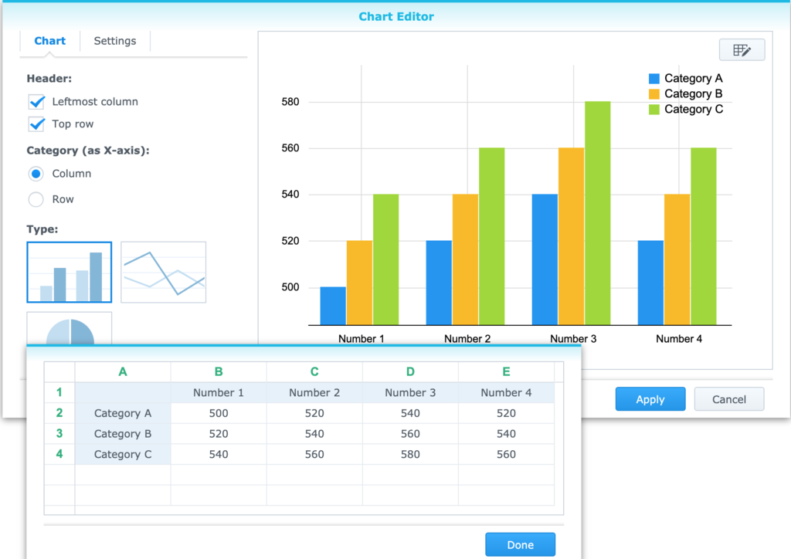

# This is H1

This is some more text

## This is H2

This is some more text

### This is H3

This is some more text

#### This is H4

This is some more text

##### This is H5

This is some more text

###### This is H6

This is some more text

This is highlighted Text

This is crossed out

This is *italic*

This is **bold**

This is ++underlined++

sub~script~

super^script^

1.  Number 1
2.  Number 2
    1.  Number sub 1
    2.  Number sub 2
3.  Number 3

-   Bullet 1
-   Bullet 2
    -   Sub bullet 1
    -   Sub bullet 2
        -   Sub sub bullet 
-   Bullet 3

Check 1

Check 2

Sub check 1

Sub check 2

Sub sub check 1

Sub sub check 2

Check 3

There is a horizontal line below this text

------------------------------------------------------------------------

There is a horizontal line above this text

Below is a 3x3 Table

| **cell R1C1** | **cell R1C2** | **cell R1C3** |
|---------------|---------------|---------------|
| cell R2C1     | cell R1C2     | cell R1C3     |
| cell R3C1     | cell R1C2     | cell R1C3     |

Pie Chart

Line chart

Below is a bar chart

Below is an image of the design of the line chart as seen in note-station



Below is a hyperlink to the internet

<https://github.com/kevindurston21/YANOM-Note-O-Matic>

Below is a link to test page 2 inside of this notebook

[test page 2](<./test page 2.md>)

Below is a renamed link to test page 2 inside of this notebook

[renamed link to test page 2](<./test page 2.md>)

Below is a a page in the 'Test Book 2' notebook

[Page linked to from test book](<../Test Book 2/Page linked to from test book.md>)

Below is a renamed link to a page in this notebook, the link will not work

[renamed link to test page 3](<./test page 3.md>)

Below is a link to a page that has a duplicated page title

[This is a duplicated title](<../Test Book 2/This is a duplicated title.md>)

An audio memo recording has been attached - it is silent because Note Station does not record correctly on my computers (if the feature actually works) but this shows it is exported.

An example-attachment.pdf has been attached

This page has 4 tags Tag1, Tag2, Tag1/SubTag1, Tag1/SubTag1/SubSubTag1. There will be near the top of the markdown file.

This is some code pasted into the note

```
if not files_to_convert:
    print('No .nsx files found')
    exit(1)
```

There is no way to insert 'code' in line in a Note.  Note formatted HTML does not use the ` tag it just uses a `

     tag so code is always it's own block even if only one word. Just like

```
while
```

this.

A pdf of what this page looks like in Note Station has been attached - see test page.pdf

This is the end of the text.

## Unlinked Resources

- [Record 2021-02-15 16:00:13.webm](./file_6c4b828f227a096d3374599cae3f94ec.webm)
- [example-attachment.pdf](./file_c4ee8b831ad1188509c0f33f0c072af5.pdf)
- [test page.pdf](./file_27a9aadc878b718331794c8bc50a1b8c.pdf)