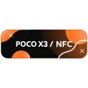

2026-06-23 07:54:49, **SMARPHONE | UPDATES**: 

2026-06-23 07:54:50, **SMARPHONE | UPDATES**:

> #InfinityX #Rom #Official #Surya
> **Project Infinity X v3.11 | Android 16.
> By** @Muichiro Tokito
> 
> ×| [Download]() 
> ×| [Support]()
> ×| Changelog: [Source]() | [Device]()
> 
> **Released**: June 9
> @Smartphone_Official | @SmartphoneDiscussions

Reactions: ⚡ (3)

2026-06-23 07:57:14, **SMARPHONE | UPDATES**: 

2026-06-23 07:57:15, **SMARPHONE | UPDATES**:

> #Crdroid #Rom #Official #Surya
> **Crdroid v12.11 | Android 16.
> By** @braindead55 
> 
> ×| [Download]() 
> ×| [Support]()
> ×| [Changelog]()
> ×| [Wiki]()
> 
> **Released**: June 10
> @Smartphone_Official | @SmartphoneDiscussions

Reactions: 🔥 (2)

2026-06-23 07:59:39, **SMARPHONE | UPDATES**: 

2026-06-23 07:59:39, **SMARPHONE | UPDATES**:

> #AlphaDroid #Rom #Official #Surya
> **AlphaDroid 4.5 | Android 16.
> By** @braindead55 
> 
> ×| [Download]() 
> ×| [Support]()
> ×| Changelog: [Source]() | [Device]()
> 
> **Released**: June 10
> @Smartphone_Official | @SmartphoneDiscussions

Reactions: 🔥 (2)

2026-06-23 08:02:02, **SMARPHONE | UPDATES**: 

2026-06-23 08:02:02, **SMARPHONE | UPDATES**:

> #AxionOS #Rom #Official #Surya
> **AxionAOSP v2.7 | Android 16.
> By** @kardebayan
> 
> ×| [Download]()
> ×| [Flash guide ]()
> ×| Changelog: [Source]() | [Device]()
> 
> **Released**: June 13
> @Smartphone_Official | @SmartphoneDiscussions

Reactions: 🔥 (6)

2026-06-23 08:05:26, **SMARPHONE | UPDATES**: 

2026-06-23 08:05:27, **SMARPHONE | UPDATES**:

> #Recovery #Unofficial #Ofox #Surya 
> **OrangeFox Recovery 12.0 | Android 16.
> By** @IBoreasI
> 
> ×| [Download]() 
> ×| [Screenshots]()
> 
> **Notes**:
> • Based on the brigudav repository, various improvements and fixes have been made.
> 
> **Released**: June 14
> @Smartphone_Official | @SmartphoneDiscussions

Reactions: 🔥 (4) | ❤‍🔥 (1)

2026-06-23 08:07:32, **SMARPHONE | UPDATES**: 

2026-06-23 08:07:32, **SMARPHONE | UPDATES**:

> #PixelOS #Rom #Official #Surya
> **PixelOS 16.2 | Android 16.
> By** @DebayanKar
> 
> ×| [Download]() 
> ×| [Support]() 
> 
> **Released**: June 21
> @Smartphone_Official | @SmartphoneDiscussions

Reactions: 🔥 (8) | 🍓 (1)

2026-06-24 03:20:02, **SMARPHONE | UPDATES**:

Reactions: 🤯 (1)

2026-06-24 03:25:34, **SMARPHONE | UPDATES**:

#Archive #Surya 
Probably this is the biggest archive channel of custom roms for Smart phone
@host_surya 

    my friend Reza, mirrored those memorable stuffs in telegram from December 2020 till October 2023, **2434 Files!**
    sometimes i miss those OLD roms and ports(Android 10-13), btw i decided to introduce and make public. if download links was dead, maybe you can find there.

Reactions: ❤‍🔥 (28) | 🔥 (2) | 👍 (1) | 🐳 (1)

2026-06-24 03:36:25, **SMARPHONE | UPDATES**:

also thanks to Arsalan for continuing this from 2022 and his channel is still alive
@suryarom
you can find archives from 2022 till now.

Reactions: ⚡ (18) | ❤‍🔥 (4) | 🍓 (1)

2026-07-13 20:05:03, **SMARPHONE | UPDATES**:

Reactions: ☃ (1)

2026-07-13 20:05:03, **SMARPHONE | UPDATES**:

> #InfinityX #Rom #Official #Surya
> **Project Infinity X v3.12 | Android 16.
> By **Muichiro Tokito
> 
> ×| [Download]() 
> ×| Changelog: [Device]() | [Source]()
> ×| [Flash guide]()
> 
> **Released**: July 8
> @Smartphone_Official | @SmartphoneDiscussions

Reactions: ⚡ (7) | ❤‍🔥 (1) | ☃ (1)

2026-07-13 20:09:54, **SMARPHONE | UPDATES**: 

2026-07-13 20:09:54, **SMARPHONE | UPDATES**:

> #VoltageOS #Rom #Unofficial #Surya 
> **VoltageOS 5.11 EOL | Android 16.
> By** Muichiro Tokito
> 
> ×| [Download]()
> ×| [Recovery]() 
> ×| [Screenshots]()
> 
> **Notes**:
> • Use Latest Firmware
> • Use MindTheGApps
> • Dolby & Leica included
> • Misc Changes and improvements
> 
> **Released**: July 8
> @Smartphone_Official | @SmartphoneDiscussions

Reactions: ⚡ (8) | 🍓 (3) | 👍 (1)
