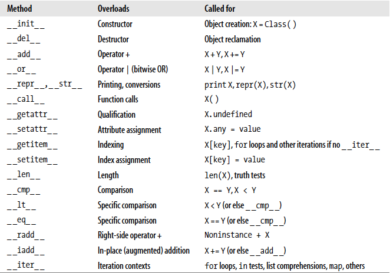
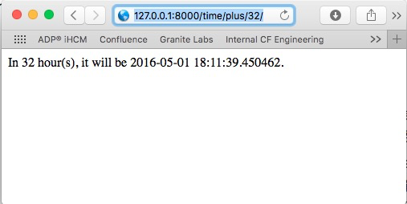

## Basic

### Python是面向对象的语言，Python中的所有数据类型都是对象

### dir()函数可以返回某个对象所支持的所有操作及属性

- >>> S = "a string"  
  >>> dir(S)  
  ['__add__', '__class__', '__contains__', '__delattr__', '__doc__', '__eq__', '__  
  format__', '__ge__', '__getattribute__', '__getitem__', '__getnewargs__', '__gt_  
  _', '__hash__', '__init__', '__iter__', '__le__', '__len__', '__lt__', '__mod__'  
  , '__mul__', '__ne__', '__new__', '__reduce__', '__reduce_ex__', '__repr__', '__  
  rmod__', '__rmul__', '__setattr__', '__sizeof__', '__str__', '__subclasshook__',  
   '_formatter_field_name_split', '_formatter_parser', 'capitalize', 'center', 'co  
  unt', 'encode', 'endswith', 'expandtabs', 'find', 'format', 'index', 'isalnum',  
  'isalpha', 'isdecimal', 'isdigit', 'isidentifier', 'islower', 'isnumeric', 'ispr  
  intable', 'isspace', 'istitle', 'isupper', 'join', 'ljust', 'lower', 'lstrip', '  
  maketrans', 'partition', 'replace', 'rfind', 'rindex', 'rjust', 'rpartition', 'r  
  split', 'rstrip', 'split', 'splitlines', 'startswith', 'strip', 'swapcase', 'tit  
  le', 'translate', 'upper', 'zfill']

### help()可以返回某个对象某个方法的帮助信息

- >>> help(S.index)  
  Help on built-in function index:  
  index(...)  
  S.index(sub [,start [,end]]) -> int  
  Like S.find( ) but raise ValueError when the substring is not found.

### Variables

- 基础

	- names, references, and objects

		- 当在Python的术语环境中提到Variables时，指的是"names of objects" 或者 "names of values"

		- 

		- 从概念上讲：

			- Variables 是系统表中的记录，拥有足够的空间用于保存指向Object的链接

			- Object 是一块内存空间，拥有足够的空间保存其数据

			- References 是从Variables 到 Objects 的指针，它会被系统自动跟踪

		- 从实例来看：

			- >>> a = 3

			- 当执行 a = 3 这条表达式的时候，系统内部主要会发生3件事情

				- 1. 创建一个number对象，其值为3

				- 2. 创建一个Variable a, 如果a当前还不存在

				- 3. 通过Reference，让a指向新创建的Object 3

		- in-place change 和 赋值操作 "="

			- Python 的赋值语句 "="，给某个variable赋值时（注意是变量赋值，而不是给变量的某个元素赋值，给变量的元素赋值叫做in-place change，是完全不同的行为），会创建新的对象，而不会修改变量当前所指向的对象

				- >>> a = 3  
				  >>> id(a)  
				  4297110040  
				  >>> a = 4  
				  >>> id(a)  
				  4297110016

				- a = 4 后，其所指向的对象地址发生了变化，说明a已经不再指向 a = 3 时那个对象了。

				- >>> b = a  
				  >>> id(b)  
				  4297110016  
				  >>> a = 5  
				  >>> id(a)  
				  4297109992  
				  >>> id(b)  
				  4297110016

				- 当 b = a 后，b和a指向的地址相同(指向同一个对象)

				- 然后给a赋值，会使a指向一个全新的对象，但不会影响b，b仍旧指向旧的对象

			- in-place change，一般是指给集合类对象的某个元素赋值，那么python会直接修改这个集合对象，而不会产生一个全新的集合对象

				- >>> L1 = [2, 3, 4] # A mutable object  
				  >>> id(L1)  
				  4300659744  
				  >>> L2 = L1 # Make a reference to the same object  
				  >>> L1[0] = 24 # An in-place change  
				  >>> L1 # L1 is different  
				  [24, 3, 4]  
				  >>> L2 # But so is L2!  
				  [24, 3, 4]
>>> id(L1)  
				  4300659744  
				  >>> id(L2)  
				  4300659744

				- L1 和 L2 指向同一个对象，然后通过L1，对他们所指向的对象的第0个元素进行赋值，结果是L1和L2的对象地址并没有改变，而L1的元素值的变化，也反映到了L2

		- Object 中，不仅仅包含该对象的数据，其实，每个Object都还包含两个标准的说明域：

			- type designator 用于标识该对象的类型 

			- reference counter 用于记录其引用的个数，这个计数器的作用就是用来判断对象是否可以被释放

		- Shared References

			- 多个Variables 指向同一个 Object，就是shared references

			- >>> a = 3  
			  >>> b = a

				- 

				- 此时，a和b这两个variable都指向同一个object

			- >>> a = 3  
			  >>> b = a  
			  >>> a = 'spam'

				- 

				- 当a重新赋值后，a指向了不同的object

				- 注意"="赋值操作，总是新建一个对象，然后建立新对象与variable的连接

			- in-place change 与 shared reference

				- >>> L1 = [2, 3, 4] # A mutable object  
				  >>> id(L1)  
				  4300659744  
				  >>> L2 = L1 # Make a reference to the same object  
				  >>> L1[0] = 24 # An in-place change  
				  >>> L1 # L1 is different  
				  [24, 3, 4]  
				  >>> L2 # But so is L2!  
				  [24, 3, 4]
>>> id(L1)  
				  4300659744  
				  >>> id(L2)  
				  4300659744

				- 注意当发生in-place change时，shared reference 会相互影响.
L1和L2指向同一个对象，然后通过L1，对他们所指向的对象的第0个元素进行赋值，结果是发生了in-place change, L1和L2的对象地址并没有改变，而L1的元素值的变化，也反映到了L2

			- 如果希望拷贝数值到新的对象，而不用shared reference，可以使用下列方法：

				- >>> L1 = [2, 3, 4]  
				  >>> L2 = L1[:] # Make a copy of L1  
				  >>> L1[0] = 24  
				  >>> L1  
				  [24, 3, 4]  
				  >>> L2 # L2 is not changed  
				  [2, 3, 4]

				- import copy  
				  X = copy.copy(Y) # Make a top-level "shallow" copy of any object Y  
				  X = copy.deepcopy(Y) # Make a deep copy of any object Y: copy all nested parts

			- 检查两个变量是否相等，是否是指向同一个对象

				- >>> L = [1, 2, 3]  
				  >>> M = L # M and L reference the same object  
				  >>> L == M # Same value  
				  True  
				  >>> L is M # Same object  
				  True

				- >>> L = [1, 2, 3]  
				  >>> M = [1, 2, 3] # M and L reference different objects  
				  >>> L == M # Same values  
				  True  
				  >>> L is M # Different objects  
				  False

					- L和M相等，但不是同一个对象

				- >>> X = 42  
				  >>> Y = 42    # Should be two different objects  
				  >>> X == Y  
				  True  
				  >>> X is Y # Same object anyhow: caching at work!  
				  True

					- X和Y本应该是两个不同的对象，但此例中，他们是同一个对象。这是因为Python自动cache和重用一些小的对象，例如integer，由于X和Y的值相等（42），因此42这个对象被重用了，被分配给了X和Y两个Variables

				- >>> x = 42  
				  >>> x = 'shrubbery' # Reclaim 42 now?

					- 42 这个对象可能不会被立即释放，因为它是一个int类型的很小的对象，python可能会保留一段时间，以备重用

				- >>> import sys  
				  >>> sys.getrefcount(1) # 837 pointers to this shared piece of memory  
				  837

					- 查询某个变量的当前引用个数

	- Python 的变量无需声明，通过赋值，创建变量

	- 变量作用域

		-     在python中，变量查找遵循LGB原则，即优先在局部作用域(local scope)中对变量进行查找，失败则在全局作用域(global scope)中进行查找,最后尝试再内建作用域(build-in scope)内查找，如果还是未找到的话，则抛出异常。后来由于闭包和嵌套函数的出现，作用域又增加了外部作用域，这样变量的查找作用域优先级变为：局部、外部、全局和内建。 作用域由def、class、lambda等语句产生，if、try、for等语句并不会产生新的作用域。我们看下面的一个例子:
		  def scope1_f1():
    def f2():
        print local_v
    local_v = 'local'
    f2()
    print global_v  
		  if __name__ == "__main__":
    global_v = 'global'
    scope1_f1()  
		     在scope1_f1函数中我们并未对global_str进行赋值（即scope1_f1的局部作用域中并不存在变量lobal_str），但程序正常输出结果'local'和'global'。 

一 局部作用域中不应对全局变量进行赋值
   需要注意的是虽然我们可以在函数中对全局的变量进行访问，但一旦局部作用域中对全局变量进行了赋值操作，python解释器就不会从全局作用域中查找，而会抛出UnboundLocalError错误。该规则在由局部作用域向外部作用域查找时同样有效。
def scope1_f1():
    print global_v
    global_v = 'local'
		  if __name__ == "__main__":
    global_v = 'global'
    scope1_f1()
   运行程序我们会得到：UnboundLocalError: local variable 'global_v' referenced before assignment
		     有资料将该规则描述为“局部作用域中全局变量应是只读”是不准确的。因为如果变量为list等类型，我们可以通过append这样的方法来修改全局变量，而不影响局部作用域对变量的访问。
def scope1_f1():
    print global_v
    global_v.add('local')
		  if __name__ == "__main__":
    global_v = ['global']
    scope1_f1()  
		  二 局部作用域中使用 global实现对全局变量进行赋值
    如果说确实需要对全局变量进行赋值的话，应在局部作用域中使用global来修饰变量。python2.6中global对变量的修饰可以在函数的任意地方进行，但如果global在赋值之后的话，解释器会提示SyntaxWarning 。
def scope1_f1():
    global global_v
    print global_v
    global_v = 'local'
		  if __name__ == "__main__":
    global_v = 'global'
    scope1_f1()  
		  三 继承类优先使用第一个基类中的变量
   在没有对变量初始化的情况下，继承类会优先使用第一个基类中的变量。下面的例子会输出1而不是2。（说明：如果继承类为初始化函数，会优先调第一个基类的初始化函数，如果前面的基类都没有的话才会调后面基类的初始化函数，初始化函数对变量的修改不在本文讨论范围），
class sclass1():
    a = 1
    def run(self):
        print self.a
class sclass2():
    a = 2
    def run(self):
        print self.a
		  class dclass(sclass1, sclass2):
    def run(self):
        print self.a  
		  if __name__ == "__main__":
    a = dclass()
    a.run()    
		  四 全局作用域指的是本模块而不是程序 
   在变量查找时只会在本模块范围内进行变量的查找，即使使用from xxx import *也不会垮模块查找。在python中导入一个模块可以理解为是将另外一个模块各变量赋值给当前模块的同名变量, 对当前模块中变量的赋值不会影响到导入模块的变量。
main.py
from module2 import *
if __name__ == "__main__":
   module2_v = 5
   module2_v1 = 3
   print_modul2()
		  modul2.py 
module2_v1 = 'module2' 
def print_modul2():
   print module2_v1
   print module2_v  

	- Python 在运行过程中动态地判断变量的类型

		- Python 的变量只是一个名字，并没有任何类型信息ꘀꑍߐĀ**ⷰ**腷 

		- 类型信息存在与这个名字所代表的Python对象中

		- Python 的变量 (Variables) 只是在某一个时刻代表了某一个对象

	- Python 不能使用未赋值的变量

	- 当某个变量出现在表达式中，该变量在运行时会被替换为它当前所指向的对象

	- Python使用变量无需特殊前缀

		- #!/usr/bin/pythn  
		     
		  message = "Hell Wrld!"  
		  print message, "\n\n"

	- Python的常用变量类型(不完整)

		- string

		- int

		- flat

		- lists

		- tuples

		- dictinary

	- type()函数能返回变量的类型

		- >>> Prduct = "LinuxCBT Scripting Editin"  
		  >>> print Prduct  
		  LinuxCBT Scripting Editin  
		  >>> type(Prduct)  
		  <type 'str'>  
		  >>> Price = 395  
		  >>> type(Price)  
		  <type 'int'>  
		  >>> Price = "395"  
		  >>> type(Price)  
		  <type 'str'>  
		  >>> Price = 395.00  
		  >>> type(Price)  
		  <type 'flat'>

	- id()函数返回变量的地址

		- 例子

			- >>> Price = 300  
			  >>> id(Price)  
			  4297190560  
			  >>> Price1 = Price  
			  >>> id(Price1)  
			  4297190560  
			  >>> Price = 400  
			  >>> Price  
			  400  
			  >>> Price1  
			  300  
			  >>> id(Price)  
			  4297190608  
			  >>> id(Price1)  
			  4297190560

		- 从这个例子可以看到，当Price1 = Price后，Price1和Price指向相同的地址。这表示，如果用一个变量给另一个变量赋值，实际并没有进行数值拷贝，Price1和Price这两个变量在此时其实是两个“引用”。

		- 当重新给Price赋值后，Price的值和地址都发生了变化，而Price1不受影响。意味着重新赋值Price，实际是类似与重新定义了Price，Price指向了不同的空间，因此id返回的地址就不同了

	- 判断变量的类型

		- type

		- 类型名称 (list, dictionary, string etc.)

		- isinstance函数

- string的一些基本操作

	- string 相当于只包含字符的list, string也是有序的集合类型

	- • Single quotes: 'spa"m'  
	  • Double quotes: "spa'm"  
	  • Triple quotes: '''... spam ...''', """... spam ..."""  
	  • Escape sequences: "s\tp\na\0m"  
	  • Raw strings: r"C:\new\test.spm"  
	  • Unicode strings: u'eggs\u0020spam'

	- string 可以用""或''括起来。单引号和双引号是一样的意思。

	- string 还可以用三个引号(单/双都可以，但不能混用)，三个引号可以生成多行的string

		- >>> msg = """  
		  aaaaaaaaaaaaa  
		  bbb'''bbbbbbbbbb""bbbbbbb'bbbb  
		  cccccccccccccc"""

	- string 分为两种，一种是raw string，一种是unicode string

		- raw string 以 r开头

			- r"C:\new\test.spm"

		- unicode string 以u开头

			- u'eggs\u0020spam'

	- string 的斜杠特殊字符

		- \newline Ignored (continuation)

		- \\ Backslash (keeps a \)

		- \' Single quote (keeps ')

		- \" Double quote (keeps ")

		- \a Bell

		- \b Backspace

		- \f Formfeed

		- \n Newline (linefeed)

		- \r Carriage return

		- \t Horizontal tab

		- \v Vertical tab

		- \N{id} Unicode database ID

		- \uhhhh Unicode 16-bit hex

		- \Uhhhh... Unicode 32-bit hexa

			- The \Uhhhh... escape sequence takes exactly eight hexadecimal digits (h); both \u and \U can be used only in Unicode string literals.

		- \xhh Hex digits value

		- \ooo Octal digits value

		- \0 Null (doesn’t end string)

		- \other Not an escape (kept)

	- raw string 可以关闭斜杠特殊字符

		- myfile = open('C:\new\text.dat', 'w')

			- 这样写是错的，因为\n和\t会被解释为特殊字符

		- myfile = open(r'C:\new\text.dat', 'w')

			- 用r开头的raw string，解决这个问题

		- myfile = open('C:\\new\\text.dat', 'w')

			- 当然，还可以用这个老办法

	- concatenate

		- >>> print "first", "secnd"  
		  first secnd  
		  >>> print "first" + "secnd"  
		  firstsecnd

	- repeat

		- >>> print "hell"*3  
		  hellhellhell

	- format

		- 用%表达式，可以即时构造出一个格式化后的string

			- 参数列表，要用()扩起来，因为python认为参数列表是一个Tuple

			- >>> "%s %d %f" % ("here is an example of '%'", 395, 400.01)  
			  "here is an example of '%' 395 400.010000"

			- %s String (or any object)  
			  %r  s, but uses repr, not str  
			  %c Character  
			  %d Decimal (integer)  
			  %i  Integer  
			  %u Unsigned (integer)  
			  %o Octal integer  
			  %x Hex integer  
			  %X x, but prints uppercase  
			  %e Floating-point exponent  
			  %E e, but prints uppercase  
			  %f  Floating-point decimal  
			  %g Floating-point e or f  
			  %G Floating-point E or f  
			  %% Literal %

		- file1.write(>>> "%s %d %f" % ("here is an example of '%'", 395, 400.01))

	- 从STDIN输入

		- 常用的读取标准输入的函数有raw_input()和input()，raw_input()用于读取string，而input()用于读取integer

		- raw_input()

			- >>> message = raw_input("What is yur message? ")  
			  What is yur message? Hell Wrld  
			  >>> print message  
			  Hell Wrld

		- input()

			- >>> val = input("Please specify an integer: ")  
			  Please specify an integer: 100  
			  >>> print val  
			  100

	- 比较两个string

		- ==符号可以用于比较strings

			- >>> message = "new string"  
			  >>> message2 = "new string"  
			  >>> print message  
			  new string  
			  >>> print message2  
			  new string  
			  >>> if message == message2:  
			  ...  print "They Match!"  
			  ...   
			  They Match!  
			  >>> message2 = "new strings"  
			  >>> print message2  
			  new strings  
			  >>> if message == message2:  
			  ...  print "They Match!"  
			  ... 

	- 所有序列类型变量都适用的操作

		- len函数返回string的长度

			- #!/usr/bin/pythn  
			  
			  message = "Hell Wrld!"  
			  print message, "\n\n"

		- 可以通过下标访问string中的字符

			- >>> message = "new string"  
			  >>> print message[4:10]  
			  string  
			  >>> print message[5]  
			  t

			- >>> S[-1] # The last item from the end in S  
			  'm'  
			  >>> S[-2] # The second to last item from the end  
			  'a'

			- >>> S = 'abcdefghijklmnop'  
			  >>> S[1:10:2]  
			  'bdfhj'  
			  >>> S[::2]  
			  'acegikmo'

				- 还可以指定步长（间隔）

		- 但不能通过下标去改变stirng中的某个元素

			- >>> message[5] = 'a'  
			  Traceback (most recent call last):  
			    File "<stdin>", line 1, in <module>  
			  TypeError: 'str' object does not support item assignment  
			  >>> 

			- Python的string是immutable(不能修改)的

	- string类型才有的操作

		- find & replace

			- >>> S.find('pa') # Find the offset of a substring  
			  1  
			  >>> S  
			  'Spam'  
			  >>> S.replace('pa', 'XYZ') # Replace occurrences of a substring with another  
			  'SXYZm'  
			  >>> S  
			  'Spam'

		- split 将string切分成一个list

			- >>> line = 'aaa,bbb,ccccc,dd'  
			  >>> line.split(',') # Split on a delimiter into a list of substrings  
			  ['aaa', 'bbb', 'ccccc', 'dd']

		- upper

			- >>> S = 'spam'  
			  >>> S.upper( ) # Upper- and lowercase conversions  
			  'SPAM'

		- isalpha

			- >>> S.isalpha( ) # Content tests: isalpha, isdigit, etc.  
			  True

		- rstrip移除string最右边的空白字符

			- >>> line = 'aaa,bbb,ccccc,dd\n'  
			  >>> line = line.rstrip( ) # Remove whitespace characters on the right side  
			  >>> line  
			  'aaa,bbb,ccccc,dd'

	- 模式匹配

		- >>> import re  
		  >>> match = re.match('Hello[ \t]*(.*)world', 'Hello Python world')  
		  >>> match.group(1)  
		  'Python '

		- >>> match = re.match('/(.*)/(.*)/(.*)', '/usr/home/lumberjack')  
		  >>> match.groups( )  
		  ('usr', 'home', 'lumberjack')

	- string module

		- strings module 包含很多函数，可以用于操作字符串

		- upper

			- #upper example  
			  
			  >>> import string  
			  >>> print message  
			  new string  
			  >>> string.upper(message)  
			  'NEW STRING'  
			  >>> print message  
			  new string  
			  >>> message = string.upper(message)  
			  >>> print message  
			  NEW STRING

		- capitalize

			- #capitalize example  
			  
>>> string.capitalize(message)  
			  'New string'  
			  >>> string.capwords(message)  
			  'New String'

		- split 将string切分成一个list

			- >>> string.split(message)  
			  ['NEW', 'STRING']

		- join 将一个字符list组合成一个string

			- >>> message = string.join(message)  
			  >>> print message  
			  N E W   S T R I N G

	- 字符串的编码与解码(encode与decode)

		- 首先要搞清楚，字符串在Python内部的表示是unicode编码，因此，在做编码转换时，通常需要以unicode作为中间编码，即先将其他编码的字符串解码（decode）成unicode，再从unicode编码（encode）成另一种编码。

		- decode的作用是将其他编码的字符串转换成unicode编码，如str1.decode('gb2312')，表示将gb2312编码的字符串转换成unicode编码。

		- encode的作用是将unicode编码转换成其他编码的字符串，如str2.encode('gb2312')，表示将unicode编码的字符串转换成gb2312编码。

		- #-*-coding:utf-8-*-   
		  
		  s='中文'
		  print type(s) #查看s的字符类型
		  print s  
		  
		  s.decode('utf8') #解码utf8，默认的编码方式是unicode
		  s.decode('gbk', "ignore") #解码utf8，忽略其中有异常的编码，仅显示有效的编码
		  s.decode('gbk', 'replace')
		  print type(s)
		  print s
		  
		  s.encode('gb2312') ##编码为utf8
		  print type(s)
		  print s

- Lists

	- list类型是mutable的有序集合类型

	- 用中括号[]定义一个list，每个元素用逗号隔开

		- >>> L = [123, 'spam', 1.23] # A list of three different-type objects

	- len返回list的元素个数

		- >>> L = [123, 'spam', 1.23] # A list of three different-type objects  
		  >>> len(L) # Number of items in the list  
		  3

	- 下标可以访问list的某个元素，或子集

		- >>> L[0] # Indexing by position  
		  123  
		  >>> L[:-1] # Slicing a list returns a new list  
		  [123, 'spam']  
		  >>> L + [4, 5, 6] # Concatenation makes a new list too  
		  [123, 'spam', 1.23, 4, 5, 6]  
		  >>> L # We're not changing the original list  
		  [123, 'spam', 1.23]

	- list特有的操作

		- append

			- >>> L.append('NI') # Growing: add object at end of list  
			  >>> L  
			  [123, 'spam', 1.23, 'IN']

		- pop

			- >>> L.pop(2) # Shrinking: delete an item in the middle  
			  1.23

		- sort

			- >>> M = ['bb', 'aa', 'cc']  
			  >>> M.sort( )  
			  >>> M  
			  ['aa', 'bb', 'cc']  
			  >>> M.reverse( )  
			  >>> M  
			  ['cc', 'bb', 'aa']

	- Nesting 嵌套 list

		- >>> M = [[1, 2, 3], # A 3 x 3 matrix, as nested lists  
		  [4, 5, 6],  
		  [7, 8, 9]]  
		  >>> M  
		  [[1, 2, 3], [4, 5, 6], [7, 8, 9]]

		- >>> M[1] # Get row 2  
		  [4, 5, 6]  
		  >>> M[1][2] # Get row 2, then get item 3 within the row  
		  6

	- list comprehension

		- list compression 是 python对list类型的一个很大的增强，使python可以非常方便地操作结构化的list，例如矩阵

		- 例子：取出矩阵的第二列

			- >>> M = [[1, 2, 3], # A 3 x 3 matrix, as nested lists  
			                 [4, 5, 6],  
			                 [7, 8, 9]]  
			  >>> col2 = [row[1] for row in M] # Collect the items in column 2  
			  >>> col2  
			  [2, 5, 8]  
			  >>> M # The matrix is unchanged  
			  [[1, 2, 3], [4, 5, 6], [7, 8, 9]]

		- list comprehension 其实是通过运行两个中括号中间的表达式，来产生一个新的list

			- >>> [row[1] + 1 for row in M] # Add 1 to each item in column 2  
			  [3, 6, 9]  
			  >>> [row[1] for row in M if row[1] % 2 == 0] # Filter out odd items  
			  [2, 8]

			- >>> diag = [M[i][i] for i in [0, 1, 2]] # Collect a diagonal from matrix  
			  >>> diag  
			  [1, 5, 9]  
			  >>> doubles = [c * 2 for c in 'spam'] # Repeat characters in a string  
			  >>> doubles  
			  ['ss', 'pp', 'aa', 'mm']

		- 语法

			- [ expression for target1 in sequence1 [if condition]  
			                     for target2 in sequence2 [if condition] ...  
			                     for targetN in sequenceN [if condition] ]

				- >>> res = [x + y for x in [0, 1, 2] for y in [100, 200, 300]]  
				  >>> res  
				  [100, 200, 300, 101, 201, 301, 102, 202, 302]

- Dictionary (hashtable)

	- 与List不同，Dictionary不是有序集合，因此不能用for遍历

	- 跟JS类似，Dictionary的每一个元素都是一个key-value对

	- 用花括号定义一个Dictionary

		- >>> D = {'food': 'Spam', 'quantity': 4, 'color': 'pink'}

	- 通过key访问value，Dictionary是mutable的

		- >>> D['food'] # Fetch value of key 'food'  
		  'Spam'  
		  >>> D['quantity'] += 1 # Add 1 to 'quantity' value  
		  >>> D  
		  {'food': 'Spam', 'color': 'pink', 'quantity': 5}

	- 也可以先定义空Dictionary，然后初始化每个key

		- >>> D = {}  
		  >>> D['name'] = 'Bob' # Create keys by assignment  
		  >>> D['job'] = 'dev'  
		  >>> D['age'] = 40  
		  >>> D  
		  {'age': 40, 'job': 'dev', 'name': 'Bob'}  
		  >>> print D['name']  
		  Bob

	- Nest

		- >>> rec = {'name': {'first': 'Bob', 'last': 'Smith'},  
		  'job': ['dev', 'mgr'],  
		  'age': 40.5}

		- >>> rec['name'] # 'Name' is a nested dictionary  
		  {'last': 'Smith', 'first': 'Bob'}  
		  >>> rec['name']['last'] # Index the nested dictionary  
		  'Smith'  
		  >>> rec['job'] # 'Job' is a nested list  
		  ['dev', 'mgr']  
		  >>> rec['job'][-1] # Index the nested list  
		  'mgr'  
		  >>> rec['job'].append('janitor') # Expand Bob's job description in-place  
		  >>> rec  
		  {'age': 40.5, 'job': ['dev', 'mgr', 'janitor'], 'name': {'last': 'Smith', 'first':  
		  'Bob'}}

	- keys 方法返回一个Dictionary的所有key，返回类型是list

		- >>> D = {'a': 1, 'b': 2, 'c': 3} >>> D {'a': 1, 'c': 3, 'b': 2}

		- >>> Ks = D.keys( ) >>> Ks ['a', 'c', 'b']        # Unordered keys list  
		  
		  >>> Ks.sort( ) >>> Ks ['a', 'b', 'c']                # Sorted keys list  
		  
		  >>> for key in Ks: print key, '=>', D[key]     # Iterate though sorted keys  
		  a => 1 b => 2 c => 3

	- sorted 函数是一个内置函数，可以对多种对象进行排序，并返回结果

		- # 对于dictionary类型，sorted返回排序后的key list
>>> D = {'a':1, 'c':3, 'b':2}
		  >>> sorted(D)  
		  ['a', 'b', 'c']

	- for 循环可以用来遍历一个序列类型的对象，例如list，string

		- >>> D {'a': 1, 'c': 3, 'b': 2}  
		  >>> for key in sorted(D): print key, '=>', D[key]  
		  a => 1 b => 2 c => 3

	- has_key 方法，可以用来测试一个dictionary变量中是否包含某个key

		- >>> D {'a': 1, 'c': 3, 'b': 2}  # Assigning new keys grows dictionaries  
		  >>> D.has_key('f') 
False  
		  >>> if not D.has_key('f'): print 'missing'  
		  missing

- Tuples

	- 读作 "toople" 或者 "tuhple"

	- Tuple 就是只读的list

		- Tuple 不可写的特性就是它相对于list唯一的特点

		- 在大型程序中，会用得比较多

	- 用一对圆括号来定义Tuple 

		- >>> T = (1, 2, 3, 4) >>> len(T) 4    # A 4-item tuple # Length  
		  
		  >> T + (5, 6) (1, 2, 3, 4, 5, 6)    # Concatenation # Indexing, slicing, and more  
		  >>> T[0] 1

- Files

	- File 类型的对象是Python与文件打交道的主要接口

	- open 函数创建File对象。没有特定的语法来创建File对象。只能通过内置函数open来创建File对象。

		- >>> f = open('data.txt', 'w')    # Make a new file in output mode # Write strings of bytes to it

	- write 方法写文件

		- >>> f.write('Hello\n') 
>>> f.write('world\n') 
>>> f.close( )   # Close to flush output buffers to disk

	- read 方法读文件

		- >>> f = open('data.txt') # 'r' is the default processing mode  
		  >>> bytes = f.read( ) # Read entire file into a string  
		  >>> bytes  
		  'Hello\nworld\n'  
		  >>> print bytes # Print interprets control characters  
		  Hello  
		  world  
		  >>> bytes.split( ) # File content is always a string  
		  ['Hello', 'world']

	- 其他方法，通过dir()和help()查询

- 其他的Core Types

	- set

	- decimal

	- ...

### Python 语法

- 摘要

	- 

	- 

- 操作符

	- 赋值

		- X += Y          X &= Y         X -= Y          X |= Y  
		  X *= Y           X ^= Y         X /= Y          X >>= Y  
		  X %= Y         X <<= Y       X **= Y        X //= Y

- Python语法中的block

	- 传统语言的程序块,例如C

		- if (x > y) {  
		  x = 1;  
		  y = 2;  
		  }

	- Python的块

		- if x > y:  
		      x = 1  
		      y = 2

			- 注意冒号":"，是Python特有的符号

			- 缩进是必须的

	- Header line:  
	          Nested statement block

		- 这是Python语句块的结构，一个冒号结尾的行，开始一个语句块

		- 紧接着是有缩进的一系列语句

		- 缩进结束，则语句块结束

		- 同一个语句块的语句，必须具有相同的缩进量

		- Python 根据缩进量自动判断语句属于哪个block

	- x = 1  
	  if x:  
	      y = 2  
	      if y:  
	          print 'block2'  
	      print 'block1'
print 'block0'

		- 

- Flow Control

	- 注意语法的缩进，这是python的特色

		- 

	- conditional testing

		- <, <=, >, >=, ==, !=, <>

			- >>> min, max = 8, 9  
			  >>> if min > max:  
			  ...     print min, "is less than", max  
			  ... else:  
			  ...     print "no luck"  
			  ...   
			  no luck

	- for loop

		- 语法

			- for <target> in <object>: # Assign object items to target  
			   <statements> # Repeated loop body: use target  
			  else:  
			   <statements> # If we didn't hit a 'break'

		- for loop 可以用于遍历有序集合对象，例如string，例如list

			- >>> string1 = "LinuxCBT"  
			  >>> for i in string1:  
			  ...  print i  
			  ...   
			  L  
			  i  
			  n  
			  u  
			  x  
			  C  
			  B  
			  T

			- >>> list1 = ["LinuxCBT", 395, "Open Source", "Kernel", "Debian", "Scripting"]  
			  >>> for i in list1:  
			  ...     print i  
			  ...   
			  LinuxCBT  
			  395  
			  Open Source  
			  Kernel  
			  Debian  
			  Scripting

	- while loop

		- 语法

			- while <test>: # Loop test  
			      <statements1> # Loop body  
			  else: # Optional else  
			      <statements2> # Run if didn't exit loop with break

		- 例子

			- >>> x = 'spam'  
			  >>> while x: # While x is not empty  
			  ...  print x,  
			  ...  x = x[1:] # Strip first character off x  
			  ...  
			  spam pam am m

		- break, continue, pass

			- break, continue 与C相同

			- pass 什么事情都不做，只是一个placeholder

		- else

			- while <test1>:  
			   <statements1>  
			  if <test2>: break # Exit loop now, skip else  
			  if <test3>: continue # Go to top of loop now, to test1  
			  else:  
			   <statements2> # Run if we didn't hit a 'break'

			- else语句块中的语句，只有当loop正常结束后(没有被'break')才执行

### File I/O

- open 函数接受2个参数，文件路径和打开文件的模式瘀ꗯߐĀ姰蚐 

	- 文件的打开模式

		- r 只读

		- rb 只读二进制文件

		- w 只写，并覆盖原来内容

		- wb 只写，二进制文件，并覆盖原来内容

		- a 附加

		- r+ 读写

	- open("data1" , "r")

	- >>> file1 = open('/var/log/system.log','r')  
	  >>> file1  
	  <open file '/var/log/system.log', mode 'r' at 0x1004bd250>

- open 函数会创建File类型的对象，File类型对象支持的方法可以用dir函数和help函数查询到

	- >>> dir(file)  
	  ['__class__', '__delattr__', '__doc__', '__enter__', '__exit__', '__format__', '__getattribute__', '__hash__', '__init__', '__iter__', '__new__', '__reduce__', '__reduce_ex__', '__repr__', '__setattr__', '__sizeof__', '__str__', '__subclasshook__', 'close', 'closed', 'encoding', 'errors', 'fileno', 'flush', 'isatty', 'mode', 'name', 'newlines', 'next', 'read', 'readinto', 'readline', 'readlines', 'seek', 'softspace', 'tell', 'truncate', 'write', 'writelines', 'xreadlines']

- 读取文本

	- readline() 方法读取一行文本，返回一个string

		- >>> print file1.readline()  
		  Jan 14 00:30:00 chen-pengs-MacBook-Pro newsyslog[18570]: logfile turned over
>>> print file1.readline(50)  
		  Jan 14 00:30:06 chen-pengs-MacBook-Pro WDDriveMana

	- read() 读取指定个数的字符，返回一个string

	- readlines() 读取所有行，返回一个list，没一行都是list中的一个元素。注意，是list了，不是string

		- >>> L = file1.readlines()  
		  >>> type(L)  
		  <type 'list'>

- 写入文本

	- write() 写入一个stringꘀꑍߐĀ鶀膏 

		- >>> file2 = open('data1','w')  
		  >>> file2.write('Write a string without \\n')  
		  >>> file2.close()

	- wwritelines() 将list中的元素写入文件，每个元素都是一行

		- >>> file2.writelines(file1.readlines())

### Exceptions

- 捕获异常

	- 与Java类似，python使用try-except机制捕获异常

		- >>> try:  
		  ...     file1 = open(abc,'r')  
		  ... except:  
		  ...     print "problem opening file"  
		  ...   
		  problem opening file

	- 语法

		- try - except - else

			- try:  
			      <statements> # Run this action first  
			  except <name1>:  
			      <statements> # Run if name1 is raised during try block  
			  582 | Chapter 27: Exception Basics  
			  except <name2>, <data>:  
			      <statements> # Run if name2 is raised, and get extra data  
			  except (name3, name4):  
			      <statements> # Run if any of these exceptions occur  
			  except:  
			      <statements> # Run for all (other) exceptions raised  
			  else:  
			      <statements> # Run if no exception was raised during try block

		- try - finally

			- try:     
			      <statements> # Run this action first  
			  finally:  
			      <statements> # Always run this code on the way out

			- finally 块中的语句始终都会被执行

		- 总的语法

			- try:  
			      main-action  
			  except Exception1:  
			      handler1  
			  except Exception2:  
			      handler2  
			  ...  
			  else:  
			      else-block  
			  finally:  
			      finally-block

			- 例子

				- 

				- 

				- 结果

					- 

- 抛出异常

	- raise 语句用于抛出异常

		- raise <name> # Manually trigger an exception  
		  raise <name>, <data> # Pass extra data to catcher too  
		  raise # Re-raise the most recent exception

			- 名字 <name> 可以是内置的异常名称，例如 IndexError

			- 也可以是用户创建的类的名称，或者其实例

			- 也可以是某个已经赋值过的string对象的名称

			- 例子

				- class MyBad: pass  
				  def stuff( ):  
				      raise MyBad( ) # Trigger exception manually  
				  try:  
				      stuff( ) # Raises exception  
				  except MyBad:  
				      print 'got it' # Handle exception here  
				  ... # Resume execution here

		- 抛出一个带有附加数据的异常 raise <name>, <data>

			- 抛出一个带有附加数据的异常，使得发生该异常时的上下文能被轻松地传递到捕获异常的块中。

			- 严格地说，每个异常都有附加数据，如果没有为raise特别指定附加数据，则该数据默认是一个特殊的None对象。这个例子可以说明这种情况，

				- myException = 'Error' # String object  
				  def raiser1( ):  
				      raise myException, "hello" # Raise, pass data  
				  def raiser2( ):  
				      raise myException # Raise, None implied  
				  def tryer(func):  
				      try:          
				          func( )  
				      except myException, extraInfo: # Run func; catch exception + data  
				          print 'got this:', extraInfo  
				  % python  
				  >>> from raisedata import *  
				  >>> tryer(raiser1) # Explicitly passed extra data  
				  got this: hello  
				  >>> tryer(raiser2) # Extra data is None by default  
				  got this: None

		- assert 语句

			- assert <test>, <data>    # <data> 可选

				- 一旦test条件返回false，则raise一个异常，异常的类型是AssertionError

			- assert 的工作机制类似于： 

				- if _ _debug_ _:  
				      if not <test>:      
				          raise AssertionError, <data>

### Functions

- Define 一个function

	- 关键字 def 用于定义函数，函数体需要缩进

		- >>> def name():  
		  ...         print "Fred"  
		  ...   
		  >>> name()  
		  Fred

	- def 是一条赋值语句，它创建一个函数对象，并将它赋值给一个名字

- return 关键字用于返回值

	- >>> def add(n1, n2):  
	  ...         return n1 + n2  
	  ...   
	  >>> add(3,5)  
	  8

- 参数

	- 两条重要原则

		- 不可改变的参数是按值传递

			- • Immutable arguments are passed “by value.” Objects such as integers and  
			  strings are passed by object reference instead of by copying, but because you  
			  can’t change immutable objects in-place anyhow, the effect is much like making  
			  a copy.

		- 可改变的参数是按指针（引用）传递

			- • Mutable arguments are passed “by pointer.” Objects such as lists and dictionaries  
			  are also passed by object reference, which is similar to the way C passes  
			  arrays as pointers—mutable objects can be changed in-place in the function,  
			  much like C arrays.

	- 参数的缺省值

		- >>> def f(a=4, b=5, c=6):  
		  ...     print c, b, a  
		  ...  
		  >>> f(a=2)  
		  6 5 2

	- 名字匹配的参数传递

		- 除了参数位置匹配，Python 还允许通过名字匹配给参数传递值

			- >>> def f(a, b, c):  
			  ...     print c, b, a  
			  ...  
			  >>> f(b=3, a=2, c=4)  
			  4 3 2

	- 可变参数个数

		- *

			- * 操作符，Python 可以将所有未匹配上的，参数放入一个Tuple，并且将*号后的参数名作为Tuple的名字。函数可以通过for循环遍历参数列表。

				- >>> def f(*args):  
				  ...     for param in args:  
				  ...         print param  
				  ...  
				  >>> f( 1, 's', 3.2 )  
				  1  
				  s  
				  3.2

		- **

			- **操作符与 * 类似，但它只搜集通过名字匹配而传入的参数。 ** 将有名字的参数放入一个dictionary。

				- >>> def f(**args): print args  
				  ...  
				  >>> f(a=1, b=2)  
				  {'a': 1, 'b': 2}

		- 放在一起

			- 可以将 * ，** ，以及普通的位置参数组合使用

				- >>> def f(a, *pargs, **kargs): print a, pargs, kargs  
				  ...  
				  >>> f(1, 2, 3, x=1, y=2)  
				  1 (2, 3) {'y': 2, 'x': 1}

	- unpack 参数

		- * 和 ** 可以将单个传入的参数打包到Tuple或Dictionary里，反过来讲，当调用函数时，* 和 ** 也能将传入的Tuple，List，或者Dictionary解包成单个的参数

			- >>> def f(a, b, c, d): print a, b, c, d  
			  ...  
			  >>> args = (1, 2, 3, 4)  
			  >>> f( *args )  
			  1 2 3 4  
			  >>> args = { 'a':1, 'b':2, 'c':3, 'd':4 }  
			  >>> f( **args )  
			  1 2 3 4

### Regular Express

- re 模块用于处理正则表达式

- compile 函数

	- 将产生一个编译后的regular express对象，以便重复多次使用，提高效率

		- >>> import re  
		  >>> reg = re.compile('\d{3}')  
		  >>> reg.match('abc')  
		  >>> reg.match('123')  
		  <_sre.SRE_Match object at 0x1004c66b0>

- match 函数

	- regular express 对象的match函数，用来匹配一个给定的字符串，如果匹配，则返回一个match对象，否则返回NoneꘀꑍߐĀ䔠禅 

		- >>> import re  
		  >>> reg = re.compile('\d{3}')  
		  >>> print reg.match('12a')  
		  None  
		  >>> m = reg.match('123')  
		  >>> m.span()  
		  (0, 3)  
		  >>> m.start()  
		  0
>>> m.group()  
		  '123'

	- match 对象的 group 函数和 groups 函数，用于返回反向引用

		- group() 用于返回整个匹配到的内容

		- groups() 用一个Tuple来返回括号中的反向引用，每个匹配到的串都是Tuple的一个元素，排序是按括号在正则表达式中出现的顺序

- 忽略大小写

	- compile 的时候，第二个参数传入 re.IGNORECASE

		- >>> reg = re.compile('(\d{3})(.*)', re.IGNORECASE)  
		  >>> reg = re.compile('(\d{3})((abc)*)', re.IGNORECASE)  
		  >>> m = reg.match('123abcABC')  
		  >>> m.group()  
		  '123abcABC'  
		  >>> m.groups()  
		  ('123', 'abcABC', 'ABC')

### Modules

- import

	- >>> import sys

	- import 所做的工作

		- 找到module文件

			- import 搜索module的顺序

				- 1. The home directory of the program.  
				  2. PYTHONPATH directories (if set).  
				  3. Standard library directories.  
				  4. The contents of any .pth files (if present).

				- 通过 sys.path 可以查看当前的搜索目录列表

					- >>> sys.path  
					  ['', '/System/Library/Frameworks/Python.framework/Versions/2.6/lib/python26.zip', '/System/Library/Frameworks/Python.framework/Versions/2.6/lib/python2.6', '/System/Library/Frameworks/Python.framework/Versions/2.6/lib/python2.6/plat-darwin', '/System/Library/Frameworks/Python.framework/Versions/2.6/lib/python2.6/plat-mac', '/System/Library/Frameworks/Python.framework/Versions/2.6/lib/python2.6/plat-mac/lib-scriptpackages', '/System/Library/Frameworks/Python.framework/Versions/2.6/Extras/lib/python', '/System/Library/Frameworks/Python.framework/Versions/2.6/lib/python2.6/lib-tk', '/System/Library/Frameworks/Python.framework/Versions/2.6/lib/python2.6/lib-old', '/System/Library/Frameworks/Python.framework/Versions/2.6/lib/python2.6/lib-dynload', '/Library/Python/2.6/site-packages', '/System/Library/Frameworks/Python.framework/Versions/2.6/Extras/lib/python/PyObjC', '/System/Library/Frameworks/Python.framework/Versions/2.6/Extras/lib/python/wx-2.8-mac-unicode']

			- import 语句中的模块名

				- 注意，import 后的模块名字无需扩展名，该扩展名被有意地忽略了

				- 当 import b 出现时，Python 会根据搜索路径查找Module，然后导入第一个匹配的项目，结果有可能是:

					- • A source code file named b.py.

					- • A byte code file named b.pyc.

					- • A directory named b, for package imports.

					- • A compiled extension module, usually coded in C or C++, and dynamically linked when imported (e.g., b.so on Linux, or b.dll or b.pyd on Cygwin and Windows).

					- • A compiled built-in module coded in C and statically linked into Python.ꘀꑍߐĀ懰蘀 

					- • A ZIP file component that is automatically extracted when imported.

					- • An in-memory image, for frozen executables.

					- • A Java class, in the Jython version of Python.

					- • A .NET component, in the IronPython version of Python.

		- 编译module为字节码 .pyc

		- 执行module

- from <module> import <name> [, <name1>, <name2> ... ]

	- from 关键字允许只从某个module中import某些名字

	- >>> from sys import ps2  
	  >>> ps2  
	  '... '

- import 和 from 其实是赋值语句

	- import 将创建一个module对象，并将整个对象赋值给一个变量(相同的名字)

	- from 也要创建module对象，但只将对象中的一个或多个属性取出，赋值给当前模块的同名变量

	- 因此！ 要考虑到in-place change和shared reference的问题，当进行 in-place change 时，变量和引用之间可能会交叉影响

		- x = 1  
		  y = [1, 2]

  
		  % python  
		  >>> from small import x, y # Copy two names out  
		  >>> x = 42                       # Changes local x only  
		  >>> y[0] = 42                   # Changes shared mutable in-place
>>> import small               # Get module name (from doesn't)  
		  >>> small.x                       # Small's x is not my x  
		  1  
		  >>> small.y                       # But we share a changed mutable  
		  [42, 2]

- import 和 from 只会发生一次

	- 第一次 import 某个模块时，Python会执行module中的代码，但仅此一次，后续的import语句，或from语句，只是将内存中已存在的module对象取出并赋值

- reload 重新加载module

	- 由于import只执行一次，因此当需要重新加载模块时，必须由用户显示地发出指令

	- reload 是一个函数，而不像import 或者 from 一样是个语句

	- reload() 函数，可以强制重新加载一个module，并in-place地修改当前内存中的module对象

- dir() 函数可以查看module内包含的方法和属性

	- >>> import sys  
	  >>> dir(sys)  
	  ['__displayhook__', '__doc__', '__excepthook__', '__name__', '__package__', '__stderr__', '__stdin__', '__stdout__', '_clear_type_cache', '_current_frames', '_getframe', 'api_version', 'argv', 'builtin_module_names', 'byteorder', 'call_tracing', 'callstats', 'copyright', 'displayhook', 'dont_write_bytecode', 'exc_clear', 'exc_info', 'exc_type', 'excepthook', 'exec_prefix', 'executable', 'exit', 'flags', 'float_info', 'getcheckinterval', 'getdefaultencoding', 'getdlopenflags', 'getfilesystemencoding', 'getprofile', 'getrecursionlimit', 'getrefcount', 'getsizeof', 'gettrace', 'hexversion', 'last_traceback', 'last_type', 'last_value', 'maxint', 'maxsize', 'maxunicode', 'meta_path', 'modules', 'path', 'path_hooks', 'path_importer_cache', 'platform', 'prefix', 'ps1', 'ps2', 'py3kwarning', 'setcheckinterval', 'setdlopenflags', 'setprofile', 'setrecursionlimit', 'settrace', 'stderr', 'stdin', 'stdout', 'subversion', 'version', 'version_info', 'warnoptions']

- module 编写

	- 创建module

		- 只需要将任何包含Python代码的文件直接以 .py 为扩展名保存起来，则该文件自动会被认为是一个module, 所有该文件包含的顶层的变量，都会作为该module的属性，被export给import它的客户程序使用

	- __name__ 和 "__main__"

		- 每个module都有一个内置属性__name__

			- 如果module被作为顶层的程序文件被执行，则__name__ == "__main__"

			- 如果module被import，则__name__被自动设置为module的名字

		- 根据这个规律，一个module可以测试自己是被作为主程序执行了，还是作为module被import了

			- if __name__ == '__main__':

- module packages

	- 除了单个 .py 文件的import，python还可以一次性import一个目录，一个包含.py文件的目录就是一个package，而import一个目录则叫做 package import

		- 而实际上，当Python导入一个目录(package)时，会创建一个新的名字空间，其包含的属性对应了目录里面的子目录和单个的module

		- import dir1.dir2.mod  
		  The same goes for from statements:  
		  from dir1.dir2.mod import x

			- 这个import语句，暗示着 mod.py 的位置：dir0\dir1\dir2\mod.py     # Or mod.pyc, mod.so, etc.

			- 而 dir0 应该是包含在Python的当前搜索路径sys.path中的

	- __init__.py 文件

		- 如果选择package imports，则必须遵循一个限制：每个在import之后出现的目录，必须包含一个__init__.py文件

			- import dir1.dir2.mod

				- dir1 和 dir2 都必须包含__init__.py 文件

		- 当import一个目录时，Python会自动执行__init__.py，因此这个文件可以对package进行初始化

			- import 一个目录时，Python会为这个目录创建一个module对象，而这个对象包含的属性，则由__init__.py提供

			- 如果使用 from ... import *   ，则可以在__init__.py中使用__all__ 这个list来控制哪些名字被输出，__all__ 列表中，可以包含一系列嵌套子目录名，代表需要输出的子模块。如果__all__没有指定，from import * 也不会自动枚举所有的子模块，而是会只import那些在__init__.py中显示赋值过的名字

				- 例如: 如果某个目录的__init__.py文件中包含如下语句：
from submodule import X
这表示X这个名字，存在于目录名字空间中，当外界import这个目录时，这个名字X，会被export

		- 如果你不需要__init__.py文件，可以让它成为一个空文件，但是它必须存在

		- 例子: 

			- # File: dir1\_ _init_ _.py  
			  print 'dir1 init'  
			  x = 1  
			  # File: dir1\dir2\_ _init_ _.py  
			  print 'dir2 init'  
			  y = 2  
			  # File: dir1\dir2\mod.py  
			  print 'in mod.py'  
			  z = 3
% python  
			  >>> import dir1.dir2.mod # First imports run init files  
			  dir1 init  
			  dir2 init  
			  in mod.py  
			  >>>
>>> import dir1.dir2.mod # Later imports do nothing  
			  >>>  
			  >>> reload(dir1)  
			  dir1 init  
			  <module 'dir1' from 'dir1\_ _init_ _.pyc'>  
			  >>>  
			  >>> reload(dir1.dir2)  
			  dir2 init  
			  <module 'dir1.dir2' from 'dir1\dir2\_ _init_ _.pyc'>
>>> dir1  
			  <module 'dir1' from 'dir1\_ _init_ _.pyc'>  
			  >>> dir1.dir2  
			  <module 'dir1.dir2' from 'dir1\dir2\_ _init_ _.pyc'>  
			  >>> dir1.dir2.mod  
			  <module 'dir1.dir2.mod' from 'dir1\dir2\mod.pyc'>
>>> dir1.x  
			  1  
			  >>> dir1.dir2.y  
			  2  
			  >>> dir1.dir2.mod.z  
			  3

				- 第一次import dir1\dir2\mod.py，会执行dir1\__init__.py, dir2\__init__.py以及dir1\dir2\mod.py

				- 第二次import dir1\dir2\mod.py, 什么都没有发生

				- rerload dir1，只会重新执行dir1\__init__.pyc

				- reload dir1\dir2，只会重新执行dir1\dir2\__init__.py

### OOP

- class

	- Python OOP 由 class 来实现

		- class 关键字创建一个class object，并赋予他一个名字

			- >>> class MyClass: pass  
			  ... 

		- class语句块中的赋值语句，例如"="，例如 def，是创建class的成员变量和方法

			- 可以通过 classname.x, classname.y() 的格式，来调用class 中定义的属性和方法

		- self 指针

			- 在每个需要访问实例变量的地方，必须使用self.variable 的形式

			- 在定义成员函数的时候，Python必须显示地定义第一个参数self，否则该方法将无法访问实例变量。与Java和C++类似，self (this)总是成员方法的第一个参数，然而不同之处在于，Java, C++是隐含的this参数，而Python必须显式定义

				- >>> class myclass:  
				  ...     x = 1  
				  ...     def fun(self):  
				  ...             print self.x  
				  ... 

	- Python OOP 模型中，有两种object

		- class object

			- 不同于其他语言 class 在 python 并不只是一个定义，而是一个实际的对象

			- class object 提供了默认的方法和属性

			- class object 是instance object 的工厂，由class object可以创建多个instance object

		- instance object

			- 每次调用class object，就得到了一个instance object

				- >>> class MyClass: pass  
				  ...   
				  >>> x = MyClass()  
				  >>> y = MyClass()  
				  >>> id(MyClass)  
				  4299893648  
				  >>> id(x)  
				  4300019184  
				  >>> id(y)  
				  4301854696

				- call 一个 class object，就类似调用了某个函数创建了一个新的instance object

			- 每个instance object都有自己的名字空间，并且继承了class object的属性和方法

			- 在class定义中，用self.x, self.y的形式来调用instance object的成员变量

- 继承

	- >>> class SecondClass(FirstClass): # Inherits setdata  
	  ...           def display(self): # Changes display  
	  ...                   print 'Current value = "%s"' % self.data  
	  ...

	- Python 其实把继承看作“名字继承”

		- 意思是：类似与class这样的结构，其实都是管理名字空间的工具，它们的意义在于：允许名字的继承及回溯查找名字

		- 举例而言，当class3继承了class2和class1，并且class3创建了一个实例object，那么它们的层次关系应该是这样的：

			- 

		- 那么当程序需要查找object.attr这个名字的时候，Python会沿着instance向上，一个一个class地回溯查找，找到第一个符合的名字就停止并返回这个查找结果

	- Python允许多重继承

		- 如果两个父类包含同名属性或方法，这就发生了冲突，例如钻石型的继承。

		- 发生名字冲突后，Python并不会报错，而是按照名字回溯的顺序，找到第一个匹配

			- Python 搜索继承树的顺序，是严格地深度优先，然后从左到右。

		- 使用伪私有(Pseudoprivate)成员变量，可以解决多重继承可能带来的名字冲突

			- 两个下划线定义的变量就是伪私有变量 __X

			- 例子中的__X变量，会被Python扩展其名字，成为_C2__X

				- class C2:  
				  def metha(self): self._ _X = 99 # Me too  
				  def methb(self): print self._ _X # Becomes _C2_ _X in I

		- 我的结论

			- 不要使用多重继承，太丑陋了

	- 抽象基类

		- Python 2.6 之前，不存在抽象基类的概念

			- 使用类似这样的语句，来定义抽象基类，或虚函数

				- class Abstract1( object ):  
				      """ 抽象基类，不能直接使用，必须子类化，并实现其方法 """
				      def aMethod( self ):  
				          raise NotImplementedError( "Should have implemented this" )

		- Python 2.6 之后，就有抽象基类了，可以定义纯虚函数，并要求其子类必须实现它

- 构造函数 __init__(self, values)

	- >>> class ThirdClass(SecondClass): # Is a SecondClass  
	  ... def _ _init_ _(self, value): # On "ThirdClass(value)"  
	  ... self.data = value  
	  ... def _ _add_ _(self, other): # On "self + other"  
	  ... return ThirdClass(self.data + other)  
	  ... def _ _mul_ _(self, other):  
	  ... self.data = self.data * other # On "self * other"

	- Python 不会自动执行父类的构造函数，必须通过 super_class_name.__init__( self ) 的方式显示地调用

		- >>> class c1():  
		  ...     def __init__( self ):  
		  ...             print "c1 constructor"  
		  ...   
		  >>> class c2(c1):  
		  ...     def __init__( self ):  
		  ...             c1.__init__( self )  
		  ...             print "c2 constructor"  
		  ...   
		  >>> c2()  
		  c1 constructor  
		  c2 constructor  
		  <__main__.c2 instance at 0x1004d6f38>

- 析构函数 __del__

	- >>> class Life:  
	  ... def _ _init_ _(self, name='unknown'):  
	  ... print 'Hello', name  
	  ... self.name = name  
	  ... def _ _del_ _(self):  
	  ... print 'Goodbye', self.name  
	  ...  
	  >>> brian = Life('Brian')  
	  Hello Brian  
	  >>> brian = 'loretta'  
	  Goodbye Brian

	- 当对象被回收的时候，析构函数被执行(例如垃圾回收发生的时候)，还可以主动 del 一个对象，使其被回收

	- Python 不会自动去执行父类的析构函数，必须通过 super_name.__del__ 显示地执行

		- 这个例子没有显示地调用父类的析构函数，于是在del的时候父类析构函数没有执行

			- >>> class c1():  
			  ...     def __init__( self, name ):  
			  ...             self.name = name  
			  ...             print "Hello", self.name  
			  ...     def __del__( self ):  
			  ...             print "c1 saying goodbye to", self.name  
			  ...   
			  >>> class c2(c1):  
			  ...     def __del__( self ):  
			  ...             print "c2 saying goodbye to", self.name  
			  ...   
			  >>> o = c2("Fred")  
			  Hello Fred  
			  >>> del o  
			  c2 saying goodbye to Fred

		- 改一下，就执行了，注意在析构函数中，往往是父类析构函数最后执行

			- >>> class c1():  
			  ...     def __init__( self, name ):  
			  ...             self.name = name  
			  ...             print "Hello", self.name  
			  ...     def __del__( self ):  
			  ...             print "c1 saying goodbye to", self.name  
			  ...   
			  >>> class c2(c1):  
			  ...     def __del__( self ):  
			  ...             print "c2 saying goodbye to", self.name  
			  ...             c1.__del__( self )  
			  ...   
			  >>> o = c2("God")  
			  Hello God  
			  >>> del o  
			  c2 saying goodbye to God  
			  c1 saying goodbye to God

- 操作符重载

	- 通过覆盖一系列特殊的函数（特殊的函数都以两个下划线__开头和结尾，可以实现类的操作符重载）

		- __add__(self, other)

			- +

		- __mul__(self, other)

			- *

			- 

	- >>> class ThirdClass(SecondClass): # Is a SecondClass  
	  ... def _ _init_ _(self, value): # On "ThirdClass(value)"  
	  ... self.data = value  
	  ... def _ _add_ _(self, other): # On "self + other"  
	  ... return ThirdClass(self.data + other)  
	  ... def _ _mul_ _(self, other):  
	  ... self.data = self.data * other # On "self * other"

	- ...  
	  >>> a = ThirdClass("abc") # New _ _init_ _ called  
	  >>> a.display( ) # Inherited method  
	  Current value = "abc"  
	  >>> b = a + 'xyz' # New _ _add_ _: makes a new instance  
	  >>> b.display( )  
	  Current value = "abcxyz"  
	  >>> a * 3 # New _ _mul_ _: changes instance in-place  
	  >>> a.display( )  
	  Current value = "abcabcabc"

- 可以重载的东西

	- 

- 运行时检查对象的属性

	- __dict__

		- 每个对象，包括class对象和instance对象，都隐含这一个dictionary，通过这个dictionary对象，我们可以浏览对象的属性，以及class所包含的方法

		- >>> rec._ _dict_ _.keys( )  
		  ['age', '__module_ _', '_ _doc_ _', 'name']  
		  >>> x._ _dict_ _.keys( )  
		  ['name']  
		  >>> y._ _dict_ _.keys( )  
		  []

	- __class__

		- 每个实例对象，也包含了一个指向自己的class object的链接，这个链接的名字就是__class__

		- >>> x._ _class_ _  
		  <class _ _main_ _.rec at 0x00BAFF60>

## 系统管理

### 处理命令行参数

- sys.argv

	- >>> import sys  
	  >>> sys.argv  
	  ['']

		- sys.argv 是一个list, 每个元素都是命令行中以空格隔开的参数

		- sys.argv 中的第一个元素，是程序名本身

- getopt 模块

	- getopt 模块与 C，perl，等其他语言的同名模块一样，都是用于处理命令行参数的

		- getopt 将命令行参数分为几个大类

			- 选项类参数

				- 开关选项类，此类参数一般作为某个功能的开关

					- 短格式

						- -h  -f

					- 长格式

						- --help --force

				- 附带了参数的选项类参数

					- 短格式

						- -h /help.htm  -o /tmp/file.txt

					- 长格式

						- --help=/help.htm --output=/tmp/file.txt

			- 非选项类参数

				- 不带 - 或者 -- 的参数

				- 例如： cp -r a b，其中 a 和 b 就是非选项类参数, -r 是选项类参数

		- getopt 用模式串来匹配选项类参数

			- 短格式的模式串

				- 直接用字符串，来表示程序可以接收哪些选项

				- 带附加参数的选项，字母后面跟一个冒号“:”

			- 长格式的模式串

				- 长格式模式串，要用一个list来定义

				- 带附加参数的选项，都要以一个"="号结尾

		- getopt.getopt 函数

			- 这个函数是getopt模块最主要的函数，用于分析命令行参数，格式如下：

				- options, args = getopt(args, options[, long options ])

					- args 是被分析的参数字符串，当然，args 串不要包含程序本身，一般都是 sys.argv[1:]

					- options 是短格式模式串

					- long options 是长格式模式串，这是一个可选串

					- getopt 函数返回两个 list 对象，第一个 list 用于存放已经匹配的选项参数，第二个 list 存放剩余的非选项参数

						- 第一个 list 的每个元素都是一对 选项名-值

							- [('-f', ''), ('--help', '')]

						- 第二个 list 的每个元素都是未匹配上的参数

							- ['ccc',  'file']

				- 注意，与GNU的getopt不同，getopt.getopt 函数遇到第一个非选项参数后，就停止处理后面的参数了，后面的所有参数，都会被作为非选项参数而返回到第二个 list 。 如果想使用GNU的方式分析参数（即遇到第一个非选项类参数后不停止，而继续分析后面的参数），则应该用 getopt.gnu_getopt 函数

			- 例子 g.py :

				- #!/usr/bin/python  
				  
				  import getopt  
				  import sys  
				  
				  s = 'hfo:'    # -f -h -o xxx or -oxxx  
				  l = ['help', 'force', 'output=']  # --help --force  --output=xxx  
				  
				  options,args = getopt.getopt( sys.argv[1:], s, l )  
				  
				  print "options: ",options   
				  print "rest of arguments: ",args

					- 运行一下看结果

						- ./g.py -f -h  -o file  
						  options:  [('-f', ''), ('-h', ''), ('-o', 'file')]  
						  rest of arguments:  []

							- 短格式

						- $ ./g.py --force --help  --output file  
						  options:  [('--force', ''), ('--help', ''), ('--output', 'file')]  
						  rest of arguments:  []

							- 长格式

						- $ ./g.py -f --help  --output file  
						  options:  [('-f', ''), ('--help', ''), ('--output', 'file')]  
						  rest of arguments:  []

							- 长短格式混合用

			- getopt 函数在分析失败后，会 raise 一个 getopt.GetoptError 异常，所以往往会把 getopt 放在 try 中，然后 except 捕获 GetoptError 异常，发生异常后，打印 usage:

				- #!/usr/bin/python  
				  
				  import getopt  
				  import sys  
				  
				  s = 'hfo:'    # -f -h -o xxx or -oxxx  
				  l = ['help', 'force', 'output=']  # --help --force  --output=xxx  
				  
				  options,args = [],[]  
				  try:  
				   options,args = getopt.getopt( sys.argv[1:], s, l )  
				  except getopt.GetoptError:   
				   print "Usage: -f -h -oxxx or --help --force --output=xxx"  
				   exit(1)  
				  
				  print "options: ",options   
				  print "rest of arguments: ",args

					- 运行一下试试

						- 故意多写一个 -c 选项，导致 getopt 发出异常

						- $ ./g.py --force --help  --output aa -c file  
						  Usage: -f -h -oxxx or --help --force --output=xxx

		- 处理参数

			- 处理 getopt 函数返回的 list ， 大致的模式是这样：

				- for o, a in opts:  
				      if o in ("-h", "--help"):  
				          usage()  
				          sys.exit()  
				      if o in ("-o", "--output"):  
				          output = a

				- 使用一个循环，每次从opts中取出一个两元组，赋给两个变量。o保存选项参数，a为附加参数。接着对取出的选项参数进行处理。

### 通过smtp发邮件

- python 标准包提供了smtp发送邮件的方法

	- smtplib 包

		- 低级包，针对RFC关于SMTP各种结构，提供相应接口瘀ꗯߐĀᙀ蕕 

	- email 包

		- 帮助解析和生成email

- 例子

	- >>> import smtplib  
	  >>> mail_server = 'localhost'  
	  >>> mail_server_port = 25  
	  >>> from_addr = 'sender@home.com'  
	  >>> to_addr = 'chenp@me.com'  
	  >>> from_header = 'From: %s\r\n' % from_addr  
	  >>> to_header = 'To: %s\r\n\r\n' % to_addr  
	  >>> subject_header = 'Subject: nothing interesting'  
	  >>> body = 'This is a not-very-interesting mail.'  
	  >>> email_message = '%s\n%s\n%s\n\n%s' % (from_header, to_header, subject_header, body)
>>> # s.debuglevel(1)
>>> # s.starttls()  
	  >>> s = smtplib.SMTP(mail_server, mail_server_port)  
	  >>> s.login('username', 'password')  
	  >>> s.sendmail(from_addr, to_addr, email_message)  
	  >>> s.quit()

		- 注意From 和 To 这两个header，为了配合RFC的规范，使用了\r\n作为结束符

		- debuglevel(1) 打开了debug的报告

		- starttls() 启动了SSL

### 获取系统信息

- platform 模块可以用来检测系统信息

	- >>> import platform  
	  >>> platform.processor()  
	  'i686'  
	  >>> platform.system()  
	  'Linux'  
	  >>> platform.release()  
	  '2.6.16.21-0.8-smp'  
	  >>> platform.release()
>>> platform.architecture()  
	  ('32bit', '')  
	  >>> platform.dist()  
	  ('SuSE', '10', 'i586')

### 通过SSH执行远程命令

- paramiko 库，可以连接到远程SSH服务器，执行任务，返回结果

	- paramiko 库并没有默认包含在python中，需要下载后安装

		- 安装paramiko库之前，需要下载并安装pycrypto库

		- pycrypto库在这里下载:

			- http://download2us.softpedia.com/dl/40026ba9095eed133a9c49d1b47cf4ab/4d3097a8/400045106/mac/Developer-Tools/pycrypto-2.3.tar.gz

		- paramiko库在这里：

			- http://www.lag.net/paramiko/download/

	- 例子

		- 远程执行命令

			- >>> import paramiko  
			  >>> hostname = '10.200.110.125'  
			  >>> port = 22  
			  >>> username = 'root'  
			  >>> password = 'xxxYYYxxx'  
			  >>> if __name__ == '__main__':  
			  ...     paramiko.util.log_to_file('paramiko.log')  
			  ...     s = paramiko.SSHClient()  
			  ...     s.load_system_host_keys()  
			  ...     s.connect(hostname, port, username, password)  
			  ...     stdin, stdout, stderr = s.exec_command('ifconfig')  
			  ...     print stdout.read()  
			  ...     s.close()  
			  ... 

		- sftp 取回文件

			- >>> import paramiko  
			  >>> import os  
			  >>> hostname = '10.200.110.125'  
			  >>> port = 22  
			  >>> username = 'root'  
			  >>> password = 'xxxYYYxxx'  
			  >>> dir_path = '/home/chp/logs'  
			  >>>   
			  >>> if __name__ == '__main__':  
			  ...     t = paramiko.Transport((hostname, port))  
			  ...     t.connect(username = username, password = password)  
			  ...     sftp = paramiko.SFTPClient.from_transport(t)  
			  ...     files = sftp.listdir(dir_path)  
			  ...     for f in files:  
			  ...             print 'Retrieving', f  
			  ...             sftp.get(os.path.join(dir_path, f), f)  
			  ...     t.close()  
			  ... 

		- 使用公钥/私钥对，不用密码

			- >>> import paramiko  
			  >>>  
			  >>> hostname = '10.200.110.125'  
			  >>> port = 22  
			  >>> username = 'root'  
			  >>> pkey_file = '/home/chp/.ssh/id_rsa'  
			  >>>   
			  >>> if __name__ == '__main__':  
			  ...     key = paramiko.RSAKey.from_private_key_file(pkey_file)  
			  ...     s = paramiko.SSHClient()  
			  ...     s.load_system_host_keys()  
			  ...     s.connect(hostname, port, pkey=key)  
			  ...     stdin, stdout, stderr = s.exec_command('ifconfig')  
			  ...     print stdout.read()  
			  ...     s.close()  
			  ... 

### 进程，线程，并发管理

- 执行操作系统命令

	- Python 2.4 带来了 subprocess 包，以此替代了一些旧的包，例如os.system, os.spawn, os.popen, popen2等。几乎所有的进程控制都可以通过subprocess来实现

	- subprocess.call

		- >>> import subprocess  
		  >>> subprocess.call(['ls', '-l', '/tmp/'])  
		  total 288  
		  drwxr-xr-x  15 chenp  wheel    510 Jan 14 22:42 58F32DB5-8C16-4DB4-A148-EBDCACB94CD8  
		  drwxr-xr-x   3 root   wheel    102 Jan 15 01:30 AdobePatch  
		  0
>>>

		- >>> import subprocess  
		  >>> subprocess.call('df -k', shell=True)  
		  Filesystem           1K-blocks      Used Available Use% Mounted on  
		  /dev/sda2             51261788   2540008  48721780   5% /  
		  udev                    387600       120    387480   1% /dev  
		  .host:/              1953172872 215173376 1737999496  12% /mnt/hgfs  
		  0

			- 例子中的call函数，用于创建一个子进程。其后的shell=True参数，是源自Popen类的构造方法，表示使用一个Shell来执行df -k这条命令。可以通过executable=/usr/bin/[?]sh来指定具体使用哪个shell，本例中没有指定，则表示使用默认的/bin/sh

		- 在命令行中使用SHELL变量，也是可以的

			- >>> import subprocess  
			  >>> subprocess.call('du -hs $HOME', shell=True)  
			  1.8M    /root  
			  0

		- 重定向 stdout，stderr，stdin 都是允许的，命令执行的返回值，也是可以获取的

			- >>> ret = subprocess.call('ping -c 1 192.168.1.108',  
			  ...                       shell=True,  
			  ...                       stdout=open('/dev/null', 'w'),  
			  ...                       stderr=subprocess.STDOUT)  
			  >>> ret  
			  0

		- call函数的返回值就是进程的退出值，这跟unix的约定是一样的，0表示成功，其他表示发生错误

			- 0  
			  Success  
			  1  
			  General errors  
			  2  
			  Misuse of shell built-ins  
			  126  
			  Command invoked cannot execute  
			  127  
			  Command not found  
			  128  
			  Invalid argument to exit  
			  Fatal error signal “n”  
			  130 Script terminated by Ctrl-C 
255 Exit status out of range

	- subprocess.Popen

		- 如果你不想获取程序的输出，使用 subprocess.call 函数，如果需要获取到进程的标准输出、标准输入、标准错误，则应该使用 subprocess.Popen

		- Popen 与 call 有一点很大的不同，call 会阻塞主程序直到子进程结束，而 Popen 则不会

			- >>> import subprocess  
			  >>> p = subprocess.Popen("df -h", shell=True, stdout=subprocess.PIPE)  
			  >>> out = p.stdout.readlines()  
			  >>> print out  
			  ['Filesystem            Size  Used Avail Use% Mounted on\n', '/dev/sda2              49G  2.5G   47G   5% /\n', 'udev                  379M  120K  379M   1% /dev\n', '.host:/               1.9T  213G  1.7T  12% /mnt/hgfs\n']

				- 例子中的 stdout = subprocess.PIPE，表示将子进程的标准输出重定向到对象 p 的 stdout，此时p.stdout 是一个file对象。如果没有指定stdout = subprocess.PIPE，则p.stdout为None

		- 通过管道获取标准输入、标准输出，以及标准错误

			- cat /etc/passwd | grep 0:0 | cut -d ':' -f 7

				- 这条命令，如果用Python来写，是这样的

				- >>> from subprocess import Popen  
				  >>> p1 = Popen("cat /etc/passwd", shell=True, stdout=subprocess.PIPE)  
				  >>> p2 = Popen("grep 0:0", shell=True, stdin=p1.stdout, stdout=subprocess.PIPE)  
				  >>> p3 = Popen("cut -d ':' -f 7", shell=True, stdin=p2.stdout, stdout=subprocess.PIPE)  
				  >>> print p3.stdout.read()  
				  /bin/bash

					- 看上去比直接一条命令复杂，但这只为了演示Python的能力

		- Popen 对象的 communicate() 函数，可以向 Popen 对象的 stdin 输入一串字符，并返回一个Tuple，其中包含了 stdout 和 stderr 两个 file 对象

			- >>> from subprocess import Popen  
			  >>> p = Popen("/bin/sh", shell=True, stdin=subprocess.PIPE, stdout=subprocess.PIPE)  
			  >>> output, error = p.communicate("ls")  
			  >>> output  
			  'Desktop\nbin\n'

	- 一个自动检查文件系统并发送邮件的例子

		- import smtplib  
		  import subprocess  
		  import string  
		  p = subprocess.Popen("df -h", shell=True, stdout=subprocess.PIPE)  
		  MSG = p.stdout.read()  
		  FROM = "guru-python-sysadmin@example.com"  
		  TO = "staff@example.com"  
		  SUBJECT = "Nightly Disk Usage Report"  
		  msg = string.join((  
		   "From: %s" % FROM,  
		   "To: %s" % TO,  
		   "Subject: %s" % SUBJECT,  
		   "",  
		   MSG), "\r\n")  
		  server = smtplib.SMTP('localhost')  
		  server.sendmail(FROM, TO, msg)  
		  server.quit()

			- 这个脚本放在crontab里面，定时执行，就能达到监控的目的

- 并发的进程和线程

	- 线程

		- threading 库，是 Python 用来实现线程的标准库

		- 第一个例子KissThread，子类化Thread并覆盖run函数

			- >>> class KissThread(threading.Thread):  
			  ...         def run(self):  
			  ...             global count  
			  ...             print "Thread # %s: Pretending to do stuff" % count  
			  ...             count += 1  
			  ...             time.sleep(2)  
			  ...             print "done with stuff"  
			  ...   
			  >>>   
			  >>>   
			  >>> for t in range(5):  
			  ...         KissThread().start()  
			  ... 

				- run(self) 函数是线程入口

				- 对象的start()方法会启动线程，并调用run函数瘀ꗯߐĀ셰蘘 

		- 第二种方法，直接用Thread类的构造函数来指定入口函数

			- from threading import Thread  
			  from Queue import Queue  
			  import subprocess  
			  
			  queue = Queue()  
			  num_threads = 3  
			  ips = ["10.200.110.121", "10.200.110.122", "10.200.110.125"]  
			  def pinger(i,q):  
			      while True:  
			          ip = q.get()  
			          print "Thread %s: Pinging %s" % (i, ip)  
			          ret = subprocess.call("ping -c 1 %s" % ip, shell=True, stdout=open('/dev/null','w'),stderr=subprocess.STDOUT)  
			          if ret == 0:  
			              print "%s: is alive" % ip  
			          else:  
			              print "%s: did not respond" % ip  
			          q.task_done()  
			  
			  for i in range(num_threads):  
			      worker = Thread(target = pinger, args = (i, queue))  
			      worker.setDaemon(True)  
			      worker.start()  
			  
			  for ip in ips:  
			      queue.put(ip)  
			  
			  print "Main Thread Waiting"  
			  queue.join()  
			  print "Done"

			- 这个例子是使用任意个数的线程，去处理队列中的任务的典型应用

				- 程序的功能是：产生3个线程，分别去ping一系列的主机，检查它们的状态

				- 使用多线程，比单一进程依次去ping大量主机节省了很多时间

			- 这个例子使用了Queue包

				- Queue 类创建一个队列

				- Queue.get()

					- 从队列中取出一个任务，例子中是一个ip地址

				- Queue.task_done()

					- 告诉队列，前一个get()所取出的任务已经完成了

				- Queue.join()

					- 阻塞线程，直到Queue里面的任务全部task_done了

		- setDaemon 函数将线程置为后台线程

			- Python 程序会等待最后一个“非Daemon”线程结束后，才结束整个进程

				- 也就是说，如果主线程结束，而子线程还在运行，同时子线程又不是Daemon线程，则程序不会马上结束，会一直等到子线程结束后才退出。

			- 这个程序不会自动结束，子线程是一个死循环，而且它不是daemon线程。daemon线程的标志，是从创建者继承的

				- import threading  
				  def _loop():  
				          while 1:pass  
				  t = threading.Thread(target=_loop)  
				  t.start()  
				  print 'main thread: end'

			- 这个程序能自动结束：

				- import threading  
				  def _loop():  
				          while 1:pass  
				  t = threading.Thread(target=_loop)  
				  t.setDaemon(True)  
				  t.start()  
				  print 'main thread: end'

			- setDaemon必须在 start() 之前调用，否则就没有效果

	- 子进程

		- processing 库， 是用进程来实现并发操作的库，这并不是默认就有的库，需要单独安装

			- 在这里可以下载到processing库
http://pypi.python.org/pypi/processing

			- 

		- 通过子进程并发执行任务，可以将任务扩展到多个CPU去执行，这是相对于使用线程的一个优势。（当然线程也有自己的优势，即轻量，无需IPC即可共享数据等）

		- 例子

			- from processing import Process, Queue  
			  import time  
			  
			  def f(q):  
			      x = q.get()  
			      print "Process number %s, sleeps for %s seconds" % (x,x)  
			      time.sleep(x)  
			      print "Process number %s finished" % x  
			  
			  q = Queue()  
			  
			  sp = None  
			  for i in range(10):  
			      q.put(i)  
			      sp = Process(target=f, args=[q])  
			      sp.start()  
			  
			  print "main process joins on queue"  
			  Process.join(sp)  
			  print "Main program finished"

				- 其方法基本与线程类似，注意Queue的用法不同

- Daemon

	- 产生一个Daemon进程，其道理跟UNIX ADVANCED PROGRAMMING里面讲的一样

		- 原理是这样的：
1.  子进程退出后的退出状态（EXIT 值），要等待父进程调用wait(), waitpid() 等函数来收集（收尸……）。
2.  如果父进程一直不去收集，那么子进程就一直不能完全释放，一直占用进程表中的一条记录。这就是僵尸进程了。
3.  如果父进程既不去收尸，也不退出，那么僵尸子进程会一直保持僵尸状态。
4.  但如果父进程在子进程退出之前（必须是子进程还没有成为僵尸之前），自己先主动退出了，子进程则成为了“孤儿”进程。
5.  孤儿进程会被内核感知到，init进程负责“领养”所有的孤儿进程。
6.  init 进程肯定会定时调用wait() 或 waitpid() 去收尸，因此，被init领养的进程，就不会成为僵尸进程了。
7.  Daemon 进程就是被init收养的孤儿进程，由于它需要长时间运行，因此它的stdout, stdin, stderr 需要被重定向。并且，守护进程不能有control terminal，所以要用setsid函数将其与控制终端分离

		- 例子： 这一段程序中的daemonize函数，可以把自己变成一个Daemon进程

			- import sys, os  
			  def daemonize (stdin='/dev/null', stdout='/dev/null', stderr='/dev/null'):  
			      # Perform first fork.  
			      try:  
			          pid = os.fork( )  
			          if pid > 0:  
			              sys.exit(0) # Exit first parent.  
			      except OSError, e:  
			          sys.stderr.write("fork #1 failed: (%d) %s\n" % (e.errno, e.strerror))  
			          sys.exit(1)  
			      # Decouple from parent environment.  
			      os.chdir("/")  
			      os.umask(0)  
			      os.setsid( )  
			      # Perform second fork.  
			      try:  
			          pid = os.fork( )  
			          if pid > 0:  
			              sys.exit(0) # Exit second parent.  
			      except OSError, e:  
			          sys.stderr.write("fork #2 failed: (%d) %s\n" % (e.errno, e.strerror))  
			          sys.exit(1)  
			      # The process is now daemonized, redirect standard file descriptors.  
			      for f in sys.stdout, sys.stderr: f.flush( )  
			      si = file(stdin, 'r')  
			      so = file(stdout, 'a+')  
			      se = file(stderr, 'a+', 0)  
			      os.dup2(si.fileno( ), sys.stdin.fileno( ))  
			      os.dup2(so.fileno( ), sys.stdout.fileno( ))  
			      os.dup2(se.fileno( ), sys.stderr.fileno( ))

				- 两次 fork()，然后结束父进程，这是为了让init接管最后的守护进程

				- os.chdir("/") 是为了让进程运行在一个永远存在的目录

				- os.umask(0) ， 如果进程要创建文件，则放大权限可以避免麻烦

				- os.setsid() 让子进程成为一个新的进程组的首进程，让子进程成为一个新session的首进程，最关键的是：新的session不与任何控制终端关联

				- os.dup2() 函数，将参数中传递进来的文件描述符的文件表项赋值给子进程的文件描述符，改变子进程的标准输入、输出、错误。

		- 例子： 使用daemonize函数把自己变成守护进程瘀ꗯߐĀ㔰蚜 

			- from daemonize import daemonize  
			  import time  
			  import sys  
			  def watcher():  
			      start_time = time.time()  
			      end_time = start_time + 20  
			      while time.time() < end_time:  
			              now = time.time()  
			              if int(now) % 5 == 0:  
			                      sys.stderr.write('Mod 5 at %s\n' % now)  
			              else:  
			                      sys.stdout.write('No mod 5 at %s\n' % now)  
			              time.sleep(1)  
			  
			  if __name__ == '__main__':  
			      daemonize(stdout='/tmp/stdout.log', stderr='/tmp/stderr.log')  
			      watcher()

- exec 系统调用

	- execl(path, arg0, arg1, ...)  
	  execle(path, arg0, arg1, ..., env)  
	  execlp(file, arg0, arg1, ...)  
	  execlpe(file, arg0, arg1, ..., env)  
	  execv(path, args)  
	  execve(path, args, env)  
	  execvp(file, args)  
	  execvpe(file, args, env)

		- 这些函数都在 os 模块里

		- 函数名带 l 和 v 的，传入参数的用法不一，带 l 的适合固定的参数个数，而带 v 的，用在参数个数不一定的情况比较方便。给带 v 的函数传入一个Tuple作为参数 args ，他会将其解开然后一个个压入函数的参数栈。

		- 函数名带 p 和 带 e 的，带 p 表示函数会根据环境变量 PATH 的设定，搜索可执行文件的路径。 带 e 的表示用参数 env 替换环境变量。 两个都带的（例如 execvpe），则以env 中指定的环境变量会替换当前的环境变量为准

		- env 是一个 map

### 获取并格式化时间

- Python获取系统时间
  取得时间相关的信息的话，要用到python time模块,python time模块里面有很多非常好用的功能，你可以去官方文档了解下，要取的当前时间的话，要取得当前时间的时间戳，时间戳好像是1970年到现在时间相隔的时间。
  
  你可以试下下面的方式来取得当前时间的时间戳：
import time
print time.time()
输出的结果是：
1279578704.6725271
  但是这样是一连串的数字不是我们想要的结果，我们可以利用time模块的格式化时间的方法来处理：
time.localtime(time.time())
用time.localtime()方法，作用是格式化时间戳为本地的时间。
输出的结果是：
time.struct_time(tm_year=2010, tm_mon=7, tm_mday=19, tm_hour=22, tm_min=33, tm_sec=39, tm_wday=0, tm_yday=200, tm_isdst=0)
  现在看起来更有希望格式成我们想要的时间了。
time.strftime(‘%Y-%m-%d’,time.localtime(time.time()))
  最后用time.strftime()方法，把刚才的一大串信息格式化成我们想要的东西，现在的结果是：
2010-07-19
  time.strftime里面有很多参数，可以让你能够更随意的输出自己想要的东西：
下面是time.strftime的参数：
strftime(format[, tuple]) -> string
将指定的struct_time(默认为当前时间)，根据指定的格式化字符串输出
python中时间日期格式化符号：
%y 两位数的年份表示（00-99）
%Y 四位数的年份表示（000-9999）
%m 月份（01-12）
%d 月内中的一天（0-31）
%H 24小时制小时数（0-23）
%I 12小时制小时数（01-12）
%M 分钟数（00=59）
%S 秒（00-59）
  %a 本地简化星期名称
%A 本地完整星期名称
%b 本地简化的月份名称
%B 本地完整的月份名称
%c 本地相应的日期表示和时间表示
%j 年内的一天（001-366）
%p 本地A.M.或P.M.的等价符
%U 一年中的星期数（00-53）星期天为星期的开始
%w 星期（0-6），星期天为星期的开始
%W 一年中的星期数（00-53）星期一为星期的开始
%x 本地相应的日期表示
%X 本地相应的时间表示
%Z 当前时区的名称
%% %号本身

### os.getenv 函数可以获取当前的环境变量

- >>> import os  
  >>> os.getenv('USER')  
  'chenp'

- 还可以指定一个 default 值。如果没找到这个环境变量，就返回 default 值。但default值不会实际改变当前环境。

	- >>> os.getenv('ABC','abc')  
	  'abc'  
	  >>> os.getenv('ABC')
>>>

### SHUTIL 模块可以执行一些高级文件管理

- copy 文件

	- >>> import shutil  
	  >>> shutil.copy('data1','data2')

	- >>> dir(shutil)  
	  ['Error', 'WindowsError', '__all__', '__builtins__', '__doc__', '__file__', '__name__', '__package__', '_basename', '_samefile', 'abspath', 'copy', 'copy2', 'copyfile', 'copyfileobj', 'copymode', 'copystat', 'copytree', 'destinsrc', 'fnmatch', 'ignore_patterns', 'move', 'os', 'rmtree', 'stat', 'sys']

- 删除目录树

	- # mkdir -p a/b/c/d/e/f/g

	- >>> import shutil  
	  >>> shutil.rmtree('a')

### 通过 Socket 模块检测服务器的端口是否已监听（服务是否存活）

- >>> import socket  
  >>> s = socket.socket()  
  >>> s.bind(('0.0.0.0',513))  
  >>> s.connect(('192.168.1.108',514))

	- 如果最后一步 connect 没有抛出异常，则表示连接成功，还表示服务器正在监听对应的端口

	- 这是在python的console里面执行的，如果写成程序，则应该用try, except捕获 socket.error 异常

	- 注意第三步，客户端特意给 socket 绑定了一个小于1024的端口513，这是为了测试 RSH 而设的，否则 RSH 客户端会报 “illegal port”的错误（ RSH 要求客户端的端口小于1024大于512 ）。当然，绑定小于1024的端口，是需要root权限的。本例是用 sudo python 来启动的python，因此可以成功。

- socket.getservbyname 可以根据 /etc/services 文件将端口名字转换成端口号，这样就不用把端口号写死在程序中

	- >>> socket.getservbyname('shell')  
	  514

	- 在 /etc/services 文件中，对应的一些比较重要的条目

		- REXEC:  
		      exec            512/tcp    # remote process execution;  
		  RSH:  
		      shell           514/tcp    # cmd  
		  SSH:  
		      ssh              22/tcp    # SSH Remote Login Protocol  
		      ssh              22/udp    # SSH Remote Login Protocol  
		  RLOGIN:  
		      uucp-rlogin     541/tcp    # uucp-rlogin  
		      uucp-rlogin     541/udp    # uucp-rlogin  
		  TELNET:  
		      telnet           23/tcp    # Telnet  
		      telnet           23/udp    # Telnet

- UDP 小程序

	- 服务器

		- >>> import socket  
		  >>> s = socket.socket(type=socket.SOCK_DGRAM)  
		  >>> s.bind(('0.0.0.0',8888))  
		  >>> s.recv(50)  
		  'Hello you!!!'

			- UDP 服务器端程序不用listen，不用accept，直接recv。

			- s.recv() 会阻塞程序，直到从socket上接收到了数据

	- 客户端

		- >>> import socket  
		  >>> s = socket.socket(type=socket.SOCK_DGRAM)  
		  >>> s.sendto('Hello you!!!', ('192.168.1.108',8888))  
		  12

			- UDP 客户端程序不用connect。直接sendto

- 这个例子检测 HTTP 的 80 端口，还顺便 fetch 了一些网页元数据

	- >>> import socket  
	  >>>   
	  >>> s = socket.socket()  
	  >>> s.connect(('www.baidu.com', 80))  
	  >>> s.send("GET / HTTP/1.0\n\n")  
	  16  
	  >>> s.recv(200)  
	  'HTTP/1.1 200 OK\r\nDate: Mon, 17 Jan 2011 04:22:37 GMT\r\nServer: BWS/1.0\r\nContent-Length: 6222\r\nContent-Type: text/html;charset=gb2312\r\nCache-Control: private\r\nExpires: Mon, 17 Jan 2011 04:22:37 GMT\r\nSet'  
	  >>> s.close()

### 一些与Python无关的东西

- 远程执行命令的几种方法比较

	- RSH （有些系统又命名为 remsh, rcmd）

		- rsh 命令允许用户在远程主机上执行命令，（一般是一些无需交互的命令，因为 RSH 并不使用伪终端设备作为控制终端）然后返回结果给本地的 RSH 客户端

			- # rsh 192.168.1.108 date

		- RSH 服务器端口是 514/TCP，顺便提一下，514/UDP 不是 RSH，而是 syslog，这个有点特殊

		- rsh协议有一些限制

			- 为了安全考虑，客户端发出请求时使用的TCP必须在 [512-1023]

			- RSH 协议允许客户端发出连接请求时，附带一个端口号，这个端口号，是可选的。如果附带了端口号，服务端收到请求后，会尝试发起另一个TCP请求 （当然，RSH 客户端在这之前必须提前开始监听这个端口），连接这个指定的端口，如果连接成功，服务器端会得到一个socket，然后将服务器端被指定执行的那条命令的标准错误重定向到这个socket文件。（这样使得远程命令的标准输入、输出、错误设备，都能通过网络，被重定向到RSH客户端程序）
这个附带的用于接收标准出错信息的端口，必须也在[512-1023]之间

			- 因此，当 RSH 在NAT后进行远程操作时，可能会失败。（因为NAT可能会改变发起端的端口）

		- RSH 与 RLOGIN

			- 当 RSH 没有带需要执行的命令时，RSH 命令会转而执行 RLOGIN 试图获取远程主机的一个 SHELL，并连接其控制 TERMINAL ( 伪终端 )

		- 特点

			- pros

				- RSH 是很老的协议。被广泛地支持。（然而……刚刚安装的SUSE 10，默认都不安装 RSH Server 了）

				- RSH 有可能可以重定向远程命令所有的输出信息（输入、输出、错误、退出码）。因此远程命令就像是在本地执行一样，非常方便。

			- cons

				- RSH 不安全

				- 需要预先配置主机信任关系

				- 有连接数量的限制，一台主机作为客户端，最多发起512个 RSH 连接。（因为客户端端口必须在 [512-1023]）

				- RSH 客户端不能使用 NAT 转发

	- REXEC

		- # rexec -a -d -l chenp -p 'password' sles10-1 date

		- REXEC 的端口是 512/TCP ，注意只有 TCP

		- 与 RSH 类似，也是主要用于非交互式的远程命令，但无需预先配置信任关系，而是需要输入密码

			- REXEC 也可能重定向远程命令的标准错误到本地。其方法与 RSH 一样，就是附带一个端口

			- 由于这个附加端口是可选项，因此 REXEC 提供了一个参数去关闭这个附带端口，也就是选择不单独重定向远程的标准错误信息

				- 参数是 -a

				- 带上这个参数，能一定程度避免防火墙问题

		- 在 linux 的实现中，REXEC 允许在命令行中带入密码参数，这给自动化带来了便利

	- SSH

		- SSH 是非常强大的工具。具有 RSH 所有的能力，而且没有RSH的弱点。

		- 加密传输，安全

		- SSH 的服务端口是 22/TCP, 22/UDP

		- 唯一的弱点： 比较新的协议，有些系统不会自带 SSH，例如 AIX5.x AIX6.x

	- RLOGIN

		- rlogin 允许用户远程登陆服务器，得到一个 SHELL。

		- RLOGIN 的端口是 513/TCP

		- 远程服务器的守护进程，跟 TELNET 有点类似，会 fork 子进程，然后执行 shell，子进程（ shell ）通过伪终端与父进程通信。

		- 优点是： 老协议，支持非常广泛

		- 弱点是

			- 跟 RSH 类似，必须预先配置信任关系

			- 只能得到一个远程主机的 shell，而不能直接远程执行命令

			- 由于 RLOGIN 只将伪终端的输入、输出通过网络发送给 RLOGIN 客户端，因此无法通过重定向获取到标准错误信息。远程命令的标准错误输出，将与标准输出共享一个终端设备。

			- 不容易取得远程命令的退出码

				- 是否能使用这样的变通方案:

					- 每次执行完命令后，再执行一个 echo $? ，这样客户端就能“看到”上一条命令的退出码了。

	- TELNET

		- 说到 TELNET ，一般都是指 TELNETD 服务器，可以允许用户远程登陆，并为远程用户提供一个shell。

			- 与 rlogin 不同的是，telnetd 不能通过配置信任关系来避免输入密码

			- 由于 telnet 每次连接都需要输入用户名和密码，因此自动登陆 telnet 并不那么容易，脚本语言一般是通过 Expect 这样的工具根据服务器的提示来判断如何响应。

		- TELNET 服务器默认端口 23/TCP 23/UDP

		- 然而 TELNET 客户端，就完全是一个向某个 TCP 端口进行输入、输出的 “代理” 程序。它的原理十分的简单，就是通过 TCP 连接某个服务器的某个端口，产生套接字后，通过这个 TCP 套接字发送和接收字符。因此 TELNET 客户端经常被用于测试服务器上的某个服务的状态。

			- 例如： 测试一下POP的110端口

				- # telnet pop.126.com 110  
				  Trying 220.181.15.128...  
				  Connected to pop3.126.idns.yeah.net.  
				  Escape character is '^]'.  
				  +OK Welcome to coremail Mail Pop3 Server (126coms[f7aa0ed0270c139a0807240dd700906bs])

### 把之前学的综合一下，做一个批量检测服务器状态的socket程序

- sysadm_base.py

	- #!/usr/bin/env python  
	  #Author: Fred Chen  
	  #Date: 01.17.2011  
	  #Functions: Base functions related to system administration  
	  
	  import socket  
	  
	  def is_server_port_alive( host, port ):  
	      """  
	          check wether the TCP port of a given host is being listened or not  
	          parameters: host - hostname or ip address  
	                      port - must be an integer port number  
	          exceptions: none  
	          return:     True if server port is up  
	                      False if server port is down  
	          dependency: Os independent  
	      """  
	      s = socket.socket()  
	      try:  
	          s.connect((host, port))  
	          s.close()  
	          return True  
	      except socket.error, e:  
	          return False  
	          

		- 这个模块提供了检查单个主机的某个port的函数

		- 通过socket创建TCP连接，成功则证明服务器还在监听指定的端口

- tcpping.py

	#!/usr/bin/env python  
	  
	  
	  
	  
	  
	  
	  
	  
	  
	  
	  
	  
	  
	  
	  
	  
	  
	  
	  
	  
	  
	  
	  
	  
	  
	  
	  
	  
	  
	  
	  
	  
	  
	  
	  
	#Author: Fred Chen  
	  
	  
	  
	  
	  
	  
	  
	  
	  
	  
	  
	  
	  
	  
	  
	  
	  
	  
	  
	  
	  
	  
	  
	  
	  
	  
	  
	  
	  
	  
	  
	  
	  
	  
	  
	#Date: 01.17.2011  
	  
	  
	  
	  
	  
	  
	  
	  
	  
	  
	  
	  
	  
	  
	  
	  
	  
	  
	  
	  
	  
	  
	  
	  
	  
	  
	  
	  
	  
	  
	  
	  
	  
	  
	  
	#Functions: Ping a list of server on given port, see if they're listening on those Ports  
	  
	  
	  
	  
	  
	  
	  
	  
	  
	  
	  
	  
	  
	  
	  
	  
	  
	  
	  
	  
	  
	  
	  
	  
	  
	  
	  
	  
	  
	  
	  
	  
	  
	  
	  
	#Usage: progname -h hostname:port or --host hostname:port"   
	  
	  
	  
	  
	  
	  
	  
	  
	  
	  
	  
	  
	  
	  
	  
	  
	  
	  
	  
	  
	  
	  
	  
	  
	  
	  
	  
	  
	  
	  
	  
	  
	  
	  
	  
	  
	  
	  
	  
	  
	  
	  
	  
	  
	  
	  
	  
	  
	  
	  
	  
	  
	#                  
	  
	  
	  
	  
	  
	  
	  
	  
	  
	  
	  
	  
	  
	  
	  
	  
	-f input_filename or --file input_filename  
	  
	  
	  
	  
	  
	  
	  
	  
	  
	  
	  
	  
	  
	  
	  
	  
	  
	  
	  
	  
	  
	  
	  
	  
	  
	  
	  
	  
	  
	  
	  
	  
	  
	  
	  
	  
	  
	  
	  
	  
	  
	  
	  
	  
	  
	  
	  
	  
	  
	  
	  
	  
	  
	  
	  
	  
	  
	  
	  
	  
	  
	  
	  
	  
	  
	  
	  
	  
	  
	  
	  
	  
	  
	  
	  
	  
	  
	  
	  
	  
	  
	  
	  
	  
	  
	  
	  
	  
	  
	  
	  
	  
	  
	  
	  
	  
	  
	  
	  
	  
	  
	  
	  
	  
	  
	import sysadm_base  
	
	
	
	
	
	
	
	
	
	
	
	
	
	
	
	
	
	
	
	
	
	
	
	
	
	
	
	
	
	
	
	
	
	
	
	import socket  
	
	
	
	
	
	
	
	
	
	
	
	
	
	
	
	
	
	
	
	
	
	
	
	
	
	
	
	
	
	
	
	
	
	
	
	import re  
	
	
	
	
	
	
	
	
	
	
	
	
	
	
	
	
	
	
	
	
	
	
	
	
	
	
	
	
	
	
	
	
	
	
	
	import getopt  
	
	
	
	
	
	
	
	
	
	
	
	
	
	
	
	
	
	
	
	
	
	
	
	
	
	
	
	
	
	
	
	
	
	
	
	import sys  
	
	
	
	
	
	
	
	
	
	
	
	
	
	
	
	
	
	
	
	
	
	
	
	
	
	
	
	
	
	
	
	
	
	
	
	
	
	
	
	
	
	
	
	
	
	
	
	
	
	
	
	
	
	
	
	
	
	
	
	
	
	
	
	
	
	
	
	
	
	
	class ArgumentError(Exception): pass  
	
	
	
	
	
	
	
	
	
	
	
	
	
	
	
	
	
	
	
	
	
	
	
	
	
	
	
	
	
	
	
	
	
	
	
	
	
	
	
	
	
	
	
	
	
	
	
	
	
	
	
	
	
	
	
	
	
	
	
	
	
	
	
	
	
	
	
	
	
	
	def __entry__():  
	
	
	
	
	
	
	
	
	
	
	
	
	
	
	
	
	
	
	
	
	
	
	
	
	
	
	
	
	
	
	
	
	
	
	
	    
	
	
	
	
	
	
	
	
	
	
	
	
	
	
	
	
	L = ()  
	
	
	
	
	
	
	
	
	
	
	
	
	
	
	
	
	
	
	
	
	
	
	
	
	
	
	
	
	
	
	
	
	
	
	
	    
	
	
	
	
	
	
	
	
	
	
	
	
	
	
	
	
	try:  
	
	
	
	
	
	
	
	
	
	
	
	
	
	
	
	
	
	
	
	
	
	
	
	
	
	
	
	
	
	
	
	
	
	
	
	        
	
	
	
	
	
	
	
	
	
	
	
	
	
	
	
	
	options = check_args()  
	
	
	
	
	
	
	
	
	
	
	
	
	
	
	
	
	
	
	
	
	
	
	
	
	
	
	
	
	
	
	
	
	
	
	
	        
	
	
	
	
	
	
	
	
	
	
	
	
	
	
	
	
	L = build_list(options)  
	
	
	
	
	
	
	
	
	
	
	
	
	
	
	
	
	
	
	
	
	
	
	
	
	
	
	
	
	
	
	
	
	
	
	
	    
	
	
	
	
	
	
	
	
	
	
	
	
	
	
	
	
	except ArgumentError, e:  
	
	
	
	
	
	
	
	
	
	
	
	
	
	
	
	
	
	
	
	
	
	
	
	
	
	
	
	
	
	
	
	
	
	
	
	        
	
	
	
	
	
	
	
	
	
	
	
	
	
	
	
	
	usage()  
	
	
	
	
	
	
	
	
	
	
	
	
	
	
	
	
	
	
	
	
	
	
	
	
	
	
	
	
	
	
	
	
	
	
	
	        
	
	
	
	
	
	
	
	
	
	
	
	
	
	
	
	
	print "ArgumentError: %s" % e  
	
	
	
	
	
	
	
	
	
	
	
	
	
	
	
	
	
	
	
	
	
	
	
	
	
	
	
	
	
	
	
	
	
	
	
	        
	
	
	
	
	
	
	
	
	
	
	
	
	
	
	
	
	exit(0)  
	
	
	
	
	
	
	
	
	
	
	
	
	
	
	
	
	
	
	
	
	
	
	
	
	
	
	
	
	
	
	
	
	
	
	
	    
	
	
	
	
	
	
	
	
	
	
	
	
	
	
	
	
	for host, port in L:  
	
	
	
	
	
	
	
	
	
	
	
	
	
	
	
	
	
	
	
	
	
	
	
	
	
	
	
	
	
	
	
	
	
	
	
	        
	
	
	
	
	
	
	
	
	
	
	
	
	
	
	
	
	#print "host: %s port: %s" % (host, port)  
	
	
	
	
	
	
	
	
	
	
	
	
	
	
	
	
	
	
	
	
	
	
	
	
	
	
	
	
	
	
	
	
	
	
	
	        
	
	
	
	
	
	
	
	
	
	
	
	
	
	
	
	
	pinger(host, port)  
	
	
	
	
	
	
	
	
	
	
	
	
	
	
	
	
	
	
	
	
	
	
	
	
	
	
	
	
	
	
	
	
	
	
	
	
	
	
	
	
	
	
	
	
	
	
	
	
	
	
	
	
	
	
	
	
	
	
	
	
	
	
	
	
	
	
	
	
	
	
	def usage():  
	
	
	
	
	
	
	
	
	
	
	
	
	
	
	
	
	
	
	
	
	
	
	
	
	
	
	
	
	
	
	
	
	
	
	
	    
	
	
	
	
	
	
	
	
	
	
	
	
	
	
	
	
	print     
	
	
	
	
	
	
	
	
	
	
	
	
	
	
	
	
	"Usage:"  
	
	
	
	
	
	
	
	
	
	
	
	
	
	
	
	
	
	
	
	
	
	
	
	
	
	
	
	
	
	
	
	
	
	
	
	    
	
	
	
	
	
	
	
	
	
	
	
	
	
	
	
	
	print     
	
	
	
	
	
	
	
	
	
	
	
	
	
	
	
	
	"%s\t-h hostname:port or --host hostname:port" % sys.argv[0]  
	
	
	
	
	
	
	
	
	
	
	
	
	
	
	
	
	
	
	
	
	
	
	
	
	
	
	
	
	
	
	
	
	
	
	
	    
	
	
	
	
	
	
	
	
	
	
	
	
	
	
	
	
	print     
	
	
	
	
	
	
	
	
	
	
	
	
	
	
	
	
	"\t\t-f input_filename or --file input_filename"  
	
	
	
	
	
	
	
	
	
	
	
	
	
	
	
	
	
	
	
	
	
	
	
	
	
	
	
	
	
	
	
	
	
	
	
	    
	
	
	
	
	
	
	
	
	
	
	
	
	
	
	
	
	print     
	
	
	
	
	
	
	
	
	
	
	
	
	
	
	
	
	""  
	
	
	
	
	
	
	
	
	
	
	
	
	
	
	
	
	
	
	
	
	
	
	
	
	
	
	
	
	
	
	
	
	
	
	
	
	
	
	
	
	
	
	
	
	
	
	
	
	
	
	
	
	
	
	
	
	
	
	
	
	
	
	
	
	
	
	
	
	
	
	def check_args():  
	
	
	
	
	
	
	
	
	
	
	
	
	
	
	
	
	
	
	
	
	
	
	
	
	
	
	
	
	
	
	
	
	
	
	
	    
	
	
	
	
	
	
	
	
	
	
	
	
	
	
	
	
	"""  
	
	
	
	
	
	
	
	
	
	
	
	
	
	
	
	
	
	
	
	
	
	
	
	
	
	
	
	
	
	
	
	
	
	
	
	        
	
	
	
	
	
	
	
	
	
	
	
	
	
	
	
	
	check and get options. program accepts following parameters:  
	
	
	
	
	
	
	
	
	
	
	
	
	
	
	
	
	
	
	
	
	
	
	
	
	
	
	
	
	
	
	
	
	
	
	
	            
	
	
	
	
	
	
	
	
	
	
	
	
	
	
	
	
	-h hostname:port or --host hostname:port  
	
	
	
	
	
	
	
	
	
	
	
	
	
	
	
	
	
	
	
	
	
	
	
	
	
	
	
	
	
	
	
	
	
	
	
	            
	
	
	
	
	
	
	
	
	
	
	
	
	
	
	
	
	-f input_filename or --file input_filename  
	
	
	
	
	
	
	
	
	
	
	
	
	
	
	
	
	
	
	
	
	
	
	
	
	
	
	
	
	
	
	
	
	
	
	
	        
	
	
	
	
	
	
	
	
	
	
	
	
	
	
	
	
	return options-arg pair tuple, example: (('-h','h110121:23'), ('--host','192.168.1.1:mysql'), ('--file','/tmp/checklist'), ...)  
	
	
	
	
	
	
	
	
	
	
	
	
	
	
	
	
	
	
	
	
	
	
	
	
	
	
	
	
	
	
	
	
	
	
	
	        
	
	
	
	
	
	
	
	
	
	
	
	
	
	
	
	
	raise ArgumentError exception if there's wrong options from command line  
	
	
	
	
	
	
	
	
	
	
	
	
	
	
	
	
	
	
	
	
	
	
	
	
	
	
	
	
	
	
	
	
	
	
	
	    
	
	
	
	
	
	
	
	
	
	
	
	
	
	
	
	
	"""  
	
	
	
	
	
	
	
	
	
	
	
	
	
	
	
	
	
	
	
	
	
	
	
	
	
	
	
	
	
	
	
	
	
	
	
	    
	
	
	
	
	
	
	
	
	
	
	
	
	
	
	
	
	arg_str_short = 'h:f:'  
	
	
	
	
	
	
	
	
	
	
	
	
	
	
	
	
	
	
	
	
	
	
	
	
	
	
	
	
	
	
	
	
	
	
	
	    
	
	
	
	
	
	
	
	
	
	
	
	
	
	
	
	
	arg_lst_long = ['host=', 'file=']  
	
	
	
	
	
	
	
	
	
	
	
	
	
	
	
	
	
	
	
	
	
	
	
	
	
	
	
	
	
	
	
	
	
	
	
	    
	
	
	
	
	
	
	
	
	
	
	
	
	
	
	
	
	options, args = (), ();  
	
	
	
	
	
	
	
	
	
	
	
	
	
	
	
	
	
	
	
	
	
	
	
	
	
	
	
	
	
	
	
	
	
	
	
	    
	
	
	
	
	
	
	
	
	
	
	
	
	
	
	
	
	try:  
	
	
	
	
	
	
	
	
	
	
	
	
	
	
	
	
	
	
	
	
	
	
	
	
	
	
	
	
	
	
	
	
	
	
	
	        
	
	
	
	
	
	
	
	
	
	
	
	
	
	
	
	
	options, args = getopt.getopt(sys.argv[1:], arg_str_short, arg_lst_long)  
	
	
	
	
	
	
	
	
	
	
	
	
	
	
	
	
	
	
	
	
	
	
	
	
	
	
	
	
	
	
	
	
	
	
	
	    
	
	
	
	
	
	
	
	
	
	
	
	
	
	
	
	
	except getopt.GetoptError, e:  
	
	
	
	
	
	
	
	
	
	
	
	
	
	
	
	
	
	
	
	
	
	
	
	
	
	
	
	
	
	
	
	
	
	
	
	        
	
	
	
	
	
	
	
	
	
	
	
	
	
	
	
	
	raise ArgumentError, "GetoptError %s" % e  
	
	
	
	
	
	
	
	
	
	
	
	
	
	
	
	
	
	
	
	
	
	
	
	
	
	
	
	
	
	
	
	
	
	
	
	    
	
	
	
	
	
	
	
	
	
	
	
	
	
	
	
	
	
	
	
	
	
	
	
	
	
	
	
	
	
	
	
	
	
	
	
	
	
	
	
	
	
	
	
	
	
	
	
	
	
	
	
	
	    
	
	
	
	
	
	
	
	
	
	
	
	
	
	
	
	
	if len(args) > 0:  
	
	
	
	
	
	
	
	
	
	
	
	
	
	
	
	
	
	
	
	
	
	
	
	
	
	
	
	
	
	
	
	
	
	
	
	        
	
	
	
	
	
	
	
	
	
	
	
	
	
	
	
	
	raise ArgumentError, "Unused arguments %s" % args  
	
	
	
	
	
	
	
	
	
	
	
	
	
	
	
	
	
	
	
	
	
	
	
	
	
	
	
	
	
	
	
	
	
	
	
	    
	
	
	
	
	
	
	
	
	
	
	
	
	
	
	
	
	return options  
	
	
	
	
	
	
	
	
	
	
	
	
	
	
	
	
	
	
	
	
	
	
	
	
	
	
	
	
	
	
	
	
	
	
	
	
	
	
	
	
	
	
	
	
	
	
	
	
	
	
	
	
	
	
	
	
	
	
	
	
	
	
	
	
	
	
	
	
	
	
	    
	
	
	
	
	
	
	
	
	
	
	
	
	
	
	
	
	
	
	
	
	
	
	
	
	
	
	
	
	
	
	
	
	
	
	
	
	
	
	
	
	
	
	
	
	
	
	
	
	
	
	
	
	    
	
	
	
	
	
	
	
	
	
	
	
	
	
	
	
	
	
	
	
	
	
	
	
	
	
	
	
	
	
	
	
	
	
	
	
	
	
	
	
	
	
	
	
	
	
	
	
	
	
	
	
	
	def build_list(options):  
	
	
	
	
	
	
	
	
	
	
	
	
	
	
	
	
	
	
	
	
	
	
	
	
	
	
	
	
	
	
	
	
	
	
	
	    
	
	
	
	
	
	
	
	
	
	
	
	
	
	
	
	
	"""  
	
	
	
	
	
	
	
	
	
	
	
	
	
	
	
	
	
	
	
	
	
	
	
	
	
	
	
	
	
	
	
	
	
	
	
	        
	
	
	
	
	
	
	
	
	
	
	
	
	
	
	
	
	build host-port Tuple list from sys.argv  
	
	
	
	
	
	
	
	
	
	
	
	
	
	
	
	
	
	
	
	
	
	
	
	
	
	
	
	
	
	
	
	
	
	
	
	        
	
	
	
	
	
	
	
	
	
	
	
	
	
	
	
	
	return host-port pair tuple, each element of the tuple is a pair of host and port   
	
	
	
	
	
	
	
	
	
	
	
	
	
	
	
	
	
	
	
	
	
	
	
	
	
	
	
	
	
	
	
	
	
	
	
	
	
	
	
	
	
	
	
	
	
	
	
	
	
	
	
	
	            
	
	
	
	
	
	
	
	
	
	
	
	
	
	
	
	
	example: (('h110121','23'), ('10.32.110.10','mysql'), ...)  
	
	
	
	
	
	
	
	
	
	
	
	
	
	
	
	
	
	
	
	
	
	
	
	
	
	
	
	
	
	
	
	
	
	
	
	    
	
	
	
	
	
	
	
	
	
	
	
	
	
	
	
	
	"""  
	
	
	
	
	
	
	
	
	
	
	
	
	
	
	
	
	
	
	
	
	
	
	
	
	
	
	
	
	
	
	
	
	
	
	
	    
	
	
	
	
	
	
	
	
	
	
	
	
	
	
	
	
	reg_host_port = re.compile('([^:^\s]+)[:\s]+(\w+)')  
	
	
	
	
	
	
	
	
	
	
	
	
	
	
	
	
	
	
	
	
	
	
	
	
	
	
	
	
	
	
	
	
	
	
	
	
	
	
	
	
	
	
	
	
	
	
	
	
	
	
	
	
	
	
	
	
	
	
	
	
	
	
	
	
	
	
	
	
	
	
	    
	
	
	
	
	
	
	
	
	
	
	
	
	
	
	
	
	check_list = [];  
	
	
	
	
	
	
	
	
	
	
	
	
	
	
	
	
	
	
	
	
	
	
	
	
	
	
	
	
	
	
	
	
	
	
	
	    
	
	
	
	
	
	
	
	
	
	
	
	
	
	
	
	
	for o, a in options:  
	
	
	
	
	
	
	
	
	
	
	
	
	
	
	
	
	
	
	
	
	
	
	
	
	
	
	
	
	
	
	
	
	
	
	
	        
	
	
	
	
	
	
	
	
	
	
	
	
	
	
	
	
	if o in ('-h', '--host'):  
	
	
	
	
	
	
	
	
	
	
	
	
	
	
	
	
	
	
	
	
	
	
	
	
	
	
	
	
	
	
	
	
	
	
	
	            
	
	
	
	
	
	
	
	
	
	
	
	
	
	
	
	
	m = reg_host_port.match(a)  
	
	
	
	
	
	
	
	
	
	
	
	
	
	
	
	
	
	
	
	
	
	
	
	
	
	
	
	
	
	
	
	
	
	
	
	            
	
	
	
	
	
	
	
	
	
	
	
	
	
	
	
	
	check_list.append(m.groups())  
	
	
	
	
	
	
	
	
	
	
	
	
	
	
	
	
	
	
	
	
	
	
	
	
	
	
	
	
	
	
	
	
	
	
	
	        
	
	
	
	
	
	
	
	
	
	
	
	
	
	
	
	
	elif o in ('-f', '--file'):  
	
	
	
	
	
	
	
	
	
	
	
	
	
	
	
	
	
	
	
	
	
	
	
	
	
	
	
	
	
	
	
	
	
	
	
	            
	
	
	
	
	
	
	
	
	
	
	
	
	
	
	
	
	filename = a  
	
	
	
	
	
	
	
	
	
	
	
	
	
	
	
	
	
	
	
	
	
	
	
	
	
	
	
	
	
	
	
	
	
	
	
	            
	
	
	
	
	
	
	
	
	
	
	
	
	
	
	
	
	f = open(filename, 'r')  
	
	
	
	
	
	
	
	
	
	
	
	
	
	
	
	
	
	
	
	
	
	
	
	
	
	
	
	
	
	
	
	
	
	
	
	            
	
	
	
	
	
	
	
	
	
	
	
	
	
	
	
	
	lst = f.readlines()  
	
	
	
	
	
	
	
	
	
	
	
	
	
	
	
	
	
	
	
	
	
	
	
	
	
	
	
	
	
	
	
	
	
	
	
	            
	
	
	
	
	
	
	
	
	
	
	
	
	
	
	
	
	f.close()  
	
	
	
	
	
	
	
	
	
	
	
	
	
	
	
	
	
	
	
	
	
	
	
	
	
	
	
	
	
	
	
	
	
	
	
	            
	
	
	
	
	
	
	
	
	
	
	
	
	
	
	
	
	for str in lst:  
	
	
	
	
	
	
	
	
	
	
	
	
	
	
	
	
	
	
	
	
	
	
	
	
	
	
	
	
	
	
	
	
	
	
	
	                
	
	
	
	
	
	
	
	
	
	
	
	
	
	
	
	
	str = str.rstrip()  
	
	
	
	
	
	
	
	
	
	
	
	
	
	
	
	
	
	
	
	
	
	
	
	
	
	
	
	
	
	
	
	
	
	
	
	                
	
	
	
	
	
	
	
	
	
	
	
	
	
	
	
	
	m = reg_host_port.match(str)  
	
	
	
	
	
	
	
	
	
	
	
	
	
	
	
	
	
	
	
	
	
	
	
	
	
	
	
	
	
	
	
	
	
	
	
	                
	
	
	
	
	
	
	
	
	
	
	
	
	
	
	
	
	check_list.append(m.groups())  
	
	
	
	
	
	
	
	
	
	
	
	
	
	
	
	
	
	
	
	
	
	
	
	
	
	
	
	
	
	
	
	
	
	
	
	    
	
	
	
	
	
	
	
	
	
	
	
	
	
	
	
	
	return tuple(check_list)  
	
	
	
	
	
	
	
	
	
	
	
	
	
	
	
	
	
	
	
	
	
	
	
	
	
	
	
	
	
	
	
	
	
	
	
	    
	
	
	
	
	
	
	
	
	
	
	
	
	
	
	
	
	
	
	
	
	
	
	
	
	
	
	
	
	
	
	
	
	
	
	
	
	
	
	
	
	
	
	
	
	
	
	
	
	
	
	
	
	
	
	
	
	
	
	
	
	
	
	
	
	
	
	
	
	
	
	
	
	
	
	
	
	
	
	
	
	
	
	
	
	
	
	
	reg_int = re.compile("\d+")  
	
	
	
	
	
	
	
	
	
	
	
	
	
	
	
	
	
	
	
	
	
	
	
	
	
	
	
	
	
	
	
	
	
	
	
	def pinger(host, port_str):  
	
	
	
	
	
	
	
	
	
	
	
	
	
	
	
	
	
	
	
	
	
	
	
	
	
	
	
	
	
	
	
	
	
	
	
	    
	
	
	
	
	
	
	
	
	
	
	
	
	
	
	
	
	"""  
	
	
	
	
	
	
	
	
	
	
	
	
	
	
	
	
	
	
	
	
	
	
	
	
	
	
	
	
	
	
	
	
	
	
	
	        
	
	
	
	
	
	
	
	
	
	
	
	
	
	
	
	
	check a host on a given port  
	
	
	
	
	
	
	
	
	
	
	
	
	
	
	
	
	
	
	
	
	
	
	
	
	
	
	
	
	
	
	
	
	
	
	
	        
	
	
	
	
	
	
	
	
	
	
	
	
	
	
	
	
	parameters: host is hostname or ip address  
	
	
	
	
	
	
	
	
	
	
	
	
	
	
	
	
	
	
	
	
	
	
	
	
	
	
	
	
	
	
	
	
	
	
	
	                    
	
	
	
	
	
	
	
	
	
	
	
	
	
	
	
	
	port_str is a string object containing port number or service name  
	
	
	
	
	
	
	
	
	
	
	
	
	
	
	
	
	
	
	
	
	
	
	
	
	
	
	
	
	
	
	
	
	
	
	
	    
	
	
	
	
	
	
	
	
	
	
	
	
	
	
	
	
	"""  
	
	
	
	
	
	
	
	
	
	
	
	
	
	
	
	
	
	
	
	
	
	
	
	
	
	
	
	
	
	
	
	
	
	
	
	    
	
	
	
	
	
	
	
	
	
	
	
	
	
	
	
	
	port_int = 'Must be assigned later as an integer'  
	
	
	
	
	
	
	
	
	
	
	
	
	
	
	
	
	
	
	
	
	
	
	
	
	
	
	
	
	
	
	
	
	
	
	
	    
	
	
	
	
	
	
	
	
	
	
	
	
	
	
	
	
	if ( not reg_int.match(port_str) ):  
	
	
	
	
	
	
	
	
	
	
	
	
	
	
	
	
	
	
	
	
	
	
	
	
	
	
	
	
	
	
	
	
	
	
	
	        
	
	
	
	
	
	
	
	
	
	
	
	
	
	
	
	
	try:  
	
	
	
	
	
	
	
	
	
	
	
	
	
	
	
	
	
	
	
	
	
	
	
	
	
	
	
	
	
	
	
	
	
	
	
	            
	
	
	
	
	
	
	
	
	
	
	
	
	
	
	
	
	port_int = socket.getservbyname(port_str)  
	
	
	
	
	
	
	
	
	
	
	
	
	
	
	
	
	
	
	
	
	
	
	
	
	
	
	
	
	
	
	
	
	
	
	
	        
	
	
	
	
	
	
	
	
	
	
	
	
	
	
	
	
	except socket.error, e:  
	
	
	
	
	
	
	
	
	
	
	
	
	
	
	
	
	
	
	
	
	
	
	
	
	
	
	
	
	
	
	
	
	
	
	
	            
	
	
	
	
	
	
	
	
	
	
	
	
	
	
	
	
	print "%s is neither a valid port number nor a valid service name" % port_str  
	
	
	
	
	
	
	
	
	
	
	
	
	
	
	
	
	
	
	
	
	
	
	
	
	
	
	
	
	
	
	
	
	
	
	
	            
	
	
	
	
	
	
	
	
	
	
	
	
	
	
	
	
	return False  
	
	
	
	
	
	
	
	
	
	
	
	
	
	
	
	
	
	
	
	
	
	
	
	
	
	
	
	
	
	
	
	
	
	
	
	    
	
	
	
	
	
	
	
	
	
	
	
	
	
	
	
	
	else:  
	
	
	
	
	
	
	
	
	
	
	
	
	
	
	
	
	
	
	
	
	
	
	
	
	
	
	
	
	
	
	
	
	
	
	
	        
	
	
	
	
	
	
	
	
	
	
	
	
	
	
	
	
	port_int = int(port_str)  
	
	
	
	
	
	
	
	
	
	
	
	
	
	
	
	
	
	
	
	
	
	
	
	
	
	
	
	
	
	
	
	
	
	
	
	    
	
	
	
	
	
	
	
	
	
	
	
	
	
	
	
	
	if sysadm_base.is_server_port_alive(host, port_int):  
	
	
	
	
	
	
	
	
	
	
	
	
	
	
	
	
	
	
	
	
	
	
	
	
	
	
	
	
	
	
	
	
	
	
	
	        
	
	
	
	
	
	
	
	
	
	
	
	
	
	
	
	
	print "%s : %s\tis alive" % (host, port_str)  
	
	
	
	
	
	
	
	
	
	
	
	
	
	
	
	
	
	
	
	
	
	
	
	
	
	
	
	
	
	
	
	
	
	
	
	        
	
	
	
	
	
	
	
	
	
	
	
	
	
	
	
	
	return True  
	
	
	
	
	
	
	
	
	
	
	
	
	
	
	
	
	
	
	
	
	
	
	
	
	
	
	
	
	
	
	
	
	
	
	
	    
	
	
	
	
	
	
	
	
	
	
	
	
	
	
	
	
	else:  
	
	
	
	
	
	
	
	
	
	
	
	
	
	
	
	
	
	
	
	
	
	
	
	
	
	
	
	
	
	
	
	
	
	
	
	        
	
	
	
	
	
	
	
	
	
	
	
	
	
	
	
	
	print "%s : %s\tis dead" % (host, port_str)  
	
	
	
	
	
	
	
	
	
	
	
	
	
	
	
	
	
	
	
	
	
	
	
	
	
	
	
	
	
	
	
	
	
	
	
	        
	
	
	
	
	
	
	
	
	
	
	
	
	
	
	
	
	return False  
	
	
	
	
	
	
	
	
	
	
	
	
	
	
	
	
	
	
	
	
	
	
	
	
	
	
	
	
	
	
	
	
	
	
	
	        
	
	
	
	
	
	
	
	
	
	
	
	
	
	
	
	
	
	
	
	
	
	
	
	
	
	
	
	
	
	
	
	
	
	
	
	
	
	
	
	
	
	
	
	
	
	
	
	
	
	
	
	
	
	
	
	
	
	
	
	
	
	
	
	
	
	
	
	
	
	
	
	
	
	
	
	
	
	
	
	
	
	
	
	
	
	
	
	
	
	
	
	
	
	
	
	
	
	
	
	
	
	
	
	
	
	
	
	
	
	
	
	
	
	
	
	
	
	
	
	
	
	
	if __name__ == '__main__':  
	
	
	
	
	
	
	
	
	
	
	
	
	
	
	
	
	
	
	
	
	
	
	
	
	
	
	
	
	
	
	
	
	
	
	
	    
	
	
	
	
	
	
	
	
	
	
	
	
	
	
	
	
	__entry__()  
	
	
	
	
	
	
	
	
	
	
	
	
	
	
	
	
	
	
	
	
	
	
	
	
	
	
	
	
	
	
	
	
	
	
	
	
	
	
	
	
	
	
	
	
	
	
	
	
	
	
	
	
	
	
	
	
	
	
	
	
	
	
	
	
	
	
	
	
	
	
	#END

	- 主程序。使用了模块、函数、异常、getopt、list的append，file对象等

	- 自定义了一个程序的入口函数 __entry__()， 然后在程序末尾处，在所有函数的外部调用。主要是为了解决python要求函数定义必须在调用之前的先后次序问题。

	- 用到了正则表达式对象来匹配及拆分主机名和端口

	- 下一步

		- 将增加多线程的处理，用于并发大量的服务器检测请求

		- 增加更强的参数，允许只指定端口范围，或只指定主机列表，然后扫描一个范围内的IP打开了哪些端口，或者检测哪些主机打开了指定的端口

## Database

### Sqlite3

- Sqlite3 的文档

	- http://www.sqlite.org/docs.html

- Python的sqlite3模块是用来操作sqlite数据库的接口。是Python标准库的一部分。无需服务进程，无需配置。

- 使用sqlite3库的基本流程是：

	- 1. 连接数据库

	- 2. 获取一个 cursor 对象

	- 3. 使用 cursor.execute() 方法来执行SQL语句

	- 4. 如果是 SELECT 语句，则在 execute 之后用 fetch 系列函数获取结果集

	- 5. 另外两个额外的操作：

		- 更新数据后必须提交：

			- conn.commit()

		- 使用完成后要关闭数据库：

			- conn.close()

- 连接一个sqlite3数据库

	- import sqlite3
	  
	  sqlite_file = 'sqlite.db'
	  conn = sqlite3.connect(sqlite_file)  
	  c = conn.cursor()

	- 第一次连接数据库的时候，会自动创建数据库文件。

- 创建一个数据库，并新建两个表

	- import sqlite3
	  
	  sqlite_file = 'my_first_db.sqlite'    # name of the sqlite database file
	  table_name1 = 'my_table_1'  # name of the table to be created
	  table_name2 = 'my_table_2'  # name of the table to be created
	  new_field = 'my_1st_column' # name of the column
	  field_type = 'INTEGER'  # column data type
	  
	  # Connecting to the database file  
	  conn = sqlite3.connect(sqlite_file)  
	  c = conn.cursor()  
	  
	  # Creating a new SQLite table with 1 column  
	  c.execute('CREATE TABLE {tn} ({nf} {ft})'\
	          .format(tn=table_name1, nf=new_field, ft=field_type))  
	  
	  # Creating a second table with 1 column and set it as PRIMARY KEY  
	  # note that PRIMARY KEY column must consist of unique values!  
	  c.execute('CREATE TABLE {tn} ({nf} {ft} PRIMARY KEY)'\
	          .format(tn=table_name2, nf=new_field, ft=field_type))  
	  
	  # Committing changes and closing the connection to the database file  
	  conn.commit()  
	  conn.close()

- 从表中获取数据

	- import sqlite3
	  
	  sqlite_file = 'my_first_db.sqlite'    # name of the sqlite database file
	  table_name = 'my_table_2'   # name of the table to be queried
	  id_column = 'my_1st_column'
	  some_id = 123456
	  column_2 = 'my_2nd_column'
	  column_3 = 'my_3rd_column'
	  
	  # Connecting to the database file  
	  conn = sqlite3.connect(sqlite_file)  
	  c = conn.cursor()  
	  
	  # 1) Contents of all columns for row that match a certain value in 1 column  
	  c.execute('SELECT * FROM {tn} WHERE {cn}="Hi World"'.\
	          format(tn=table_name, cn=column_2))  
	  all_rows = c.fetchall()  
	  print('1):', all_rows)
	  
	  # 2) Value of a particular column for rows that match a certain value in column_1  
	  c.execute('SELECT ({coi}) FROM {tn} WHERE {cn}="Hi World"'.\
	          format(coi=column_2, tn=table_name, cn=column_2))  
	  all_rows = c.fetchall()  
	  print('2):', all_rows)
	  
	  # 3) Value of 2 particular columns for rows that match a certain value in 1 column  
	  c.execute('SELECT {coi1},{coi2} FROM {tn} WHERE {coi1}="Hi World"'.\
	          format(coi1=column_2, coi2=column_3, tn=table_name, cn=column_2))  
	  all_rows = c.fetchall()  
	  print('3):', all_rows)
	  
	  # 4) Selecting only up to 10 rows that match a certain value in 1 column  
	  c.execute('SELECT * FROM {tn} WHERE {cn}="Hi World" LIMIT 10'.\
	          format(tn=table_name, cn=column_2))  
	  ten_rows = c.fetchall()  
	  print('4):', ten_rows)
	  
	  # 5) Check if a certain ID exists and print its column contents  
	  c.execute("SELECT * FROM {tn} WHERE {idf}={my_id}".\
	          format(tn=table_name, cn=column_2, idf=id_column, my_id=some_id))  
	  id_exists = c.fetchone()  
	  if id_exists:  
	      print('5): {}'.format(id_exists))
	  else:  
	      print('5): {} does not exist'.format(some_id))
	  
	  # Closing the connection to the database file  
	  conn.close()

- SQLite3的数据类型

	- Here is a quick overview of all data types that are supported by SQLite 3:  
	   • INTEGER: A signed integer up to 8 bytes depending on the magnitude of the value.  
	   • REAL: An 8-byte floating point value.  
	   • TEXT: A text string, typically UTF-8 encoded (depending on the database encoding).  
	   • BLOB: A blob of data (binary large object) for storing binary data.  
	   • NULL: A NULL value, represents missing data or an empty cell.

- SQLite3的SQL语法

	- http://www.sqlite.org/syntaxdiagrams.html#sql-stmt

- Evernote 里有一篇较详细的教程 “SQLite Python tutorial”

## Web

### http

- httplib

	- 概念

		- httplib 库是一个相对底层的库，定义了一些用于处理 HTTP 和 HTTPS 的对象及函数。

			- 注意对 HTTPS 的支持前提是：必须在编译socket库时加入SSL支持。

			- 一般情况下不会直接使用 httplib 库，而是使用 urllib 或 urllib2 库。但如果想灵活精确地控制 HTTP 请求，也可以直接使用 httplib 提供的底层函数。

		- httplib 提供的类不多

			- httplib.HTTPConnection(host[, port[, strict[, timeout[, source_address]]]])

				- 一个 HTTPConnection 对象代表与 HTTP 服务器的一次交互。

				- host 和 port 参数，是用来指定 HTTP 服务器IP地址（或域名），以及端口号。如果不写 port 参数，那么httplib会从尝试 host 参数中提取端口号（“ip:port”），如果 host 参数中也不含端口号信息，那么就使用默认的 80 端口。

				- strict 参数默认为 False，表示不严格限制 HTTP 消息中的状态行。如果将其设置为 True，则表示严格限制 HTTP 状态行的格式，此时如果状态行不符合 HTTP/1.0 或 1.1 规范，就会产生一个 BadStatusLine 异常。

				- timeout 表示尝试连接HTTP服务器时的超时时间，以秒为单位。如果缺省，那么超时时间以 socket 库中定义的全局超时设置为准。

				- source_address 是一个 tuple，形式为 (host, port)。表示以哪个地址作为源地址发送这次 HTTP 请求。

				- >>> h1 = httplib.HTTPConnection('www.cwi.nl')
				  >>> h2 = httplib.HTTPConnection('www.cwi.nl:80')
				  >>> h3 = httplib.HTTPConnection('www.cwi.nl', 80)
				  >>> h3 = httplib.HTTPConnection('www.cwi.nl', 80, timeout=10)

			- httplib.HTTPSConnection(host[, port[, key_file[, cert_file[, strict[, timeout[, source_address[, context]]]]]]])

				- 它是 HTTPConnection 的子类，用于处理 HTTPS 类型的连接，使用 SSL 与服务器通信。

				- 默认端口为 443

				- 如果有 context 参数，它必须是一个 ssl.SSLContext 对象。

				- key_file 和 cert_file 已经过时不用了。现在使用 ssl.SSLContext.load_cert_chain()，或者直接用 ssl.create_default_context()，让它选择系统级别的受信任的CA证书。

			- httplib.HTTPResponse(sock, debuglevel=0, strict=0)

				- 一问一答是HTTP协议的基本交互形式。前面两个类是“问”，HTTPResponse 类则是用来获取服务器的回应。

				- 这个类的对象不由用户生成，一般是httplib中的函数来创建并返回。

			- httplib.HTTPMessage

				- HTTPMessage 对象保存了服务器返回的HTTP消息中所含的 HTTP HEADERS。它是由 mimetools.Message 类实现的，并且提供一些方法来操作 HTTP 消息头。

				- 与 HTTPResponse 类似，HTTPMessage 也不要用户自己去实例化。

			- 异常类

				- httplib 中定义了许多异常类。当处理 HTTP 请求时如果发生异常，则处理函数会抛出这些类。

				- httplib 定义的异常类都是以 HTTPException 为父类。意味着在 try except 语句捕获异常的时候，指定 HTTPException 可以捕获到所有这些异常。

				- HTTPException 类本身是从 “Exception” 派生而来的。

				- httplib 异常类的继承关系如下：

					- httplib.HTTPException

						- httplib.NotConnected

							- A subclass of HTTPException.

						- httplib.InvalidURL

							- A subclass of HTTPException, raised if a port is given and is either non-numeric or empty.

						- httplib.UnknownProtocol

							- A subclass of HTTPException.

						- httplib.UnknownTransferEncoding

							- A subclass of HTTPException.

						- httplib.UnimplementedFileMode

							- A subclass of HTTPException.

						- httplib.IncompleteRead

							- A subclass of HTTPException.

						- httplib.BadStatusLine

							- A subclass of HTTPException. Raised if a server responds with a HTTP status code that we don’t understand.

						- httplib.ImproperConnectionState

							- httplib.CannotSendRequest

								- A subclass of ImproperConnectionState.

							- httplib.CannotSendHeader

								- A subclass of ImproperConnectionState.

							- httplib.ResponseNotReady

								- A subclass of ImproperConnectionState.

			- 常量

				- httplib.HTTP_PORT

					- 默认的HTTP端口号，等于80

				- httplib.HTTPS_PORT

					- 默认的HTTPS端口号，等于443

				- HTTP 状态码

					- Constant  
					  Value  
					  Definition  
					  CONTINUE  
					  100  
					  HTTP/1.1, RFC 2616, Section 10.1.1
					  SWITCHING_PROTOCOLS  
					  101  
					  HTTP/1.1, RFC 2616, Section 10.1.2
					  PROCESSING  
					  102  
					  WEBDAV, RFC 2518, Section 10.1
					  OK  
					  200  
					  HTTP/1.1, RFC 2616, Section 10.2.1
					  CREATED  
					  201  
					  HTTP/1.1, RFC 2616, Section 10.2.2
					  ACCEPTED  
					  202  
					  HTTP/1.1, RFC 2616, Section 10.2.3
					  NON_AUTHORITATIVE_INFORMATION  
					  203  
					  HTTP/1.1, RFC 2616, Section 10.2.4
					  NO_CONTENT  
					  204  
					  HTTP/1.1, RFC 2616, Section 10.2.5
					  RESET_CONTENT  
					  205  
					  HTTP/1.1, RFC 2616, Section 10.2.6
					  PARTIAL_CONTENT  
					  206  
					  HTTP/1.1, RFC 2616, Section 10.2.7
					  MULTI_STATUS  
					  207  
					  WEBDAV RFC 2518, Section 10.2
					  IM_USED  
					  226  
					  Delta encoding in HTTP, RFC 3229, Section 10.4.1
					  MULTIPLE_CHOICES  
					  300  
					  HTTP/1.1, RFC 2616, Section 10.3.1
					  MOVED_PERMANENTLY  
					  301  
					  HTTP/1.1, RFC 2616, Section 10.3.2
					  FOUND  
					  302  
					  HTTP/1.1, RFC 2616, Section 10.3.3
					  SEE_OTHER  
					  303  
					  HTTP/1.1, RFC 2616, Section 10.3.4
					  NOT_MODIFIED  
					  304  
					  HTTP/1.1, RFC 2616, Section 10.3.5
					  USE_PROXY  
					  305  
					  HTTP/1.1, RFC 2616, Section 10.3.6
					  TEMPORARY_REDIRECT  
					  307  
					  HTTP/1.1, RFC 2616, Section 10.3.8
					  BAD_REQUEST  
					  400  
					  HTTP/1.1, RFC 2616, Section 10.4.1
					  UNAUTHORIZED  
					  401  
					  HTTP/1.1, RFC 2616, Section 10.4.2
					  PAYMENT_REQUIRED  
					  402  
					  HTTP/1.1, RFC 2616, Section 10.4.3
					  FORBIDDEN  
					  403  
					  HTTP/1.1, RFC 2616, Section 10.4.4
					  NOT_FOUND  
					  404  
					  HTTP/1.1, RFC 2616, Section 10.4.5
					  METHOD_NOT_ALLOWED  
					  405  
					  HTTP/1.1, RFC 2616, Section 10.4.6
					  NOT_ACCEPTABLE  
					  406  
					  HTTP/1.1, RFC 2616, Section 10.4.7
					  PROXY_AUTHENTICATION_REQUIRED  
					  407  
					  HTTP/1.1, RFC 2616, Section 10.4.8
					  REQUEST_TIMEOUT  
					  408  
					  HTTP/1.1, RFC 2616, Section 10.4.9
					  CONFLICT  
					  409  
					  HTTP/1.1, RFC 2616, Section 10.4.10
					  GONE  
					  410  
					  HTTP/1.1, RFC 2616, Section 10.4.11
					  LENGTH_REQUIRED  
					  411  
					  HTTP/1.1, RFC 2616, Section 10.4.12
					  PRECONDITION_FAILED  
					  412  
					  HTTP/1.1, RFC 2616, Section 10.4.13
					  REQUEST_ENTITY_TOO_LARGE  
					  413  
					  HTTP/1.1, RFC 2616, Section 10.4.14
					  REQUEST_URI_TOO_LONG  
					  414  
					  HTTP/1.1, RFC 2616, Section 10.4.15
					  UNSUPPORTED_MEDIA_TYPE  
					  415  
					  HTTP/1.1, RFC 2616, Section 10.4.16
					  REQUESTED_RANGE_NOT_SATISFIABLE  
					  416  
					  HTTP/1.1, RFC 2616, Section 10.4.17
					  EXPECTATION_FAILED  
					  417  
					  HTTP/1.1, RFC 2616, Section 10.4.18
					  UNPROCESSABLE_ENTITY  
					  422  
					  WEBDAV, RFC 2518, Section 10.3
					  LOCKED  
					  423  
					  WEBDAV RFC 2518, Section 10.4
					  FAILED_DEPENDENCY  
					  424  
					  WEBDAV, RFC 2518, Section 10.5
					  UPGRADE_REQUIRED  
					  426  
					  HTTP Upgrade to TLS, RFC 2817, Section 6
					  INTERNAL_SERVER_ERROR  
					  500  
					  HTTP/1.1, RFC 2616, Section 10.5.1
					  NOT_IMPLEMENTED  
					  501  
					  HTTP/1.1, RFC 2616, Section 10.5.2
					  BAD_GATEWAY  
					  502  
					  HTTP/1.1 RFC 2616, Section 10.5.3
					  SERVICE_UNAVAILABLE  
					  503  
					  HTTP/1.1, RFC 2616, Section 10.5.4
					  GATEWAY_TIMEOUT  
					  504  
					  HTTP/1.1 RFC 2616, Section 10.5.5
					  HTTP_VERSION_NOT_SUPPORTED  
					  505  
					  HTTP/1.1, RFC 2616, Section 10.5.6
					  INSUFFICIENT_STORAGE  
					  507  
					  WEBDAV, RFC 2518, Section 10.6
					  NOT_EXTENDED  
					  510  
					  An HTTP Extension Framework, RFC 2774, Section 7

				- httplib.responses

					- 是一个字典，保存了HTTP/1.1规范所定义的所有状态码和所对应的W3C名字。

					- 它一般跟前面所定义的状态常量一起使用，用于查询状态吗的含义。  
					  例如： httplib.responses[httplib.NOT_FOUND] is 'Not Found'.

		- 实际的编程其实主要工作是实例化 HTTPConnection 或 HTTPSConnection 类，然后调用其 request 方法发送请求，并且获得HTTPRsponse对象。
		  看上去颇为简单，但由于这是对 HTTP 协议的底层操作，因此要对 HTTP 协议本身有一定的理解。

			- HTTP协议的基本交互是“一来一往”或“一问一答”

				- 问答都通过同样的消息格式

					- 请求行/状态行
					  消息头  
					  *** 一个空行 ***
					  消息体

						- 客户端发送的HTTP请求

							- Method URL VERSION  
							  HEADER1: VALUE  
							  ...  
							  HEADERn: VALUE  
							  
							  BODY

								- GET /getme/ HTTP/1.1  
								  User-Agent: 'Mozilla/4.0 (compatible; MSIE 5.5; Windows NT)'  
								  ...  
								  
								  hl=zh-CN&source=hp&q=domety

						- 服务器应答的HTTP回应

							- HTTP-Version Status-Code Reason-Phrase  
							  HEADER1: VALUE  
							  ...  
							  HEADERn: VALUE  
							  
							  BODY

								- HTTP/1.1 200 OK  
								  Date: Sat, 31 Dec 2005 23:59:59 GMT  
								  Content-Type: text/html;charset=ISO-8859-1  
								  Content-Length: 122  
								  
								  ＜html＞
								  ＜head＞
								  ＜title＞Wrox Homepage＜/title＞
								  ＜/head＞
								  ＜body＞
								  ＜!-- body goes here --＞
								  ＜/body＞
								  ＜/html＞

			- HTTPConnection 是编程中第一个要涉及的对象

				- HTTPConnection 对象的成员

					- HTTPConnection.request(method, url[, body[, headers]])

						- 用 method 指定的方法（'GET', 'POST', 'PUT', 'DELETE' 等），发送一个请求给HTTP服务器；

						- URL 代表所请求的路径；

						- body 中是要附带的消息体，body 会跟随 headers 被发送。body 的类型是一个字符串，或者一个“file”对象。如果body是一个file对象，那么文件内容会作为消息体被发送。

						- headers 是一个哈希表，表示额外要传递给服务器的headers。httplib本身会传递一些headers，但用户可以在这里增加自己的header，还可以替换同名的header。如果不指定headers参数，那么httplib会自动加入一个“Content-Length” header，用于指定body的长度。如果body为None，那么就不会自动加入“Content-Length”，或者加入一个值为0的“Content-Length”（针对PUT, POST, PATCH）。

					- HTTPConnection.getresponse()

						- 在 request 之后，调用这个函数来返回 HTTPResponse 对象。

						- 注意：在发送下一个 request 之前，必须先读取完 response 对象中的所有数据。

					- HTTPConnection.set_debuglevel(level)

						- 设置debug级别。默认为0，表示不打印debug信息。

					- HTTPConnection.set_tunnel(host, port=None, headers=None)

						- 设置HTTP隧道的host和port。通常用在通过代理服务器提交HTTPS连接的情况。

						- headers参数与request中的含义一样

					- HTTPConnection.connect()

						- 连接HTTP服务器（根据生成对象时指定的host 和 port参数）

					- HTTPConnection.close()

						- 关闭连接

					- 除了可以使用 request 函数来发送 HTTP 请求，还可以一步一步地使用下列函数来发送一个 HTTP 请求：

						- HTTPConnection.putheader(header, argument[, ...])

							- 发送 RFC 822 风格的header到服务器。它会发送一个header，一个冒号加空格，然后第一个argument。如果有多个argument，那么每个argument被放在一个新行里，每行都以‘table’字符开始，接着argument本身。

						- HTTPConnection.endheaders(message_body=None)

							- 发送一个空行到服务器，通知header部分的结束。可选的message_body参数可以用来发送消息体。消息体如果是字符串，那么会与headers放在同一个IP包中，如果消息体是二进制数据，会被放在不同的包中发送给服务器。

						- HTTPConnection.send(data)

							- 发送数据（消息体）给服务器。这个函数只能在 endheaders() 之后， getresponse() 之前调用。

			- 而实际使用中，最常用到的是 HTTPConnection 类的 .getresponse 方法所返回的 HTTPResponse 对象。因为其中包含了服务器应答的内容。

				- HTTPRsponse 对象的成员

					- HTTPResponse.read([amt])

						- 读取服务器返回的消息体（body），amt指定读取的字节数。

					- HTTPResponse.getheader(name[, default])

						- 获取name所指定的消息头（headers）的值。如果服务器返回的消息头中没有找到这个name，那么返回default所指定的值。

					- HTTPResponse.getheaders()

						- 返回一个列表，包含服务器返回的所有消息头。每个消息头都以一个tuple的形式保存（header, value）

					- HTTPResponse.fileno()

						- 返回底层所使用的socket的fileno

					- HTTPResponse.msg

						- 是 memetools.Message 的一个实例对象，包含了服务器返回的所有headers。

					- HTTPResponse.version

						- 保存了服务器所使用的HTTP协议的版本号。10表示HTTP/1.0，11表示HTTP/1.1。

					- HTTPResponse.status

						- 保存了服务器返回的状态码

					- HTTPResponse.reason

						- 服务器返回的说明字符串（Reason-Phrase）。（例如对错误的描述）

	- 例子

		- 发送 GET 请求

			- >>> import httplib
			  >>> conn = httplib.HTTPSConnection("www.python.org")
			  >>> conn.request("GET", "/")
			  >>> r1 = conn.getresponse()
			  >>> print r1.status, r1.reason
			  200 OK  
			  >>> data1 = r1.read()
			  >>> conn.request("GET", "/")
			  >>> r2 = conn.getresponse()
			  >>> print r2.status, r2.reason
			  404 Not Found  
			  >>> data2 = r2.read()
			  >>> conn.close()

		- 发送 HEAD 请求
		  对于HEAD 请求，服务器不会返回任何数据（body），一般用于测试URL的有效性。

			- >>> import httplib
			  >>> conn = httplib.HTTPSConnection("www.python.org")
			  >>> conn.request("HEAD","/")
			  >>> res = conn.getresponse()
			  >>> print res.status, res.reason
			  200 OK  
			  >>> data = res.read()
			  >>> print len(data)
			  0  
			  >>> data == ''
			  True

		- 发送 POST 请求

			- >>> import httplib, urllib
			  >>> params = urllib.urlencode({'@number': 12524, '@type': 'issue', '@action': 'show'})
			  >>> headers = {"Content-type": "application/x-www-form-urlencoded",
			  ...            "Accept": "text/plain"}
			  >>> conn = httplib.HTTPConnection("bugs.python.org")
			  >>> conn.request("POST", "", params, headers)
			  >>> response = conn.getresponse()
			  >>> print response.status, response.reason
			  302 Found  
			  >>> data = response.read()
			  >>> data
			  'Redirecting to <a href="http://bugs.python.org/issue12524">http://bugs.python.org/issue12524</a>'  
			  >>> conn.close()

		- 发送 PUT 请求
		  PUT 请求跟 POST 请求很类似，唯一不同之处是服务器端允许PUT请求创建新的资源。

			- >>> # This creates an HTTP message
			  >>> # with the content of BODY as the enclosed representation
			  >>> # for the resource http://localhost:8080/foobar
			  ...  
			  >>> import httplib
			  >>> BODY = "***filecontents***"
			  >>> conn = httplib.HTTPConnection("localhost", 8080)
			  >>> conn.request("PUT", "/file", BODY)
			  >>> response = conn.getresponse()
			  >>> print response.status, response.reason
			  200, OK

- urllib2

	- 理解

		- urllib2是Python的一个获取URLs(Uniform Resource Locators)的组件。他以urlopen函数的形式提供了一个非常简单的接口

		- urllib2 不仅仅可以处理HTTP，还可以用相似方式处理不同的协议，例如FTP协议。

	- 使用

		- 最简单的使用urllib2

			- import urllib2 
			  response = urllib2.urlopen('http://python.org/') 
			  html = response.read()

			- urlopen函数帮你请求参数中指定的URL，并返回一个Response对象；

			- Response对象中包含了服务器应答的内容，它就有点类似一个文件对象，可以通过“read”方法来获取服务器返回的数据。

		- Request对象

			- Request对象代表你对URL的请求。在最简单例子里，没有看到使用Request对象，那是因为urlopen函数内部会根据传入的URL字符串构造一个Request对象。
			  前面的例子还可以写成使用了Request对象的形式：

				- import urllib2 
				  req = urllib2.Request('http://www.pythontab.com') 
				  response = urllib2.urlopen(req)   
				  the_page = response.read()

			- urllib2使用相同的接口处理所有类型的URL。例如FTP：

				- req = urllib2.Request('ftp://example.com/')

			- 在HTTP请求时，允许你做额外的两件事

				- 首先是你能够发送data表单数据

					- 在HTTP中,这个经常使用熟知的POST请求发送。通常在你提交一个HTML表单时由你的浏览器来做。

					- 并不是所有的POSTs都来源于表单，你能够使用POST提交任意的数据到你自己的程序。在Request函数的参数中，如果指定了“data”参数，那么urllib2就会使用post方法提交请求。

					- HTML表单，data需要编码成标准形式。然后做为data参数传到Request对象。编码工作使用urllib的urlencode函数而非urllib2。

						- import urllib 
						  import urllib2 
						  url = 'http://www.pythontab.com' 
						  values = {'name' : 'Michael Foord', 
						            'location' : 'pythontab', 
						            'language' : 'Python' } 
						  data = urllib.urlencode(values)   
						  req = urllib2.Request(url, data)   
						  response = urllib2.urlopen(req)   
						  the_page = response.read()

					- 如果没有指定data参数，urllib2使用GET方式的请求。GET方式是将data直接编码到URL中，而不像POST一样将data编码后放在body里。

						- import urllib2 
						  import urllib 
						  data = {}   
						  data['name'] = 'Somebody Here' 
						  data['location'] = 'pythontab' 
						  data['language'] = 'Python' 
						  url_values = urllib.urlencode(data)   
						  print url_values 
						  
						  url = 'http://ns' 
						  full_url = url + '?' + url_values 
						  resp = urllib2.urlopen(full_url)  
						  
						  print resp.read()

				- 其次你能够传送额外的关于数据或发送本身的信息("metadata")到服务器，此数据作为HTTP的"headers"来发送

					- 在Request函数的参数中，还有一个headers参数。这个参数是一个字典类型的变量，代表HTTP HEADER 中包含的键值对。
					  如果指定了“headers”参数，那么urllib2会将你指定的一个字典类型转换为 HTTP 请求中的 HEADER，一并发送给HTTP服务器。

					- 例如，WEB服务器根据接收到的HTTP请求头中的“User_Agent”这个header来判断用户的浏览器类型。所以Python程序在发送HTTP请求时，可以指定这个特殊的header。
					  例子里将Python程序伪装为一个Windows版的Mozilla浏览器。

						- import urllib 
						  import urllib2 
						  url = 'http://www.pythontab.com' 
						  user_agent = 'Mozilla/4.0 (compatible; MSIE 5.5; Windows NT)' 
						      
						  values = {'name' : 'Michael Foord', 
						            'location' : 'pythontab', 
						            'language' : 'Python' } 
						  headers = { 'User-Agent' : user_agent } 
						  data = urllib.urlencode(values) 
						  req = urllib2.Request(url, data, headers) 
						  response = urllib2.urlopen(req) 
						  the_page = response.read()

		- Response对象

			- response应答对象同样有两个很有用的方法

				- info()

					- 这个返回对象的字典对象，该字典描述了获取的页面情况。通常是服务器发送的特定头headers。目前是httplib.HTTPMessage 实例。

					- 经典的headers包含"Content-length"，"Content-type"，和其他。查看Quick Reference to HTTP Headers(http://www.cs.tut.fi/~jkorpela/http.html)获取有用的HTTP头列表，以及它们的解释意义。

				- geturl()

					- 返回获取的真实的URL，这个很有用，因为urlopen(或者opener对象使用的)或许会有重定向。获取的URL或许跟请求URL不同。

		- 错误处理

			- 当urlopen不能够处理一个response时，产生urlError（不过通常的Python APIs异常如ValueError,TypeError等也会同时产生）。

				- 通常，URLError在没有网络连接(没有路由到特定服务器),或者服务器不存在的情况下产生。这种情况下，异常同样会带有"reason"属性，它是一个tuple，包含了一个错误号和一个错误信息。

					- >>> req = urllib2.Request('http://www.pythontab.com') 
					  >>> try: urllib2.urlopen(req) 
					  >>> except URLError, e: 
					  >>>    print e.reason
					  (4, 'getaddrinfo failed')    
					  >>>

			- HTTPError是urlError的子类，通常在特定HTTP URLs中产生。

				- 服务器上每一个HTTP 应答对象response包含一个数字"状态码"。

					- 有时状态码指出服务器无法完成请求。默认的处理器会为你处理一部分这种应答(例如:假如response是一个"重定向"，需要客户端从别的地址获取文档，urllib2将为你处理)。

					- 其他不能处理的，urlopen会产生一个HTTPError。典型的错误包含"404"(页面无法找到)，"403"(请求禁止)，和"401"(带验证请求)。

				- HTTPError实例产生后会有一个整型'code'属性，是服务器发送的相关错误号。

					- 因为默认的处理器处理了重定向(300以外号码)，并且100-299范围的号码指示成功，所以你只能看到400-599的错误号码。

					- BaseHTTPServer.BaseHTTPRequestHandler.response是一个很有用的应答号码字典，显示了RFC 2616使用的所有的应答号。

						- # Table mapping response codes to messages; entries have the  
						  # form {code: (shortmessage, longmessage)}.  
						  responses = {
						      100: ('Continue', 'Request received, please continue'),
						      101: ('Switching Protocols',
						            'Switching to new protocol; obey Upgrade header'),
						  
						      200: ('OK', 'Request fulfilled, document follows'),
						      201: ('Created', 'Document created, URL follows'),
						      202: ('Accepted',
						            'Request accepted, processing continues off-line'),
						      203: ('Non-Authoritative Information', 'Request fulfilled from cache'),
						      204: ('No Content', 'Request fulfilled, nothing follows'),
						      205: ('Reset Content', 'Clear input form for further input.'),
						      206: ('Partial Content', 'Partial content follows.'),
						  
						      300: ('Multiple Choices',
						            'Object has several resources -- see URI list'),
						      301: ('Moved Permanently', 'Object moved permanently -- see URI list'),
						      302: ('Found', 'Object moved temporarily -- see URI list'),
						      303: ('See Other', 'Object moved -- see Method and URL list'),
						      304: ('Not Modified',
						            'Document has not changed since given time'),
						      305: ('Use Proxy',
						            'You must use proxy specified in Location to access this '
						            'resource.'),
						      307: ('Temporary Redirect',
						            'Object moved temporarily -- see URI list'),
						  
						      400: ('Bad Request',
						            'Bad request syntax or unsupported method'),
						      401: ('Unauthorized',
						            'No permission -- see authorization schemes'),
						      402: ('Payment Required',
						            'No payment -- see charging schemes'),
						      403: ('Forbidden',
						            'Request forbidden -- authorization will not help'),
						      404: ('Not Found', 'Nothing matches the given URI'),
						      405: ('Method Not Allowed',
						            'Specified method is invalid for this server.'),
						      406: ('Not Acceptable', 'URI not available in preferred format.'),
						      407: ('Proxy Authentication Required', 'You must authenticate with '
						            'this proxy before proceeding.'),
						      408: ('Request Timeout', 'Request timed out; try again later.'),
						      409: ('Conflict', 'Request conflict.'),
						      410: ('Gone',
						            'URI no longer exists and has been permanently removed.'),
						      411: ('Length Required', 'Client must specify Content-Length.'),
						      412: ('Precondition Failed', 'Precondition in headers is false.'),
						      413: ('Request Entity Too Large', 'Entity is too large.'),
						      414: ('Request-URI Too Long', 'URI is too long.'),
						      415: ('Unsupported Media Type', 'Entity body in unsupported format.'),
						      416: ('Requested Range Not Satisfiable',
						            'Cannot satisfy request range.'),
						      417: ('Expectation Failed',
						            'Expect condition could not be satisfied.'),
						  
						      500: ('Internal Server Error', 'Server got itself in trouble'),
						      501: ('Not Implemented',
						            'Server does not support this operation'),
						      502: ('Bad Gateway', 'Invalid responses from another server/proxy.'),
						      503: ('Service Unavailable',
						            'The server cannot process the request due to a high load'),
						      504: ('Gateway Timeout',
						            'The gateway server did not receive a timely response'),
						      505: ('HTTP Version Not Supported', 'Cannot fulfill request.'),
						      }

				- 当一个错误号产生后，服务器返回一个HTTP错误号，和一个错误页面。你可以使用HTTPError实例作为页面返回的应答对象response。这表示和错误属性一样，它同样包含了read,geturl,和info方法。

					- >>> req = urllib2.Request('http://www.python.org/fish.html') 
					  >>> try: 
					  >>>     urllib2.urlopen(req)   
					  >>> except URLError, e: 
					  >>>     print e.code 
					  >>>     print e.read() 
					  >>>  
					  
					  404   
					  <!DOCTYPE html PUBLIC "-//W3C//DTD HTML 4.01 Transitional//EN" 
					      "http://www.w3.org/TR/html4/loose.dtd"> 
					  <?xml-stylesheet href="./css/ht2html.css" 
					      type="text/css"?> 
					  <html><head><title>Error 404: File Not Found</title> 
					  ...... etc...

				- 所以如果你想为HTTPError或URLError做准备，将有两个基本的办法

					- 第一种

						- from urllib2 import Request, urlopen, URLError, HTTPError 
						  req = Request(someurl) 
						  try: 
						      response = urlopen(req) 
						  except HTTPError, e: 
						      print 'The server couldn/'t fulfill the request.' 
						      print 'Error code: ', e.code 
						  except URLError, e: 
						      print 'We failed to reach a server.' 
						      print 'Reason: ', e.reason 
						  else: 
						      # everything is fine

					- 第二种

						- from urllib2 import Request, urlopen, URLError 
						  req = Request(someurl) 
						  try: 
						      response = urlopen(req) 
						  except URLError, e: 
						      if hasattr(e, 'reason'): 
						          print 'We failed to reach a server.' 
						          print 'Reason: ', e.reason 
						      elif hasattr(e, 'code'): 
						          print 'The server couldn/'t fulfill the request.' 
						          print 'Error code: ', e.code 
						  else: 
						      # everything is fine

	- 高级点的概念

		- openers

			- urllib2使用opener获取URL。Opener是 urllib2.OpenerDirector 的实例。

			- 一般情况下，我们使用 urlopen 函数，不使用底层的opener。但在实现上，urlopen函数内部也是使用了一个默认的 opener。

			- 如果 urlopen 函数并不能完全满足你的要求，例如无法处理代理，cookie，验证等，那么用户也可以自己定义openers来满足这些相对特殊的需求。

		- handlers

			- Openers使用handlers，所有的“繁重”工作由handlers处理。

			- 也就是说openers不能单独工作，必须给它“安装”上不同类型的handlers，它才能完成URL的获取工作。

			- handlers知道

				- 如何通过特定协议打开URLs

				- 如何处理URL打开时的各种细节

		- 创建Opener

			- 如果你希望使用特定handler来获取URL，那么就需要创建一个opener。

				- 例如获取一个能处理cookie的opener

				- 或者获取一个不重定向的opener

				- 或者获取一个能通过网站验证的opener。

			- 要创建一个 opener, 分两步：

				- 实例化一个OpenerDirector

				- 然后调用 .add_handler(some_handler_instance)

			- 另外，还可以使用 build_opener，这是一个更加方便的函数，用来创建opener对象，只需要一次函数调用。

				- build_opener 函数会在新建的opener中默认添加几个handler。但它同时提供了快捷的方法来添加或替换默认处理器。

				- 其他的Handlers包括处理代理，验证，等等。也可以灵活地添加到opener里。

			- install_opener 函数，可以将某个opener对象设置为全局默认opener，也就意味着 urlopen 函数也会使用 install_opener 所指定的 opener对象。

			- Opener对象有一个open方法，该方法可以像urlopen函数那样直接用来获取urls，并返回 response 对象：不必再调用install_opener，这是为了方便。

			- 例子：Basic Authentication 基本验证

				- 为了展示创建和安装一个handler，我们将使用HTTPBasicAuthHandler

					- Basic Authentication的资料看这里：
					  http://www.voidspace.org.uk/python/articles/authentication.shtml

					- 当需要基础验证时，服务器发送一个header(401错误码) 请求验证

					- 这个指定了scheme 和一个‘realm’，看起来像这样：
					  Www-authenticate: SCHEME realm="REALM"

						- 例如  
						  Www-authenticate: Basic realm="cPanel Users"

				- 客户端必须提交新的请求，并在请求头里包含正确的用户名和密码，这就是“基础验证”。

				- 为了简化这个过程，我们可以创建一个HTTPBasicAuthHandler的实例，并让opener使用这个handler。

					- HTTPBasicAuthHandler使用一个密码管理器（HTTPPasswordMgr）的实例对象来映射URLs和realms所对应的用户名和密码

					- 如果你知道realm(从服务器发送来的HTTP头里)是什么，你就能使用HTTPPasswordMgr

					- 一般情况下，用户不关心ream是什么。这种情况下，更方便的方式是使用HTTPPasswordMgrWithDefaultRealm。它允许你给某个URL设置一个默认用户名和密码。给 add_password 方法传入 “None” 参数，就表示是使用默认用户名密码。

						- # create a password manager  
						  password_mgr = urllib2.HTTPPasswordMgrWithDefaultRealm()
						  
						  # Add the username and password.  
						  # If we knew the realm, we could use it instead of None.  
						  top_level_url = "http://example.com/foo/"
						  password_mgr.add_password(None, top_level_url, username, password)
						  
						  handler = urllib2.HTTPBasicAuthHandler(password_mgr)
						  
						  # create "opener" (OpenerDirector instance)  
						  opener = urllib2.build_opener(handler)
						  
						  # use the opener to fetch a URL  
						  opener.open(a_url)
						  
						  # Install the opener.  
						  # Now all calls to urllib2.urlopen use our opener.  
						  urllib2.install_opener(opener)

						- top_level_url 表示第一层需要验证的URL，其下的URL同样可以匹配到这个 .add_password() 所设置的密码。

				- 注意，例子里可以看到，我们只需提供自己的 HTTPBasicAuthHandler 给 build_opener。因为默认情况下，build_opener 还会给 opener 添加 ProxyHandler, UnknownHandler, HTTPHandler, HTTPDefaultErrorHandler, HTTPRedirectHandler, FTPHandler, FileHandler, HTTPErrorProcessor 等 handler。

			- Proxies

				- urlib2 默认会自动检测并使用系统的代理设置。因为urlopen 所使用的默认 opener 就注册了 ProxyHandler 类型的 handler。ProxyHandler 是默认 opener 的 handler chain 中的一部分（opener通过一个链来管理 handlers ）。

				- 如果不希望自动使用系统全局的Proxy设置，可自己创建一个 ProxyHandler，然后不给它定义任何的代理服务器。这个步骤跟前面例子中自定义的 HTTPBasicAuthHandler 差不多。

					- >>> proxy_support = urllib2.ProxyHandler({})
					  >>> opener = urllib2.build_opener(proxy_support)
					  >>> urllib2.install_opener(opener)

		- Sockets 和 Layers

			- Python 操作URL资源的库是分层实现的。urllib2使用了httplib，而httplib使用了socket库。

			- 因此，可以对socket库设置全局的timeout时间限制。虽然目前httplib和urllib2并没有将timeout暴露给用户，但通过设置socket库的timeout，仍然会对上层的urllib2库函数生效。

				- import socket
				  import urllib2
				  
				  # timeout in seconds  
				  timeout = 10
				  socket.setdefaulttimeout(timeout)
				  
				  # this call to urllib2.urlopen now uses the default timeout  
				  # we have set in the socket module  
				  req = urllib2.Request('http://www.voidspace.org.uk')
				  response = urllib2.urlopen(req)

	- 配合Cookie

		- cookielib模块的主要作用是提供可存储cookie的对象，以便于与urllib2模块配合使用来访问Internet资源。

			- Python 的 urllib2 库可以与cookielib库（3.0改名叫做cookiejar库了）一起使用，以实现Cookie功能。

			- Cookielib模块非常强大，我们可以利用本模块的CookieJar类的对象来捕获cookie并在后续连接请求时重新发送，比如可以实现模拟登录 功能。

			- 该模块主要的对象有CookieJar、FileCookieJar、MozillaCookieJar、LWPCookieJar。

				- 它们的关系：CookieJar —-派生—->FileCookieJar —-派生—–>MozillaCookieJar和LWPCookieJar

		- 使用

			- 获取Cookie保存到变量

				- import urllib2
				  import cookielib
				  #声明一个CookieJar对象实例来保存cookie
				  cookie = cookielib.CookieJar()
				  #利用urllib2库的HTTPCookieProcessor对象来创建cookie处理器
				  handler=urllib2.HTTPCookieProcessor(cookie)
				  #通过handler来构建opener
				  opener = urllib2.build_opener(handler)
				  #此处的open方法同urllib2的urlopen方法，也可以传入request
				  response = opener.open('http://www.baidu.com')
				  for item in cookie:
				      print 'Name = '+item.name
				      print 'Value = '+item.value

			- 将抓获的cookie放到Request中去模拟已经登录的状态（真实）

				- """  
				  这是一个抓取到的真实的HTTP请求。其中包括了已经登录之后的Cookie。网站通过这个来判断用户的登录状态。
				  也就是说，在HTTP HEADER中包含了这些COOKIE，网站就会认为用户已经登录了。
				  GET /forum-85-1.html HTTP/1.1  
				  Host: forum.xitek.com
				  User-Agent: Mozilla/5.0 (Macintosh; Intel Mac OS X 10.11; rv:45.0) Gecko/20100101 Firefox/45.0  
				  Accept: text/html,application/xhtml+xml,application/xml;q=0.9,*/*;q=0.8  
				  Accept-Language: en-US,en;q=0.5  
				  Accept-Encoding: gzip, deflate  
				  Referer: http://forum.xitek.com/forum.php
				  Cookie: __utma=233478537.708451037.1445010895.1449287697.1462112688.3; __utmz=233478537.1462112688.3.3.utmcsr=ww.xitek.com|utmccn=(referral)|utmcmd=referral|utmcct=/; Hm_lvt_dd00b3895ef99d3494e3cb06e718ef98=1462112688,1462114806,1462115566; bdshare_firstime=1445011019768; __utmb=233478537.93.10.1462112688; __utmc=233478537; Hm_lpvt_dd00b3895ef99d3494e3cb06e718ef98=1462120100; unipass=93a5mhU8NI5gpJytnMfJA8SRvuVkHzYr2xXjxpWXNtO0KC9uIBs5YLD6JNgyKPnprVPgJ45qGSFObjhetw; __cfduid=dda3d199e9fad60680a7f5cdf5564f2111462116591; __utmt=1; __utmt_~1=1; __utmt_~2=1; rb6q_2ce7_auth=470811rxo1T%2F6%2BbNKYdXICDMFesBQx9Au3aH%2FEPVuBbP6Hb8EvCHD1RMu0hlCewyAyCgu%2FMrFA3%2FLJMKM%2BGS8stW8FWDpKCe0UvPLI93yRQSMRdr7TYOjNA1K6T4TlY%2Fi4FeQNOO8pTmyu9jke6tKbLIDiobHis; weakpass=1; bbuserid=8882424; bbuserid2=8882424; votename=%E2%95%AE%28%E2%95%AF_%E2%95%B0%29%E2%95%AD; bbpassword=0423Q5%2BOdhYacgINHUXoXCWsop9gLX2yPfOMm1%2B7ejBwq0Ux%2F2zgP9BQfvDsddbIeF9tPUzChjsF2lgGVA; photobook=sK7i5bQN4qPufwsYN1jgwr4OV04bkrg3; rb6q_2ce7_sid=FP11Ni; rb6q_2ce7_lastvisit=1462116495; rb6q_2ce7_lastact=1462120098%09forum.php%09; rb6q_2ce7_sendmail=1; rb6q_2ce7_alertinfo=1  
				  Connection: keep-alive  
				  """  
				  user_agent = 'Mozilla/5.0 (Macintosh; Intel Mac OS X 10.11; rv:45.0) Gecko/20100101 Firefox/45.0'
				  cks = '__utma=233478537.708451037.1445010895.1449287697.1462112688.3; __utmz=233478537.1462112688.3.3.utmcsr=ww.xitek.com|utmccn=(referral)|utmcmd=referral|utmcct=/; Hm_lvt_dd00b3895ef99d3494e3cb06e718ef98=1462112688,1462114806,1462115566; bdshare_firstime=1445011019768; __utmb=233478537.93.10.1462112688; __utmc=233478537; Hm_lpvt_dd00b3895ef99d3494e3cb06e718ef98=1462120100; unipass=93a5mhU8NI5gpJytnMfJA8SRvuVkHzYr2xXjxpWXNtO0KC9uIBs5YLD6JNgyKPnprVPgJ45qGSFObjhetw; __cfduid=dda3d199e9fad60680a7f5cdf5564f2111462116591; __utmt=1; __utmt_~1=1; __utmt_~2=1; rb6q_2ce7_auth=470811rxo1T%2F6%2BbNKYdXICDMFesBQx9Au3aH%2FEPVuBbP6Hb8EvCHD1RMu0hlCewyAyCgu%2FMrFA3%2FLJMKM%2BGS8stW8FWDpKCe0UvPLI93yRQSMRdr7TYOjNA1K6T4TlY%2Fi4FeQNOO8pTmyu9jke6tKbLIDiobHis; weakpass=1; bbuserid=8882424; bbuserid2=8882424; votename=%E2%95%AE%28%E2%95%AF_%E2%95%B0%29%E2%95%AD; bbpassword=0423Q5%2BOdhYacgINHUXoXCWsop9gLX2yPfOMm1%2B7ejBwq0Ux%2F2zgP9BQfvDsddbIeF9tPUzChjsF2lgGVA; photobook=sK7i5bQN4qPufwsYN1jgwr4OV04bkrg3; rb6q_2ce7_sid=FP11Ni; rb6q_2ce7_lastvisit=1462116495; rb6q_2ce7_lastact=1462120098%09forum.php%09; rb6q_2ce7_sendmail=1; rb6q_2ce7_alertinfo=1'
				  headers = {'User-Agent' : user_agent, 'Cookie' : cks }
				  req = urllib2.Request('http://forum.xitek.com/forum-85-1.html', None, headers)
				  response = opener.open(req)  
				  print response.read().decode('gbk')

			- 保存Cookie到文件

				- import cookielib
				  import urllib2
				   
				  #设置保存cookie的文件，同级目录下的cookie.txt
				  filename = 'cookie.txt'
				  #声明一个MozillaCookieJar对象实例来保存cookie，之后写入文件
				  cookie = cookielib.MozillaCookieJar(filename)
				  #利用urllib2库的HTTPCookieProcessor对象来创建cookie处理器
				  handler = urllib2.HTTPCookieProcessor(cookie)
				  #通过handler来构建opener
				  opener = urllib2.build_opener(handler)
				  #创建一个请求，原理同urllib2的urlopen
				  response = opener.open("http://www.baidu.com")
				  #保存cookie到文件
				  cookie.save(ignore_discard=True, ignore_expires=True)

				- 这时，我们就要用到 FileCookieJar 这个对象了，在这里我们使用它的子类MozillaCookieJar来实现Cookie的保存

			- 从文件中获取Cookie并访问

				- import cookielib
				  import urllib2
				   
				  #创建MozillaCookieJar实例对象
				  cookie = cookielib.MozillaCookieJar()
				  #从文件中读取cookie内容到变量
				  cookie.load('cookie.txt', ignore_discard=True, ignore_expires=True)
				  #创建请求的request
				  req = urllib2.Request("http://www.baidu.com")
				  #利用urllib2的build_opener方法创建一个opener
				  opener = urllib2.build_opener(urllib2.HTTPCookieProcessor(cookie))
				  response = opener.open(req)
				  print response.read()

			- 利用cookie模拟网站登录

				- import urllib
				  import urllib2
				  import cookielib
				   
				  filename = 'cookie.txt'
				  #声明一个MozillaCookieJar对象实例来保存cookie，之后写入文件
				  cookie = cookielib.MozillaCookieJar(filename)
				  opener = urllib2.build_opener(urllib2.HTTPCookieProcessor(cookie))
				  postdata = urllib.urlencode({
				     'stuid':'201200131012',
				     'pwd':'23342321'
				    })
				  #登录教务系统的URL
				  loginUrl = 'http://jwxt.sdu.edu.cn:7890/pls/wwwbks/bks_login2.login'
				  #模拟登录，并把cookie保存到变量
				  result = opener.open(loginUrl,postdata)
				  #保存cookie到cookie.txt中
				  cookie.save(ignore_discard=True, ignore_expires=True)
				  #利用cookie请求访问另一个网址，此网址是成绩查询网址
				  gradeUrl = 'http://jwxt.sdu.edu.cn:7890/pls/wwwbks/bkscjcx.curscopre'
				  #请求访问成绩查询网址
				  result = opener.open(gradeUrl)
				  print result.read() #声明一个MozillaCookieJar对象实例来保存Cookie #登录教务系统的URL #模拟登录 #保存Cookie到Cookie #利用Cookie请求访问另一个网址 #请求访问成绩查询网址

- HTMLParser

	- HTMLParser用于解析HTML文本。常用来从大型的烦乱的HTML文本中抽取自己关心的内容。

	- HTMLParser是Python用来解析html的模块。它可以分析出html里面的标签、数据等等，是一种处理html的简便途径。HTMLParser采用的是一种事件驱动的模式，当HTMLParser找到一个特定的标记时，它会去调用一个用户定义的函数，以此来通知程序处理。它主要的用户回调函数的命名都是以handler_开头的，都是HTMLParser的成员函数。当我们使用时，就从HTMLParser派生出新的类，然后重新定义这几个以handler_开头的函数即可。这几个函数包括：

		- handle_startendtag  处理开始标签和结束标签

		- handle_starttag     处理开始标签，比如<xx>

		- handle_endtag       处理结束标签，比如</xx>

		- handle_charref      处理特殊字符串，就是以&#开头的，一般是内码表示的字符

		- handle_entityref    处理一些特殊字符，以&开头的，比如 &nbsp;

		- handle_data         处理数据，就是<xx>data</xx>中间的那些数据

		- handle_comment      处理注释

		- handle_decl         处理<!开头的，比如<!DOCTYPE html PUBLIC "-//W3C//DTD HTML 4.01 Transitional//EN"

		- handle_pi           处理形如<?instruction>的东西

	- 例子

		- 找链接

			-  1 #-*- encoding: gb2312 -*-  
			   2 import HTMLParser  
			   3     
			   4 class MyParser(HTMLParser.HTMLParser):  
			   5     def __init__(self):  
			   6         HTMLParser.HTMLParser.__init__(self)            
			   7             
			   8     def handle_starttag(self, tag, attrs):  
			   9         # 这里重新定义了处理开始标签的函数  
			   10         if tag == 'a':  
			   11             # 判断标签<a>的属性  
			   12             for name,value in attrs:  
			   13                 if name == 'href':  
			   14                     print value  
			   15             
			   16     
			   17 if __name__ == '__main__':  
			   18     a = '<html><head><title>test</title><body><a href="http://www.163.com">链接到163</a></body></html>'  
			   19         
			   20     my = MyParser()    
			   21     # 传入要分析的数据，是html的。  
			   22     my.feed(a)   #

		- 找图片链接

			-  1     # -*- coding:utf-8 -*-    
			   2     # file: GetImage.py    
			   3     #    
			   4     import Tkinter    
			   5     import urllib    
			   6     import HTMLParser    
			   7     class MyHTMLParser(HTMLParser.HTMLParser):                                              # 创建HTML解析类    
			   8             def __init__(self):    
			   9                     HTMLParser.HTMLParser.__init__(self)      
			   10                     self.gifs = []                                                          # 创建列表，保存gif    
			   11                     self.jpgs = []                                                          # 创建列表，保存jpg    
			   12             def handle_starttag(self, tags, attrs):                                         # 处理起始标记    
			   13                     if tags == 'img':                                                       # 处理图片    
			   14                             for attr in attrs:    
			   15                                     for t in attr:    
			   16                                             if 'gif' in t:    
			   17                                                     self.gifs.append(t)                     # 添加到gif列表    
			   18                                             elif 'jpg' in t:    
			   19                                                     self.jpgs.append(t)                     # 添加到jpg列表    
			   20                                             else:    
			   21                                                     pass    
			   22             def get_gifs(self):                                                             # 返回gif列表    
			   23                     return self.gifs    
			   24             def get_jpgs(self):                                                             # 返回jpg列表    
			   25                     return self.jpgs    
			   26     class Window:    
			   27             def __init__(self, root):    
			   28                     self.root = root                                                        # 创建组件    
			   29                     self.label = Tkinter.Label(root, text = '输入URL:')    
			   30                     self.label.place(x = 5, y = 15)      
			   31                     self.entryUrl = Tkinter.Entry(root,width = 30)       
			   32                     self.entryUrl.place(x = 65, y = 15)      
			   33                     self.get = Tkinter.Button(root,       
			   34                                     text = '获取图片', command = self.Get)    
			   35                     self.get.place(x = 280, y = 15)      
			   36                     self.edit = Tkinter.Text(root,width = 470,height = 600)      
			   37                     self.edit.place(y = 50)      
			   38             def Get(self):    
			   39                     url = self.entryUrl.get()                                               # 获取URL    
			   40                     page = urllib.urlopen(url)                                              # 打开URL    
			   41                     data = page.read()                                                      # 读取URL内容    
			   42                     parser = MyHTMLParser()                                                 # 生成实例对象    
			   43                     parser.feed(data)                                                       # 处理HTML数据    
			   44                     self.edit.insert(Tkinter.END, '====GIF====\n')                          # 输出数据    
			   45                     gifs = parser.get_gifs()      
			   46                     for gif in gifs:    
			   47                             self.edit.insert(Tkinter.END, gif + '\n')    
			   48                     self.edit.insert(Tkinter.END, '===========\n')    
			   49                     self.edit.insert(Tkinter.END, '====JPG====\n')    
			   50                     jpgs = parser.get_jpgs()      
			   51                     for jpg in jpgs:    
			   52                             self.edit.insert(Tkinter.END, jpg + '\n')    
			   53                     self.edit.insert(Tkinter.END, '===========\n')    
			   54                     page.close()      
			   55     root = Tkinter.Tk()      
			   56     window = Window(root)      
			   57     root.minsize(600,480)      
			   58     root.mainloop()

### email

- 收取outlook邮件

	- 在github上有个项目，可以收取live，hotmail，outlook邮件

		- https://github.com/awangga/outlook

		- import imaplib
		  import email
		  import smtplib
		  import datetime
		  
		  class Outlook():
		   def __init__(self):
		    mydate = datetime.datetime.now()-datetime.timedelta(1)
		    self.today = mydate.strftime("%d-%b-%Y")
		    #self.imap = imaplib.IMAP4_SSL('imap-mail.outlook.com')
		    #self.smtp = smtplib.SMTP('smtp-mail.outlook.com')
		    
		   def login(self,username,password):
		    self.username = username  
		    self.password = password  
		    while True:
		     try:
		      self.imap = imaplib.IMAP4_SSL('imap-mail.outlook.com')
		      r, d = self.imap.login(username, password)  
		      assert r == 'OK', 'login failed'
		      print " > Sign as ",d
		     except:
		      print " > Sign In ..."
		      continue
		     #self.imap.logout()
		     break
		   
		   def sendEmailMIME(self,recipient,subject,message):
		    msg = email.mime.Multipart.MIMEMultipart()  
		    msg['to'] = recipient
		    msg['from'] = self.username
		    msg['subject'] = subject
		    msg.add_header('reply-to', self.username)
		    #headers = "\r\n".join(["from: " + "sms@kitaklik.com","subject: " + subject,"to: " + recipient,"mime-version: 1.0","content-type: text/html"])
		    #content = headers + "\r\n\r\n" + message
		    try:
		     self.smtp = smtplib.SMTP('smtp-mail.outlook.com',587)
		     self.smtp.ehlo()  
		     self.smtp.starttls()  
		     self.smtp.login(self.username, self.password)  
		     self.smtp.sendmail(msg['from'], [msg['to']], msg.as_string())
		     print "   email replied"
		    except smtplib.SMTPException:
		     print "Error: unable to send email"
		   
		   def sendEmail(self,recipient,subject,message):
		    headers = "\r\n".join(["from: " + self.username,"subject: " + subject,"to: " + recipient,"mime-version: 1.0","content-type: text/html"])
		    content = headers + "\r\n\r\n" + message
		    while True:
		     try:
		      self.smtp = smtplib.SMTP('smtp-mail.outlook.com',587)
		      self.smtp.ehlo()  
		      self.smtp.starttls()  
		      self.smtp.login(self.username, self.password)  
		      self.smtp.sendmail(self.username, recipient, content)  
		      print "   email replied"
		     except:
		      print "   Sending email..."
		      continue
		     break
		      
		   def list(self):
		    #self.login()
		    return self.imap.list()
		   
		   def select(self,str):
		    return self.imap.select(str)
		    
		   def inbox(self):
		    return self.imap.select("Inbox")
		   
		   def junk(self):
		    return self.imap.select("Junk")
		   
		   def logout(self):
		    return self.imap.logout()
		    
		   def today(self):
		    mydate = datetime.datetime.now()  
		    return mydate.strftime("%d-%b-%Y")
		    
		   def unreadIdsToday(self):
		    r, d = self.imap.search(None,'(SINCE "'+self.today+'")', 'UNSEEN')
		    list = d[0].split(' ')
		    return list
		    
		   def getIdswithWord(self,ids,word):
		    stack = []  
		    for id in ids:
		     self.getEmail(id)  
		     curr_mailmsg = self.mailbody()
		     if word in self.mailbody().lower():
		      stack.append(id)  
		    return stack
		    
		   def unreadIds(self):
		    r, d = self.imap.search(None, "UNSEEN")
		    list = d[0].split(' ')
		    return list
		    
		   def readIdsToday(self):
		    r, d = self.imap.search(None,'(SINCE "'+self.today+'")', 'SEEN')
		    list = d[0].split(' ')
		    return list
		    
		   def allIds(self):
		    r, d = self.imap.search(None, "ALL")
		    list = d[0].split(' ')
		    return list
		    
		   def readIds(self):
		    r, d = self.imap.search(None, "SEEN")
		    list = d[0].split(' ')
		    return list
		    
		   def getEmail(self,id):
		    r, d = self.imap.fetch(id, "(RFC822)")
		    self.raw_email = d[0][1]
		    self.email_message = email.message_from_string(self.raw_email)  
		    return self.email_message
		    
		   def unread(self):
		    list = self.unreadIds()
		    latest_id = list[-1]
		    return self.getEmail(latest_id)
		   
		   def read(self):
		    list = self.readIds()
		    latest_id = list[-1]
		    return self.getEmail(latest_id)
		    
		   def readToday(self):
		    list = self.readIdsToday()
		    latest_id = list[-1]
		    return self.getEmail(latest_id)
		   
		   def unreadToday(self):
		    list = self.unreadIdsToday()
		    latest_id = list[-1]
		    return self.getEmail(latest_id)
		    
		   def readOnly(self,folder):
		    return self.imap.select(folder,readonly=True)
		   
		   def writeEnable(self,folder):
		    return self.imap.select(folder,readonly=False)
		      
		   def rawRead(self):
		    list = self.readIds()
		    latest_id = list[-1]
		    r, d = self.imap.fetch(latest_id, "(RFC822)")
		    self.raw_email = d[0][1]
		    return self.raw_email
		    
		   def mailbody(self):
		    if self.email_message.is_multipart():
		     for payload in self.email_message.get_payload():
		      # if payload.is_multipart(): ...
		      body = payload.get_payload().split(self.email_message['from'])[0].split('\r\n\r\n2015')[0]
		      return body
		    else:
		     body = self.email_message.get_payload().split(self.email_message['from'])[0].split('\r\n\r\n2015')[0]
		     return body
		  
		   def mailsubject(self):
		    return self.email_message['Subject']  
		    
		   def mailfrom(self):
		    return self.email_message['from']
		    
		   def mailto(self):
		    return self.email_message['to']
		    
		   def mailreturnpath(self):
		    return self.email_message['Return-Path']
		   
		   def mailreplyto(self):
		    return self.email_message['Reply-To']
		    
		   def mailall(self):
		    return self.email_message
		    

	- 例子：

		- #encoding=utf-8  
		  
		  import outlook
		  from email.header import Header
		  from email.header import decode_header
		  
		  mail = outlook.Outlook()  
		  mail.login('jamborzkqxip@hotmail.com','YakEcan651')
		  mail.inbox()  
		  ids = mail.allIds()  
		  for id in ids:
		      m = mail.getEmail(id)  
		      subject = m['subject']
		      print subject
		      print '=' * 80
		      h = Header(subject)  
		      dh = decode_header(h)  
		      for s,c in dh:
		          if c:
		              s = s.decode(c)   
		          print s
		      print '=' * 80

- 解析邮件内容

### Django

- Django是一个纯Python的Web框架

	- MVC模式

- 基础

	- 基础部分包括很少的内容，但演示了从开发一个动态页面到部署的整个流程。手快的人30分钟就能完成整个过程，完成一个简单网站的部署。

	- 安装开发环境

		- eclipse+pydev

		- 手动安装django

			- # pip install django

	- 创建一个项目

		- 创建新项目

			- django项目一般不放在/var/www，可以在自己的home目录下面新建一个目录，然后进入该目录创建django项目

			- eclipse直接创建一个django项目

			- 或者用命令：django-admin.py startproject chenp

		- django项目创建后，会自动生成一些文件

			- 

				- __init__.py ：让 Python 把该目录当成一个开发包 (即一组模块)所需的文件。 这是一个空文件，一般你不需要修改它。

				- manage.py ：一种命令行工具，允许你以多种方式与该 Django 项目进行交互。 键入python manage.py help，看一下它能做什么。 你应当不需要编辑这个文件；在这个目录下生成它纯是为了方便。

				- settings.py ：该 Django 项目的设置或配置。 查看并理解这个文件中可用的设置类型及其默认值。

				- urls.py：Django项目的URL设置。 可视其为你的django网站的目录。 目前，它是空的。

		- 试运行新项目

			- 新项目创建完成后，可以在本机上试运行，通过浏览器查看效果

			- eclipse 里直接运行 ( Run as: Pydev: Django )

			- 或者命令行： python manage.py runserver

			- 运行后，console会提示一个URL

				- April 30, 2016 - 05:56:57  
				  Django version 1.9.5, using settings 'chenp.settings'  
				  Starting development server at http://127.0.0.1:8000/  
				  Quit the server with CONTROL-C.

			- 浏览器打开URL，就能预览Django的页面了

		- 创建一个视图

			- 访问网站，其本质就是通过不同的URL访问不同的页面。网站服务器要根据浏览器所请求的URL，来提供对应的页面。URL和页面之间是一种映射关系。

			- Django将页面视为一个视图。每个视图由一个Python函数来表示：用户访问某个URL时，Django就执行与URL对应的Python函数，Python函数会“吐出”视图的内容。这跟老式的CGI程序是一个道理。只是Django在映射关系的指定上，更加灵活。

			- 后面可能会把视图对应的Python函数叫做“视图函数”或“view函数”

			- 创建一个视图，需要在Django框架中指定两个信息

				- 视图的URL

				- 视图所对应的Python函数

				- 视图的URL在urls.py中指定

				- 视图所对应的Python函数，由用户的函数来实现

				- URL和视图函数的对应关系在urls.py中维护

			- 创建第一个视图

				- 先在项目的目录下新建一个views.py文件，在其中实现视图函数。

					- from django.http import HttpResponse  
					  
					  def hello(request):  
					      return HttpResponse("Hello world")

					- 一个视图就是Python的一个函数。这个函数第一个参数的类型是HttpRequest；它返回一个HttpResponse实例。为了使一个Python的函数成为一个Django可识别的视图，它必须满足这两个条件。

				- 修改urls.py，创建视图函数和URL之间的映射关系。

					- 在urls.py中增加映射

						- from views import hello  
						  
						  urlpatterns = [  
						      url(r'^hello/$', hello),  
						  ]

						- 这表示当浏览器访问以“hello”开头，“/”结尾的URL时，就执行hello函数。而hello函数是从“views”模块中import进来的。按照约定，hello函数会返回一个HttpResponse实例，该实例中包含了http响应消息，Django会将它翻译成HTTP响应消息格式后，再返回给浏览器。

					- 映射就是给 urlpatterns 列表里增加一个url对象。url 对象就描述了一个URL和一个view函数的对应关系。urlpatterns 列表中保存了当前Django项目的所有映射关系。

					- 在指定URL的时候可以使用正则表达式，例如 r'^hello/$'

					- settings.py 中的 APPEND_SLASH = True 选项控制 URL末尾的斜杠“/”。如果用户请求的URL中没有末尾斜杠，且没有找到匹配的映射，那么Django自动尝试给URL加上斜杠再进行匹配。

				- 测试第一个视图

					- 

	- 部署到Web服务器

		- 部署之前，记得要将 settings.py 中的debug模式改为 False。否则可能暴露很多敏感的配置信息。

		- Django一般以wsgi与Web服务器集成

		- 以CentOS7+Apache为例

			- 测试用的Web服务器为“htpc.chenp.net”，目前是空白状态

			- 安装Apache服务器

				- # yum install httpd

				- 默认情况下Apache不带wsgi模块

					- # ls /etc/httpd/modules/*wsgi*  
					  ls: cannot access /etc/httpd/modules/*wsgi*: No such file or directory 

			- 安装wsgi模块

				- # yum install mod_wsgi  
				  # ls /etc/httpd/modules/*wsgi*  
				  /etc/httpd/modules/mod_wsgi.so  

			- 在Web服务器安装Django

				- # yum install python-pip  
				  # pip install django

			- 配置网站

				- 将eclipse的Django项目目录上传到“htpc”，在 /var/www/chenp，项目名称也是chenp。项目目录结构一般是这个样子：

					- 

				- 配置wsgi

					- 注意在项目chenp的子目录chenp下有个wsgi.py文件，该文件是wsgi所需的配置文件。一般在创建项目时，由Django自动生成。
					  在配置Apache与wsgi集成时，需要用到这个文件。

						- """  
						  WSGI config for chenp project.  
						  
						  It exposes the WSGI callable as a module-level variable named ``application``.  
						  
						  For more information on this file, see  
						  https://docs.djangoproject.com/en/1.9/howto/deployment/wsgi/  
						  """  
						  
						  import os  
						  
						  from django.core.wsgi import get_wsgi_application  
						  
						  os.environ.setdefault("DJANGO_SETTINGS_MODULE", "chenp.settings")  
						  
						  application = get_wsgi_application()

					- vi /etc/httpd/conf/httpd.conf

						- WSGIScriptAlias / /var/www/chenp/chenp/wsgi.py  
						  WSGIPythonPath /var/www/chenp  
						  
						  <Directory /var/www/chenp/chenp>  
						  <Files wsgi.py>  
						  Require all granted  
						  </Files>  
						  </Directory>

							- The first bit in the WSGIScriptAlias line is the base URL path you want to serve your application at (/ indicates the root url), and the second is the location of a “WSGI file” – see below – on your system, usually inside of your project package (mysite in this example). This tells Apache to serve any request below the given URL using the WSGI application defined in that file.  
							  
							  The WSGIPythonPath line ensures that your project package is available for import on the Python path; in other words, that import mysite works.  
							  
							  The <Directory> piece just ensures that Apache can access your wsgi.py file.  
							  
							  Next we’ll need to ensure this wsgi.py with a WSGI application object exists. As of Django version 1.4, startproject will have created one for you; otherwise, you’ll need to create it. See the WSGI overview documentation for the default contents you should put in this file, and what else you can add to it.

					- 另外，还可以将 Django 项目配置为虚拟服务器，选择另外的端口或IP来访问，不影响网站根目录

						- Listen 8080  
						  WSGIPythonPath /var/www/chenp  
						  
						  <VirtualHost *:8080>  
						    ServerName docean.chenp.net
						    WSGIScriptAlias / /var/www/chenp/chenp/wsgi.py  
						    <Directory /var/www/chenp/chenp>  
						      <Files wsgi.py>  
						         Require all granted  
						      </Files>  
						    </Directory>  
						  </VirtualHost>            

				- 重启httpd

					- # systemctl restart httpd

				- 测试

					- 

- 进阶一点点

	- 比基础部分稍微多一点内容，是非常实用的功能。在真正的实战中几乎不可避免要是用到这些内容。

	- 视图函数返回HTML文本

		- 视图函数本来返回一个HttpResponse对象。可以将动态的HTML文本“装进”HttpResponse对象后返回，让浏览器显示。

			- views.py

				- def current_datetime(request):  
				      now = datetime.datetime.now()  
				      html = "<html><body>It is now %s.</body></html>" % now  
				      return HttpResponse(html)

			- urls.py

				- url(r'^time/$', current_datetime),

			- 测试 http://127.0.0.1:8000/time/

				- 

			- 这其实跟基础里的方法是一样的，本来没什么好说的。但可以看出来一点，通过在视图函数里对HTML进行硬编码虽然是可行的，但是不优雅，不灵活。这就是为什么处理这类页面应该使用“模板”的原因。

	- 动态URL

		- 由于 Dango 的视图是用户自己的函数实现的。因此就具有很大的灵活性。可以随便使用Python的函数和功能，返回任意的内容。
		  视图函数的第一个参数是HttpRequest类型，其中包含了很多信息。

			- 例如浏览器所请求的URL字符串也包含在HttpRequest对象中。视图函数可以通过判断这个字符串，来返回不同的内容。这样可以将一个视图函数映射给多个URL。

				- 例子：写一个view函数返回用户所请求的url

					- def rawurl(request):
					      requested_url = request.get_raw_uri()  
					      return HttpResponse(requested_url)

			- 再比如HttpRequest对象的 "META" 成员中含有许多元数据信息，视图函数可以利用来判断客户端的信息。

				- 例子：写一个view函数，返回用户的IP地址

					- def myip(request):
					      return HttpResponse(request.META['REMOTE_ADDR']+'\n')

					- 将这个功能部署到公网上的某台机器，就能使通过拨号上网的用户查询到自己的临时公网IP地址：
					  $ curl http://htpc/myip/  
					  10.0.1.40

		- 但如果让视图函数自己来解析URL，会使得视图函数的编码工作增加，同时URL也不太好看。Django提供了正则表达式匹配的简易方式。可以通过在urls.py中使用正则表达式，让框架来解析URL中的关键字，并作为参数传递给视图函数。

			- Django的URL哲学是要好看。例如传统URL中的查询字符串 “/time/plus?hours=3” 就并不好看。Django 倾向于类似 “/time/plus/3/” 这样的形式。

			- 例如，在前面的例子里将 http://127.0.0.1:8000/time/ 这个URL映射给了视图函数 current_datetime。但如果想通过 http://127.0.0.1:8000/time/plus/1/ 这样的URL，来获得当前时间之后一小时的时间。/time/plus/2/ 显示当前时间＋2个小时的页面 /time/plus/3/ 显示当前时间＋3个小时的页面，以此类推。

				- 当然可以这样进行URL映射

					- urlpatterns = patterns('',  
					      ('^time/$', current_datetime),  
					      ('^time/plus/1/$', one_hour_ahead),  
					      ('^time/plus/2/$', two_hours_ahead),  
					      ('^time/plus/3/$', three_hours_ahead),  
					      ('^time/plus/4/$', four_hours_ahead),  
					  )

					- 这样做的缺点显而易见，就是需要映射多次，并准备多个视图函数。而这一系列映射所实现的功能却都是类似的。

			- 我们可以使用 Django 的URL配置系统来实现这个需求

				- url(r'^time/plus/(\d{1,2})/$', hours_ahead),

				- 这个映射表示了 /time/plus/1..99/ 的所有URL，都会映射到视图函数 hours_ahead。

				- (\d{1,2}) 用圆括号包围起来，是正则表达式的提取数据功能，表示我们要把URL中的这一部分提取出来，并作为参数传递给 hours_ahead。

				- 然后我们在views.py中实现 hours_ahead 函数

					- def hours_ahead(request, offset):
					      try:
					          offset = int(offset)  
					      except ValueError:
					          raise Http404()
					      dt = datetime.datetime.now() + datetime.timedelta(hours=offset)  
					      html = "<html><body>In %s hour(s), it will be %s.</body></html>" % (offset, dt)
					      return HttpResponse(html)

					- 注意这次的视图函数就多了一个参数 “offset”，这个参数就是用来接收 Django从URL中提取出来的部分。具体到这个例子，就是对应正则表达式 r'^time/plus/(\d{1,2})/$' 中 “(\d{1,2})” 所提取的部分。

						- 每一个视图 总是 以一个 HttpRequest 对象作为 它的第一个参数。

						- offset 是从匹配的URL里提取出来的。 例如：如果请求URL是/time/plus/3/，那么offset将会是3；如果请求URL是/time/plus/21/，那么offset将会是21。请注意：捕获值永远都是字符串（string）类型，而不会是整数（integer）类型，即使这个字符串全由数字构成（如：“21”）。

				- 测试

					- 

	- 模板

		- 前面的例子都是直接在视图函数里生成HTML文本和标签。这样的硬编码不够灵活，耦合度太高。另外，还要求做后台的Python程序员必须同时了解HTML，页面设计和Python编码相当于同时由一个人完成，无法多人协同。而且一旦页面需要修改，就不可避免地要修改Python代码。这些都是硬编码的弊端。
		  模板的出现，就是为了解决这些问题。

			- Django 的模板，是一种通用的模板。也就是说 Django 的模板不仅仅针对HTML，它可以用来构建任意文本格式。

			- 使用模板可以将表现形式（网页）和内容（数据）分开实现。模板定义一个文本，而这个文本其中的一些占位符（特殊标签），在运行时被动态产生的内容所替代，从而展现不同的内容。

			- 一个感谢信模板的例子

				- <html>  
				  <head><title>Ordering notice</title></head>  
				  
				  <body>  
				  
				  <h1>Ordering notice</h1>  
				  
				  
Dear {{ person_name }},
  
				  
				  
Thanks for placing an order from {{ company }}. It's scheduled to  
				  ship on {{ ship_date|date:"F j, Y" }}.
  
				  
				  
Here are the items you've ordered:
  
				  
				  <ul>  
				    
				      <li>{{ item }}</li>  
				    
				  </ul>  
				  
				    
				      
Your warranty information will be included in the packaging.
  
				    
				      
You didn't order a warranty, so you're on your own when  
				      the products inevitably stop working.
  
				    
				  
				  
Sincerely, {{ company }}
  
				  
				  </body>  
				  </html>

				- 用两个大括号括起来的文字（例如 {{ person_name }} ）称为 变量(variable) 。这意味着在此处插入指定变量的值。 如何指定变量的值呢？ 稍后就会说明。
				  
				  被大括号和百分号包围的文本(例如  )是 模板标签(template tag) 。标签(tag)定义比较明确，即： 仅通知模板系统完成某些工作的标签。
				  
				  
				  这个例子中的模板包含一个for标签（  ）和一个if 标签（ ）
				  
				  
				  for标签类似Python的for语句，可让你循环访问序列里的每一个项目。 if 标签，正如你所料，是用来执行逻辑判断的。 在这里，tag标签检查ordered_warranty值是否为True。如果是，模板系统将显示和之间的内容；否则将显示和之间的内容。是可选的。
				  
				  
				  最后，这个模板的第二段中有一个关于filter过滤器的例子，它是一种最便捷的转换变量输出格式的方式。 如这个例子中的{{ship_date|date:”F j, Y” }}，我们将变量ship_date传递给date过滤器，同时指定参数”F j,Y”。date过滤器根据参数进行格式输出。 过滤器是用管道符(|)来调用的，具体可以参见Unix管道符。

		- Django 的模板系统是一个单独的子系统，它可以脱离视图单独工作（但大多数情况下是与视图结合使用的）。实际上模板系统是一个Python库，可以在任何地方使用它，而不仅仅在Django视图中。

			- 使用 Django 模板，总共分两步

				- 1. 创建一个 Template 对象

					- 可以用带模板标签的HTML字符串（或者任意字符串）直接初始化一个 Template 对象。

					- 或者指定一个磁盘上的模板文件来初始化 Template 对象。

				- 2. 调用 Template 对象的 render 方法，并且传入一套变量context。它将返回一个基于模板的展现字符串，在返回的字符串中，模板的变量和标签会被context中对应的值替换。

					- context在Django里表现为 Context 类，在 django.template 模块里。 她的构造函数带有一个可选的参数： 一个 Dictionary 类型的变量用于映射模板变量和它们的值。

					- render 返回的值是一个Unicode对象，不是普通的Python字符串。  在框架中，Django会一直使用Unicode对象而不是普通的字符串。

				- Template 和 Context 的关系，其实就是形式和内容的关系了。给同一个 Template 不同的 Context 对象，渲染（ render ）的结果也不同。

					- >>> from django import template  
					  >>> t = template.Template('My name is {{ name }}.')  
					  >>> c = template.Context({'name': 'Adrian'})  
					  >>> print t.render(c)  
					  My name is Adrian.  
					  >>> c = template.Context({'name': 'Fred'})  
					  >>> print t.render(c)  
					  My name is Fred.

				- 例子

					- >>> from django.template import Template, Context  
					  >>> raw_template = """
Dear {{ person_name }},
  
					  ...  
					  ... 
Thanks for placing an order from {{ company }}. It's scheduled to  
					  ... ship on {{ ship_date|date:"F j, Y" }}.
  
					  ...  
					  ...   
					  ... 
Your warranty information will be included in the packaging.
  
					  ...   
					  ... 
You didn't order a warranty, so you're on your own when  
					  ... the products inevitably stop working.
  
					  ...   
					  ...  
					  ... 
Sincerely, {{ company }}
"""  
					  >>> t = Template(raw_template)  
					  >>> import datetime  
					  >>> c = Context({'person_name': 'John Smith',  
					  ...     'company': 'Outdoor Equipment',  
					  ...     'ship_date': datetime.date(2009, 4, 2),  
					  ...     'ordered_warranty': False})  
					  >>> t.render(c)  
					  u"
Dear John Smith,
\n\n
Thanks for placing an order from Outdoor  
					  Equipment. It's scheduled to\nship on April 2, 2009.
\n\n\n
You  
					  didn't order a warranty, so you're on your own when\nthe products  
					  inevitably stop working.
\n\n\n
Sincerely, Outdoor Equipment  
					  
"

			- 在模板中，可以使用复杂类型的变量。包括 Dictionary 和 List 类型，或者自定义对象类型。
			  模板中引用Context中变量的方法是用两个花括号 {{ }} 将变量名包围起来。
			  实现深度引用的关键，是使用一个句号来引用对象的成员（.）。通过 {{ 变量名.成员 }} 的方式，可以引用复杂类型的成员。

				- 例子一，引用 Dictionary 类型的变量

					- >>> from django.template import Template, Context  
					  >>> person = {'name': 'Sally', 'age': '43'}  
					  >>> t = Template('{{ person.name }} is {{ person.age }} years old.')  
					  >>> c = Context({'person': person})  
					  >>> t.render(c)  
					  u'Sally is 43 years old.'

				- 例子二，引用对象的成员

					- >>> from django.template import Template, Context  
					  >>> import datetime  
					  >>> d = datetime.date(1993, 5, 2)  
					  >>> d.year  
					  1993  
					  >>> d.month  
					  5  
					  >>> d.day  
					  2  
					  >>> t = Template('The month is {{ date.month }} and the year is {{ date.year }}.')  
					  >>> c = Context({'date': d})  
					  >>> t.render(c)  
					  u'The month is 5 and the year is 1993.'

				- 例子三，引用自定义对象的成员

					- >>> from django.template import Template, Context  
					  >>> class Person(object):  
					  ...     def __init__(self, first_name, last_name):  
					  ...         self.first_name, self.last_name = first_name, last_name  
					  >>> t = Template('Hello, {{ person.first_name }} {{ person.last_name }}.')  
					  >>> c = Context({'person': Person('John', 'Smith')})  
					  >>> t.render(c)  
					  u'Hello, John Smith.'

				- 例子四，引用对象的成员方法

					- >>> from django.template import Template, Context  
					  >>> t = Template('{{ var }} -- {{ var.upper }} -- {{ var.isdigit }}')  
					  >>> t.render(Context({'var': 'hello'}))  
					  u'hello -- HELLO -- False'  
					  >>> t.render(Context({'var': '123'}))  
					  u'123 -- 123 -- True'

					- 注意这里调用方法时并* 没有* 使用圆括号 而且也无法给该方法传递参数；你只能调用不需参数的方法。

				- 例子五，用索引访问列表对象（list）的元素

					- >>> from django.template import Template, Context  
					  >>> t = Template('Item 2 is {{ items.2 }}.')  
					  >>> c = Context({'items': ['apples', 'bananas', 'carrots']})  
					  >>> t.render(c)  
					  u'Item 2 is carrots.'

					- 不允许使用负数列表索引。 像 {{ items.-1 }} 这样的模板变量将会引发`` TemplateSyntaxError``

				- 句点查找规则可概括为： 当模板系统在变量名中遇到点时，按照以下顺序尝试进行查找：
				  1. 字典类型查找 （比如 foo["bar"] )
2. 属性查找 (比如 foo.bar )
3. 方法调用 （比如 foo.bar() )
4. 列表类型索引查找 (比如 foo[bar] )
				  系统使用找到的第一个有效类型。 这是一种短路逻辑。

				- 句点查找可以多级深度嵌套。 例如在下面这个例子中 {{person.name.upper}} 会转换成字典类型查找（ person['name'] ) 然后是方法调用（ upper() ):

					- >>> from django.template import Template, Context  
					  >>> person = {'name': 'Sally', 'age': '43'}  
					  >>> t = Template('{{ person.name.upper }} is {{ person.age }} years old.')  
					  >>> c = Context({'person': person})  
					  >>> t.render(c)  
					  u'SALLY is 43 years old.'

			- 对于 Context 对象，可以在创建时指定一个 Dictionary 对象来初始化。初始化之后，还可以用类似 Dictionary 的语法来增删其条目。

				- >>> from django.template import Context  
				  >>> c = Context({"foo": "bar"})  
				  >>> c['foo']  
				  'bar'  
				  >>> del c['foo']  
				  >>> c['foo']  
				  Traceback (most recent call last):  
				    ...  
				  KeyError: 'foo'  
				  >>> c['newvariable'] = 'hello'  
				  >>> c['newvariable']  
				  'hello'

		- 基本的模板标签和过滤器

			- 标签

				- if/else

					-  标签检查(evaluate)一个变量，如果这个变量为真（即，变量存在，非空，不是布尔值假），系统会显示在  和  之间的任何内容，例如：

						-   
						      
Welcome to the weekend!
  
						  

					-  标签是可选的：

						-   
						      
Welcome to the weekend!
  
						    
						      
Get back to work.
  
						  

					-  标签接受 and ， or 或者 not 关键字来对多个变量做判断 ，或者对变量取反（ not )，例如：

						-   
						      Both athletes and coaches are available.  
						    
						  
						    
						      There are no athletes.  
						    
						  
						    
						      There are some athletes or some coaches.  
						    
						  
						    
						      There are no athletes or there are some coaches.  
						    
						  
						    
						      There are some athletes and absolutely no coaches.  
						  

					-  标签不允许在同一个标签中同时使用 and 和 or ，因为逻辑上可能模糊的，例如，如下示例是错误的： 比如这样的代码是不合法的：

						- 

				- for

					-  允许我们在一个序列上迭代。 与Python的 for 语句的情形类似，循环语法是 for X in Y ，Y是要迭代的序列而X是在每一个特定的循环中使用的变量名称。 每一次循环中，模板系统会渲染在  和  之间的所有内容。

						- <ul>  
						    
						      <li>{{ athlete.name }}</li>  
						    
						  </ul>

					- 给标签增加一个 reversed 使得该列表被反向迭代：

						-   
						  ...  
						  

					- 可以嵌套使用  标签：

						-   
						      <h1>{{ athlete.name }}</h1>  
						      <ul>  
						        
						          <li>{{ sport }}</li>  
						        
						      </ul>  
						  

					- 在执行循环之前先检测列表的大小是一个通常的做法，当列表为空时输出一些特别的提示。

						-   
						        
						          
{{ athlete.name }}
  
						        
						    
						      
There are no athletes. Only computer programmers.
  
						  

					- 因为这种做法十分常见，所以`` for`` 标签支持一个可选的`` `` 分句，通过它我们可以定义当列表为空时的输出内容 下面的例子与之前那个等价：

						-   
						      
{{ athlete.name }}
  
						    
						      
There are no athletes. Only computer programmers.
  
						  

					- 在每个`` ``循环里有一个称为`` forloop`` 的模板变量。这个变量有一些提示循环进度信息的属性。

						- forloop.counter 总是一个表示当前循环的执行次数的整数计数器。 这个计数器是从1开始的，所以在第一次循环时 forloop.counter 将会被设置为1。

							-   
							      
{{ forloop.counter }}: {{ item }}
  
							  

						- forloop.counter0 类似于 forloop.counter ，但是它是从0计数的。 第一次执行循环时这个变量会被设置为0。

						- forloop.revcounter 是表示循环中剩余项的整型变量。 在循环初次执行时 forloop.revcounter 将被设置为序列中项的总数。 最后一次循环执行中，这个变量将被置1。

						- forloop.revcounter0 类似于 forloop.revcounter ，但它以0做为结束索引。 在第一次执行循环时，该变量会被置为序列的项的个数减1。

						- forloop.first 是一个布尔值，如果该迭代是第一次执行，那么它被置为 True 在下面的情形中这个变量是很有用的：

							-   
							      <li class="first"><li>  
							      {{ object }}  
							      </li>  
							  

						- forloop.last 是一个布尔值；在最后一次执行循环时被置为True。 

							- 一个常见的用法是在一系列的链接之间放置管道符（|）

								- {{ link }} | 

								- 上面的模板可能会产生如下的结果：

									- Link1 | Link2 | Link3 | Link4

							- 另一个常见的用途是为列表的每个单词的加上逗号。

								- Favorite places:  
								  {{ p }}, 

						- forloop.parentloop 是一个指向当前循环的上一级循环的 forloop 对象的引用（在嵌套循环的情况下）。

							-   
							      <table>  
							        
							          <tr>  
							          <td>Country #{{ forloop.parentloop.counter }}</td>  
							          <td>City #{{ forloop.counter }}</td>  
							          <td>{{ city }}</td>  
							          </tr>  
							        
							      </table>  
							  

						- forloop 变量仅仅能够在循环中使用。 在模板解析器碰到标签后，forloop就不可访问了。

						- Context和forloop变量

							- 如果 Context 对象中也有一个“forloop”变量，那么 Context 对象提供的“forloop”变量就被移到“forloop.parentloop”中去了，以免与模板自己的  标签的 forloop 同名变量冲突。
							  如果是嵌套 for 循环，那么冲突的 forloop 变量被移到最外层 for 循环的 forloop.parentloop 中保存。

								- from django.template import Template, Context  
								  txt = """  
								    
								    {{ item }}  
								      
								      {{ item1 }}  
								      {{ forloop.parentloop.parentloop }}  
								      
								    
								  """  
								  c = Context({'items':[1,2,3], 'items1':[11,22,33], 'forloop':1024})  
								  t = Template(txt)  
								  print t.render(c)

								-   1  
								      
								      11  
								      1024  
								      
								      22  
								      1024  
								      
								      33  
								      1024  
								    ……

				- ifequal/ifnotequal

					- Django模板系统压根儿就没想过实现一个全功能的编程语言，所以它不允许我们在模板中执行Python的语句（还是那句话，要了解更多请参看理念和限制小节）。 但是比较两个变量的值并且显示一些结果实在是个太常见的需求了，所以Django提供了  标签供我们使用。

					-  标签比较两个值，当他们相等时，显示在  和  之中所有的值。

						-   
						      <h1>Welcome!</h1>  
						  

					- 参数可以是硬编码的字符串，随便用单引号或者双引号引起来，所以下列代码都是正确的：

						-   
						      <h1>Site News</h1>  
						    
						  
						    
						      <h1>Community</h1>  
						  

					- 和  类似，  支持可选的  标签：

						-   
						      <h1>Site News</h1>  
						    
						      <h1>No News Here</h1>  
						  

					- 只有模板变量，字符串，整数和小数可以作为  标签的参数。下面是合法参数的例子：

						-   
						    
						    
						  

					- 其他任何类型，例如Python的字典类型、列表类型、布尔类型，不能用在  中。 下面是些错误的例子：

						-   
						    
						  

					- 如果你需要判断变量是真还是假，请使用  来替代  。

				- 注释

					- 就像HTML或者Python，Django模板语言同样提供代码注释。 注释使用 {# #} ：

						- {# This is a comment #}

					- 注释的内容不会在模板渲染时输出。

					- 用这种语法的注释不能跨越多行。 这个限制是为了提高模板解析的性能。 在下面这个模板中，输出结果和模板本身是 完全一样的（也就是说，注释标签并没有被解析为注释）：

						- This is a {# this is not  
						  a comment #}  
						  test.

					- 如果要实现多行注释，可以使用`` `` 模板标签，就像这样：

						-   
						  This is a  
						  multi-line comment.  
						  

				- 在模板中使用逻辑判断和游标类标签，有部分人会认为这在一定程度上违背了形式和内容分离的原则。因为这相当于让模板来操作Python数据结构。使得逻辑和表现形式没有完全隔离。

					- 个人意见是：表现形式和逻辑原本就是无法完全隔离的，只是一个融合度的选择问题。例如模板可能会根据某个变量的值而选择不同的HTML标签来显示，这时就可能有两种做法来满足要求：

						- 1. 这个判断可以放在模板中，并由模板根据判断结果生成HTML。放在模板中的理由是因为这涉及到HTML标签的选择，而理想的情况下应该只由模板来操作HTML，视图函数是不应该将HTML硬编码的。这样做的坏处是模板中加入了逻辑，似乎违反了模板的初衷，即模板只负责表现形式，逻辑让视图函数去负责。

						- 2. 将这个判断放在视图函数中，并由视图函数生成HTML字符串，模板中只需要引用这个HTML字符串变量即可。放在视图函数的理由是因为这涉及到逻辑判断，而模板是不应该参与逻辑的。但这样做的坏处是在视图函数中又加入了HTML硬编码，也不符合表现形式和内容分离的原则。

					- 因此，如何选择程序和模板的功能划分？个人觉得这要根据各人的思维习惯。  
					  我的建议是将“逻辑”进一步划分为“表现逻辑”和“业务逻辑”。

						- 凡事涉及到如何展现的，都属于“表现逻辑”，由模板实现。

						- 凡事涉及到业务模型的逻辑，都属于“业务逻辑”，由视图实现。

			- 过滤器

				- 就象本章前面提到的一样，模板过滤器是在变量被显示前修改它的值的一个简单方法。 过滤器使用管道字符，如下所示：

					- {{ name|lower }}

					- 显示的内容是变量 {{ name }} 被过滤器 lower 处理后的结果，它功能是转换文本为小写。

				- 过滤管道可以被* 套接* ，既是说，一个过滤器管道的输出又可以作为下一个管道的输入，如此下去。 下面的例子实现查找列表的第一个元素并将其转化为大写。ꘀꑍߐĀ۰蠸 

					- {{ my_list|first|upper }}

				- 有些过滤器有参数。 过滤器的参数跟随冒号之后并且总是以双引号包含。 例如：

					- {{ bio|truncatewords:"30" }}

					- 这个将显示变量 bio 的前30个词。

				- 以下几个是最为重要的过滤器

					- addslashes 

						- 添加反斜杠到任何反斜杠、单引号或者双引号前面。 这在处理包含JavaScript的文本时是非常有用的。

					- date

						- 按指定的格式字符串参数格式化 date 或者 datetime 对象， 范例：

						- {{ pub_date|date:"F j, Y" }}

					- length

						- 返回变量的长度。 对于列表，这个参数将返回列表元素的个数。 对于字符串，这个参数将返回字符串中字符的个数。 你可以对列表或者字符串，或者任何知道怎么测定长度的Python 对象使用这个方法（也就是说，有 __len__() 方法的对象）。

		- 在视图中使用模板

			- 前面的例子都是用一个字符串直接初始化模板 Template 对象。但Django 的模板系统支持从文件系统加载预先编辑保存好的模板文件。

				- 视图函数可以用标准的Python文件操作函数打开模板并读取内容，然后用这个内容初始化 Template 对象。但这样做还是带来了冗余的文件操作代码。ꘀꑍߐĀ瘐蟼 

				- from django.template import Template, Context  
				  from django.http import HttpResponse  
				  import datetime  
				  
				  def current_datetime(request):  
				      now = datetime.datetime.now()  
				      # Simple way of using templates from the filesystem.  
				      # This is BAD because it doesn't account for missing files!  
				      fp = open('/home/djangouser/templates/mytemplate.html')  
				      t = Template(fp.read())  
				      fp.close()  
				      html = t.render(Context({'current_date': now}))  
				      return HttpResponse(html)

			- Django 提供了一套方法让模板函数能自动找到模板文件并自己加载。

				- 存放模板文件，可以是任意的目录，只要运行 Web 服务器的用户可以读取该目录的子目录和模板文件。

				- 要使用自动加载模板的功能，需要在settings.py中设置模板的目录位置。
				  最省事的方式是使用绝对路径（即从文件系统根目录开始的目录路径）。

					- TEMPLATES = [  
					      {  
					          ...  
					          'DIRS': ['/Volumes/7TB/Work/workspace/chenp/templates',],
					          ...  
					       },  
					  ]

				- 如果想要更灵活一点并减少一些负面干扰，可利用 Django 配置文件就是 Python 代码这一点来动态构建 TEMPLATE_DIRS 的内容，例如：

					- 'DIRS': [os.path.join(os.path.dirname(__file__), 'templates').replace('\\','/'),],

				- 完成 TEMPLATE_DIRS 设置后，下一步就是修改视图代码，让它使用 Django 模板加载功能而不是对模板路径硬编码。

					- from django.template.loader import get_template  
					  from django.template import Context  
					  from django.http import HttpResponse  
					  import datetime  
					  
					  def current_datetime(request):  
					      now = datetime.datetime.now()  
					      t = get_template('current_datetime.html')  
					      html = t.render(Context({'current_date': now}))  
					      return HttpResponse(html)

					- 这里使用了函数 django.template.loader.get_template() ，而不是手动从文件系统加载模板。 该 get_template() 函数以模板名称为参数，在文件系统中找出模块的位置，打开文件并返回一个编译好的 Template 对象。

				- 接下来，在模板目录中创建current_datetime.html 文件：

					- <html><body>It is now {{ current_date }}.</body></html>

				- 测试

					- 

			- render_to_response()

				- 前面所有的例子都遵循了一个工作流，即：

					- 载入一个模板文件

					- 然后用 Context渲染它

					- 最后返回这个处理好的HttpResponse对象给用户

				- 这个工作流是经常重复出现的，因此 Django 提供了一个捷径来让你一步完成这个工作流。这就是 render_to_response() 函数。
				  使用 render_to_response() 重新写过的视图函数:

					- def current_datetime(request):  
					      now = datetime.datetime.now()  
					      return render_to_response('current_datetime.html', {'current_date': now})

	- 表单

		- 通过HttpRequest对象获取用户通过表单提交数据

			- 我们已经知道，视图函数的第一个参数永远都是一个HttpRequest函数。但还没有正经地使用过这个对象所提供的属性和方法。

			- HttpRequest对象，有一些有趣的、必须熟悉的属性和方法，以便知道能拿它们来做些什么。 在view函数的执行过程中，你可以用这些属性来获取当前request的一些信息（比如，你正在加载这个页面的用户是谁，或者用的是什么浏览器）。

			- HttpRequest对象的属性和方法包括

				- URL相关信息

					- 

				- 其它信息

					- request.META

						- 是一个Python字典，包含了所有本次HTTP请求的Header信息，比如用户IP地址和用户Agent（通常是浏览器的名称和版本号）。

						- 字典中几个常见的键值有：

							- HTTP_REFERER，进站前链接网页，如果有的话。 （请注意，它是REFERRER的笔误。）

							- HTTP_USER_AGENT，用户浏览器的user-agent字符串，如果有的话。例如：

								- "Mozilla/5.0 (X11; U; Linux i686; fr-FR; rv:1.8.1.17) Gecko/20080829 Firefox/2.0.0.17" .

							- REMOTE_ADDR 客户端IP，如："12.345.67.89" 。

								- 如果申请是经过代理服务器的话，那么它可能是以逗号分割的多个IP地址，如："12.345.67.89,23.456.78.90" 。

						- 使用时，应该用try/except 语句，或者用Python字典的 get() 方法来处理“可能不存在的键”：

							- # BAD!  
							  def ua_display_bad(request):  
							      ua = request.META['HTTP_USER_AGENT']  # Might raise KeyError!  
							      return HttpResponse("Your browser is %s" % ua)  
							  
							  # GOOD (VERSION 1)  
							  def ua_display_good1(request):  
							      try:  
							          ua = request.META['HTTP_USER_AGENT']  
							      except KeyError:  
							          ua = 'unknown'  
							      return HttpResponse("Your browser is %s" % ua)  
							  
							  # GOOD (VERSION 2)  
							  def ua_display_good2(request):  
							      ua = request.META.get('HTTP_USER_AGENT', 'unknown')  
							      return HttpResponse("Your browser is %s" % ua)

						- 动手写一个简单的view函数来显示 request.META 的所有数据

							- def display_meta(request):  
							      values = request.META.items()  
							      values.sort()  
							      html = []  
							      for k, v in values:  
							          html.append('<tr><td>%s</td><td>%s</td></tr>' % (k, v))  
							      return HttpResponse('<table>%s</table>' % '\n'.join(html))

					- 用户提交的数据

						- request.GET

						- request.POST

						- 二者都是类字典对象，你可以通过它们来访问GET和POST数据。

						- 例子：创建一个表单，并使用HttpRequest对象来获取用户提交的数据。

							- 先创建一个模板，里面有表单

								- <html>  
								  <head>  
								      <title>Search</title>  
								  </head>  
								  <body>  
								      <form action="/search/" method="get">  
								          <input type="text" name="q">  
								          <input type="submit" value="Search">  
								      </form>  
								  </body>  
								  </html>

							- 创建一个url映射，和一个视图函数用来展现这个表单

								- urls.py 里面指定视图函数

									- url(r'^search-form/$', search_form),

								- views.py 里实现视图函数 “search_form”，简单地返回模板内容即可。

									- def search_form(request):
									      return render_to_response('search_form.html')

							- 创建另一个url映射，和另一个视图函数，来处理这个表单的提交。

								- urls.py 里面指定视图函数

									- url(r'^search/$', search),

								- views.py 里实现视图函数 “search_form”，处理用户的输入。

									- def search(request):
									      if 'q' in request.GET:
									          message = 'You searched for: %r' % request.GET['q']
									      else:
									          message = 'You submitted an empty form.'
									      return HttpResponse(message)

									- 解释

										- 表单通过'GET'方法提交的变量名->值对，是以类字典的形式保存在request.GET对象中了。

										- 在HTML里我们定义了一个变量q。当提交表单时，变量q的值通过GET(method=”get”)附加在URL /search/上。

										- 处理/search/（search()）的视图通过request.GET来获取q的值。

								- 无需解释：GET方法是将“变量名=值”对，直接写在URL里进行请求。所以从浏览器地址栏就能明确看到提交的数据。

									- http://127.0.0.1:8000/search/?q=balabalabala

								- 例子中不好的地方是在于，使用了两个视图函数来处理同一个表单。（一个只负责显示模板，另一个负责在表单提交时处理数据）。这个可以根据自己的需要进行优化，用同一个函数实现表单的显示和处理。例如：

									- def search(request):
									      if 'q' in request.GET:
									          message = 'You searched for: %r' % request.GET['q']
									          return HttpResponse(message)
									      else:
									          return render_to_response('search_form.html')

									- 解释

										- 这样一来，当浏览器第一次访问表单的URL，不带‘q’变量，视图函数会返回模板。提交表单时，'q'变量就在request.GET里了，这时就处理数据。

								- 对于POST方法提交的表单，处理方法与GET是类似的。只是request.GET换成了request.POST而已。

									- 但是Django的POST处理流程有放CSRF防护，因此需要做一些特殊的设置。

										- 首先要在每个用POST方法提交的模板中加入  标签

											- <html>  
											  <head>  
											      <title>post_form</title>  
											  </head>  
											  <body>  
											      
<b> POST </b>
  
											      <form action="/post/" method="post">   
											          
											          <input type="text" name="q">  
											          <input type="submit" value="Search">  
											      </form>  
											  </body>  
											  </html>

										- 其次要在view函数中用RequestContext渲染模板：

											- def post_form(request):
											      if request.POST.get('q'):
											          message = 'You searched for: %r' % request.POST.get('q','')
											          return HttpResponse(message)
											      else:
											          return render_to_response('post_form.html', RequestContext(request))

## Python3

### Python3 和 Python2 的区别

- 2020 年 Python2 将逐渐不受支持

### Print 语句 “函数化”

- 在 python3 中，print 不再是一个语句，而是一个函数。因此，print 需要加上双括号。

- 

### Python3 中不等于“<>” 符号改为 “!=”

- 

### Python2 中整数相除结果为整数，Python3 中结果为浮点数

- 

	- $ python  
	  Python 3.7.4 (default, Sep  7 2019, 18:27:02)   
	  [Clang 10.0.1 (clang-1001.0.46.4)] on darwin  
	  Type "help", "copyright", "credits" or "license" for more information.  
	  >>> 5/2  
	  2.5  
	  >>> 

	- $ python2.7  
	  Python 2.7.10 (default, Feb 22 2019, 21:55:15)   
	  [GCC 4.2.1 Compatible Apple LLVM 10.0.1 (clang-1001.0.37.14)] on darwin  
	  Type "help", "copyright", "credits" or "license" for more information.  
	  >>> 5/2  
	  2  
	  >>> 

### Python2 中 xrange() 函数在 Python3 中被 range() 函数替代

- 

### Python3 的 raise 语句与 Python2 不同，异常对象的附加参数需要括号

- 

### Python3 的 try...except 语句中可以使用 “as”  捕获自定义名称的对象

- 

- >>> def this_fails():  
  ...     x = 1/0  
  ...  
  >>> try:  
  ...     this_fails()  
  ... except ZeroDivisionError as err:  
  ...     print('Handling run-time error:', err)  
  ...  
  Handling run-time error: division by zero

### Python3 中默认字符串为 unicode，不需要再使用 “u” 前缀

- 

## 高级特性

### Decorator

- Python 的 Decorator 就跟设计模式中的装饰模式是一个概念

- 很多的语言特性都是由设计模式转变而来，用某种模式的人多了，可能就会固化为语言本身所支持的特性，这种情况在 C++，Python 这些语言中是非常常见的情况。

- 函数对象

	- Python 的每个函数，其实是一个特殊的 “函数对象”

	- def func_obj():  
	      print("func_obj ran.")  
	  
	  def main(func):  
	      func()  
	  
	  if __name__ == "__main__":  
	      main(func_obj)

		- 例子中 func_obj() 是一个函数，但同时也是一个对象。函数对象的名字就是函数名本身。

		- 函数对象跟普通对象一样，可以被作为参数传递给另一个函数。例子中 func_obj 对象被传递给 main() 函数，在 main() 函数中得以执行。

	- def a():  
	      print("a ran.")  
	  
	  b = a  
	  b()

		- 函数对象还可以像普通对象一样，被赋值给其他对象。

	- def func_a():  
	      print("func_a ran.")  
	  
	  def func_b(func):  
	      return func  
	  
	  if __name__ == "__main__":  
	      func_b(func_a)

		- 函数对象不仅可以作为参数，还能作为函数的返回值。

		- 例子中 func_b() 将参数中的函数作为返回值返回。

		- 注意： “return func” 和 “return func()” 的含义是不同的，前者不执行 func 函数而返回函数对象本身，后者先执行 func 函数，然后返回其执行的结果。

	- def outer_function():  
	      def inner_function():  
	          print("inner_function ran.")  
	      return inner_function

		- 函数对象还可以在另一个函数体内被定义。

		- 在函数体内部定义的函数对象，也可以作为函数的返回值。

- Python 实现装饰器模式

	- 装饰器模式的最大目的是在不改动函数本身的情况下，给函数添加新的功能。

	- 假设我们有一个除法函数 “div”

		- def div(n, d):  
		      return n/d;

		- 这个函数的功能是将第一个参数除以第二个参数，然后返回结果。

		- 所以，div(4,2) 会返回 2.0，而 div(2,4) 会返回 0.5。

	- 如果我们要给这个函数加上一个功能，让它永远都只能用较大数除以较小的数。我们可能就会修改 div 函数。

		- def div(n,d):  
		      if n < d:  
		          n,d = d,n  
		      return n/d;

	- 而现实中，进入函数体去修改函数可能是办不到的，因为 div() 函数可能是别人写的，不由自己维护。

	- 所以为达目的，我们可以利用 Python 函数对象的特点，使用装饰器模式：

		- def div(n,d):  
		      return n/d;  
		  
		  def smart_div(func):  
		  
		      def inner(n, d):  
		          if n < d:  
		              n,d = d,n  
		          return func(n, d)  
		  
		      return inner  
		  
		  div = smart_div(div)  
		  
		  print(div(4,2))  
		  print(div(2,4))

		- 原始的 div() 函数

			- def div(n, d):  
			      return n/d;

		- smart_div() 函数

			- def smart_div(func):  
			  
			      def inner(n, d):  
			          if n < d:  
			              n,d = d,n  
			          return func(n, d)  
			  
			      return inner

			- smart_div() 函数就是装饰器，术语叫做 “decorator”

			- smart_div() 函数接受另一个函数作为参数。

			- smart_div() 函数返回一个内部定义的函数对象 inner()。

			- 内部函数对象 inner() 的作用是执行传入的函数对象，并在其上添加判断参数大小的功能。

		- div = smart_div(div)

			- 最后将 div() 函数对象传给 smart_div() 函数，并执行，其结果赋值给原始的 div 变量。

			- 此后，div() 函数不再是原来的那个原始的 div() 函数，而是由 smart_div() 所返回的，经过修饰的 inner() 函数。该函数在调用原始的 div() 之前，会进行额外的检查。

		- print(div(4,2))  
		  print(div(2,4))

			- 最后，我们执行被装饰后的 div 函数。得到的输出为：
			  2.0  
			  2.0

			- 结果说明无论参数顺序，div() 函数总是用大数除以较小数。这就是在原始的 div() 函数中加入了新的功能了。

	- “@” 关键字

		- 由于装饰器模式用的很多，因此 Python 直接在语言中增加了 “@” 关键字表示装饰器。因此原先的程序可以写成：

			- def smart_div(func):  
			  
			      def inner(n, d):  
			          if n < d:  
			              n,d = d,n  
			          return func(n, d)  
			  
			      return inner  
			  
			  @smart_div  
			  def div(n,d):  
			      return n/d;  
			  
			  print(div(4,2))  
			  print(div(2,4))

		- 这种写法避免了每次都要对函数进行赋值。省略了 “div = smart_div(div)” 这个步骤。

		- 另外，使用“@”关键字，使得装饰器的堆叠更加简洁：

			- 假设我们要在 smart_div() 的基础上，再增加除数检查的功能，那么我们可以在增加一个 “check_div()” 装饰器:

				- def check_div(func):  
				      def inner(n, d):  
				          if d == 0:  
				              print("ERROR: denominator zero.")  
				              return None  
				          else:  
				              return func(n, d)  
				      return inner

			- 然后，我们将 check_div() 装饰器作为第二层装饰器堆叠在 smart_div() 之上:

				- @check_div  
				  @smart_div  
				  def div(n,d):  
				      return n/d;

			- 这样使得原始的 div() 函数首先被 smart_div() 装饰，被修饰后的函数又被 check_div() 修饰，使得函数同时具有了两个额外的功能。

			- 完整的程序：

				- def check_div(func):  
				      def inner(n, d):  
				          if d == 0:  
				              print("ERROR: denominator zero.")  
				              return None  
				          else:  
				              return func(n, d)  
				      return inner  
				  
				  def smart_div(func):  
				  
				      def inner(n, d):  
				          if n < d:  
				              n,d = d,n  
				          print(n,d)  
				          return func(n, d)  
				  
				      return inner  
				  
				  @check_div  
				  @smart_div  
				  def div(n,d):  
				      return n/d;  
				  
				  print(div(4,2))  
				  print(div(2,4))  
				  print(div(1,0))

## GUI

### 官方自带的TkInter框架

- 优点

	- 不用另外安装库

	- 方便简单

- 用tkinter编写GUI的基本流程

	- 基本框架：

		- from tkinter import *  
		  root = Tk()  
		  ......   //加入自己的控件
		  root.mainloop()

	- 组成部分：

		- 导入TK库：from tkinter imoprt *

		- 创建根窗口：root = Tk()

		- 创建控件并指定父窗口：button = Button(root, text = "Hello World", command = myHandler)

		- 安排控件在父窗口的位置

			- 有多种layout可以来安排控件位置，但grid layout比较好用

				- button.grid(row=0, column=1, sticky='W')

		- 编写事件处理函数（本例中是myHandler，当buttom对象被按下时调用）

			- def myHandler():  
			    print "hello world"

		- 开始窗口循环：root.mainloop()

	- 可以运行的程序：

		- from Tkinter import *
		  
		  def myHandler():
		      print "hello word!!!"
		        
		  root = Tk()  
		  
		  button = Button(root, text = "hellow world", command = myHandler)
		  button.grid(row=0, column = 1, sticky = "W")
		  
		  root.mainloop()

- 一些概念

	- 每个Tkinter程序都需要先创建一个root窗口：root = Tk()

		- root窗口就像画板一样，后续的控件都可以随意摆放在其上

	- 除了root窗口，其他的控件叫做widget

		- Widget可以是Frame，Button，Checkbox，RadioBox，Entry……等等等等。Tkinter提供了丰富的widget类。

		- Widget可以有父Widget，例如Frame就是用来组织和容纳其他widget的。

		- Widget被创建时，往往就要指定其父窗口

			- label = Label(root).  # root 就是 label 这个widget的父窗口

		- Widget的一般方法

			- “config()”方法，用来设置控件的属性，例如标题、内容、状态等。

				- button.config(text = "click", state = 'disabled')

			- “focus()”设置焦点

		- 

	- 布局管理器

		- pack

			- pack布局管理器，就是简单地将widget丢进父窗口

			- 通过调用控件的pack()方法即可将控件放进父窗口

			- pack布局管理器会自动在父窗口中堆叠控件，所以用起来最简单：创建一堆控件，然后丢进父窗口即可

				- from Tkinter import *
				  
				  root = Tk()  
				  root.geometry('450x350+400+500');
				  root.title("root window")
				  
				  labels = []  
				  for i in range(10):
				      labels.append(Label(root, text = 'my label %s' % (i)))
				  
				  for l in labels:
				      l.pack()  
				  
				  root.mainloop()

		- grid

			- 用row和column组织控件，就像把父窗口分成了很多个小格子，每个小格子里面可以放一个控件

			- 调用控件的"grid(row=?, column=?)"方法，可以将控件用grid管理器摆放到父窗口上

			- 一般会在root窗口内，先组织一些Frame控件，来划分功能区

			- 然后再在Frame控件内部，再用某种布局管理器摆放相关控件

			- 除了普通的Frame控件，还有LabelFrame控件，可以在外框上加上文字

			- 随便乱写一个布局管理的例子，创建3个Frame，容纳不同类型的控件

				- # -*- coding: utf-8 -*-  
				  
				  from Tkinter import *
				  import ttk
				  
				  root = Tk()  
				  root.geometry('450x350+400+500');
				  root.title("root window")
				  
				  fbutton = LabelFrame(root, text = "buttons", font = ('Courier', 18, 'bold'))  # 创建一个frame，用来容纳按钮
				  ftext = LabelFrame(root, text = "texts", font = ('Courier', 18, 'bold'))  # 创建一个frame，用来容纳文字类控件
				  fbox = LabelFrame(root, text = "boxes", font = ('Courier', 18, 'bold'))   # 创建一个frame，用来容纳combobox, listbox
				  
				  ftext.grid(row = 0, column = 0, columnspan = 2)
				  fbutton.grid(row = 1, column = 1, rowspan = 2)
				  fbox.grid(row = 2, column=0)
				  
				  lst = Listbox(fbox)  
				  lst.insert(0, 1)
				  lst.insert(1, 2)
				  lst.insert(2, 3)
				  lst.pack()  
				  
				  label = Label(ftext, text="normal label")
				  label.pack()  
				  label_ttk = ttk.Label(ftext, text = "ttk label")
				  label_ttk.pack()  
				  
				  button = Button(fbutton, text = "normal button")
				  button.pack()  
				  button_ttk = ttk.Button(fbutton, text = "ttk button")
				  button_ttk.pack()  
				  
				  var = StringVar()  
				  var.set("normal entry")
				  entry = Entry(ftext, textvariable = var)  
				  entry.pack()  
				  var1 = StringVar()  
				  var1.set("ttk entry")
				  entry_ttk = ttk.Entry(ftext, textvariable = var1)  
				  entry_ttk.pack()  
				  
				  root.mainloop()

				- 显示效果

					- 

			- grid布局管理器，可以通过设置padx和pady，在控件之间设置一定的距离，使得界面看起来不那么挤

				- text.grid(row = 0, column = 0, columnspan = 2, padx=20, pady=30)
				  button.grid(row = 1, column = 1, rowspan = 2, padx=20, pady=30)
				  fbox.grid(row = 2, column=0, padx=20, pady=30)

			- grid布局管理器，可以让控件粘连在自己的格子的某个位置

				- 使用“sticky”属性，E、S、W、N分别代表让控件粘连在父窗口的东南西北四个边，还可以用W+E这一类写法，让控件缩放到格子的大小

				- 默认情况下（不指定sticky属性），控件在自己的小格子里是居中放置的

				- 例子

					- 控件对齐格子的右边

						- button.grid(row=0,column=0,sticky=E)

					- 对齐左上方

						- button.grid(row=0,column=0,sticky=W+N)

					- 拉伸到格子一样宽度

						- button.grid(row=0,column=0,sticky=W+E)

					- 拉伸到格子一样高度

						- button.grid(row=0,column=0,sticky=N+S)

- 控件基础

	- root窗口

		- root窗口由Tk()类型构造

		- geometry() 函数用于指定窗口大小和位置

			- 例子：创建一个450宽，350高，左上角坐标在屏幕400,500位置处的一个root窗口

				- from Tkinter import *
				  
				  root = Tk()  
				  root.geometry('450x350+400+500');
				  root.title("root window")
				  root.mainloop()

		- title() 指定一个窗口标题

	- 在Tkinter中，还有一个据说外观比较好看的ttk控件库，通过import ttk库，可以创建ttk风格的控件，后续两种类型控件都可以互换使用。

		- 这个程序比较ttk和普通控件的外观区别

			- 

			- # -*- coding: utf-8 -*-  
			  
			  from Tkinter import *
			  import ttk
			  
			  root = Tk()  
			  root.geometry('450x350+400+500');
			  root.title("root window")
			  
			  label = Label(root, text="normal label")
			  label.pack()  
			  label_ttk = ttk.Label(root, text = "ttk label")
			  label_ttk.pack()  
			  
			  button = Button(root, text = "normal button")
			  button.pack()  
			  button_ttk = ttk.Button(root, text = "ttk button")
			  button_ttk.pack()  
			  
			  var = StringVar()  
			  var.set("normal entry")
			  entry = Entry(root, textvariable = var)  
			  entry.pack()  
			  var1 = StringVar()  
			  var1.set("ttk entry")
			  entry_ttk = ttk.Entry(root, textvariable = var1)
			  entry_ttk.pack()  
			  
			  root.mainloop() 

	- Label

		- 标签控件用Label()实例化

			- 创建一个label，并pack进父窗口

				- from Tkinter import *  
				  
				  root = Tk()  
				  root.geometry('450x350+400+500');  
				  root.title("root window")  
				  
				  label = Label(root, text = 'my label')  
				  label.pack()  
				  
				  root.mainloop()

			- 用“config()”方法，还可以改变许多属性

				- # -*- coding: utf-8 -*-  
				  
				  from Tkinter import *
				  
				  root = Tk()  
				  root.geometry('450x350+400+500');
				  root.title("root window")
				  
				  label = Label(root, text = "your label.")
				  label.pack()  
				  
				  label.config(text = "no it's your label.")  # 设置标题
				  label.config(wraplength = 50)               # 设置换行长度
				  label.config(justify = LEFT)                # 设置文字对其位置
				  label.config(foreground = 'blue', background = 'yellow')  # 设置文字和背景颜色
				  label.config(font = ('Courier', 18, 'bold')) # 设置字体
				  
				  # 在Label上设置图标
				  logo = PhotoImage(file = '~/Desktop/dog.gif')
				  label.config(image = logo)  
				  
				  label.config(compound = 'center')   # 设置为图片和文字都显示，文字显示在中间
				  
				  root.mainloop()

				- 执行效果

					- 

	- Button

		- 创建一个Button控件，按下可以修改一个Label控件的标题

			- # -*- coding: utf-8 -*-  
			  
			  from Tkinter import *
			  
			  def clickme():
			      label.config(text = "no, it's your lable.")
			  
			  root = Tk()  
			  root.geometry('450x350+400+500');
			  root.title("root window")
			  
			  label = Label(root, text = "your label.")
			  label.grid(column = 0, row = 0)
			  
			  button = Button(root, text = "click me.", command = clickme)  # 创建button对象，并指定动作为“clickme”
			  button.grid(column = 1, row = 0)
			  
			  root.mainloop()

	- Entry

		- Entry控件就类似单行的文本输入控件

		- 用Entry()创建Entry对象

		- Entry对象需要关联一个StringVar对象，用于取得文本框的内容

			- 由于Tkinter只是用Python包装的TCL图形编程库，因此Tkinter其实并不是Python的本地语言

			- 所以许多Tkinter控件，都需要用到TCL的数据类型

			- 这也是为什么需要用到StringVar类型来关联Entry控件

			- 例子：按下按钮就用Entry控件的内容修改Lable的内容

				- # -*- coding: utf-8 -*-  
				  
				  from Tkinter import *
				  
				  def clickme():
				      label.config(text = name.get())  
				  
				  root = Tk()  
				  root.geometry('450x350+400+500');
				  root.title("root window")
				  
				  label = Label()  
				  label.grid(column = 0, row = 0)
				  
				  name = StringVar()   # Entry对象需要StringVar对象与之关联，创建一个StringVar对象
				  entry = Entry(root, width = 12, textvariable = name) # 创建一个Entry对象，关联一个StringVar对象
				  entry.grid(column = 0, row = 1)
				  
				  button = Button(root, text = "click me.", command = clickme)  
				  button.grid(column = 1, row = 0)
				  
				  root.mainloop()

	- Combobox

		- Combobox用一个StringVar对象与之关联，随着当前选择的改变，StringVar对象的内容也随之变化位当前的选择项内容

		- 按下按钮就用Combobox控件的内容修改Label

			- # -*- coding: utf-8 -*-  
			  
			  from Tkinter import *
			  from ttk import Combobox
			  
			  def clickme():
			      label.config(text = name.get())  
			  
			  root = Tk()  
			  root.geometry('450x350+400+500');
			  root.title("root window")
			  
			  label = Label()  
			  label.grid(column = 0, row = 0)
			  
			  name = StringVar()  
			  cb = Combobox(root, width=12, textvariable = name)  # 创建一个combobox
			  cb['values'] = ('fred', 'jan', 'fisher', 'kevin')   # 名字加入到下拉列表
			  cb.grid(row=1, column=0)
			  cb.current(1)  # 设置当前选择
			  
			  button  = Button(root, text="clickme", command = clickme)
			  button.grid(column=1, row=0, rowspan=2)
			  
			  root.mainloop()

	- Checkbutton

		- Checkbutton是复选框，用一个IntVar对象与之关联

		- 创建2个Checkbox，让它们的选择状态同步变化，按下按钮后用当前的IntVar值修改Label内容

			- # -*- coding: utf-8 -*-  
			  
			  from Tkinter import *
			  from ttk import Combobox
			  
			  def clickme():
			      label.config(text = var.get())  
			  
			  root = Tk()  
			  root.geometry('450x350+400+500');
			  root.title("root window")
			  
			  label = Label()  
			  label.grid(column = 0, row = 0)
			  
			  var = IntVar()  
			  cb  = Checkbutton(root, text = "enable", variable = var)  # 创建一个Checkbutton，用一个IntVar对象与之关联
			  cb.select()  
			  cb.grid(column = 1, row = 1)
			  
			  cb1 =  Checkbutton(root, text = "disable", variable = var) 
			  cb1.deselect()  
			  cb1.grid(column = 1, row = 2)
			  
			  button  = Button(root, text="clickme", command = clickme)
			  button.grid(column=1, row=3, rowspan=2)
			  
			  root.mainloop()

			- 注意，此例中两个Checkbox对象都使用了同一个IntVar对象“var”，因此它们的选取状态会同步变化

	- Radiobutton

		- 单选框，用同一个IntVar对象关联一组Radiobox，反应当前选择。当前选择反映到IntVar对象后，用于修改Label标签的内容。

			- # -*- coding: utf-8 -*-  
			  
			  from Tkinter import *
			  from ttk import Combobox
			  
			  def clickme():
			      label.config(text = "%d clicked." % (var.get()))
			  
			  root = Tk()  
			  root.geometry('450x350+400+500');
			  root.title("root window")
			  
			  label = Label()  
			  label.grid(column = 0, row = 0)
			  
			  var = IntVar()  
			  rd1 = Radiobutton(root, text = "COLOR1", value = 1, variable = var, command = clickme) # 创建一个Radiobutton，关联IntVar对象
			  rd1.grid(column=1, row=1)
			  
			  rd2 = Radiobutton(root, text = "COLOR2", value = 2, variable = var, command = clickme) # 创建第二个Radiobutton，关联同一个IntVar对象
			  rd2.grid(column=1, row=2)
			  
			  rd3 = Radiobutton(root, text = "COLOR3", value = 3, variable = var, command = clickme)
			  rd3.grid(column=1, row=3)
			  
			  
			  root.mainloop()

	- ScrollText

		- 多行文本框，用ScrolledText类提供，注意Text的大写T

			- # -*- coding: utf-8 -*-  
			  
			  from Tkinter import *
			  from ttk import Combobox
			  from ScrolledText import ScrolledText
			  
			  root = Tk()  
			  root.geometry('450x350+400+500');
			  root.title("root window")
			  
			  st = ScrolledText(root, wrap = WORD)  # 创建文本框，按整word自动换行
			  st.pack()  
			  st.focus()  
			  
			  
			  root.mainloop() 

	- Menu

		- 菜单用Menu类提供

		- 注意在MAC上，菜单显示在屏幕正上方的菜单栏

		- 例子：创建一个菜单，包含File和Help两个子菜单，并给“Quit”菜单项增加对应的功能函数。

			- # -*- coding: utf-8 -*-  
			  
			  from Tkinter import *
			  import ttk
			  
			  def _quit():
			      root.quit()  
			      root.destroy()  
			      exit()  
			  
			  root = Tk()  
			  root.geometry('450x350+400+500');
			  root.title("root window")
			  
			  mainMenu = Menu(root)  # 创建一个menu
			  root.config(menu = mainMenu)  # 给root窗口设置刚刚创建的mainMenu
			  
			  # File 菜单
			  fileMenu = Menu(mainMenu, tearoff=0)   # 创建File子菜单，指定父widget为menu
			  fileMenu.add_command(label="New")   # 给File子菜单增加菜单项
			  fileMenu.add_separator()            # 给File子菜单项之间增加分隔线
			  fileMenu.add_command(label="Quit", command = _quit)  # 给File子菜单增加菜单项
			  mainMenu.add_cascade(label="File", menu=fileMenu) # 给主菜单对象增加下拉菜单，并与fileMenu关联
			  
			  # Help 菜单
			  helpMenu = Menu(mainMenu, tearoff=0) 
			  helpMenu.add_command(label="Help")
			  helpMenu.add_separator()   
			  helpMenu.add_command(label="About") 
			  mainMenu.add_cascade(label="Help", menu=helpMenu) 
			  
			  root.mainloop()

	- Notebook

		- Notebook控件就是与tabcontrol类似的控件

		- Notebook控件由ttk库提供

		- Notebook的一般使用流程是先创建Notebook对象，然后创建Frame对象并作为Notebook的标签加入，最后在标签Frame对象上创建按钮、文本框一类的控件

		- 例子：创建一个Notebook，加入两个标签

			- # -*- coding: utf-8 -*-  
			  
			  from Tkinter import *
			  import ttk
			  
			  def _quit():
			      root.quit()  
			      root.destroy()  
			      exit()  
			  
			  root = Tk()  
			  root.geometry('450x350+400+500');
			  root.title("root window")
			  
			  notebook = ttk.Notebook(root)  # 创建一个notebook
			  tab1 = Frame(notebook)     # 给notebook加入标签，标签是一个Frame控件
			  tab2 = Frame(notebook)     # 再加一个标签
			  notebook.add(tab1, text='tab1')  # 将tab加入notebook，并现实标签文字‘tab1’
			  notebook.add(tab2, text='tab2')  # 将tab加入notebook，并现实标签文字‘tab2’
			  notebook.pack(expand=1, fill="both")
			  
			  root.mainloop()

	- MessageBox

		- 就是消息对话框，python2.7中用tkMessageBox提供，python3中就是tk.messagebox

		- 按下按钮显示消息

			- # -*- coding: utf-8 -*-  
			  
			  from Tkinter import *
			  import tkMessageBox
			  
			  def clickme():
			      tkMessageBox.showinfo("HELP ME!!!", "On message box.")
			        
			  root = Tk()  
			  root.title("root window")
			  
			  button = Button(text = 'clickme', command = clickme)
			  button.pack()  
			  
			  root.mainloop()

		- 除了showinfo，还有showwarning(), showerror(), askquestion() 等等函数可以使用

	- Canvas

		- 用来画图

		- 例子，创建一个canvas，画个V字上去

			- # -*- coding: utf-8 -*-  
			  
			  from Tkinter import *
			  import tkMessageBox
			  
			  def clickme():
			      tkMessageBox.showinfo("HELP ME!!!", "On message box.")
			        
			  root = Tk()  
			  root.title("root window")
			  
			  canvas = Canvas(root, width=150,height=80, highlightthickness=0, bg='orange')
			  canvas.pack()  
			  canvas.create_line(0,0,75,80,150,0)
			  
			  root.mainloop()

